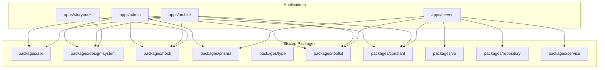
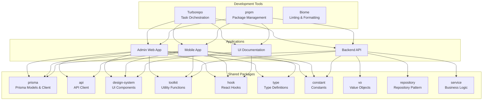
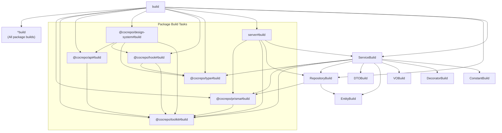
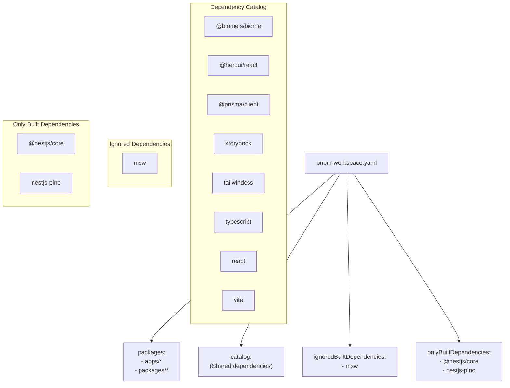
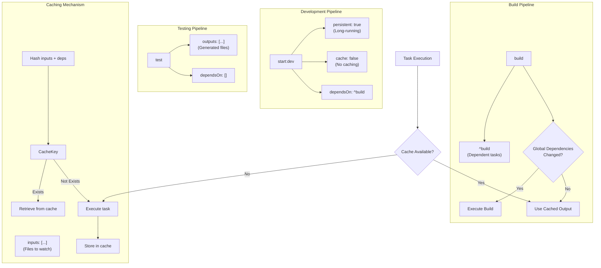
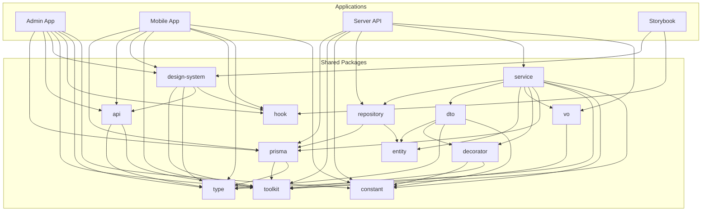

# Monorepo Architecture

<cite>
**Referenced Files in This Document**   
- [turbo.json](file://turbo.json)
- [pnpm-workspace.yaml](file://pnpm-workspace.yaml)
- [package.json](file://package.json)
- [README.md](file://README.md)
- [apps/admin/package.json](file://apps/admin/package.json)
- [apps/server/package.json](file://apps/server/package.json)
- [packages/prisma/README.md](file://packages/prisma/README.md)
- [docs/SCHEMA-REFACTORING.md](file://docs/SCHEMA-REFACTORING.md)
- [packages/repository/README.md](file://packages/repository/README.md)
- [packages/service/README.md](file://packages/service/README.md)
</cite>

## Update Summary
**Changes Made**   
- Updated package structure to reflect the renaming of `packages/schema` to `packages/prisma`
- Added documentation for new independent packages: type, vo, repository, and service
- Updated architectural diagrams to reflect the new package dependencies and structure
- Revised dependency analysis to include the new package relationships
- Updated section sources to reference the new package README files and migration guide

## Table of Contents
1. [Introduction](#introduction)
2. [Project Structure](#project-structure)
3. [Core Components](#core-components)
4. [Architecture Overview](#architecture-overview)
5. [Detailed Component Analysis](#detailed-component-analysis)
6. [Dependency Analysis](#dependency-analysis)
7. [Performance Considerations](#performance-considerations)
8. [Troubleshooting Guide](#troubleshooting-guide)
9. [Conclusion](#conclusion)

## Introduction
The prj-core monorepo architecture is designed to enable efficient shared code management across multiple applications through a unified dependency graph. This document details the high-level design, task orchestration, workspace configuration, and technical decisions behind the architecture that leverages Turborepo for incremental builds and pnpm for efficient dependency management.

## Project Structure
The prj-core monorepo follows a well-organized structure with applications and shared packages separated into distinct directories. The architecture enables code sharing while maintaining clear boundaries between different components.

**Diagram sources**
- [README.md](file://README.md#L117-L162)

**Section sources**
- [README.md](file://README.md#L117-L162)

## Core Components
The prj-core monorepo architecture consists of several core components that work together to enable efficient development and deployment. The architecture is built around the principles of code reuse, independent deployment, and incremental builds.

**Section sources**
- [README.md](file://README.md#L26-L44)

## Architecture Overview
The prj-core monorepo architecture leverages Turborepo and pnpm workspaces to create a unified dependency graph that enables shared code management across multiple applications. The architecture is designed to support independent deployment of applications while maintaining code consistency through shared packages.

**Diagram sources**
- [turbo.json](file://turbo.json)
- [pnpm-workspace.yaml](file://pnpm-workspace.yaml)
- [README.md](file://README.md#L164-L203)

## Detailed Component Analysis

### Turborepo Configuration Analysis
The Turborepo configuration in turbo.json defines the task orchestration pipeline for the monorepo, enabling efficient incremental builds and caching.

**Diagram sources**
- [turbo.json](file://turbo.json#L12-L71)

**Section sources**
- [turbo.json](file://turbo.json#L12-L71)

### pnpm Workspace Configuration Analysis
The pnpm workspace configuration defines the package boundaries and dependency linking for the monorepo, enabling efficient dependency management.

**Diagram sources**
- [pnpm-workspace.yaml](file://pnpm-workspace.yaml)

**Section sources**
- [pnpm-workspace.yaml](file://pnpm-workspace.yaml)

### Task Orchestration Pipeline
The task orchestration pipeline in Turborepo enables efficient build, test, and development workflows with caching mechanisms and proper execution order.

**Diagram sources**
- [turbo.json](file://turbo.json#L115-L156)

**Section sources**
- [turbo.json](file://turbo.json#L115-L156)

## Dependency Analysis
The prj-core monorepo architecture features a well-defined dependency graph that enables shared code management while maintaining clear boundaries between components.

**Diagram sources**
- [apps/admin/package.json](file://apps/admin/package.json)
- [apps/server/package.json](file://apps/server/package.json)
- [README.md](file://README.md#L164-L203)
- [packages/repository/README.md](file://packages/repository/README.md)
- [packages/service/README.md](file://packages/service/README.md)

**Section sources**
- [apps/admin/package.json](file://apps/admin/package.json)
- [apps/server/package.json](file://apps/server/package.json)

## Performance Considerations
The prj-core monorepo architecture is designed with performance in mind, leveraging Turborepo's incremental builds and caching mechanisms to optimize development workflows. The architecture enables parallel execution of independent tasks while maintaining proper dependency ordering for dependent tasks. The use of pnpm workspaces ensures efficient dependency management with hard links and symlinks, reducing disk usage and installation time.

The caching strategy in Turborepo is configured to cache build outputs while avoiding caching for development and testing tasks that require fresh execution. The globalDependencies configuration ensures that changes to critical configuration files trigger appropriate rebuilds across the monorepo.

## Troubleshooting Guide
When encountering issues with the prj-core monorepo architecture, consider the following common scenarios:

1. **Build failures due to dependency issues**: Clear the Turborepo cache using `pnpm clean` and reinstall dependencies with `pnpm install`.
2. **Type checking errors in shared packages**: Ensure that shared packages are properly built before consuming applications by running `pnpm build:packages` first.
3. **Development server not reflecting changes**: Verify that the appropriate watch tasks are running and that file watching is not being blocked by system permissions.
4. **Dependency resolution issues**: Check the pnpm-workspace.yaml configuration to ensure that package paths are correctly defined.
5. **Caching issues**: Manually clear the Turborepo cache if stale outputs are causing problems.

**Section sources**
- [turbo.json](file://turbo.json)
- [pnpm-workspace.yaml](file://pnpm-workspace.yaml)
- [package.json](file://package.json)

## Conclusion
The prj-core monorepo architecture effectively leverages Turborepo and pnpm workspaces to create a scalable and maintainable development environment. The architecture enables shared code management across multiple applications through a unified dependency graph, supporting independent deployment while maintaining code consistency. The task orchestration configuration in turbo.json provides efficient build, test, and development pipelines with caching mechanisms and proper execution order. The workspace configuration in pnpm-workspace.yaml defines clear package boundaries and dependency linking, enabling efficient dependency management. The technical decisions behind choosing Turborepo for incremental builds and pnpm for dependency management provide significant performance gains that outweigh the added complexity, resulting in a robust and scalable architecture for the prj-core project.