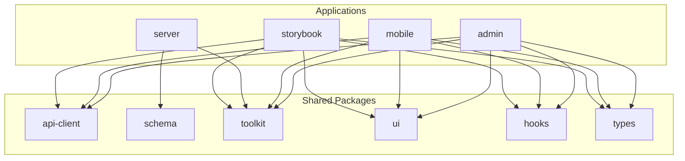
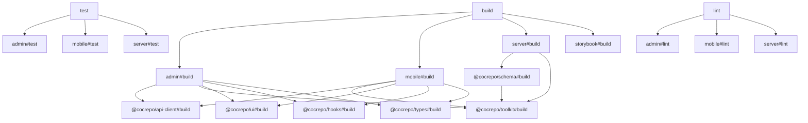
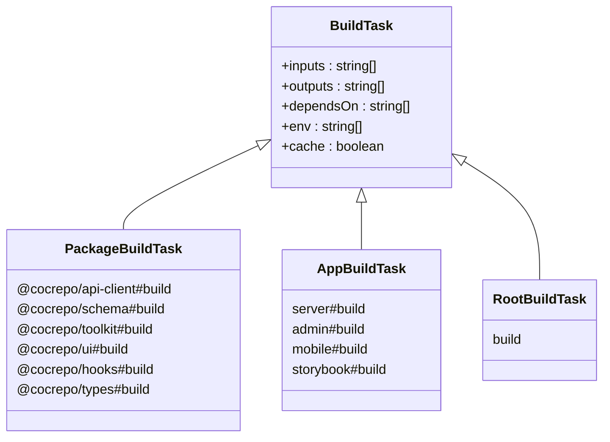
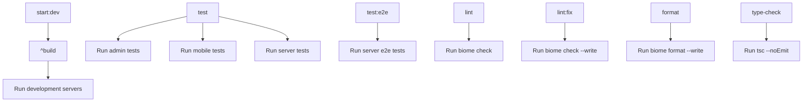
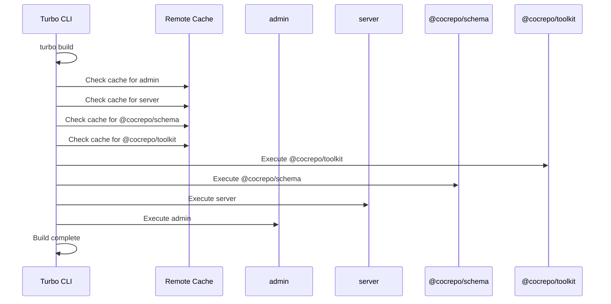
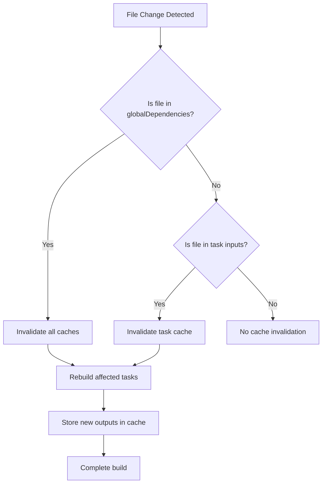
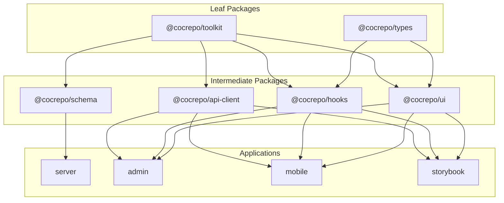

# Turborepo Configuration

<cite>
**Referenced Files in This Document**   
- [turbo.json](file://turbo.json)
- [package.json](file://package.json)
- [pnpm-workspace.yaml](file://pnpm-workspace.yaml)
- [apps/admin/package.json](file://apps/admin/package.json)
- [apps/server/package.json](file://apps/server/package.json)
- [apps/mobile/package.json](file://apps/mobile/package.json)
- [apps/storybook/package.json](file://apps/storybook/package.json)
- [packages/api-client/package.json](file://packages/api-client/package.json)
- [packages/schema/package.json](file://packages/schema/package.json)
- [packages/toolkit/package.json](file://packages/toolkit/package.json)
- [packages/ui/package.json](file://packages/ui/package.json)
- [packages/hooks/package.json](file://packages/hooks/package.json)
- [packages/types/package.json](file://packages/types/package.json)
</cite>

## Table of Contents
1. [Introduction](#introduction)
2. [Project Structure](#project-structure)
3. [Core Components](#core-components)
4. [Architecture Overview](#architecture-overview)
5. [Detailed Component Analysis](#detailed-component-analysis)
6. [Dependency Analysis](#dependency-analysis)
7. [Performance Considerations](#performance-considerations)
8. [Troubleshooting Guide](#troubleshooting-guide)
9. [Conclusion](#conclusion)

## Introduction

The Turborepo configuration in the prj-core monorepo orchestrates build, test, and development workflows across multiple applications and shared packages. This documentation details the pipeline definitions in turbo.json that enable efficient incremental builds through intelligent caching and task dependency management. The configuration supports a micro-frontend architecture with applications for admin, mobile, server, and storybook, along with shared packages for API clients, UI components, utilities, and type definitions.

**Section sources**
- [turbo.json](file://turbo.json#L1-L167)
- [package.json](file://package.json#L1-L50)

## Project Structure

The prj-core monorepo follows a standard Turborepo structure with applications in the apps/ directory and shared packages in the packages/ directory. The workspace is managed by pnpm with workspace packages defined in pnpm-workspace.yaml. Applications include admin (web dashboard), mobile (React Native), server (NestJS API), and storybook (component documentation). Shared packages provide reusable functionality across applications, including API clients, UI components, hooks, utilities, and type definitions.

**Diagram sources **
- [pnpm-workspace.yaml](file://pnpm-workspace.yaml#L1-L59)
- [turbo.json](file://turbo.json#L1-L167)

**Section sources**
- [pnpm-workspace.yaml](file://pnpm-workspace.yaml#L1-L59)
- [turbo.json](file://turbo.json#L1-L167)

## Core Components

The core components of the Turborepo configuration include task definitions for build, test, lint, and development workflows. The turbo.json file defines pipeline tasks with inputs, outputs, dependencies, and caching configurations. The globalDependencies array specifies files that affect all tasks, while individual task configurations define package-specific inputs and outputs. The configuration enables parallel execution of independent tasks while respecting dependency relationships between packages.

**Section sources**
- [turbo.json](file://turbo.json#L1-L167)
- [package.json](file://package.json#L6-L38)

## Architecture Overview

The Turborepo architecture implements a directed acyclic graph (DAG) of task dependencies that enables efficient incremental builds. The pipeline orchestrates build tasks across the monorepo with proper dependency ordering, ensuring that shared packages are built before the applications that depend on them. Caching is configured at both the global and task level, with build outputs cached based on input file hashes and environment variables.

**Diagram sources **
- [turbo.json](file://turbo.json#L12-L167)
- [package.json](file://package.json#L6-L38)

## Detailed Component Analysis

### Pipeline Task Definitions

The turbo.json configuration defines a comprehensive set of tasks for building, testing, and developing the monorepo applications and packages. Each task specifies inputs (files that trigger rebuilds), outputs (generated files), dependencies (other tasks that must complete first), and caching behavior.

#### Build Tasks

**Diagram sources **
- [turbo.json](file://turbo.json#L14-L67)
- [turbo.json](file://turbo.json#L73-L114)

**Section sources**
- [turbo.json](file://turbo.json#L14-L114)

#### Development and Testing Tasks

**Diagram sources **
- [turbo.json](file://turbo.json#L115-L156)
- [package.json](file://package.json#L14-L21)

**Section sources**
- [turbo.json](file://turbo.json#L115-L156)

### Task Dependency Management

The Turborepo configuration implements a sophisticated dependency management system that ensures proper execution order while maximizing parallelization. The ^build syntax in the root build task indicates that all build tasks in the dependency tree should be executed in the correct order based on their dependencies.

**Diagram sources **
- [turbo.json](file://turbo.json#L69-L71)
- [turbo.json](file://turbo.json#L64-L66)

**Section sources**
- [turbo.json](file://turbo.json#L64-L71)

### Caching and Incremental Builds

The caching configuration enables efficient incremental builds by storing task outputs and reusing them when inputs haven't changed. The globalDependencies array specifies files that invalidate all caches when modified, while individual task configurations define package-specific inputs that trigger rebuilds.

**Diagram sources **
- [turbo.json](file://turbo.json#L4-L9)
- [turbo.json](file://turbo.json#L15-L20)

**Section sources**
- [turbo.json](file://turbo.json#L4-L20)

## Dependency Analysis

The dependency graph in the Turborepo configuration ensures that packages are built in the correct order based on their dependencies. The server application depends on the schema and toolkit packages, while frontend applications depend on multiple shared packages including API client, UI components, hooks, and types.

**Diagram sources **
- [turbo.json](file://turbo.json#L36-L37)
- [turbo.json](file://turbo.json#L64-L65)
- [turbo.json](file://turbo.json#L82-L87)
- [turbo.json](file://turbo.json#L100-L101)
- [turbo.json](file://turbo.json#L146-L149)

**Section sources**
- [turbo.json](file://turbo.json#L36-L37)
- [turbo.json](file://turbo.json#L64-L65)
- [turbo.json](file://turbo.json#L82-L87)

## Performance Considerations

The Turborepo configuration is optimized for performance through parallel execution, intelligent caching, and incremental builds. The task dependency graph allows independent tasks to run in parallel while ensuring proper ordering for dependent tasks. Caching is configured to maximize cache hits while ensuring correctness, with build tasks caching outputs and type-checking tasks disabling caching for accuracy.

**Section sources**
- [turbo.json](file://turbo.json#L24-L25)
- [turbo.json](file://turbo.json#L38-L39)
- [turbo.json](file://turbo.json#L49-L52)
- [turbo.json](file://turbo.json#L66-L67)

## Troubleshooting Guide

Common issues with the Turborepo configuration include cache invalidation problems, dependency resolution errors, and task execution failures. When changes to shared packages don't propagate to dependent applications, clearing the Turborepo cache with turbo clean may resolve the issue. For dependency resolution problems, ensure that package versions in package.json files are compatible and that the pnpm workspace configuration is correct.

**Section sources**
- [turbo.json](file://turbo.json#L158-L160)
- [package.json](file://package.json#L13)
- [pnpm-workspace.yaml](file://pnpm-workspace.yaml#L1-L3)

## Conclusion

The Turborepo configuration in the prj-core monorepo provides an efficient and scalable build system for a complex multi-application architecture. By leveraging task dependencies, caching, and parallel execution, the configuration enables fast incremental builds and streamlined development workflows. The clear separation of applications and shared packages promotes code reuse and maintainability, while the comprehensive task definitions ensure consistent builds across the monorepo.