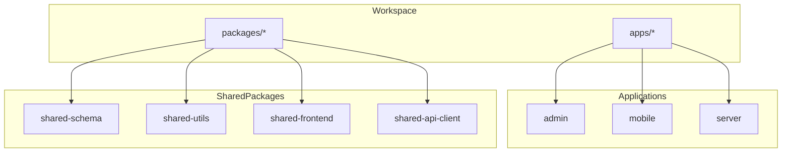
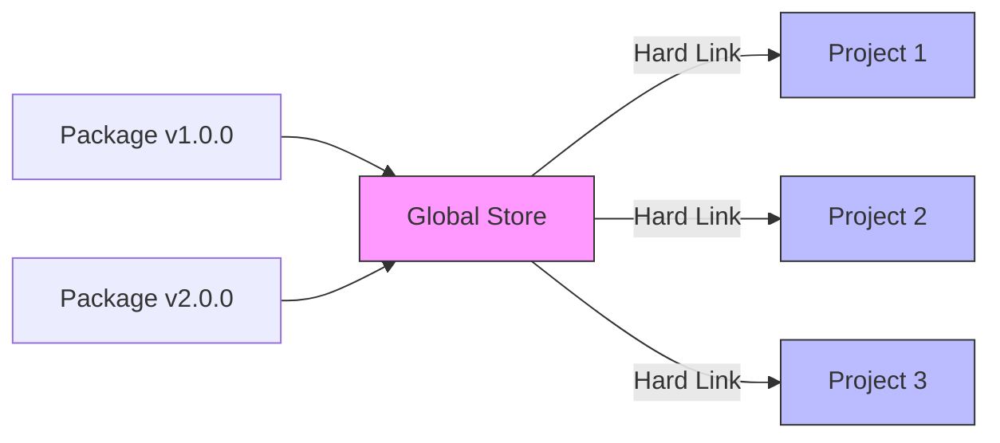
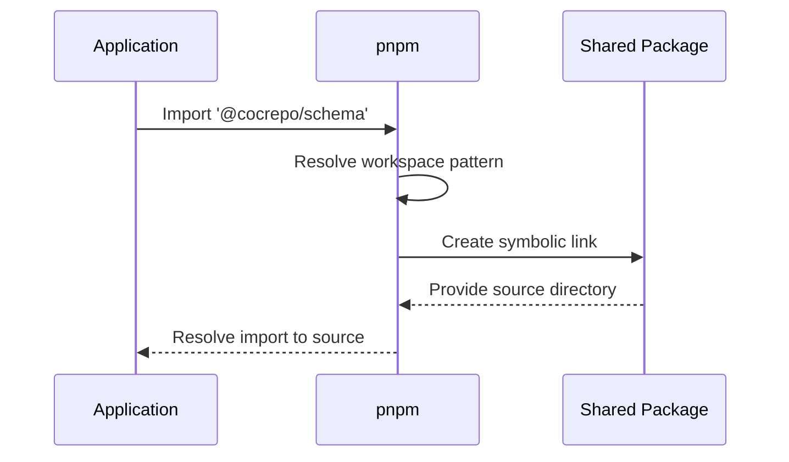

# pnpm Workspace Configuration

<cite>
**Referenced Files in This Document**   
- [pnpm-workspace.yaml](file://pnpm-workspace.yaml)
- [package.json](file://package.json)
- [turbo.json](file://turbo.json)
- [apps/admin/package.json](file://apps/admin/package.json)
- [apps/server/package.json](file://apps/server/package.json)
- [packages/shared-api-client/package.json](file://packages/shared-api-client/package.json)
- [packages/shared-schema/package.json](file://packages/shared-schema/package.json)
- [packages/shared-utils/package.json](file://packages/shared-utils/package.json)
</cite>

## Table of Contents
1. [Introduction](#introduction)
2. [Workspace Configuration](#workspace-configuration)
3. [Package Linking Strategy](#package-linking-strategy)
4. [Technical Advantages of pnpm](#technical-advantages-of-pnpm)
5. [Version Consistency Across Packages](#version-consistency-across-packages)
6. [Cross-Package Imports](#cross-package-imports)
7. [Best Practices](#best-practices)
8. [Conclusion](#conclusion)

## Introduction
The prj-core monorepo utilizes pnpm workspace configuration to manage dependencies efficiently across multiple applications and shared packages. This documentation details how the pnpm-workspace.yaml file defines workspace boundaries and package linking strategies that enable optimal dependency management. The configuration supports a modern monorepo architecture with shared dependencies between applications (admin, mobile, server) and reusable packages (shared-frontend, shared-utils, shared-schema).

**Section sources**
- [pnpm-workspace.yaml](file://pnpm-workspace.yaml#L1-L59)
- [README.md](file://README.md#L1-L50)

## Workspace Configuration
The pnpm-workspace.yaml file defines the workspace boundaries by including all applications and packages through glob patterns. The configuration specifies two main workspace patterns:

```yaml
packages:
  - apps/*
  - packages/*
```

This structure includes all directories under the apps and packages folders in the workspace, enabling shared dependency resolution and symlinking. The workspace encompasses frontend applications (admin, mobile), backend services (server), and shared utility packages.

The configuration also includes a catalog section that defines consistent versions for commonly used dependencies across the workspace, ensuring version uniformity and reducing duplication. This approach allows all workspace packages to reference the same version of critical dependencies like React, TypeScript, and testing libraries.



**Diagram sources**
- [pnpm-workspace.yaml](file://pnpm-workspace.yaml#L1-L5)

**Section sources**
- [pnpm-workspace.yaml](file://pnpm-workspace.yaml#L1-L59)

## Package Linking Strategy
pnpm implements a strict linking strategy that creates symbolic links between workspace packages instead of copying files. When a package in the workspace depends on another workspace package, pnpm creates a symlink to the source directory rather than installing a separate copy. This approach enables immediate access to code changes without requiring manual rebuilding or publishing of packages.

The linking strategy is evident in the package.json files of workspace applications, which use the "workspace:" protocol to declare dependencies on other workspace packages:

```json
"@cocrepo/schema": "workspace:^0.3.0",
"@cocrepo/toolkit": "workspace:^1.3.0"
```

This syntax tells pnpm to resolve these dependencies to their local workspace versions rather than fetching them from the registry. The version range with the workspace: prefix ensures that the local package is used while still respecting semantic versioning constraints.

The strategy enables efficient development workflows where changes to shared packages are immediately available to consuming applications during development, while still allowing proper versioning for production releases.

**Section sources**
- [apps/server/package.json](file://apps/server/package.json#L27-L28)
- [pnpm-workspace.yaml](file://pnpm-workspace.yaml#L1-L5)

## Technical Advantages of pnpm
pnpm offers several technical advantages over other package managers, particularly in monorepo environments:

### Strict Peer Dependency Handling
pnpm enforces strict peer dependency resolution, preventing the "dependency hell" that can occur when multiple versions of the same package are installed. Unlike npm and yarn, pnpm creates a flat node_modules structure where each dependency is stored only once, regardless of how many packages depend on it. This eliminates the risk of version conflicts and ensures that all packages use compatible versions of shared dependencies.

### Disk Space Efficiency
pnpm's content-addressable storage system provides significant disk space savings. Instead of copying package files multiple times, pnpm stores each package version only once in a global store and creates hard links to it from project directories. This approach reduces disk usage by up to 60% compared to traditional package managers, especially in monorepos with many shared dependencies.

### Fast Installation and Linking
The workspace linking strategy enables near-instantaneous installation of workspace dependencies. Since pnpm only needs to create symbolic links rather than download and extract packages, adding or updating workspace dependencies is significantly faster. This speed improvement enhances developer productivity, especially during initial setup or when switching between branches.



**Diagram sources**
- [pnpm-workspace.yaml](file://pnpm-workspace.yaml#L1-L59)

**Section sources**
- [pnpm-workspace.yaml](file://pnpm-workspace.yaml#L1-L59)
- [package.json](file://package.json#L5)

## Version Consistency Across Packages
The pnpm workspace configuration ensures version consistency across shared packages and applications through several mechanisms:

### Catalog Dependencies
The catalog section in pnpm-workspace.yaml defines standardized versions for commonly used dependencies:

```yaml
catalog:
  '@biomejs/biome': ^2.1.4
  '@heroui/react': ^2.8.2
  'typescript': ^5.9.2
  'react': 19.1.0
```

Packages reference these catalog versions using the "catalog:" syntax in their package.json files, ensuring uniform versions across the workspace:

```json
"dependencies": {
  "react": "catalog:",
  "typescript": "catalog:"
}
```

### Workspace Protocol
The workspace: protocol in package.json files ensures that inter-package dependencies use the local workspace version rather than potentially conflicting published versions. This prevents version drift between related packages during development.

### Centralized Dependency Management
The root package.json file specifies the package manager version, ensuring all developers use the same pnpm version:

```json
"packageManager": "pnpm@10.16.0"
```

This consistency prevents issues that can arise from different package manager behaviors across development environments.

**Section sources**
- [pnpm-workspace.yaml](file://pnpm-workspace.yaml#L5-L52)
- [package.json](file://package.json#L5)
- [apps/admin/package.json](file://apps/admin/package.json#L26-L48)

## Cross-Package Imports
The pnpm workspace enables seamless cross-package imports through symbolic linking. When a package imports from another workspace package, pnpm resolves the import to the actual source directory rather than a compiled or published version.

For example, the server application imports from shared-schema:

```typescript
import { User } from '@cocrepo/schema';
```

During development, this import resolves directly to the source files in packages/shared-schema/src/entity/user.entity.ts, allowing immediate access to code changes. The import works without requiring the shared package to be built or published.

The workspace configuration also supports deep imports from specific modules within packages:

```typescript
import { validateEmail } from '@cocrepo/toolkit/validation';
```

This capability enables fine-grained code sharing while maintaining proper package boundaries. The symbolic linking ensures that these imports work seamlessly during development, testing, and production builds.

The combination of pnpm workspaces and Turbo for task orchestration ensures that dependent packages are built in the correct order, with proper caching and incremental builds.



**Diagram sources**
- [pnpm-workspace.yaml](file://pnpm-workspace.yaml#L1-L5)
- [apps/server/package.json](file://apps/server/package.json#L27)

**Section sources**
- [pnpm-workspace.yaml](file://pnpm-workspace.yaml#L1-L59)
- [apps/server/package.json](file://apps/server/package.json#L27)

## Best Practices
### Adding New Packages to the Workspace
When adding new packages to the workspace:

1. Create the package directory under packages/
2. Include the package in pnpm-workspace.yaml patterns (already covered by packages/*)
3. Use workspace: protocol for dependencies on other workspace packages
4. Reference catalog dependencies where applicable
5. Ensure the package has proper build configuration in turbo.json

### Managing Version Conflicts
To manage version conflicts:

1. Use catalog dependencies for shared tooling and libraries
2. Leverage the workspace: protocol for inter-package dependencies
3. Run pnpm dedupe periodically to resolve any version inconsistencies
4. Use pnpm over versions to override specific dependency versions when necessary

### Dependency Management
Follow these dependency management practices:

1. Use devDependencies for development-only packages
2. Keep peerDependencies minimal and well-defined
3. Regularly audit dependencies with pnpm audit
4. Update dependencies using pnpm update rather than manual version changes

### Performance Optimization
Optimize workspace performance by:

1. Using pnpm install --frozen-lockfile in CI/CD environments
2. Leveraging Turbo for task orchestration and caching
3. Organizing packages to minimize circular dependencies
4. Using selective installation with pnpm install --filter when working on specific packages

**Section sources**
- [pnpm-workspace.yaml](file://pnpm-workspace.yaml#L1-L59)
- [turbo.json](file://turbo.json#L1-L167)
- [package.json](file://package.json#L6-L38)

## Conclusion
The pnpm workspace configuration in the prj-core monorepo provides an efficient and scalable dependency management solution for a complex multi-package architecture. By defining clear workspace boundaries through glob patterns and implementing a robust package linking strategy, the configuration enables seamless code sharing between applications and shared packages.

The technical advantages of pnpm, including strict peer dependency handling and disk space efficiency, make it particularly well-suited for monorepo environments. The version consistency mechanisms ensure that all packages use compatible versions of shared dependencies, reducing the risk of runtime errors and compatibility issues.

The workspace setup supports modern development workflows with immediate access to code changes across packages, fast installation times, and efficient disk usage. When combined with Turbo for task orchestration, the configuration provides a powerful foundation for scalable application development.

By following the documented best practices for adding new packages and managing version conflicts, teams can maintain a healthy and efficient monorepo architecture that supports both rapid development and production stability.

**Section sources**
- [pnpm-workspace.yaml](file://pnpm-workspace.yaml#L1-L59)
- [package.json](file://package.json#L1-L50)
- [turbo.json](file://turbo.json#L1-L167)