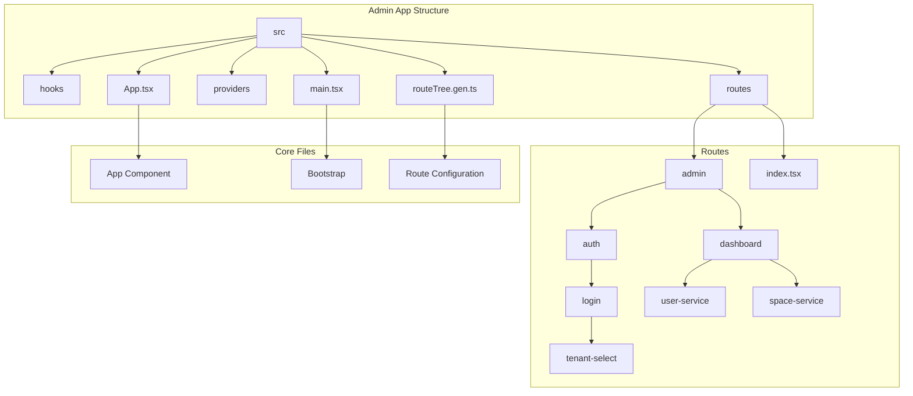
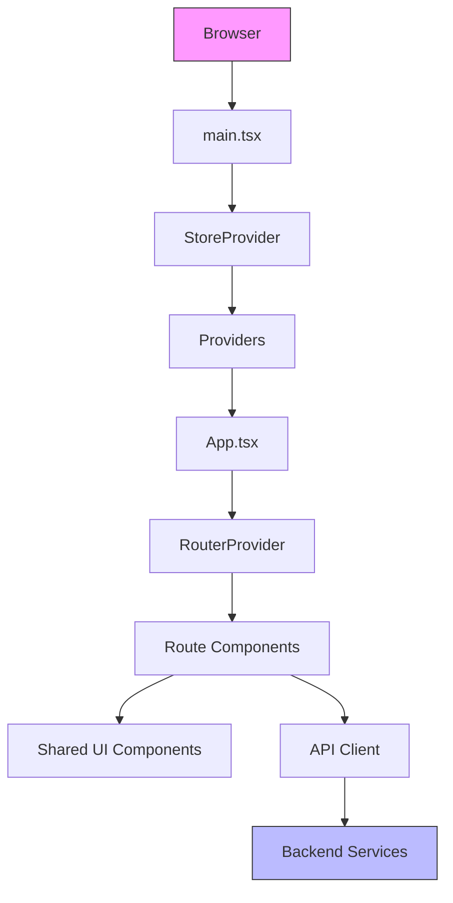
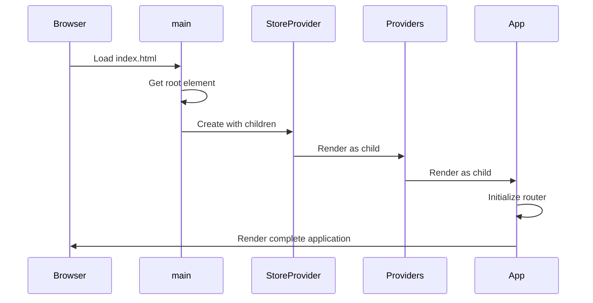
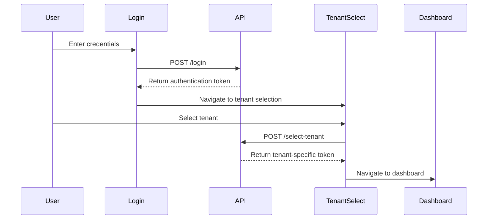
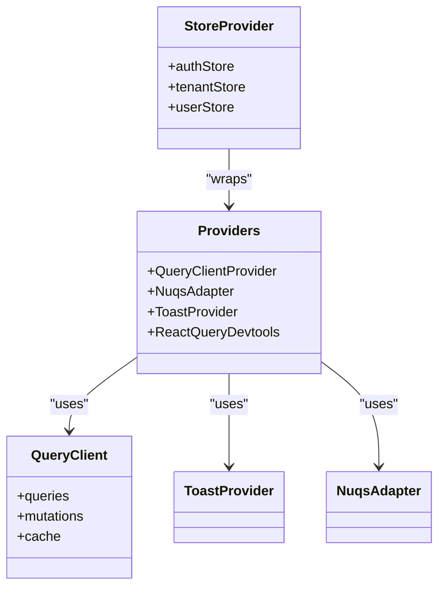

# Admin Interface

<cite>
**Referenced Files in This Document**   
- [main.tsx](file://apps/admin/src/main.tsx)
- [App.tsx](file://apps/admin/src/App.tsx)
- [routeTree.gen.ts](file://apps/admin/src/routeTree.gen.ts)
- [index.tsx](file://apps/admin/src/routes/index.tsx)
- [admin.tsx](file://apps/admin/src/routes/admin.tsx)
- [useAdminLoginRoute.ts](file://apps/admin/src/hooks/useAdminLoginRoute.ts)
- [useAdminTenantSelectRoute.ts](file://apps/admin/src/hooks/useAdminTenantSelectRoute.ts)
- [auth.tsx](file://apps/admin/src/routes/admin/auth.tsx)
- [login.tsx](file://apps/admin/src/routes/admin/auth/login.tsx)
- [tenant-select.tsx](file://apps/admin/src/routes/admin/auth/login/tenant-select.tsx)
- [dashboard.tsx](file://apps/admin/src/routes/admin/dashboard.tsx)
- [Providers.tsx](file://apps/admin/src/providers/Providers.tsx)
- [users.tsx](file://apps/admin/src/routes/admin/dashboard/user-service/users.tsx)
- [grounds.tsx](file://apps/admin/src/routes/admin/dashboard/space-service/grounds.tsx)
</cite>

## Table of Contents
1. [Introduction](#introduction)
2. [Project Structure](#project-structure)
3. [Core Components](#core-components)
4. [Architecture Overview](#architecture-overview)
5. [Detailed Component Analysis](#detailed-component-analysis)
6. [Dependency Analysis](#dependency-analysis)
7. [Performance Considerations](#performance-considerations)
8. [Troubleshooting Guide](#troubleshooting-guide)
9. [Conclusion](#conclusion)

## Introduction
The Admin Interface component of prj-core is a React-based administration application built with Vite, designed to provide comprehensive management capabilities for system administrators. This document details the implementation architecture, focusing on the bootstrap process, routing configuration, authentication flow, and integration with shared components. The application follows a modular structure with clear separation of concerns, leveraging modern React patterns and state management through MobX. The interface integrates with the shared-api-client for backend communication and utilizes shared-frontend components for consistent UI design across the platform.

## Project Structure
The Admin Interface follows a feature-based organization within the `apps/admin` directory, with clear separation between routes, components, hooks, and providers. The application is built using Vite as the build tool and leverages React for the UI layer. The structure emphasizes modularity and reusability, with routes organized hierarchically and shared functionality extracted into reusable hooks and components.



**Diagram sources**
- [main.tsx](file://apps/admin/src/main.tsx)
- [App.tsx](file://apps/admin/src/App.tsx)
- [routeTree.gen.ts](file://apps/admin/src/routeTree.gen.ts)

**Section sources**
- [main.tsx](file://apps/admin/src/main.tsx)
- [App.tsx](file://apps/admin/src/App.tsx)
- [routeTree.gen.ts](file://apps/admin/src/routeTree.gen.ts)

## Core Components
The Admin Interface consists of several core components that work together to provide a seamless administrative experience. The main entry point is `main.tsx`, which initializes the React application and wraps it with necessary providers. The `App.tsx` component sets up the routing system using TanStack Router, while the `routeTree.gen.ts` file contains the automatically generated route configuration. The application uses a combination of custom hooks and shared components to implement functionality consistently across different routes.

**Section sources**
- [main.tsx](file://apps/admin/src/main.tsx#L1-L17)
- [App.tsx](file://apps/admin/src/App.tsx#L1-L22)
- [routeTree.gen.ts](file://apps/admin/src/routeTree.gen.ts#L1-L572)

## Architecture Overview
The Admin Interface follows a layered architecture with clear separation between presentation, state management, and data access layers. The application bootstrap process begins in `main.tsx`, where the React root is created and the application is rendered within the StoreProvider and Providers wrappers. The routing system is implemented using TanStack Router, with routes defined as file-based routes that are automatically generated into the `routeTree.gen.ts` file. Authentication is handled through a multi-step process that includes login and tenant selection, with state managed using MobX.



**Diagram sources**
- [main.tsx](file://apps/admin/src/main.tsx#L1-L17)
- [App.tsx](file://apps/admin/src/App.tsx#L1-L22)
- [Providers.tsx](file://apps/admin/src/providers/Providers.tsx#L1-L38)

## Detailed Component Analysis

### Bootstrap Process
The bootstrap process of the Admin Interface begins in the `main.tsx` file, where the React application is initialized and rendered into the DOM. The application is wrapped with the StoreProvider from @cocrepo/store, which provides global state management capabilities, and the Providers component, which composes various application-level providers such as QueryClientProvider for data fetching and ToastProvider for notifications.



**Diagram sources**
- [main.tsx](file://apps/admin/src/main.tsx#L1-L17)
- [Providers.tsx](file://apps/admin/src/providers/Providers.tsx#L1-L38)

**Section sources**
- [main.tsx](file://apps/admin/src/main.tsx#L1-L17)
- [Providers.tsx](file://apps/admin/src/providers/Providers.tsx#L1-L38)

### Routing Configuration
The routing system in the Admin Interface is implemented using TanStack Router with a file-based routing approach. The `routeTree.gen.ts` file contains the automatically generated route configuration based on the file structure in the routes directory. The `App.tsx` component creates a router instance using this route tree and renders it with the RouterProvider. Routes are organized hierarchically, with the admin route serving as the parent for authentication and dashboard routes.

```mermaid
graph TD
A[/] --> B[/admin]
B --> C[/admin/auth]
B --> D[/admin/dashboard]
C --> E[/admin/auth/login]
E --> F[/admin/auth/login/tenant-select]
D --> G[/admin/dashboard/user-service]
D --> H[/admin/dashboard/space-service]
G --> I[/admin/dashboard/user-service/users]
H --> J[/admin/dashboard/space-service/grounds]
H --> K[/admin/dashboard/space-service/categories]
style A fill:#4CAF50,stroke:#333
style B fill:#2196F3,stroke:#333
style C fill:#FF9800,stroke:#333
style D fill:#FF9800,stroke:#333
```

**Diagram sources**
- [App.tsx](file://apps/admin/src/App.tsx#L1-L22)
- [routeTree.gen.ts](file://apps/admin/src/routeTree.gen.ts#L1-L572)
- [index.tsx](file://apps/admin/src/routes/index.tsx#L1-L17)

**Section sources**
- [App.tsx](file://apps/admin/src/App.tsx#L1-L22)
- [routeTree.gen.ts](file://apps/admin/src/routeTree.gen.ts#L1-L572)
- [index.tsx](file://apps/admin/src/routes/index.tsx#L1-L17)

### Authentication Flow
The authentication flow in the Admin Interface consists of two main steps: login and tenant selection. The process begins at the login route, where users enter their credentials. Upon successful authentication, users are redirected to the tenant selection page where they choose which tenant to access. This flow is implemented using React Query for API calls and MobX for state management, with navigation handled by TanStack Router.



**Diagram sources**
- [useAdminLoginRoute.ts](file://apps/admin/src/hooks/useAdminLoginRoute.ts#L1-L77)
- [login.tsx](file://apps/admin/src/routes/admin/auth/login.tsx#L1-L89)
- [tenant-select.tsx](file://apps/admin/src/routes/admin/auth/login/tenant-select.tsx#L1-L53)

**Section sources**
- [useAdminLoginRoute.ts](file://apps/admin/src/hooks/useAdminLoginRoute.ts#L1-L77)
- [login.tsx](file://apps/admin/src/routes/admin/auth/login.tsx#L1-L89)
- [tenant-select.tsx](file://apps/admin/src/routes/admin/auth/login/tenant-select.tsx#L1-L53)

### State Management with AppProviders
The Admin Interface uses a combination of MobX and React Query for state management, composed through the Providers component. The StoreProvider from @cocrepo/store manages global application state, while the QueryClientProvider from @tanstack/react-query handles data fetching and caching. The ToastProvider from @heroui/react provides notification capabilities, and the NuqsAdapter enables URL state synchronization.



**Diagram sources**
- [Providers.tsx](file://apps/admin/src/providers/Providers.tsx#L1-L38)
- [main.tsx](file://apps/admin/src/main.tsx#L1-L17)

**Section sources**
- [Providers.tsx](file://apps/admin/src/providers/Providers.tsx#L1-L38)

## Dependency Analysis
The Admin Interface has well-defined dependencies between components, with clear separation of concerns. The application depends on several external libraries for core functionality, including TanStack Router for routing, React Query for data fetching, and MobX for state management. The interface also depends on shared packages such as shared-api-client for API communication and shared-frontend for UI components.

```mermaid
graph TD
A[Admin Interface] --> B[TanStack Router]
A --> C[React Query]
A --> D[MobX]
A --> E[@heroui/react]
A --> F[shared-api-client]
A --> G[shared-frontend]
B --> H[React]
C --> H
D --> H
E --> H
F --> I[axios]
G --> J[MobX]
G --> K[React Query]
style A fill:#2196F3,stroke:#333
style H fill:#673AB7,stroke:#333
```

**Diagram sources**
- [package.json](file://apps/admin/package.json)
- [Providers.tsx](file://apps/admin/src/providers/Providers.tsx#L1-L38)

**Section sources**
- [Providers.tsx](file://apps/admin/src/providers/Providers.tsx#L1-L38)

## Performance Considerations
The Admin Interface implements several performance optimizations to ensure a responsive user experience. React Query is used for efficient data fetching and caching, reducing the number of API calls and improving perceived performance. The application uses code splitting through the file-based routing system, loading only the necessary code for the current route. The use of MobX for state management ensures efficient re-renders by only updating components when their observed state changes.

**Section sources**
- [Providers.tsx](file://apps/admin/src/providers/Providers.tsx#L1-L38)
- [App.tsx](file://apps/admin/src/App.tsx#L1-L22)

## Troubleshooting Guide
Common issues in the Admin Interface typically relate to routing configuration and authentication token handling. Route configuration errors can occur when the file structure doesn't match the expected pattern for TanStack Router, or when route parameters are not properly defined. Authentication token issues may arise from incorrect token storage or expiration handling. Solutions include verifying the route file structure, ensuring proper token storage in the authStore, and implementing token refresh mechanisms.

**Section sources**
- [useAdminLoginRoute.ts](file://apps/admin/src/hooks/useAdminLoginRoute.ts#L1-L77)
- [routeTree.gen.ts](file://apps/admin/src/routeTree.gen.ts#L1-L572)
- [authStore](file://packages/shared-frontend/src/store/authStore.ts)

## Conclusion
The Admin Interface component of prj-core provides a robust and scalable administration platform built with modern React patterns. The application's architecture emphasizes modularity, with clear separation between concerns and extensive use of shared components and utilities. The implementation of TanStack Router with file-based routing provides a intuitive and maintainable routing system, while the combination of MobX and React Query offers efficient state management and data fetching. The authentication flow with tenant selection enables multi-tenancy support, and the use of shared components ensures consistency across the platform. Overall, the Admin Interface demonstrates a well-structured and maintainable approach to building complex administrative applications.