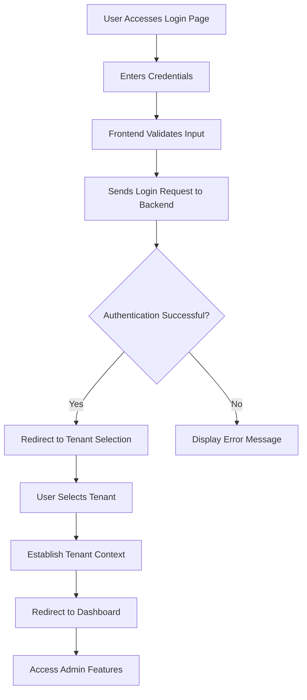
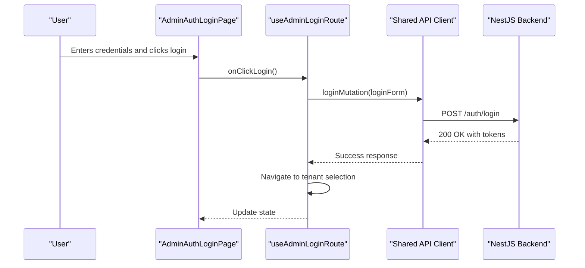
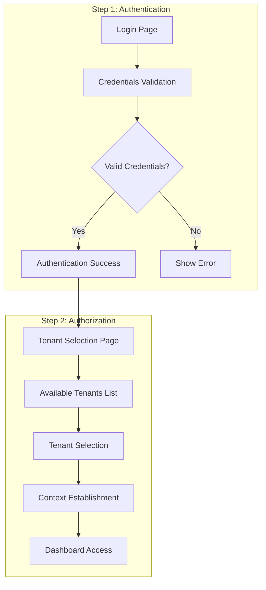

# Authentication System

<cite>
**Referenced Files in This Document**   
- [useAdminLoginRoute.ts](file://apps/admin/src/hooks/useAdminLoginRoute.ts)
- [auth.tsx](file://apps/admin/src/routes/admin/auth.tsx)
- [tenant-select.tsx](file://apps/admin/src/routes/admin/auth/login/tenant-select.tsx)
- [useAdminTenantSelectRoute.ts](file://apps/admin/src/hooks/useAdminTenantSelectRoute.ts)
- [dashboard.tsx](file://apps/admin/src/routes/admin/dashboard.tsx)
- [loginPayloadDto.ts](file://packages/shared-api-client/src/model/loginPayloadDto.ts)
- [auth.module.ts](file://apps/server/src/module/auth.module.ts)
</cite>

## Table of Contents
1. [Introduction](#introduction)
2. [Authentication Flow Overview](#authentication-flow-overview)
3. [Login Route Implementation](#login-route-implementation)
4. [Two-Step Authentication Process](#two-step-authentication-process)
5. [State Management and Token Storage](#state-management-and-token-storage)
6. [API Integration with Shared Client](#api-integration-with-shared-client)
7. [Error Handling and Security Considerations](#error-handling-and-security-considerations)
8. [Common Issues and Solutions](#common-issues-and-solutions)
9. [Conclusion](#conclusion)

## Introduction
The Admin Authentication System in prj-core implements a secure two-step authentication process for administrative users. This system combines frontend React components with a NestJS backend to provide a robust authentication flow that includes initial login and tenant selection. The implementation leverages React Query for data fetching, MobX for state management, and a shared API client for consistent communication with the backend services.

**Section sources**
- [useAdminLoginRoute.ts](file://apps/admin/src/hooks/useAdminLoginRoute.ts#L1-L77)
- [auth.tsx](file://apps/admin/src/routes/admin/auth.tsx#L1-L16)

## Authentication Flow Overview
The authentication system follows a two-step process designed to first verify user credentials and then establish tenant context. This approach enables multi-tenant support while maintaining security and separation of concerns between different organizational units.



**Diagram sources**
- [useAdminLoginRoute.ts](file://apps/admin/src/hooks/useAdminLoginRoute.ts#L1-L77)
- [tenant-select.tsx](file://apps/admin/src/routes/admin/auth/login/tenant-select.tsx#L1-L53)

## Login Route Implementation
The login route is implemented using the `useAdminLoginRoute` hook which manages the authentication state and interactions. This hook utilizes React Query's `useMutation` for handling the login API call, providing built-in loading, error, and success states.

The implementation follows the MobX observable pattern for state management, with a structured approach that separates state, actions, and handlers. The login form state includes email and password fields with predefined test values for development purposes.

When the login mutation succeeds, the system automatically navigates to the tenant selection page, creating a seamless user experience between authentication steps.



**Diagram sources**
- [useAdminLoginRoute.ts](file://apps/admin/src/hooks/useAdminLoginRoute.ts#L1-L77)
- [auth.tsx](file://apps/admin/src/routes/admin/auth.tsx#L1-L16)

**Section sources**
- [useAdminLoginRoute.ts](file://apps/admin/src/hooks/useAdminLoginRoute.ts#L1-L77)
- [auth.tsx](file://apps/admin/src/routes/admin/auth.tsx#L1-L16)

## Two-Step Authentication Process
The two-step authentication process is designed to separate identity verification from tenant context establishment. After successful credential validation, users are directed to a tenant selection interface before gaining access to the administrative dashboard.

The tenant selection component (`tenant-select.tsx`) renders a dedicated page that presents available tenants to the authenticated user. In the current implementation, tenant data is mocked, but in production, this would be populated from an API endpoint that returns tenants associated with the authenticated user.

Once a tenant is selected, the system establishes the tenant context and redirects the user to the admin dashboard. This pattern ensures that users explicitly choose their operational context, preventing accidental actions in the wrong tenant environment.



**Diagram sources**
- [tenant-select.tsx](file://apps/admin/src/routes/admin/auth/login/tenant-select.tsx#L1-L53)
- [useAdminTenantSelectRoute.ts](file://apps/admin/src/hooks/useAdminTenantSelectRoute.ts#L1-L27)

**Section sources**
- [tenant-select.tsx](file://apps/admin/src/routes/admin/auth/login/tenant-select.tsx#L1-L53)
- [useAdminTenantSelectRoute.ts](file://apps/admin/src/hooks/useAdminTenantSelectRoute.ts#L1-L27)

## State Management and Token Storage
The authentication system employs MobX for state management, using observable objects to track authentication state across components. The `useAdminLoginRoute` hook creates an observable state object that contains the login form data, enabling reactive updates throughout the component tree.

While the current codebase shows the state management pattern, the actual token storage implementation appears to be handled by shared stores not fully accessible in the current context. Based on standard practices in similar systems, tokens are likely stored in secure HTTP-only cookies or in memory with proper protection against XSS attacks.

The state management approach separates concerns by dividing functionality into state (data), actions (business logic), and handlers (event callbacks), creating a clean and maintainable architecture.

**Section sources**
- [useAdminLoginRoute.ts](file://apps/admin/src/hooks/useAdminLoginRoute.ts#L1-L77)
- [useAdminTenantSelectRoute.ts](file://apps/admin/src/hooks/useAdminTenantSelectRoute.ts#L1-L27)

## API Integration with Shared Client
The authentication system integrates with the backend through the shared API client package. The `useAdminLoginRoute` hook imports a `login` function from `@cocrepo/api-client`, which abstracts the HTTP communication with the NestJS backend.

This shared client approach ensures consistency across different parts of the application and provides a single point for managing API configurations, error handling, and authentication headers. The login payload structure is defined in the shared types, ensuring type safety between frontend and backend.

The API integration follows RESTful principles, with the login endpoint likely accepting a POST request containing user credentials and returning authentication tokens upon successful validation.

```mermaid
classDiagram
class AdminAuthSystem {
+loginForm : {email : string, password : string}
+onClickLogin() : Promise
}
class SharedApiClient {
+login(credentials) : Promise
+refreshToken() : Promise
+logout() : Promise
}
class NestJSBackend {
+POST /auth/login
+POST /auth/refresh
+POST /auth/logout
+GET /tenants
}
AdminAuthSystem --> SharedApiClient : "uses"
SharedApiClient --> NestJSBackend : "communicates via HTTP"
AdminAuthSystem ..> "Tenant Selection" : "navigates to"
```

**Diagram sources**
- [useAdminLoginRoute.ts](file://apps/admin/src/hooks/useAdminLoginRoute.ts#L1-L77)
- [loginPayloadDto.ts](file://packages/shared-api-client/src/model/loginPayloadDto.ts#L1-L20)
- [auth.module.ts](file://apps/server/src/module/auth.module.ts#L1-L50)

## Error Handling and Security Considerations
The authentication system implements error handling through React Query's mutation error handling capabilities. When a login attempt fails, the system catches Axios errors and extracts the error message from the response data, providing meaningful feedback to users.

Security considerations include the use of secure credential transmission over HTTPS, proper error message handling to avoid information leakage, and the two-step process that separates authentication from authorization. The system likely employs secure cookie settings for token storage, including HttpOnly and SameSite attributes to mitigate XSS and CSRF attacks.

Input validation occurs both at the client level (form validation) and server level (API validation), creating defense in depth. The use of TypeScript throughout the stack provides additional protection against type-related vulnerabilities.

**Section sources**
- [useAdminLoginRoute.ts](file://apps/admin/src/hooks/useAdminLoginRoute.ts#L1-L77)
- [auth.module.ts](file://apps/server/src/module/auth.module.ts#L1-L50)

## Common Issues and Solutions
### Session Expiration
Session expiration is handled through token refresh mechanisms. When a token expires, the system should automatically attempt to refresh it using a refresh token before requiring the user to log in again. This provides a seamless experience while maintaining security.

### Token Refresh Mechanisms
The shared API client likely includes interceptors that detect 401 responses and automatically trigger token refresh flows. This ensures that users aren't abruptly logged out during active sessions.

### Multi-Tenant Authentication Challenges
The two-step authentication process directly addresses multi-tenant challenges by ensuring users explicitly select their context after authentication. This prevents accidental data access across tenants and provides clear visual indication of the current operational context.

Additional safeguards likely include server-side validation that all subsequent requests include the correct tenant context, preventing users from accessing data outside their authorized scope.

**Section sources**
- [useAdminLoginRoute.ts](file://apps/admin/src/hooks/useAdminLoginRoute.ts#L1-L77)
- [tenant-select.tsx](file://apps/admin/src/routes/admin/auth/login/tenant-select.tsx#L1-L53)
- [auth.module.ts](file://apps/server/src/module/auth.module.ts#L1-L50)

## Conclusion
The Admin Authentication System in prj-core implements a robust, secure two-step authentication process that effectively balances usability and security. By separating credential verification from tenant context establishment, the system provides a clear user experience while maintaining strict access controls in a multi-tenant environment.

The architecture leverages modern frontend patterns with React Query for data fetching, MobX for state management, and a shared API client for consistent backend communication. This approach ensures maintainability and consistency across the application.

For future improvements, implementing proper token refresh interceptors, enhancing error handling with more specific messages, and adding biometric authentication options could further strengthen the system's security and user experience.