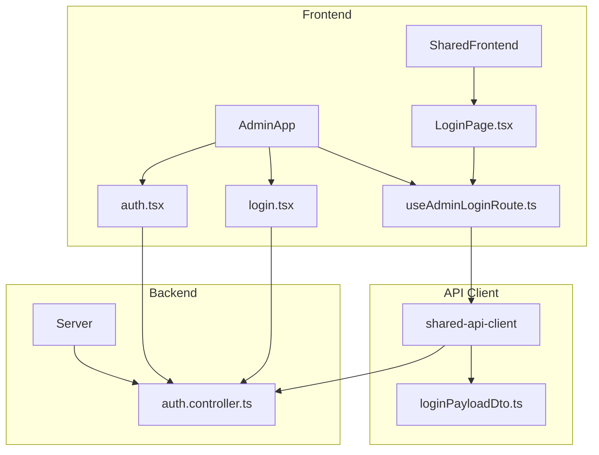
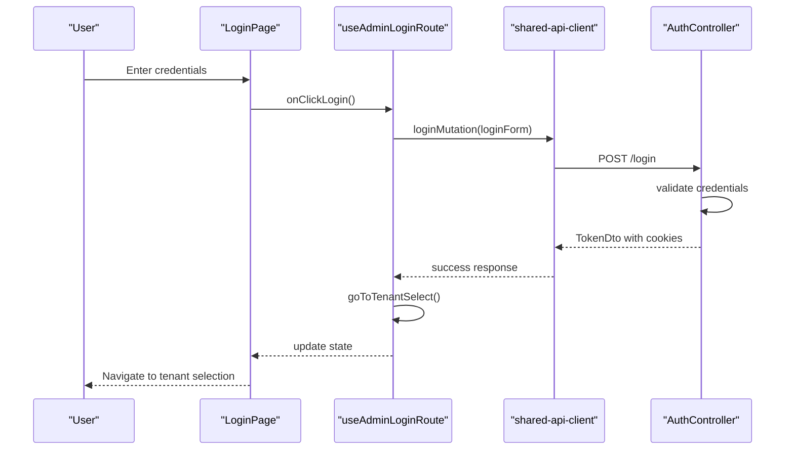
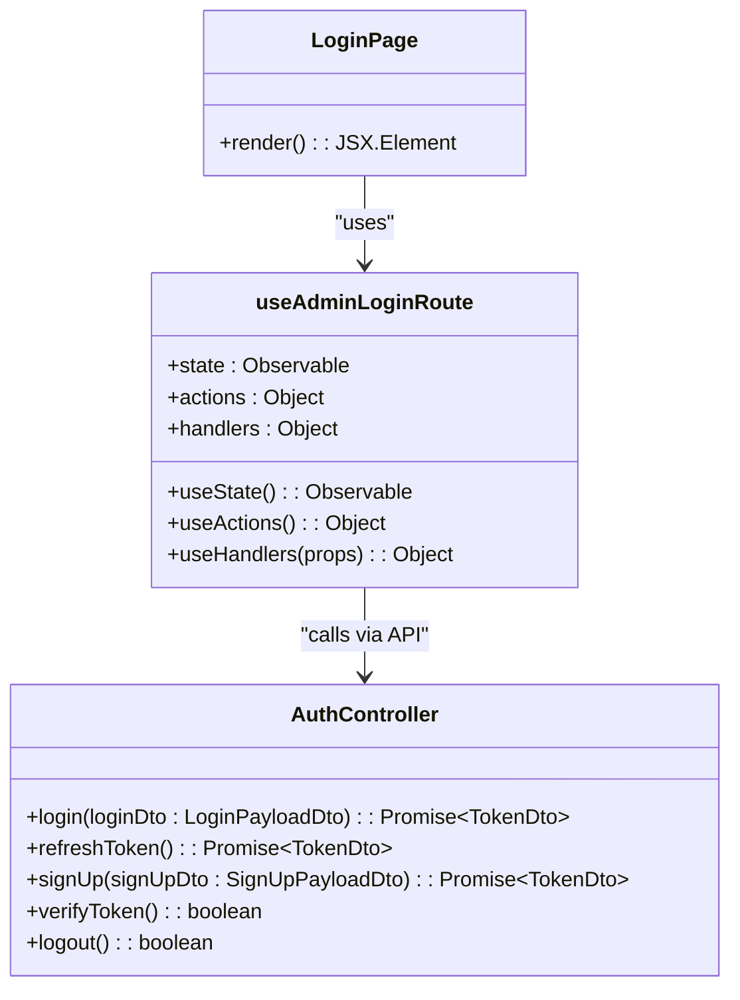
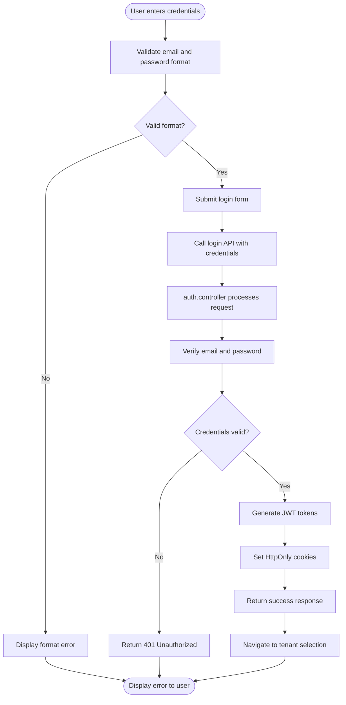
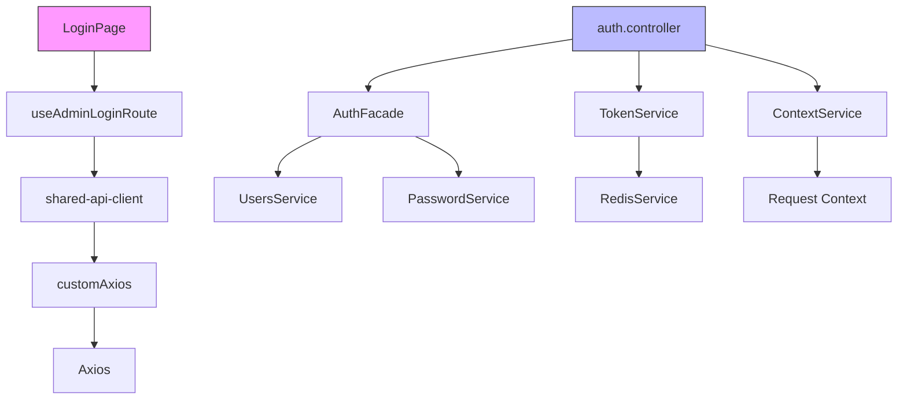

# Login Flow Implementation

<cite>
**Referenced Files in This Document**   
- [auth.tsx](file://apps/admin/src/routes/admin/auth.tsx)
- [login.tsx](file://apps/admin/src/routes/admin/auth/login.tsx)
- [useAdminLoginRoute.ts](file://apps/admin/src/hooks/useAdminLoginRoute.ts)
- [auth.controller.ts](file://apps/server/src/shared/controller/domains/auth.controller.ts)
- [LoginPage.tsx](file://packages/ui/src/components/page/LoginPage.tsx)
- [loginPayloadDto.ts](file://packages/api/src/model/loginPayloadDto.ts)
</cite>

## Table of Contents
1. [Introduction](#introduction)
2. [Project Structure](#project-structure)
3. [Core Components](#core-components)
4. [Architecture Overview](#architecture-overview)
5. [Detailed Component Analysis](#detailed-component-analysis)
6. [Dependency Analysis](#dependency-analysis)
7. [Performance Considerations](#performance-considerations)
8. [Troubleshooting Guide](#troubleshooting-guide)
9. [Conclusion](#conclusion)

## Introduction
This document provides a comprehensive analysis of the Admin Login Flow in prj-core, detailing the implementation from the frontend components to the backend authentication services. The login process begins with the AdminAuthLoginPage component in shared-frontend and integrates with the login.tsx route in the admin app. The useAdminLoginRoute hook manages navigation and state during the login process, handling form submission, API interaction with the shared-api-client, and response processing. This documentation explains the sequence of events from credential input to authentication request, including error states for invalid credentials and network failures. It also covers the relationship between frontend components and the NestJS auth.controller for credential verification, addressing common issues such as password validation requirements, loading states, and accessibility considerations in form design.

## Project Structure
The project structure for the login flow spans multiple directories and packages within the prj-core monorepo. The admin application routes are located in the apps/admin/src/routes/admin directory, with specific authentication routes in the auth subdirectory. The shared frontend components are organized in the packages/shared-frontend/src/components directory, while API clients are maintained in packages/shared-api-client. Backend authentication logic is implemented in the apps/server/src/shared/controller/domains directory. This modular structure separates concerns between presentation, business logic, and data access layers, enabling maintainable and scalable authentication functionality.

**Diagram sources**
- [auth.tsx](file://apps/admin/src/routes/admin/auth.tsx)
- [login.tsx](file://apps/admin/src/routes/admin/auth/login.tsx)
- [useAdminLoginRoute.ts](file://apps/admin/src/hooks/useAdminLoginRoute.ts)
- [LoginPage.tsx](file://packages/ui/src/components/page/LoginPage.tsx)
- [loginPayloadDto.ts](file://packages/api/src/model/loginPayloadDto.ts)
- [auth.controller.ts](file://apps/server/src/shared/controller/domains/auth.controller.ts)

**Section sources**
- [auth.tsx](file://apps/admin/src/routes/admin/auth.tsx)
- [login.tsx](file://apps/admin/src/routes/admin/auth/login.tsx)

## Core Components
The core components of the admin login flow include the AdminAuthLoginPage component, the useAdminLoginRoute hook, and the auth.controller. These components work together to provide a seamless authentication experience. The AdminAuthLoginPage component renders the login form and handles user interaction, while the useAdminLoginRoute hook manages the state and business logic for the login process. The auth.controller on the backend handles credential verification and token generation. Together, these components implement a secure and user-friendly login flow with proper error handling and state management.

**Section sources**
- [useAdminLoginRoute.ts](file://apps/admin/src/hooks/useAdminLoginRoute.ts)
- [LoginPage.tsx](file://packages/ui/src/components/page/LoginPage.tsx)
- [auth.controller.ts](file://apps/server/src/shared/controller/domains/auth.controller.ts)

## Architecture Overview
The admin login flow follows a clean architecture pattern with clear separation between presentation, business logic, and data access layers. The frontend components handle user interface rendering and interaction, while the useAdminLoginRoute hook manages application state and coordinates API calls. The shared-api-client package provides a consistent interface for communicating with the backend services. On the server side, the auth.controller implements the authentication logic using NestJS controllers and services. This architecture enables maintainable and testable code with clear responsibilities for each component.

**Diagram sources**
- [login.tsx](file://apps/admin/src/routes/admin/auth/login.tsx)
- [useAdminLoginRoute.ts](file://apps/admin/src/hooks/useAdminLoginRoute.ts)
- [auth.controller.ts](file://apps/server/src/shared/controller/domains/auth.controller.ts)

## Detailed Component Analysis

### Frontend Components Analysis
The frontend components for the admin login flow are implemented using React with TypeScript and MobX for state management. The LoginPage component renders the login form with email and password fields, while the useAdminLoginRoute hook manages the form state and handles the login logic. The component uses TanStack React Query for API calls, providing built-in loading and error states. The implementation follows accessibility best practices with proper form labeling and keyboard navigation support.

#### Component Structure

**Diagram sources**
- [login.tsx](file://apps/admin/src/routes/admin/auth/login.tsx)
- [useAdminLoginRoute.ts](file://apps/admin/src/hooks/useAdminLoginRoute.ts)
- [auth.controller.ts](file://apps/server/src/shared/controller/domains/auth.controller.ts)

**Section sources**
- [login.tsx](file://apps/admin/src/routes/admin/auth/login.tsx)
- [useAdminLoginRoute.ts](file://apps/admin/src/hooks/useAdminLoginRoute.ts)

### Authentication Flow Analysis
The authentication flow begins when the user submits their credentials through the LoginPage component. The useAdminLoginRoute hook captures the form submission and initiates the login process by calling the loginMutation function. This function sends the credentials to the backend auth.controller via the shared-api-client. The backend validates the credentials against the database and, if successful, generates JWT tokens for session management. The tokens are returned in the response along with user information and are stored in HttpOnly cookies for security.

#### Authentication Sequence

**Diagram sources**
- [useAdminLoginRoute.ts](file://apps/admin/src/hooks/useAdminLoginRoute.ts)
- [auth.controller.ts](file://apps/server/src/shared/controller/domains/auth.controller.ts)

**Section sources**
- [useAdminLoginRoute.ts](file://apps/admin/src/hooks/useAdminLoginRoute.ts)
- [auth.controller.ts](file://apps/server/src/shared/controller/domains/auth.controller.ts)

### Backend Controller Analysis
The auth.controller implements the backend authentication logic using NestJS decorators and services. The controller exposes several endpoints for login, token refresh, signup, token verification, and logout. The login endpoint accepts a LoginPayloadDto containing the user's email and password, validates the credentials, and returns a TokenDto with JWT tokens and user information. The controller uses HttpOnly cookies to securely store tokens and prevent XSS attacks. Error handling is implemented with appropriate HTTP status codes and descriptive error messages.

#### Controller Endpoints
| Endpoint | Method | Description | Security |
|---------|--------|-------------|----------|
| /login | POST | Authenticate user with email and password | Public |
| /token/refresh | POST | Refresh JWT tokens using refresh token | Public |
| /new-token | GET | Refresh access token for authenticated user | Authenticated |
| /sign-up | POST | Create new user account | Public |
| /verify-token | GET | Verify validity of access token | Authenticated |
| /logout | POST | Logout user and invalidate tokens | Authenticated |

**Diagram sources**
- [auth.controller.ts](file://apps/server/src/shared/controller/domains/auth.controller.ts)

**Section sources**
- [auth.controller.ts](file://apps/server/src/shared/controller/domains/auth.controller.ts)

## Dependency Analysis
The admin login flow has dependencies across multiple packages and services within the prj-core monorepo. The frontend components depend on the shared-api-client for API communication, which in turn depends on Axios for HTTP requests. The backend auth.controller depends on several shared services including AuthFacade, TokenService, and ContextService. These dependencies are managed through dependency injection in NestJS, ensuring loose coupling and testability. The use of HttpOnly cookies for token storage provides an additional layer of security by preventing client-side script access to authentication tokens.

**Diagram sources**
- [login.tsx](file://apps/admin/src/routes/admin/auth/login.tsx)
- [useAdminLoginRoute.ts](file://apps/admin/src/hooks/useAdminLoginRoute.ts)
- [auth.controller.ts](file://apps/server/src/shared/controller/domains/auth.controller.ts)

**Section sources**
- [useAdminLoginRoute.ts](file://apps/admin/src/hooks/useAdminLoginRoute.ts)
- [auth.controller.ts](file://apps/server/src/shared/controller/domains/auth.controller.ts)

## Performance Considerations
The login flow implementation considers several performance aspects to ensure a responsive user experience. The use of React Query for API calls provides automatic caching, error handling, and loading states without requiring additional code. The backend authentication process is optimized with efficient database queries and token generation algorithms. Password hashing uses bcrypt with appropriate work factors to balance security and performance. The implementation also includes rate limiting on authentication endpoints to prevent brute force attacks while maintaining acceptable response times for legitimate users.

## Troubleshooting Guide
Common issues in the admin login flow include invalid credentials, network errors, and token expiration. For invalid credentials, the system returns a 401 Unauthorized response with a descriptive error message. Network errors are handled gracefully with appropriate error boundaries and user feedback. Token expiration is managed through the refresh token mechanism, allowing users to maintain their session without re-entering credentials. When troubleshooting login issues, developers should check the browser's developer tools for network requests and responses, verify that cookies are being set correctly, and ensure that the backend services are running and accessible.

**Section sources**
- [useAdminLoginRoute.ts](file://apps/admin/src/hooks/useAdminLoginRoute.ts)
- [auth.controller.ts](file://apps/server/src/shared/controller/domains/auth.controller.ts)

## Conclusion
The admin login flow in prj-core implements a secure and user-friendly authentication system with clear separation of concerns between frontend and backend components. The use of React with MobX for state management, TanStack React Query for API calls, and NestJS for backend services provides a robust foundation for authentication functionality. The implementation follows security best practices with HttpOnly cookies for token storage, proper error handling, and protection against common attacks like XSS and brute force attempts. The modular architecture enables maintainable and testable code, while the comprehensive error handling provides a good user experience even when issues occur.