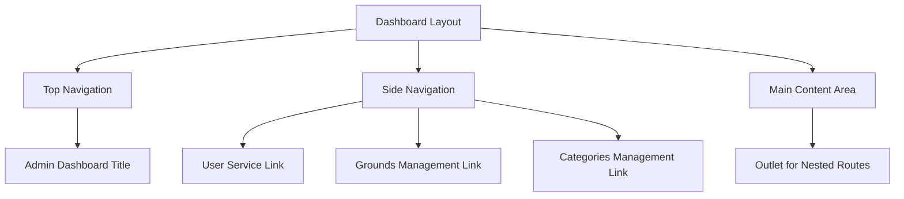
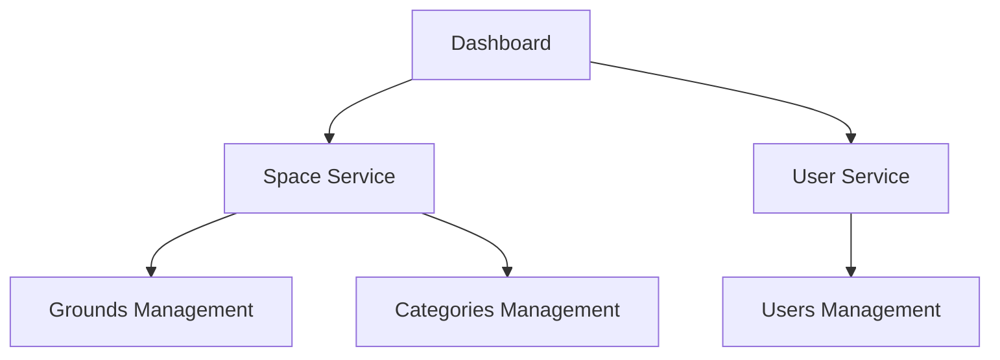
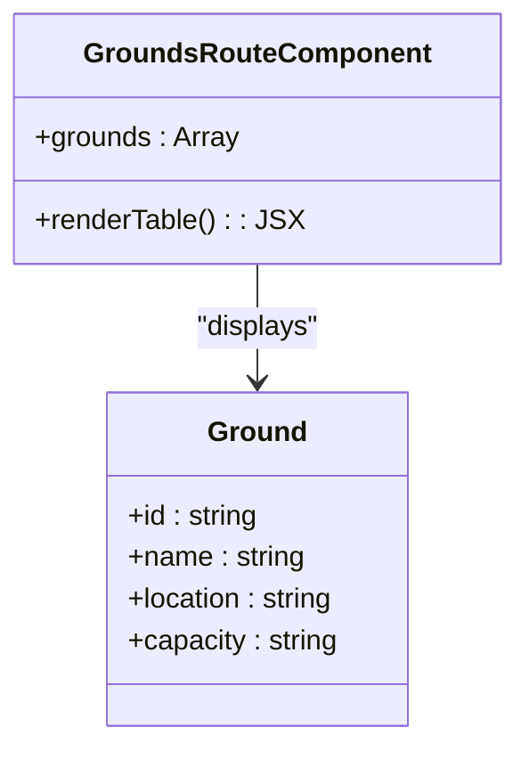
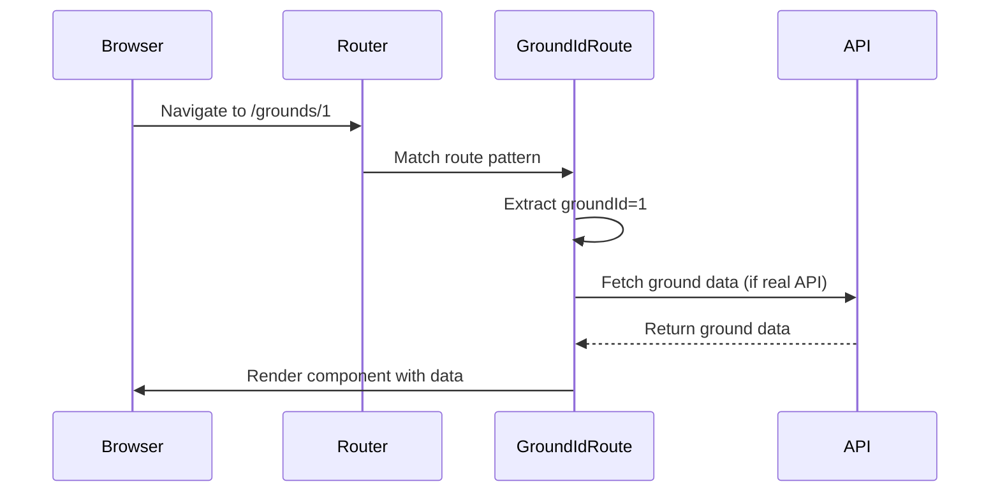
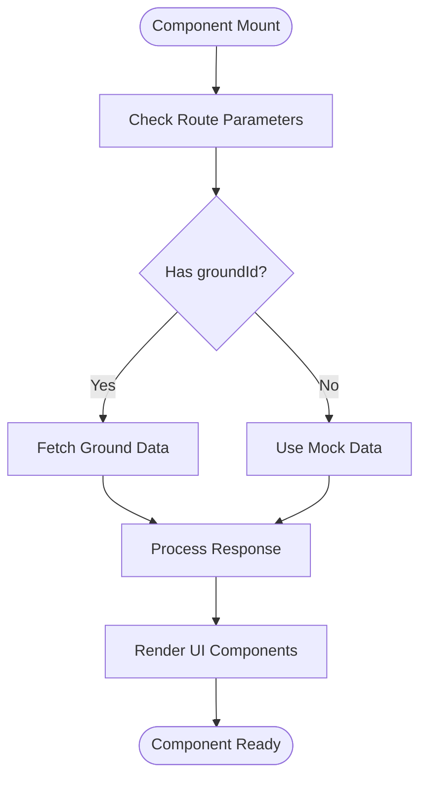
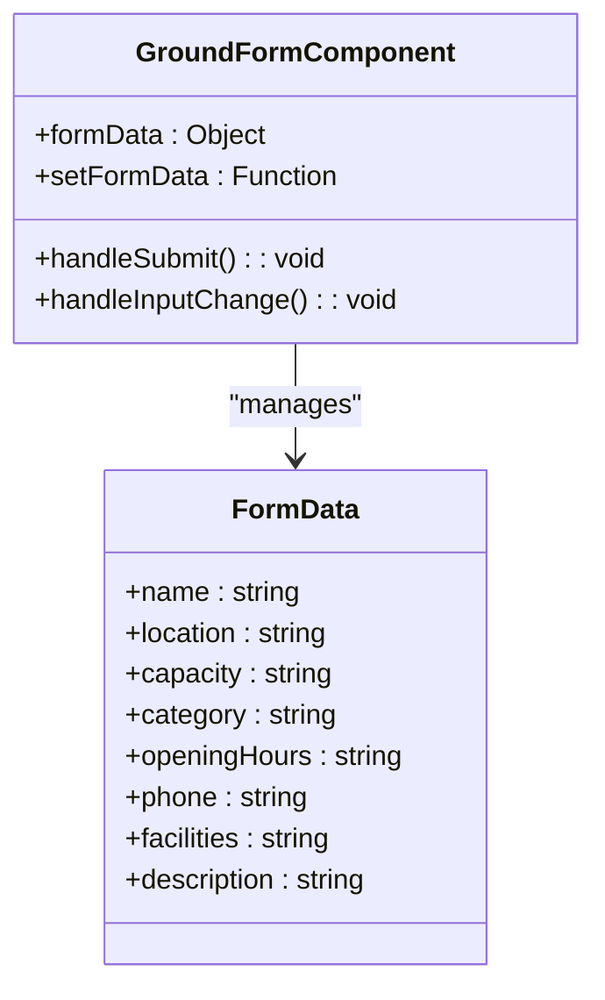
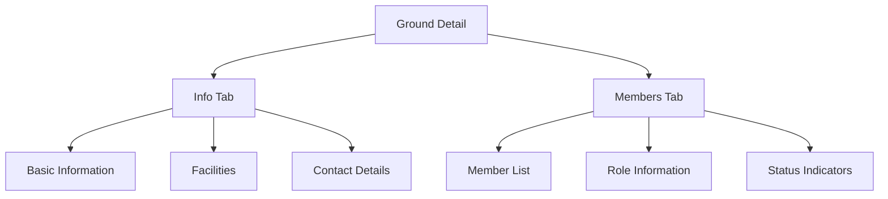
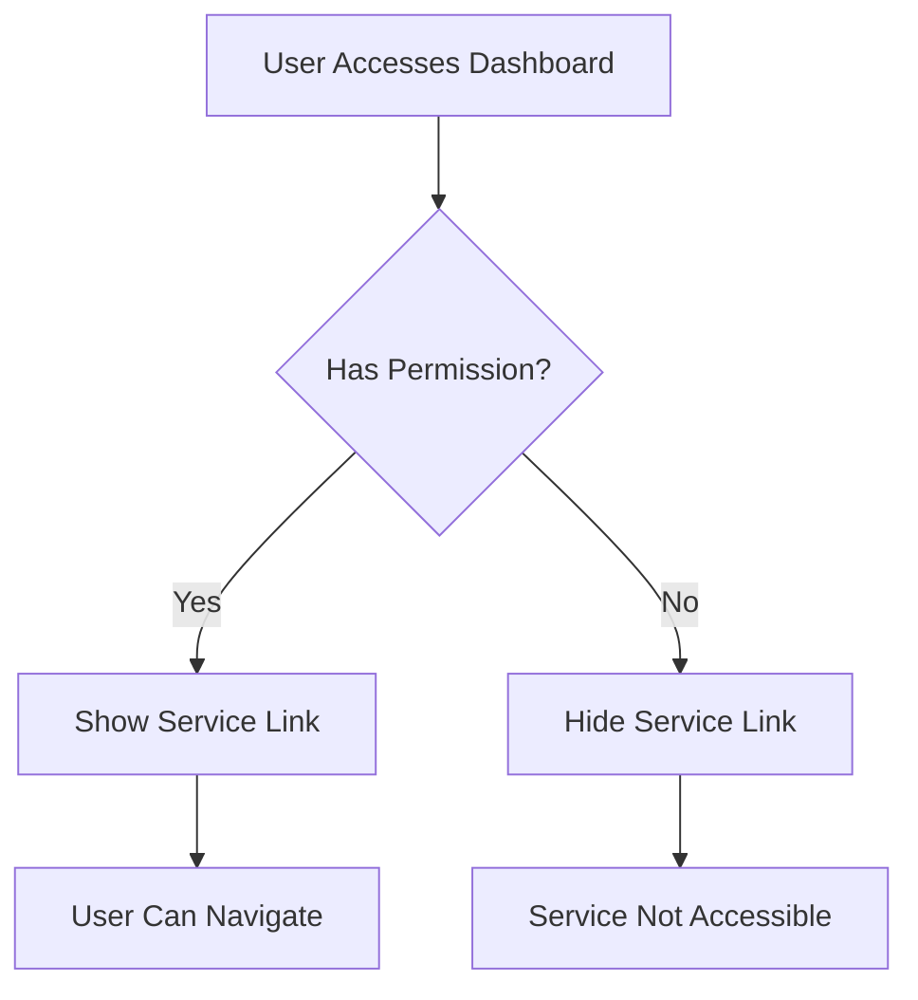

# Dashboard Interface

<cite>
**Referenced Files in This Document**   
- [dashboard.tsx](file://apps/admin/src/routes/admin/dashboard.tsx)
- [index.tsx](file://apps/admin/src/routes/admin/dashboard/index.tsx)
- [space-service.tsx](file://apps/admin/src/routes/admin/dashboard/space-service.tsx)
- [user-service.tsx](file://apps/admin/src/routes/admin/dashboard/user-service.tsx)
- [grounds.tsx](file://apps/admin/src/routes/admin/dashboard/space-service/grounds.tsx)
- [$groundId.tsx](file://apps/admin/src/routes/admin/dashboard/space-service/grounds/$groundId.tsx)
- [detail.tsx](file://apps/admin/src/routes/admin/dashboard/space-service/grounds/$groundId/detail.tsx)
- [info.tsx](file://apps/admin/src/routes/admin/dashboard/space-service/grounds/$groundId/detail/info.tsx)
- [members.tsx](file://apps/admin/src/routes/admin/dashboard/space-service/grounds/$groundId/detail/members.tsx)
- [create.tsx](file://apps/admin/src/routes/admin/dashboard/space-service/grounds/$groundId/create.tsx)
- [modify.tsx](file://apps/admin/src/routes/admin/dashboard/space-service/grounds/$groundId/modify.tsx)
- [categories.tsx](file://apps/admin/src/routes/admin/dashboard/space-service/categories.tsx)
- [$categoryId.tsx](file://apps/admin/src/routes/admin/dashboard/space-service/categories/$categoryId.tsx)
</cite>

## Table of Contents
1. [Introduction](#introduction)
2. [Dashboard Layout and Routing Structure](#dashboard-layout-and-routing-structure)
3. [Service Components Organization](#service-components-organization)
4. [Space Service Component Structure](#space-service-component-structure)
5. [Dynamic Routing Implementation](#dynamic-routing-implementation)
6. [Data Fetching and State Management](#data-fetching-and-state-management)
7. [Form Handling and Validation](#form-handling-and-validation)
8. [Detail View Organization](#detail-view-organization)
9. [UI Component Integration](#ui-component-integration)
10. [Common Issues and Solutions](#common-issues-and-solutions)
11. [Conclusion](#conclusion)

## Introduction
The Admin Dashboard Interface in prj-core provides a centralized management system for administrative operations, organized around modular service components. This document details the implementation of the dashboard layout and its core service components—space-service and user-service—focusing on their organization under the dashboard route, dynamic routing patterns, and integration with shared frontend components. The documentation is designed to be accessible to beginners with clear navigation diagrams while providing technical depth on state management and performance considerations for experienced developers.

## Dashboard Layout and Routing Structure

The dashboard interface follows a consistent layout pattern with a top navigation bar and sidebar for service navigation. The main layout is defined in the dashboard route component, which establishes the overall structure used across all dashboard views.

**Diagram sources**
- [dashboard.tsx](file://apps/admin/src/routes/admin/dashboard.tsx#L1-L50)

**Section sources**
- [dashboard.tsx](file://apps/admin/src/routes/admin/dashboard.tsx#L1-L50)
- [index.tsx](file://apps/admin/src/routes/admin/dashboard/index.tsx#L1-L26)

## Service Components Organization

The dashboard organizes functionality into distinct service components, with space-service and user-service as primary modules. Each service component serves as a routing parent for related functionality, providing a consistent heading and outlet for nested routes.

**Diagram sources**
- [space-service.tsx](file://apps/admin/src/routes/admin/dashboard/space-service.tsx#L1-L15)
- [user-service.tsx](file://apps/admin/src/routes/admin/dashboard/user-service.tsx#L1-L17)

**Section sources**
- [space-service.tsx](file://apps/admin/src/routes/admin/dashboard/space-service.tsx#L1-L15)
- [user-service.tsx](file://apps/admin/src/routes/admin/dashboard/user-service.tsx#L1-L17)

## Space Service Component Structure

The space-service component manages workspace-related entities, primarily grounds and categories. It provides a hierarchical structure where the parent route renders a service title and outlet for child routes, enabling consistent presentation across related functionality.

The grounds management interface displays a list of grounds using a table component with columns for name, location, and capacity. This list view serves as the entry point for detailed operations on individual grounds.

**Diagram sources**
- [grounds.tsx](file://apps/admin/src/routes/admin/dashboard/space-service/grounds.tsx#L1-L63)

**Section sources**
- [grounds.tsx](file://apps/admin/src/routes/admin/dashboard/space-service/grounds.tsx#L1-L63)

## Dynamic Routing Implementation

The dashboard implements dynamic routing using parameterized route segments denoted by the $ prefix (e.g., $groundId, $categoryId). This pattern enables detailed view and edit functionality for specific entities by capturing identifiers from the URL path.

When a user navigates to a ground-specific route, the component extracts the groundId parameter and uses it to fetch and display relevant data. This approach supports both detail views and form-based operations like creation and modification.

**Diagram sources**
- [$groundId.tsx](file://apps/admin/src/routes/admin/dashboard/space-service/grounds/$groundId.tsx#L1-L21)
- [detail.tsx](file://apps/admin/src/routes/admin/dashboard/space-service/grounds/$groundId/detail.tsx#L1-L24)

**Section sources**
- [$groundId.tsx](file://apps/admin/src/routes/admin/dashboard/space-service/grounds/$groundId.tsx#L1-L21)
- [detail.tsx](file://apps/admin/src/routes/admin/dashboard/space-service/grounds/$groundId/detail.tsx#L1-L24)

## Data Fetching and State Management

The dashboard components implement client-side state management using React's useState hook for form data and display state. While the current implementation uses mock data, the pattern is designed to integrate with API services for real data fetching.

For list-to-detail synchronization, the components maintain consistency by using the same data structure patterns across list views and detail views. When viewing or editing a specific ground, the component uses the route parameter to identify the target entity, ensuring data coherence across views.

**Section sources**
- [info.tsx](file://apps/admin/src/routes/admin/dashboard/space-service/grounds/$groundId/detail/info.tsx#L1-L78)
- [members.tsx](file://apps/admin/src/routes/admin/dashboard/space-service/grounds/$groundId/detail/members.tsx#L1-L90)

## Form Handling and Validation

Form components for create and modify operations implement controlled input patterns using React state to manage form data. Each form field is bound to a state property, with onChange handlers updating the state on user input.

The create and modify components share a similar structure, with form fields for ground attributes including name, location, capacity, category, opening hours, phone, facilities, and description. Form submission handlers would typically validate input and communicate with backend services.

**Diagram sources**
- [create.tsx](file://apps/admin/src/routes/admin/dashboard/space-service/grounds/$groundId/create.tsx#L1-L134)
- [modify.tsx](file://apps/admin/src/routes/admin/dashboard/space-service/grounds/$groundId/modify.tsx#L1-L136)

**Section sources**
- [create.tsx](file://apps/admin/src/routes/admin/dashboard/space-service/grounds/$groundId/create.tsx#L1-L134)
- [modify.tsx](file://apps/admin/src/routes/admin/dashboard/space-service/grounds/$groundId/modify.tsx#L1-L136)

## Detail View Organization

Detail views for grounds are organized using a tabbed interface pattern, with separate routes for different aspects of ground information. The detail route serves as a parent for tab-specific routes, providing navigation between information and members views.

The info tab displays ground attributes in a structured definition list format, while the members tab presents a table of associated users with their roles and status. This modular approach allows for scalable addition of new detail views without cluttering the interface.

**Section sources**
- [info.tsx](file://apps/admin/src/routes/admin/dashboard/space-service/grounds/$groundId/detail/info.tsx#L1-L78)
- [members.tsx](file://apps/admin/src/routes/admin/dashboard/space-service/grounds/$groundId/detail/members.tsx#L1-L90)

## UI Component Integration

The dashboard components integrate with shared-frontend UI components to ensure consistent styling and behavior across the application. Components from the shared-frontend package, such as Table, Input, Select, and Button, are used throughout the dashboard interface.

This integration promotes design consistency and reduces duplication by leveraging pre-built, tested UI elements. The shared components follow a common design system, ensuring that forms, tables, and navigation elements have a uniform appearance and interaction pattern.

**Section sources**
- [grounds.tsx](file://apps/admin/src/routes/admin/dashboard/space-service/grounds.tsx#L1-L63)
- [create.tsx](file://apps/admin/src/routes/admin/dashboard/space-service/grounds/$groundId/create.tsx#L1-L134)
- [members.tsx](file://apps/admin/src/routes/admin/dashboard/space-service/grounds/$groundId/detail/members.tsx#L1-L90)

## Common Issues and Solutions

### Data Synchronization Between List and Detail Views
The current implementation uses mock data that is not synchronized between views. In a production environment, this would be addressed by implementing a shared state management solution or ensuring API consistency across requests.

### Form Validation in Create/Modify Flows
While the current forms capture input, they lack validation logic. A robust implementation would include client-side validation for required fields, data formats, and business rules before submitting to the backend.

### Permission-Based Service Visibility
The sidebar navigation currently displays all services to all users. A complete implementation would conditionally render service links based on user permissions, preventing unauthorized access to sensitive functionality.

**Section sources**
- [dashboard.tsx](file://apps/admin/src/routes/admin/dashboard.tsx#L1-L50)
- [space-service.tsx](file://apps/admin/src/routes/admin/dashboard/space-service.tsx#L1-L15)

## Conclusion
The Admin Dashboard Interface in prj-core demonstrates a well-structured approach to organizing administrative functionality through modular service components and dynamic routing. The implementation leverages React and TanStack Router to create a hierarchical navigation system that supports both list-based overviews and detailed entity management. By integrating with shared-frontend components, the dashboard maintains consistent UI patterns while allowing for specialized functionality within each service module. The use of parameterized routes enables efficient navigation between entities, and the component structure supports both data display and form-based operations. Future enhancements should focus on implementing proper state management, form validation, and permission-based access control to create a robust administrative experience.