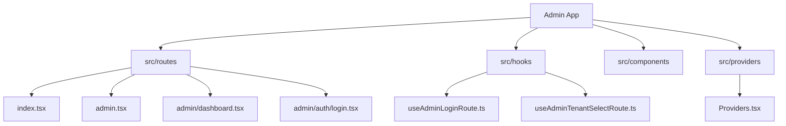
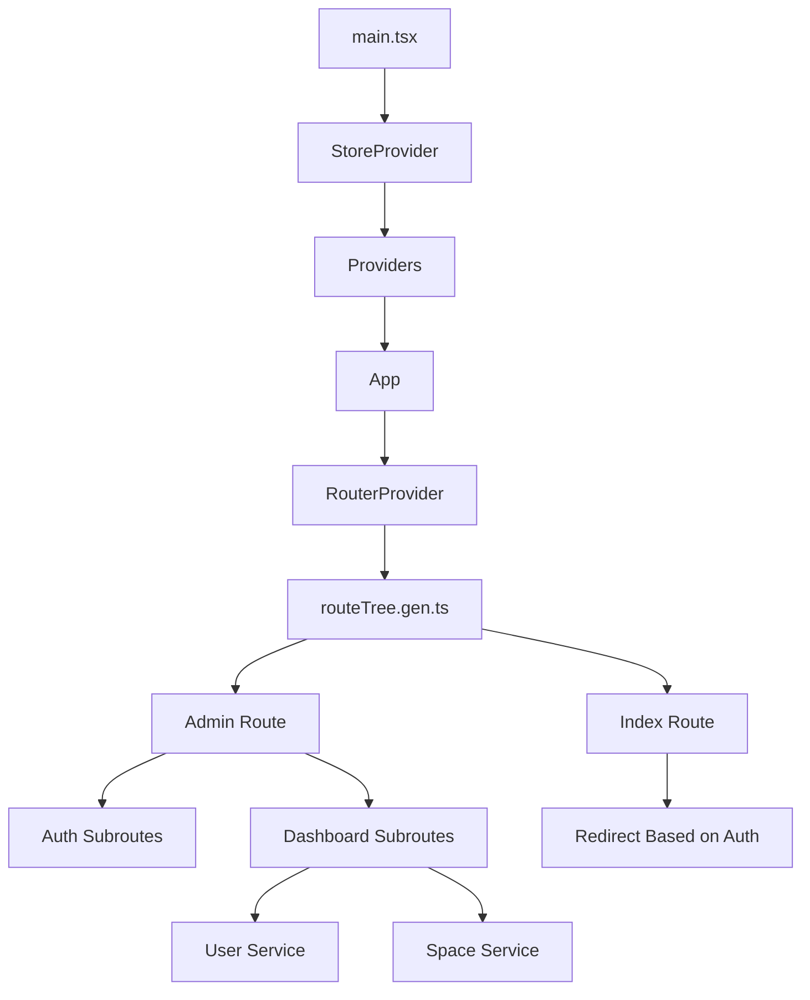
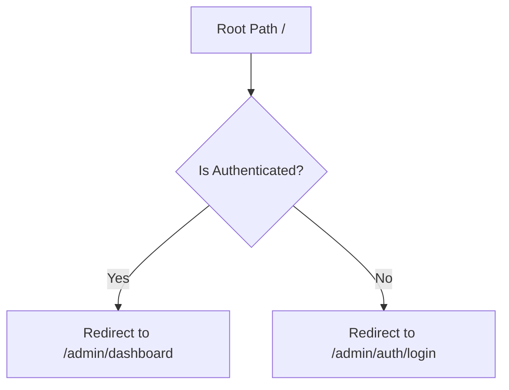
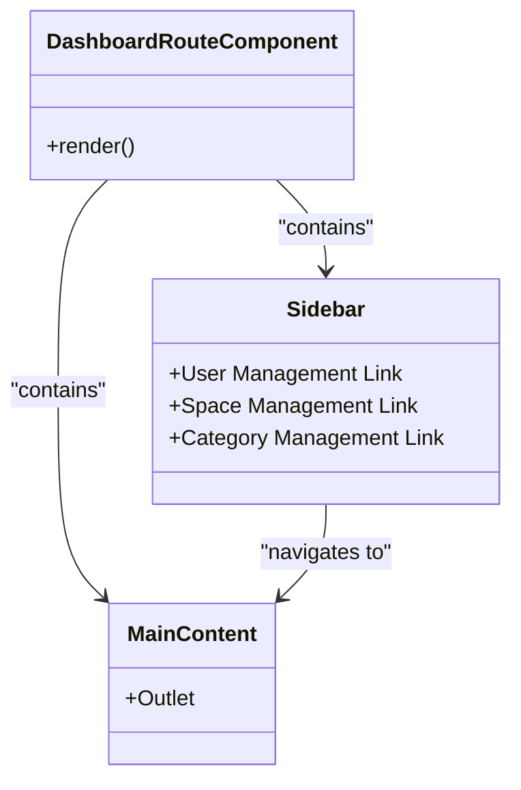
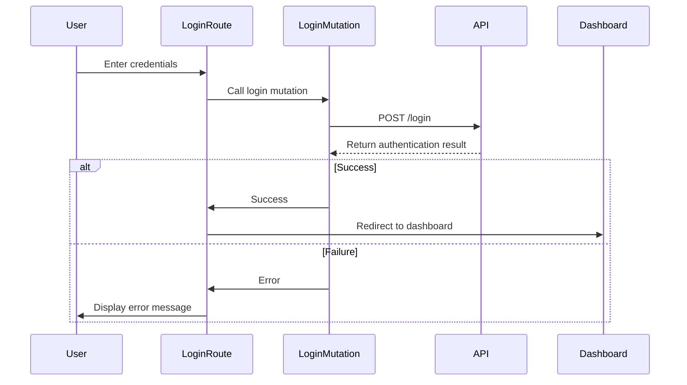
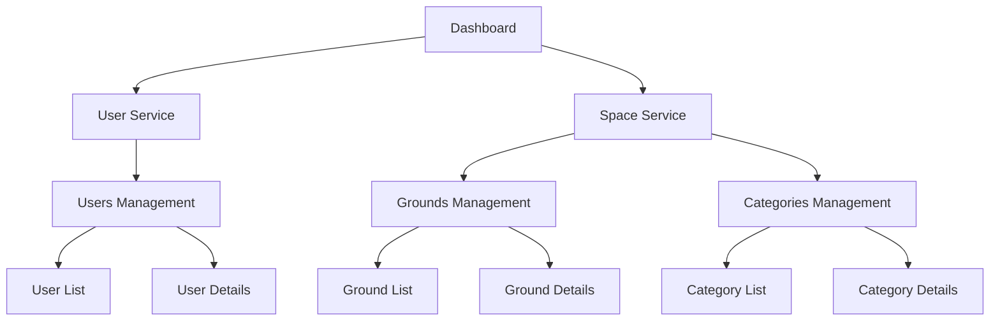
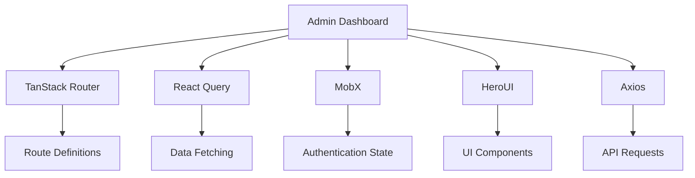

# Dashboard Overview

<cite>
**Referenced Files in This Document**   
- [index.tsx](file://apps/admin/src/routes/index.tsx)
- [admin.tsx](file://apps/admin/src/routes/admin.tsx)
- [dashboard.tsx](file://apps/admin/src/routes/admin/dashboard.tsx)
- [App.tsx](file://apps/admin/src/App.tsx)
- [main.tsx](file://apps/admin/src/main.tsx)
- [routeTree.gen.ts](file://apps/admin/src/routeTree.gen.ts)
- [useAdminLoginRoute.ts](file://apps/admin/src/hooks/useAdminLoginRoute.ts)
- [login.tsx](file://apps/admin/src/routes/admin/auth/login.tsx)
- [index.tsx](file://apps/admin/src/routes/admin/dashboard/index.tsx)
- [user-service.tsx](file://apps/admin/src/routes/admin/dashboard/user-service.tsx)
- [space-service.tsx](file://apps/admin/src/routes/admin/dashboard/space-service.tsx)
- [Providers.tsx](file://apps/admin/src/providers/Providers.tsx)
</cite>

## Table of Contents
1. [Introduction](#introduction)
2. [Project Structure](#project-structure)
3. [Core Components](#core-components)
4. [Architecture Overview](#architecture-overview)
5. [Detailed Component Analysis](#detailed-component-analysis)
6. [Dependency Analysis](#dependency-analysis)
7. [Performance Considerations](#performance-considerations)
8. [Troubleshooting Guide](#troubleshooting-guide)
9. [Conclusion](#conclusion)

## Introduction
The Admin Dashboard in prj-core serves as the central navigation hub for administrative services, providing access to user and space management functionalities. This document explains the architecture, layout structure, routing mechanism, and integration with the sidebar navigation system. The dashboard acts as the primary interface after authentication, orchestrating access to various service modules through a well-defined routing system and state management approach.

## Project Structure

The Admin Dashboard is organized within the `apps/admin` directory, following a structured approach to routing and component organization. The key structural elements include:

- `src/routes/`: Contains all route definitions and configurations
- `src/hooks/`: Houses custom hooks for state and logic management
- `src/components/`: Stores reusable UI components
- `src/providers/`: Manages application-level providers and context

The routing system is built using TanStack Router, with route definitions organized in a hierarchical structure that mirrors the application's navigation flow.

**Diagram sources**
- [index.tsx](file://apps/admin/src/routes/index.tsx)
- [admin.tsx](file://apps/admin/src/routes/admin.tsx)
- [dashboard.tsx](file://apps/admin/src/routes/admin/dashboard.tsx)
- [login.tsx](file://apps/admin/src/routes/admin/auth/login.tsx)
- [useAdminLoginRoute.ts](file://apps/admin/src/hooks/useAdminLoginRoute.ts)
- [Providers.tsx](file://apps/admin/src/providers/Providers.tsx)

**Section sources**
- [index.tsx](file://apps/admin/src/routes/index.tsx)
- [admin.tsx](file://apps/admin/src/routes/admin.tsx)
- [dashboard.tsx](file://apps/admin/src/routes/admin/dashboard.tsx)

## Core Components

The Admin Dashboard consists of several core components that work together to provide a seamless administrative experience. The main components include the routing system, authentication flow, dashboard layout, and service modules for user and space management.

The index route serves as the entry point, redirecting users to either the dashboard or login page based on authentication status. The dashboard component provides the main layout with sidebar navigation, while service modules organize related functionality under distinct sections.

**Section sources**
- [index.tsx](file://apps/admin/src/routes/index.tsx#L1-L17)
- [dashboard.tsx](file://apps/admin/src/routes/admin/dashboard.tsx#L1-L50)
- [user-service.tsx](file://apps/admin/src/routes/admin/dashboard/user-service.tsx#L1-L17)
- [space-service.tsx](file://apps/admin/src/routes/admin/dashboard/space-service.tsx#L1-L15)

## Architecture Overview

The Admin Dashboard follows a component-based architecture with a clear separation of concerns. The application is initialized through the main.tsx file, which sets up the root React component and providers. The App.tsx file creates the router instance using the generated route tree, enabling type-safe routing throughout the application.

Authentication state is managed through MobX stores, with the authStore determining the user's authentication status and controlling navigation flow. The routing system uses TanStack Router to define a hierarchical structure that supports nested layouts and dynamic imports.

**Diagram sources**
- [main.tsx](file://apps/admin/src/main.tsx#L1-L17)
- [App.tsx](file://apps/admin/src/App.tsx#L1-L22)
- [routeTree.gen.ts](file://apps/admin/src/routeTree.gen.ts#L1-L572)
- [index.tsx](file://apps/admin/src/routes/index.tsx#L1-L17)

## Detailed Component Analysis

### Index Route Analysis
The index route serves as the application's entry point, implementing a conditional redirect based on the user's authentication status. When a user accesses the root path, the component checks the authStore to determine whether to redirect to the dashboard or login page.

This approach ensures that unauthenticated users cannot access protected routes while providing a seamless experience for authenticated users who are automatically directed to the dashboard.

**Diagram sources**
- [index.tsx](file://apps/admin/src/routes/index.tsx#L1-L17)

**Section sources**
- [index.tsx](file://apps/admin/src/routes/index.tsx#L1-L17)

### Dashboard Layout Analysis
The dashboard layout component provides the main structure for the administrative interface, featuring a top navigation bar and a sidebar for service navigation. The layout uses a flex-based design to create a responsive interface that adapts to different screen sizes.

The sidebar contains navigation links to key service modules, including user management and space management functionalities. Each link uses standard anchor tags with href attributes, providing accessible navigation between different service areas.

**Diagram sources**
- [dashboard.tsx](file://apps/admin/src/routes/admin/dashboard.tsx#L1-L50)

**Section sources**
- [dashboard.tsx](file://apps/admin/src/routes/admin/dashboard.tsx#L1-L50)

### Authentication Flow Analysis
The authentication flow begins with the login route, which provides a form for user credentials. Upon successful authentication, the user is redirected to the tenant selection page, and ultimately to the dashboard.

The login functionality is implemented using React Query for data fetching, with mutation functions handling the login request. Error handling is implemented to catch and display authentication errors appropriately.

**Diagram sources**
- [login.tsx](file://apps/admin/src/routes/admin/auth/login.tsx#L1-L89)
- [useAdminLoginRoute.ts](file://apps/admin/src/hooks/useAdminLoginRoute.ts#L1-L77)

**Section sources**
- [login.tsx](file://apps/admin/src/routes/admin/auth/login.tsx#L1-L89)
- [useAdminLoginRoute.ts](file://apps/admin/src/hooks/useAdminLoginRoute.ts#L1-L77)

### Service Module Analysis
The dashboard organizes functionality into service modules, with separate routes for user-service and space-service. Each service module acts as a parent route that contains related child routes, creating a logical grouping of administrative functions.

The user-service module focuses on user management, while the space-service module handles space-related operations such as grounds and categories management. This modular approach allows for scalable growth of administrative functionality.

**Diagram sources**
- [user-service.tsx](file://apps/admin/src/routes/admin/dashboard/user-service.tsx#L1-L17)
- [space-service.tsx](file://apps/admin/src/routes/admin/dashboard/space-service.tsx#L1-L15)
- [dashboard.tsx](file://apps/admin/src/routes/admin/dashboard.tsx#L1-L50)

**Section sources**
- [user-service.tsx](file://apps/admin/src/routes/admin/dashboard/user-service.tsx#L1-L17)
- [space-service.tsx](file://apps/admin/src/routes/admin/dashboard/space-service.tsx#L1-L15)

## Dependency Analysis

The Admin Dashboard relies on several key dependencies that enable its functionality:

- TanStack Router for routing and navigation
- React Query for data fetching and state management
- MobX for global state management
- HeroUI for UI components and styling
- Axios for HTTP requests

These dependencies work together to create a cohesive application architecture where routing, state management, and UI presentation are well-integrated.

**Diagram sources**
- [App.tsx](file://apps/admin/src/App.tsx#L1-L22)
- [Providers.tsx](file://apps/admin/src/providers/Providers.tsx#L1-L36)
- [routeTree.gen.ts](file://apps/admin/src/routeTree.gen.ts#L1-L572)

**Section sources**
- [App.tsx](file://apps/admin/src/App.tsx#L1-L22)
- [Providers.tsx](file://apps/admin/src/providers/Providers.tsx#L1-L36)

## Performance Considerations

The Admin Dashboard implements several performance optimizations:

1. **Route-based code splitting**: The TanStack Router enables automatic code splitting based on routes, ensuring that only necessary code is loaded for each view.

2. **Data fetching optimization**: React Query provides caching and background refetching capabilities, reducing unnecessary API calls and improving perceived performance.

3. **State management efficiency**: MobX provides efficient reactivity with minimal re-renders, only updating components when relevant state changes occur.

4. **Responsive design**: The layout is designed to be responsive, adapting to different screen sizes without requiring separate mobile-specific code.

For optimal performance, consider implementing lazy loading for service modules and optimizing API calls through query parameters and pagination.

## Troubleshooting Guide

Common issues and their solutions:

1. **Route loading issues**: Ensure that the routeTree.gen.ts file is properly generated and imported in App.tsx. Regenerate the route tree if routes are not working as expected.

2. **Authentication state problems**: Verify that the authStore is properly initialized and that authentication status is correctly updated after login/logout operations.

3. **Navigation failures**: Check that href attributes in the sidebar match the defined route paths in the route tree.

4. **Responsive design issues**: Test the dashboard on different screen sizes and adjust CSS classes as needed to ensure proper layout at all breakpoints.

5. **API connection problems**: Verify that the API endpoints are correctly configured and that authentication tokens are properly included in requests.

**Section sources**
- [index.tsx](file://apps/admin/src/routes/index.tsx#L1-L17)
- [dashboard.tsx](file://apps/admin/src/routes/admin/dashboard.tsx#L1-L50)
- [login.tsx](file://apps/admin/src/routes/admin/auth/login.tsx#L1-L89)

## Conclusion

The Admin Dashboard in prj-core provides a comprehensive administrative interface with a well-structured architecture and intuitive navigation. The combination of TanStack Router for routing, MobX for state management, and React Query for data fetching creates a robust foundation for administrative functionality.

The dashboard serves as a central hub for managing user and space services, with a modular design that allows for easy expansion of administrative capabilities. The responsive layout ensures accessibility across different devices, while the performance optimizations provide a smooth user experience.

For developers, the clear separation of concerns and well-defined routing structure makes the codebase maintainable and extensible. The use of established libraries and patterns ensures that the dashboard follows best practices in modern web application development.