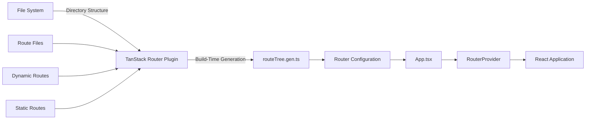
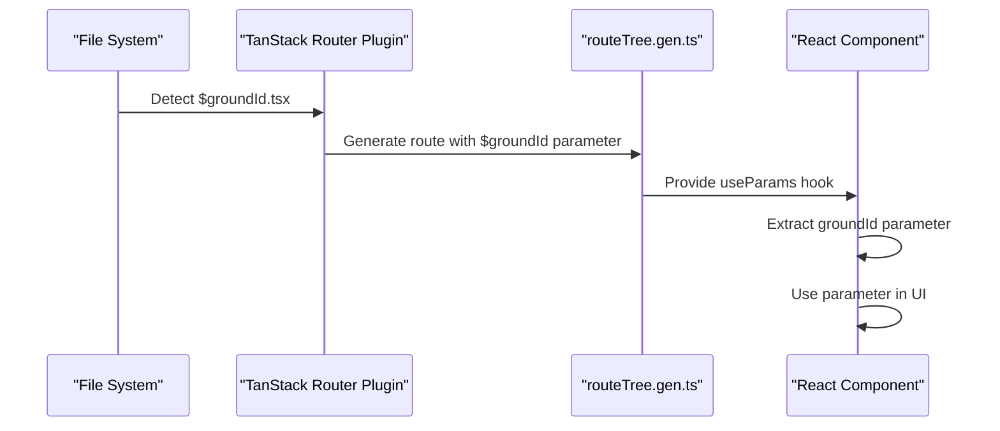
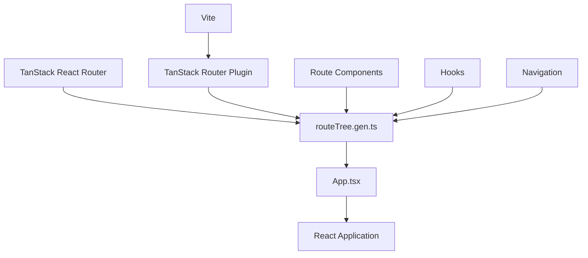

# File-Based Routing System

<cite>
**Referenced Files in This Document**   
- [routeTree.gen.ts](file://apps/admin/src/routeTree.gen.ts)
- [index.tsx](file://apps/admin/src/routes/index.tsx)
- [admin.tsx](file://apps/admin/src/routes/admin.tsx)
- [dashboard.tsx](file://apps/admin/src/routes/admin/dashboard.tsx)
- [auth.tsx](file://apps/admin/src/routes/admin/auth.tsx)
- [useAdminLoginRoute.ts](file://apps/admin/src/hooks/useAdminLoginRoute.ts)
- [useAdminTenantSelectRoute.ts](file://apps/admin/src/hooks/useAdminTenantSelectRoute.ts)
- [$groundId.tsx](file://apps/admin/src/routes/admin/dashboard/space-service/grounds/$groundId.tsx)
- [$categoryId.tsx](file://apps/admin/src/routes/admin/dashboard/space-service/categories/$categoryId.tsx)
- [App.tsx](file://apps/admin/src/App.tsx)
- [vite.config.ts](file://apps/admin/vite.config.ts)
</cite>

## Table of Contents
1. [Introduction](#introduction)
2. [Project Structure and Route Organization](#project-structure-and-route-organization)
3. [Core Routing Components](#core-routing-components)
4. [Architecture Overview](#architecture-overview)
5. [Detailed Component Analysis](#detailed-component-analysis)
6. [Dependency Analysis](#dependency-analysis)
7. [Performance Considerations](#performance-considerations)
8. [Troubleshooting Guide](#troubleshooting-guide)
9. [Conclusion](#conclusion)

## Introduction
The File-Based Routing System in prj-core's admin application provides a structured approach to route management through filesystem hierarchy. This system automatically generates a typed route tree from the directory structure under src/routes, enabling type-safe navigation and improved developer experience. The implementation leverages TanStack Router to transform file system organization into a comprehensive routing configuration during the build process.

## Project Structure and Route Organization

```mermaid
graph TD
A[Root Routes] --> B[/]
A --> C[/admin]
C --> D[/admin/dashboard]
C --> E[/admin/auth]
D --> F[/admin/dashboard/user-service]
D --> G[/admin/dashboard/space-service]
F --> H[/admin/dashboard/user-service/users]
G --> I[/admin/dashboard/space-service/categories]
G --> J[/admin/dashboard/space-service/grounds]
I --> K[/admin/dashboard/space-service/categories/$categoryId]
J --> L[/admin/dashboard/space-service/grounds/$groundId]
L --> M[/admin/dashboard/space-service/grounds/$groundId/detail]
L --> N[/admin/dashboard/space-service/grounds/$groundId/modify]
L --> O[/admin/dashboard/space-service/grounds/$groundId/create]
M --> P[/admin/dashboard/space-service/grounds/$groundId/detail/info]
M --> Q[/admin/dashboard/space-service/grounds/$groundId/detail/members]
E --> R[/admin/auth/login]
R --> S[/admin/auth/login/tenant-select]
```

**Diagram sources**
- [routeTree.gen.ts](file://apps/admin/src/routeTree.gen.ts)

**Section sources**
- [routeTree.gen.ts](file://apps/admin/src/routeTree.gen.ts)

## Core Routing Components

The routing system is built around several key components that work together to provide a seamless navigation experience. The core components include the route tree generator, file-based route definitions, and the router provider that connects everything at runtime.

**Section sources**
- [App.tsx](file://apps/admin/src/App.tsx)
- [routeTree.gen.ts](file://apps/admin/src/routeTree.gen.ts)

## Architecture Overview



**Diagram sources**
- [vite.config.ts](file://apps/admin/vite.config.ts)
- [App.tsx](file://apps/admin/src/App.tsx)

## Detailed Component Analysis

### Static Routes Implementation
Static routes are implemented through conventional file naming in the routes directory. Files like `login.tsx` create corresponding static routes that are directly accessible via their file path. The system automatically maps these files to URL paths based on their location in the directory hierarchy.

**Section sources**
- [auth.tsx](file://apps/admin/src/routes/admin/auth.tsx)
- [dashboard.tsx](file://apps/admin/src/routes/admin/dashboard.tsx)

### Dynamic Routes with Parameterized Navigation
Dynamic routes are created using dollar-prefixed parameters in file names (e.g., `$categoryId.tsx`). These files enable parameterized navigation where route parameters can be extracted and used within components.



**Diagram sources**
- [$groundId.tsx](file://apps/admin/src/routes/admin/dashboard/space-service/grounds/$groundId.tsx)
- [routeTree.gen.ts](file://apps/admin/src/routeTree.gen.ts)

**Section sources**
- [$groundId.tsx](file://apps/admin/src/routes/admin/dashboard/space-service/grounds/$groundId.tsx)
- [$categoryId.tsx](file://apps/admin/src/routes/admin/dashboard/space-service/categories/$categoryId.tsx)

### Nested Route Files and Layout Management
Nested route files enable complex layout structures while maintaining clean code organization. Parent routes can define layout components with `<Outlet />` to render child routes, creating a hierarchical navigation structure.

```mermaid
flowchart TD
A[/admin/dashboard] --> B[/admin/dashboard/user-service]
A --> C[/admin/dashboard/space-service]
B --> D[/admin/dashboard/user-service/users]
C --> E[/admin/dashboard/space-service/categories]
C --> F[/admin/dashboard/space-service/grounds]
F --> G[/admin/dashboard/space-service/grounds/$groundId]
G --> H[/admin/dashboard/space-service/grounds/$groundId/detail]
G --> I[/admin/dashboard/space-service/grounds/$groundId/modify]
G --> J[/admin/dashboard/space-service/grounds/$groundId/create]
style A fill:#f9f,stroke:#333
style G fill:#bbf,stroke:#333
```

**Diagram sources**
- [dashboard.tsx](file://apps/admin/src/routes/admin/dashboard.tsx)
- [grounds.tsx](file://apps/admin/src/routes/admin/dashboard/space-service/grounds.tsx)

**Section sources**
- [dashboard.tsx](file://apps/admin/src/routes/admin/dashboard.tsx)
- [grounds.tsx](file://apps/admin/src/routes/admin/dashboard/space-service/grounds.tsx)

### Build-Time Route Tree Generation
The build-time generation process transforms the directory structure into a typed route tree for type-safe navigation. This process is orchestrated through the Vite configuration and TanStack Router plugin.


**Diagram sources**
- [vite.config.ts](file://apps/admin/vite.config.ts)
- [routeTree.gen.ts](file://apps/admin/src/routeTree.gen.ts)

**Section sources**
- [vite.config.ts](file://apps/admin/vite.config.ts)

## Dependency Analysis



**Diagram sources**
- [package.json](file://apps/admin/package.json)
- [vite.config.ts](file://apps/admin/vite.config.ts)

**Section sources**
- [App.tsx](file://apps/admin/src/App.tsx)
- [vite.config.ts](file://apps/admin/vite.config.ts)

## Performance Considerations
The file-based routing system provides several performance benefits through its build-time generation approach. By generating the route tree at build time rather than runtime, the application avoids the overhead of route parsing during initialization. The typed nature of the generated routes also eliminates runtime type checking, contributing to faster execution. Additionally, the modular structure enables code splitting, where route components can be loaded on-demand rather than all at once during application startup.

## Troubleshooting Guide

### Common Issues and Solutions
- **Route generation failures**: Verify file naming conventions and directory structure alignment with expected URL patterns
- **Parameter extraction errors**: Ensure correct usage of `useParams()` hook and proper dynamic segment naming with dollar prefix
- **Hot-reload inconsistencies**: Check Vite configuration for proper plugin setup and file watching settings
- **Type errors in navigation**: Confirm that routeTree.gen.ts is properly imported and registered in the router configuration

**Section sources**
- [useAdminLoginRoute.ts](file://apps/admin/src/hooks/useAdminLoginRoute.ts)
- [useAdminTenantSelectRoute.ts](file://apps/admin/src/hooks/useAdminTenantSelectRoute.ts)

## Conclusion
The File-Based Routing System in prj-core's admin application offers a robust solution for managing complex navigation requirements through a clean, filesystem-based approach. By leveraging TanStack Router's build-time generation capabilities, the system provides type-safe navigation while maintaining developer-friendly conventions. The combination of static routes, dynamic parameterized routes, and nested route structures enables scalable application architecture that can accommodate growing complexity. The system's integration with Vite and TypeScript ensures optimal performance and development experience, making it well-suited for enterprise-level applications.