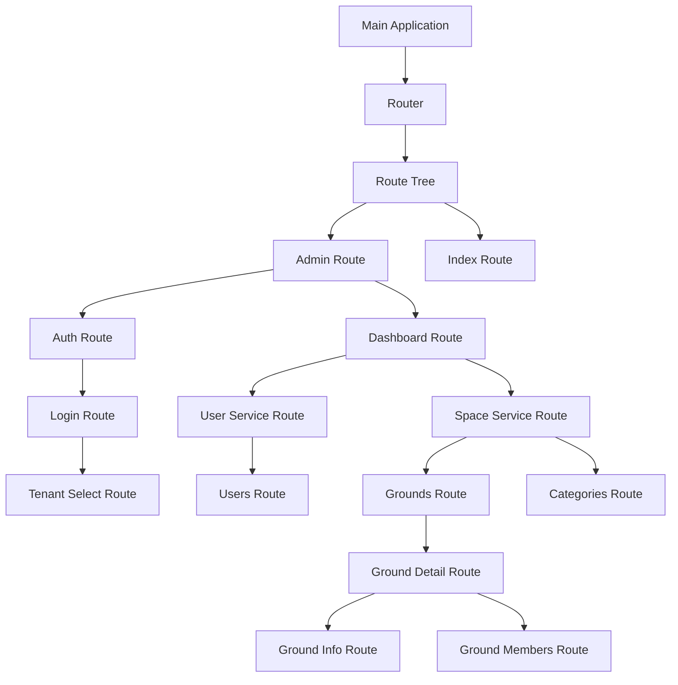
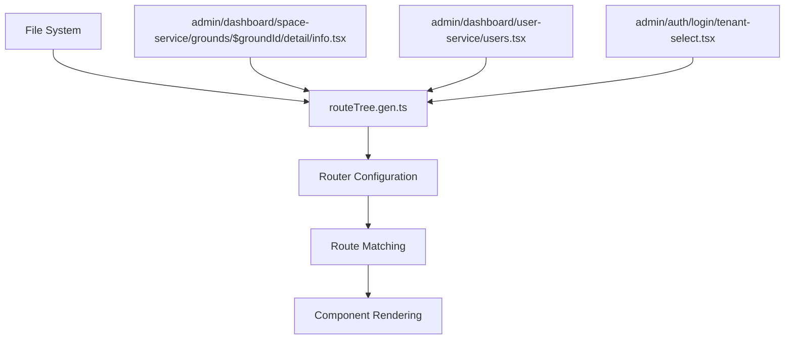
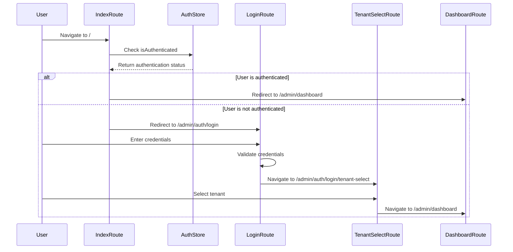
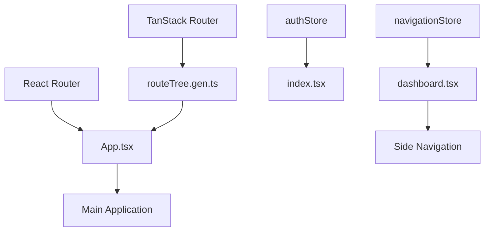

# Routing Architecture

<cite>
**Referenced Files in This Document**   
- [admin.tsx](file://apps/admin/src/routes/admin.tsx)
- [dashboard.tsx](file://apps/admin/src/routes/admin/dashboard.tsx)
- [auth.tsx](file://apps/admin/src/routes/admin/auth.tsx)
- [routeTree.gen.ts](file://apps/admin/src/routeTree.gen.ts)
- [App.tsx](file://apps/admin/src/App.tsx)
- [main.tsx](file://apps/admin/src/main.tsx)
- [users.tsx](file://apps/admin/src/routes/admin/dashboard/user-service/users.tsx)
- [info.tsx](file://apps/admin/src/routes/admin/dashboard/space-service/grounds/$groundId/detail/info.tsx)
- [categories/$categoryId.tsx](file://apps/admin/src/routes/admin/dashboard/space-service/categories/$categoryId.tsx)
- [tenant-select.tsx](file://apps/admin/src/routes/admin/auth/login/tenant-select.tsx)
- [index.tsx](file://apps/admin/src/routes/admin/dashboard/index.tsx)
- [useAdminLoginRoute.ts](file://apps/admin/src/hooks/useAdminLoginRoute.ts)
- [navigationStore.ts](file://packages/store/src/stores/navigationStore.ts)
- [routeStore.ts](file://packages/store/src/stores/routeStore.ts)
</cite>

## Table of Contents
1. [Introduction](#introduction)
2. [Project Structure and Route Hierarchy](#project-structure-and-route-hierarchy)
3. [Core Components](#core-components)
4. [Architecture Overview](#architecture-overview)
5. [Detailed Component Analysis](#detailed-component-analysis)
6. [Dependency Analysis](#dependency-analysis)
7. [Performance Considerations](#performance-considerations)
8. [Troubleshooting Guide](#troubleshooting-guide)
9. [Conclusion](#conclusion)

## Introduction
The Admin Routing Architecture in prj-core implements a file-based routing system powered by TanStack Router, which automatically generates route configurations from the directory structure under the `routes` folder. This document provides a comprehensive analysis of how the routing system works, from the auto-generated `routeTree.gen.ts` file to the implementation of nested routes, dynamic parameters, route guards, and integration with React Router. The architecture supports both authenticated and public routes, with a clear separation between the authentication flow and the main dashboard application. The system leverages code splitting and lazy loading patterns to optimize performance while maintaining a clean and maintainable code structure.

## Project Structure and Route Hierarchy
The routing system in prj-core follows a file-based convention where the directory structure directly maps to the application's route hierarchy. The `routes` directory contains all route definitions, with each file corresponding to a specific route path. The root `admin.tsx` file defines the main application layout with an `Outlet` component that renders nested routes. The `dashboard.tsx` and `auth.tsx` files define the two main sections of the application: the authenticated dashboard and the authentication flow. Each of these sections contains further nested routes organized in subdirectories, creating a hierarchical structure that reflects the application's information architecture.

```mermaid
graph TD
A[/] --> B[/admin]
B --> C[/admin/dashboard]
B --> D[/admin/auth]
C --> E[/admin/dashboard/user-service]
C --> F[/admin/dashboard/space-service]
E --> G[/admin/dashboard/user-service/users]
F --> H[/admin/dashboard/space-service/grounds]
F --> I[/admin/dashboard/space-service/categories]
H --> J[/admin/dashboard/space-service/grounds/$groundId]
J --> K[/admin/dashboard/space-service/grounds/$groundId/detail]
J --> L[/admin/dashboard/space-service/grounds/$groundId/modify]
J --> M[/admin/dashboard/space-service/grounds/$groundId/create]
K --> N[/admin/dashboard/space-service/grounds/$groundId/detail/info]
K --> O[/admin/dashboard/space-service/grounds/$groundId/detail/members]
D --> P[/admin/auth/login]
P --> Q[/admin/auth/login/tenant-select]
```

**Diagram sources**
- [admin.tsx](file://apps/admin/src/routes/admin.tsx#L3-L5)
- [dashboard.tsx](file://apps/admin/src/routes/admin/dashboard.tsx#L47-L49)
- [auth.tsx](file://apps/admin/src/routes/admin/auth.tsx#L13-L15)

**Section sources**
- [admin.tsx](file://apps/admin/src/routes/admin.tsx)
- [dashboard.tsx](file://apps/admin/src/routes/admin/dashboard.tsx)
- [auth.tsx](file://apps/admin/src/routes/admin/auth.tsx)

## Core Components
The routing architecture is built around several core components that work together to provide a seamless navigation experience. The `routeTree.gen.ts` file is automatically generated from the directory structure and contains all route definitions, which are then imported into `App.tsx` to create the router instance. The `createFileRoute` function from TanStack Router is used in each route file to define the route configuration, including the path and component to render. The `Outlet` component is used to render nested routes, enabling the creation of complex layouts with shared navigation elements. The system also includes route guards implemented through conditional navigation in the index route, which redirects users based on their authentication status.

**Section sources**
- [routeTree.gen.ts](file://apps/admin/src/routeTree.gen.ts)
- [App.tsx](file://apps/admin/src/App.tsx#L1-L22)
- [index.tsx](file://apps/admin/src/routes/index.tsx)

## Architecture Overview
The routing architecture in prj-core follows a hierarchical pattern where routes are organized in a tree structure that mirrors the application's information architecture. The system is built on TanStack Router, which provides a type-safe routing solution with automatic code splitting and lazy loading. The `routeTree.gen.ts` file serves as the single source of truth for all routes, containing the complete route hierarchy with parent-child relationships defined through the `getParentRoute` function. This file is automatically generated from the directory structure, ensuring that the route configuration stays in sync with the file system. The router instance is created in `App.tsx` and provided to the application through the `RouterProvider` component, enabling navigation throughout the application.



**Diagram sources**
- [App.tsx](file://apps/admin/src/App.tsx#L1-L22)
- [routeTree.gen.ts](file://apps/admin/src/routeTree.gen.ts)

## Detailed Component Analysis

### Route Generation and File-Based Routing
The file-based routing system in prj-core automatically generates route configurations from the directory structure under the `routes` folder. Each file in this directory corresponds to a route, with the file path determining the route path. Dynamic parameters are supported through filename conventions, where parameters are prefixed with a dollar sign (e.g., `$groundId`). The `routeTree.gen.ts` file is automatically generated and contains all route definitions, including their parent-child relationships. This approach eliminates the need for manual route configuration and ensures that the route hierarchy stays in sync with the file system.



**Diagram sources**
- [routeTree.gen.ts](file://apps/admin/src/routeTree.gen.ts)
- [info.tsx](file://apps/admin/src/routes/admin/dashboard/space-service/grounds/$groundId/detail/info.tsx#L73-L77)
- [users.tsx](file://apps/admin/src/routes/admin/dashboard/user-service/users.tsx#L41-L43)
- [tenant-select.tsx](file://apps/admin/src/routes/admin/auth/login/tenant-select.tsx#L50-L52)

**Section sources**
- [routeTree.gen.ts](file://apps/admin/src/routeTree.gen.ts)
- [info.tsx](file://apps/admin/src/routes/admin/dashboard/space-service/grounds/$groundId/detail/info.tsx)
- [users.tsx](file://apps/admin/src/routes/admin/dashboard/user-service/users.tsx)
- [tenant-select.tsx](file://apps/admin/src/routes/admin/auth/login/tenant-select.tsx)

### Dynamic Routing with Parameters
The routing system supports dynamic parameters through filename conventions, where parameters are prefixed with a dollar sign (e.g., `$groundId`, `$categoryId`). These parameters are automatically extracted from the URL and made available to the route component through the `useParams` hook. This enables the creation of dynamic routes that can render different content based on the parameter values. For example, the `grounds/$groundId` route can display information about a specific ground based on the `groundId` parameter. The system also supports nested dynamic routes, allowing for complex URL structures with multiple parameters.

```mermaid
graph TD
A[URL: /admin/dashboard/space-service/grounds/123/detail/info] --> B[Extract Parameters]
B --> C[groundId = "123"]
C --> D[Fetch Ground Data]
D --> E[Render Ground Info]
F[URL: /admin/dashboard/space-service/categories/456] --> G[Extract Parameters]
G --> H[categoryId = "456"]
H --> I[Fetch Category Data]
I --> J[Render Category Info]
```

**Diagram sources**
- [info.tsx](file://apps/admin/src/routes/admin/dashboard/space-service/grounds/$groundId/detail/info.tsx#L4)
- [categories/$categoryId.tsx](file://apps/admin/src/routes/admin/dashboard/space-service/categories/$categoryId.tsx#L7-L11)

**Section sources**
- [info.tsx](file://apps/admin/src/routes/admin/dashboard/space-service/grounds/$groundId/detail/info.tsx)
- [categories/$categoryId.tsx](file://apps/admin/src/routes/admin/dashboard/space-service/categories/$categoryId.tsx)

### Route Guards and Authentication Flow
The routing system implements route guards through conditional navigation in the index route, which redirects users based on their authentication status. When a user visits the root path, the application checks the authentication state and redirects to either the dashboard (if authenticated) or the login page (if not authenticated). The authentication flow is implemented as a nested route under `/admin/auth`, with a multi-step process that includes login and tenant selection. The `useAdminLoginRoute` hook manages the login state and navigation, while the `useAdminTenantSelectRoute` hook handles tenant selection after successful authentication.



**Diagram sources**
- [index.tsx](file://apps/admin/src/routes/index.tsx#L4-L11)
- [useAdminLoginRoute.ts](file://apps/admin/src/hooks/useAdminLoginRoute.ts)
- [tenant-select.tsx](file://apps/admin/src/routes/admin/auth/login/tenant-select.tsx#L29-L43)

**Section sources**
- [index.tsx](file://apps/admin/src/routes/index.tsx)
- [useAdminLoginRoute.ts](file://apps/admin/src/hooks/useAdminLoginRoute.ts)
- [tenant-select.tsx](file://apps/admin/src/routes/admin/auth/login/tenant-select.tsx)

## Dependency Analysis
The routing system has several key dependencies that enable its functionality. The primary dependency is TanStack Router, which provides the core routing capabilities including route matching, navigation, and code splitting. The system also depends on React Router for component-based routing and navigation. The `routeTree.gen.ts` file depends on the directory structure under the `routes` folder, with each route file importing the `createFileRoute` function from TanStack Router. The authentication flow depends on the `authStore` from the shared store package, which manages the user's authentication state. The navigation system depends on the `navigationStore` and `routeStore` from the shared store package, which manage the current route and navigation state.



**Diagram sources**
- [App.tsx](file://apps/admin/src/App.tsx#L1-L22)
- [routeTree.gen.ts](file://apps/admin/src/routeTree.gen.ts)
- [index.tsx](file://apps/admin/src/routes/index.tsx#L5)
- [navigationStore.ts](file://packages/store/src/stores/navigationStore.ts)
- [routeStore.ts](file://packages/store/src/stores/routeStore.ts)

**Section sources**
- [App.tsx](file://apps/admin/src/App.tsx)
- [routeTree.gen.ts](file://apps/admin/src/routeTree.gen.ts)
- [index.tsx](file://apps/admin/src/routes/index.tsx)
- [navigationStore.ts](file://packages/store/src/stores/navigationStore.ts)
- [routeStore.ts](file://packages/store/src/stores/routeStore.ts)

## Performance Considerations
The routing system in prj-core is designed with performance in mind, leveraging code splitting and lazy loading patterns to optimize application load times. TanStack Router automatically splits the application code by route, ensuring that only the code needed for the current route is loaded. This reduces the initial bundle size and improves page load performance. The system also supports route preloading, which can be used to prefetch data for likely next routes, further improving the user experience. The file-based routing system eliminates the need for manual route configuration, reducing the risk of configuration errors and ensuring that the route hierarchy stays in sync with the file system.

## Troubleshooting Guide
Common issues with the routing system include route generation errors, parameter parsing problems, and navigation issues. Route generation errors can occur when the directory structure does not match the expected pattern, or when there are syntax errors in the route files. Parameter parsing problems can occur when dynamic parameters are not properly extracted from the URL, or when the parameter names do not match between the filename and the component code. Navigation issues can occur when route guards are not properly implemented, or when there are circular dependencies between routes. To resolve these issues, ensure that the directory structure follows the expected pattern, that dynamic parameters are properly named, and that route guards are correctly implemented.

**Section sources**
- [routeTree.gen.ts](file://apps/admin/src/routeTree.gen.ts)
- [info.tsx](file://apps/admin/src/routes/admin/dashboard/space-service/grounds/$groundId/detail/info.tsx)
- [index.tsx](file://apps/admin/src/routes/index.tsx)

## Conclusion
The Admin Routing Architecture in prj-core provides a robust and maintainable solution for managing application navigation. The file-based routing system, powered by TanStack Router, eliminates the need for manual route configuration and ensures that the route hierarchy stays in sync with the file system. The system supports dynamic parameters, nested routes, and route guards, enabling the creation of complex application structures with minimal configuration. The integration with React Router and the shared store package provides a seamless navigation experience, while the code splitting and lazy loading patterns optimize application performance. By following the patterns and conventions outlined in this document, developers can effectively use and extend the routing system to meet the needs of the application.