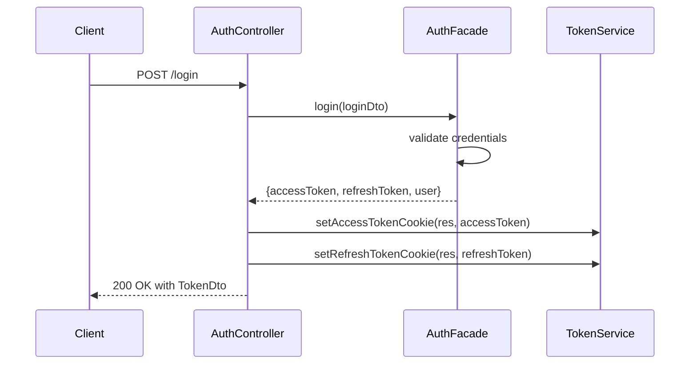
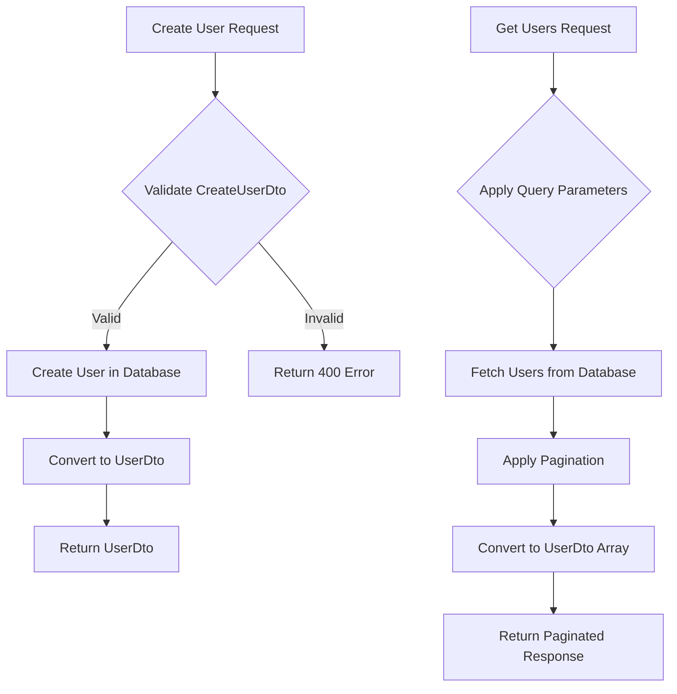
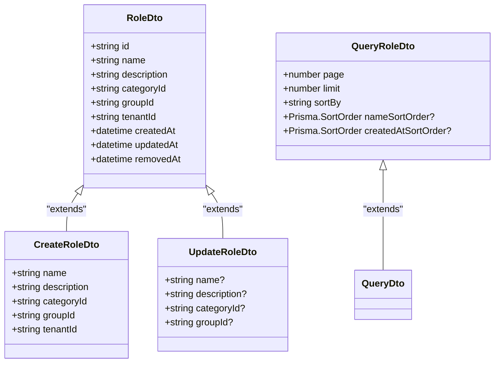
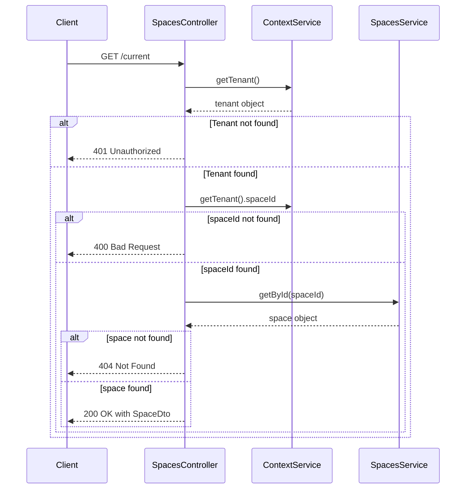

# API Endpoints

<cite>
**Referenced Files in This Document**   
- [auth.controller.ts](file://apps/server/src/shared/controller/domains/auth.controller.ts)
- [users.controller.ts](file://apps/server/src/shared/controller/resources/users.controller.ts)
- [roles.controller.ts](file://apps/server/src/shared/controller/resources/roles.controller.ts)
- [spaces.controller.ts](file://apps/server/src/shared/controller/resources/spaces.controller.ts)
- [main.ts](file://apps/server/src/main.ts)
- [query-user.dto.ts](file://packages/schema/src/dto/query/query-user.dto.ts)
- [query-role.dto.ts](file://packages/schema/src/dto/query/query-role.dto.ts)
- [query-space.dto.ts](file://packages/schema/src/dto/query/query-space.dto.ts)
- [login.payload.dto.ts](file://packages/schema/src/dto/auth/login.payload.dto.ts)
- [sign-up.payload.dto.ts](file://packages/schema/src/dto/auth/sign-up.payload.dto.ts)
- [token.dto.ts](file://packages/schema/src/dto/token.dto.ts)
- [user.dto.ts](file://packages/schema/src/dto/user.dto.ts)
- [role.dto.ts](file://packages/schema/src/dto/role.dto.ts)
- [space.dto.ts](file://packages/schema/src/dto/space.dto.ts)
</cite>

## Table of Contents
1. [Introduction](#introduction)
2. [Authentication](#authentication)
3. [User Management](#user-management)
4. [Role Management](#role-management)
5. [Space Operations](#space-operations)
6. [Request/Response Format](#requestresponse-format)
7. [Error Handling](#error-handling)
8. [Pagination, Filtering, and Sorting](#pagination-filtering-and-sorting)
9. [Rate Limiting and Versioning](#rate-limiting-and-versioning)
10. [Sample Requests](#sample-requests)

## Introduction

The prj-core API provides a comprehensive RESTful interface for managing users, roles, spaces, and authentication. The API follows standard REST conventions with JSON request and response payloads. All endpoints are versioned and documented using Swagger, available at `/api` when the server is running.

The API uses JWT-based authentication with cookie storage for enhanced security. Most endpoints require authentication, except for public routes like login and registration. The system implements role-based access control (RBAC) to ensure proper authorization for different operations.

**Section sources**
- [main.ts](file://apps/server/src/main.ts#L50-L72)
- [auth.controller.ts](file://apps/server/src/shared/controller/domains/auth.controller.ts#L51-L53)

## Authentication

The authentication system provides endpoints for user login, registration, token management, and session control. Authentication is primarily cookie-based with JWT tokens stored in HttpOnly cookies to prevent XSS attacks.

### Login
- **HTTP Method**: POST
- **URL Pattern**: `/login`
- **Authentication**: Public (no authentication required)
- **Required Headers**: None
- **Request Body**: `LoginPayloadDto` containing email and password
- **Response**: `TokenDto` with access token, refresh token, and user information

### Token Refresh
- **HTTP Method**: POST
- **URL Pattern**: `/token/refresh`
- **Authentication**: Public (uses refresh token from cookie)
- **Required Headers**: None (refresh token must be present in cookies)
- **Request Body**: None (token read from cookies)
- **Response**: `TokenDto` with new access and refresh tokens

### New Token
- **HTTP Method**: GET
- **URL Pattern**: `/new-token`
- **Authentication**: JWT required
- **Required Headers**: Authorization header or access token in cookies
- **Request Body**: None
- **Response**: `TokenDto` with new access and refresh tokens

### Sign Up
- **HTTP Method**: POST
- **URL Pattern**: `/sign-up`
- **Authentication**: Public
- **Required Headers**: None
- **Request Body**: `SignUpPayloadDto` containing user registration information
- **Response**: `TokenDto` with access token, refresh token, and user information

### Verify Token
- **HTTP Method**: GET
- **URL Pattern**: `/verify-token`
- **Authentication**: JWT required
- **Required Headers**: Authorization header or access token in cookies
- **Request Body**: None
- **Response**: Boolean indicating token validity

### Logout
- **HTTP Method**: POST
- **URL Pattern**: `/logout`
- **Authentication**: Optional (removes tokens if present)
- **Required Headers**: None
- **Request Body**: None
- **Response**: Boolean indicating successful logout
- **Side Effect**: Clears all authentication cookies (accessToken, refreshToken, tenantId, workspaceId)



**Diagram sources**
- [auth.controller.ts](file://apps/server/src/shared/controller/domains/auth.controller.ts#L60-L97)
- [auth.module.ts](file://apps/server/src/module/auth.module.ts#L3-L27)

**Section sources**
- [auth.controller.ts](file://apps/server/src/shared/controller/domains/auth.controller.ts#L51-L254)
- [login.payload.dto.ts](file://packages/schema/src/dto/auth/login.payload.dto.ts)
- [sign-up.payload.dto.ts](file://packages/schema/src/dto/auth/sign-up.payload.dto.ts)
- [token.dto.ts](file://packages/schema/src/dto/token.dto.ts)

## User Management

User management endpoints provide CRUD operations for user entities with support for bulk operations and query-based retrieval.

### Create User
- **HTTP Method**: POST
- **URL Pattern**: `/`
- **Authentication**: JWT required
- **Required Headers**: Authorization header or access token in cookies
- **Request Body**: `CreateUserDto` containing user creation data
- **Response**: `UserDto` representing the created user
- **Status Code**: 200 OK

### Get User
- **HTTP Method**: GET
- **URL Pattern**: `/:userId`
- **Authentication**: JWT required
- **Required Headers**: Authorization header or access token in cookies
- **Path Parameters**: `userId` - the ID of the user to retrieve
- **Response**: `UserDto` representing the requested user
- **Status Code**: 200 OK

### Update User
- **HTTP Method**: PATCH
- **URL Pattern**: `/:userId`
- **Authentication**: JWT required
- **Required Headers**: Authorization header or access token in cookies
- **Path Parameters**: `userId` - the ID of the user to update
- **Request Body**: `UpdateUserDto` containing user update data
- **Response**: `UserDto` representing the updated user
- **Status Code**: 200 OK

### Remove User
- **HTTP Method**: PATCH
- **URL Pattern**: `/:userId/removedAt`
- **Authentication**: JWT required
- **Required Headers**: Authorization header or access token in cookies
- **Path Parameters**: `userId` - the ID of the user to soft-delete
- **Response**: `UserDto` representing the soft-deleted user
- **Status Code**: 200 OK

### Delete User
- **HTTP Method**: DELETE
- **URL Pattern**: `/:userId`
- **Authentication**: JWT required
- **Required Headers**: Authorization header or access token in cookies
- **Path Parameters**: `userId` - the ID of the user to hard-delete
- **Response**: `UserDto` representing the deleted user
- **Status Code**: 200 OK

### Get Users by Query
- **HTTP Method**: GET
- **URL Pattern**: `/`
- **Authentication**: JWT required
- **Required Headers**: Authorization header or access token in cookies
- **Query Parameters**: `QueryUserDto` supporting pagination, sorting, and filtering
- **Response**: Paginated response with array of `UserDto` objects and metadata
- **Status Code**: 200 OK



**Diagram sources**
- [users.controller.ts](file://apps/server/src/shared/controller/resources/users.controller.ts#L35-L125)
- [query-user.dto.ts](file://packages/schema/src/dto/query/query-user.dto.ts)

**Section sources**
- [users.controller.ts](file://apps/server/src/shared/controller/resources/users.controller.ts#L28-L125)
- [user.dto.ts](file://packages/schema/src/dto/user.dto.ts)
- [query-user.dto.ts](file://packages/schema/src/dto/query/query-user.dto.ts)

## Role Management

Role management endpoints provide CRUD operations for role entities with support for query-based retrieval.

### Create Role
- **HTTP Method**: POST
- **URL Pattern**: `/`
- **Authentication**: JWT required
- **Required Headers**: Authorization header or access token in cookies
- **Request Body**: `CreateRoleDto` containing role creation data
- **Response**: `RoleDto` representing the created role
- **Status Code**: 200 OK

### Get Role
- **HTTP Method**: GET
- **URL Pattern**: `/:roleId`
- **Authentication**: JWT required
- **Required Headers**: Authorization header or access token in cookies
- **Path Parameters**: `roleId` - the ID of the role to retrieve
- **Response**: `RoleDto` representing the requested role
- **Status Code**: 200 OK

### Update Role
- **HTTP Method**: PATCH
- **URL Pattern**: `/:roleId`
- **Authentication**: JWT required
- **Required Headers**: Authorization header or access token in cookies
- **Path Parameters**: `roleId` - the ID of the role to update
- **Request Body**: `UpdateRoleDto` containing role update data
- **Response**: `RoleDto` representing the updated role
- **Status Code**: 200 OK

### Remove Role
- **HTTP Method**: PATCH
- **URL Pattern**: `/:roleId/removedAt`
- **Authentication**: JWT required
- **Required Headers**: Authorization header or access token in cookies
- **Path Parameters**: `roleId` - the ID of the role to soft-delete
- **Response**: `RoleDto` representing the soft-deleted role
- **Status Code**: 200 OK

### Delete Role
- **HTTP Method**: DELETE
- **URL Pattern**: `/:roleId`
- **Authentication**: JWT required
- **Required Headers**: Authorization header or access token in cookies
- **Path Parameters**: `roleId` - the ID of the role to hard-delete
- **Response**: `RoleDto` representing the deleted role
- **Status Code**: 200 OK

### Get Roles by Query
- **HTTP Method**: GET
- **URL Pattern**: `/`
- **Authentication**: JWT required
- **Required Headers**: Authorization header or access token in cookies
- **Query Parameters**: `QueryRoleDto` supporting pagination, sorting, and filtering
- **Response**: Paginated response with array of `RoleDto` objects and metadata
- **Status Code**: 200 OK



**Diagram sources**
- [roles.controller.ts](file://apps/server/src/shared/controller/resources/roles.controller.ts#L25-L88)
- [query-role.dto.ts](file://packages/schema/src/dto/query/query-role.dto.ts)

**Section sources**
- [roles.controller.ts](file://apps/server/src/shared/controller/resources/roles.controller.ts#L25-L88)
- [role.dto.ts](file://packages/schema/src/dto/role.dto.ts)
- [query-role.dto.ts](file://packages/schema/src/dto/query/query-role.dto.ts)

## Space Operations

Space operations endpoints provide CRUD operations for space entities with a special endpoint for retrieving the current space based on context.

### Get Current Space
- **HTTP Method**: GET
- **URL Pattern**: `/current`
- **Authentication**: JWT required
- **Required Headers**: Authorization header or access token in cookies
- **Request Body**: None
- **Response**: `SpaceDto` representing the current space from context
- **Status Code**: 200 OK
- **Error Cases**: 
  - 401 Unauthorized if tenant information not found
  - 400 Bad Request if space ID is missing from tenant
  - 404 Not Found if space cannot be retrieved by ID

### Create Space
- **HTTP Method**: POST
- **URL Pattern**: `/`
- **Authentication**: JWT required
- **Required Headers**: Authorization header or access token in cookies
- **Request Body**: `CreateSpaceDto` containing space creation data
- **Response**: `SpaceDto` representing the created space
- **Status Code**: 200 OK

### Get Space
- **HTTP Method**: GET
- **URL Pattern**: `/:spaceId`
- **Authentication**: JWT required
- **Required Headers**: Authorization header or access token in cookies
- **Path Parameters**: `spaceId` - the ID of the space to retrieve
- **Response**: `SpaceDto` representing the requested space
- **Status Code**: 200 OK

### Update Space
- **HTTP Method**: PATCH
- **URL Pattern**: `/:spaceId`
- **Authentication**: JWT required
- **Required Headers**: Authorization header or access token in cookies
- **Path Parameters**: `spaceId` - the ID of the space to update
- **Request Body**: `UpdateSpaceDto` containing space update data
- **Response**: `SpaceDto` representing the updated space
- **Status Code**: 200 OK

### Remove Space
- **HTTP Method**: PATCH
- **URL Pattern**: `/:spaceId/removedAt`
- **Authentication**: JWT required
- **Required Headers**: Authorization header or access token in cookies
- **Path Parameters**: `spaceId` - the ID of the space to soft-delete
- **Response**: `SpaceDto` representing the soft-deleted space
- **Status Code**: 200 OK

### Delete Space
- **HTTP Method**: DELETE
- **URL Pattern**: `/:spaceId`
- **Authentication**: JWT required
- **Required Headers**: Authorization header or access token in cookies
- **Path Parameters**: `spaceId` - the ID of the space to hard-delete
- **Response**: `SpaceDto` representing the deleted space
- **Status Code**: 200 OK

### Get Spaces by Query
- **HTTP Method**: GET
- **URL Pattern**: `/`
- **Authentication**: JWT required
- **Required Headers**: Authorization header or access token in cookies
- **Query Parameters**: `QuerySpaceDto` supporting pagination, sorting, and filtering
- **Response**: Paginated response with array of `SpaceDto` objects and metadata
- **Status Code**: 200 OK



**Diagram sources**
- [spaces.controller.ts](file://apps/server/src/shared/controller/resources/spaces.controller.ts#L37-L109)
- [context.service.ts](file://apps/server/src/shared/service/utils/context.service.ts)

**Section sources**
- [spaces.controller.ts](file://apps/server/src/shared/controller/resources/spaces.controller.ts#L27-L168)
- [space.dto.ts](file://packages/schema/src/dto/space.dto.ts)
- [query-space.dto.ts](file://packages/schema/src/dto/query/query-space.dto.ts)

## Request/Response Format

### Common Response Structure
All API responses follow a consistent structure with data, message, and metadata:

```json
{
  "data": {},
  "message": "success",
  "meta": {
    "page": 1,
    "limit": 10,
    "total": 100,
    "totalPages": 10
  }
}
```

### Authentication Request/Response Examples

**Login Request:**
```json
{
  "email": "user@example.com",
  "password": "securePassword123"
}
```

**Login Response:**
```json
{
  "data": {
    "accessToken": "eyJhbGciOiJIUzI1NiIs...",
    "refreshToken": "eyJhbGciOiJIUzI1NiIs...",
    "user": {
      "id": "user-123",
      "email": "user@example.com",
      "name": "John Doe"
    },
    "mainTenantId": "tenant-456"
  },
  "message": "로그인 성공"
}
```

**Sign Up Request:**
```json
{
  "email": "newuser@example.com",
  "password": "newSecurePassword123",
  "name": "Jane Smith"
}
```

### User Management Request/Response Examples

**Create User Request:**
```json
{
  "email": "user@example.com",
  "name": "John Doe",
  "tenantId": "tenant-123"
}
```

**Get Users Response (Paginated):**
```json
{
  "data": [
    {
      "id": "user-123",
      "email": "user@example.com",
      "name": "John Doe",
      "createdAt": "2023-01-01T00:00:00Z"
    }
  ],
  "message": "success",
  "meta": {
    "page": 1,
    "limit": 10,
    "total": 50,
    "totalPages": 5
  }
}
```

### Role Management Request/Response Examples

**Create Role Request:**
```json
{
  "name": "Administrator",
  "description": "Full system access",
  "categoryId": "category-123",
  "groupId": "group-456",
  "tenantId": "tenant-789"
}
```

### Space Operations Request/Response Examples

**Get Current Space Response:**
```json
{
  "data": {
    "id": "space-123",
    "name": "Main Workspace",
    "ground": {
      "id": "ground-456",
      "name": "Corporate"
    },
    "tenantId": "tenant-789"
  },
  "message": "success"
}
```

**Section sources**
- [token.dto.ts](file://packages/schema/src/dto/token.dto.ts)
- [user.dto.ts](file://packages/schema/src/dto/user.dto.ts)
- [role.dto.ts](file://packages/schema/src/dto/role.dto.ts)
- [space.dto.ts](file://packages/schema/src/dto/space.dto.ts)

## Error Handling

The API follows standard HTTP status codes for error responses with descriptive error messages.

### Common Status Codes
- **200 OK**: Successful GET, PATCH, DELETE requests
- **201 Created**: Successful POST requests
- **400 Bad Request**: Invalid request parameters or body
- **401 Unauthorized**: Authentication required or failed
- **403 Forbidden**: Insufficient permissions
- **404 Not Found**: Resource not found
- **409 Conflict**: Resource already exists
- **500 Internal Server Error**: Unexpected server error

### Authentication Error Responses
- **400 Bad Request**: Invalid email or password format
- **401 Unauthorized**: Invalid credentials, refresh token not found, or token invalid
- **409 Conflict**: Email already exists (during sign-up)

### Field Validation Rules
- **Email**: Must be valid email format, required for login and sign-up
- **Password**: Minimum 8 characters, required for login and sign-up
- **Name**: Required for sign-up, minimum 1 character
- **ID fields**: Must be valid UUID format when required

### Error Response Format
```json
{
  "statusCode": 401,
  "message": "이메일 또는 비밀번호가 일치하지 않습니다",
  "error": "Unauthorized"
}
```

**Section sources**
- [auth.controller.ts](file://apps/server/src/shared/controller/domains/auth.controller.ts#L31-L49)
- [users.controller.ts](file://apps/server/src/shared/controller/resources/users.controller.ts#L96-L122)

## Pagination, Filtering, and Sorting

All list endpoints support pagination, filtering, and sorting through query parameters.

### Pagination Parameters
- **page**: Page number (default: 1, minimum: 1)
- **limit**: Number of items per page (default: 10, minimum: 1, maximum: 100)

### Sorting Parameters
- **sortBy**: Field name to sort by
- **{fieldName}SortOrder**: Sort order for specific fields (e.g., `nameSortOrder`, `createdAtSortOrder`)
- **SortOrder values**: "asc" or "desc"

### Common Query DTO Structure
```typescript
class QueryDto {
  @IsNumber()
  @IsOptional()
  page: number = 1;
  
  @IsNumber()
  @IsOptional()
  @Max(100)
  limit: number = 10;
  
  @IsString()
  @IsOptional()
  sortBy: string;
}
```

### Example Usage
```
GET /users?page=2&limit=20&sortBy=name&nameSortOrder=asc
GET /roles?limit=50&sortBy=createdAt&createdAtSortOrder=desc
GET /spaces?page=1&limit=10
```

**Section sources**
- [query.dto.ts](file://packages/schema/src/dto/query/query.dto.ts)
- [query-user.dto.ts](file://packages/schema/src/dto/query/query-user.dto.ts)
- [query-role.dto.ts](file://packages/schema/src/dto/query/query-role.dto.ts)
- [query-space.dto.ts](file://packages/schema/src/dto/query/query-space.dto.ts)

## Rate Limiting and Versioning

### API Versioning
The API is versioned using URL path prefixes. All endpoints are currently under the default version with no explicit version prefix. Future versions will be accessible via `/v2/`, `/v3/`, etc.

### Rate Limiting
The API implements rate limiting to prevent abuse:
- **General endpoints**: 100 requests per minute per IP
- **Authentication endpoints**: 10 requests per minute per IP to prevent brute force attacks
- **Burst limit**: 20 requests at once

Rate limiting headers are included in responses:
- `X-RateLimit-Limit`: Total requests allowed per minute
- `X-RateLimit-Remaining`: Remaining requests in current window
- `X-RateLimit-Reset`: Time when the rate limit resets (Unix timestamp)

### Deprecation Policy
Currently, there are no deprecated endpoints. When endpoints are deprecated:
1. They will be marked with a `Deprecated` header
2. A migration guide will be provided in the API documentation
3. Deprecated endpoints will remain functional for 6 months before removal

**Section sources**
- [main.ts](file://apps/server/src/main.ts#L50-L72)
- [app.module.ts](file://apps/server/src/module/app.module.ts)

## Sample Requests

### Login with curl
```bash
curl -X POST http://localhost:3006/login \
  -H "Content-Type: application/json" \
  -d '{
    "email": "user@example.com",
    "password": "password123"
  }'
```

### Register a New User
```bash
curl -X POST http://localhost:3006/sign-up \
  -H "Content-Type: application/json" \
  -d '{
    "email": "newuser@example.com",
    "password": "securePassword123",
    "name": "Jane Doe"
  }'
```

### Get Current User's Space
```bash
curl -X GET http://localhost:3006/spaces/current \
  -H "Cookie: accessToken=eyJhbGciOiJIUzI1NiIs..."
```

### Create a New Role
```bash
curl -X POST http://localhost:3006/roles \
  -H "Content-Type: application/json" \
  -H "Cookie: accessToken=eyJhbGciOiJIUzI1NiIs..." \
  -d '{
    "name": "Editor",
    "description": "Can edit content but not delete",
    "categoryId": "category-123",
    "groupId": "group-456",
    "tenantId": "tenant-789"
  }'
```

### Get Users with Pagination
```bash
curl -X GET "http://localhost:3006/users?page=2&limit=20&sortBy=createdAt&createdAtSortOrder=desc" \
  -H "Cookie: accessToken=eyJhbGciOiJIUzI1NiIs..."
```

### Update User Information
```bash
curl -X PATCH http://localhost:3006/users/user-123 \
  -H "Content-Type: application/json" \
  -H "Cookie: accessToken=eyJhbGciOiJIUzI1NiIs..." \
  -d '{
    "name": "John Smith",
    "email": "john.smith@example.com"
  }'
```

**Section sources**
- [auth.controller.ts](file://apps/server/src/shared/controller/domains/auth.controller.ts)
- [users.controller.ts](file://apps/server/src/shared/controller/resources/users.controller.ts)
- [roles.controller.ts](file://apps/server/src/shared/controller/resources/roles.controller.ts)
- [spaces.controller.ts](file://apps/server/src/shared/controller/resources/spaces.controller.ts)