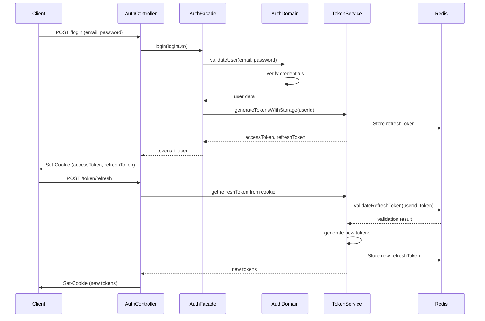

# Authentication Endpoints

<cite>
**Referenced Files in This Document**   
- [auth.controller.ts](file://apps/server/src/shared/controller/domains/auth.controller.ts)
- [auth.domain.ts](file://apps/server/src/shared/service/domain/auth.domain.ts)
- [auth.facade.ts](file://apps/server/src/shared/service/facade/auth.facade.ts)
- [token.service.ts](file://apps/server/src/shared/service/utils/token.service.ts)
- [login-payload.dto.ts](file://packages/dto/src/auth/login-payload.dto.ts)
- [tokenDto.ts](file://packages/api/src/model/tokenDto.ts)
- [cookie.util.ts](file://apps/server/src/shared/utils/cookie.util.ts)
- [auth.config.ts](file://apps/server/src/shared/config/auth.config.ts)
</cite>

## Table of Contents
1. [Introduction](#introduction)
2. [Authentication Overview](#authentication-overview)
3. [Endpoint Details](#endpoint-details)
   - [Login](#login)
   - [Token Refresh](#token-refresh)
   - [Logout](#logout)
4. [Data Validation](#data-validation)
5. [Security and Token Management](#security-and-token-management)
6. [Error Handling](#error-handling)
7. [Sample Requests](#sample-requests)

## Introduction
This document provides comprehensive documentation for the authentication endpoints in the prj-core system. The API supports JWT-based authentication with cookie storage, refresh token rotation, and secure session management. The endpoints handle user login, token refresh, and logout operations with proper error handling and security measures.

## Authentication Overview



**Diagram sources**
- [auth.controller.ts](file://apps/server/src/shared/controller/domains/auth.controller.ts#L60-L96)
- [auth.facade.ts](file://apps/server/src/shared/service/facade/auth.facade.ts#L75-L83)
- [auth.domain.ts](file://apps/server/src/shared/service/domain/auth.domain.ts#L109-L141)
- [token.service.ts](file://apps/server/src/shared/service/utils/token.service.ts#L102-L110)

**Section sources**
- [auth.controller.ts](file://apps/server/src/shared/controller/domains/auth.controller.ts)
- [auth.domain.ts](file://apps/server/src/shared/service/domain/auth.domain.ts)

## Endpoint Details

### Login

**HTTP Method**: POST  
**URL Pattern**: `/login`  
**Authentication Required**: No  
**Content-Type**: `application/json`  

#### Request Parameters
| Parameter | Location | Type | Required | Description |
|---------|----------|------|----------|-------------|
| email | body | string | Yes | User's email address |
| password | body | string | Yes | User's password |

#### Request Body Schema
```json
{
  "email": "user@example.com",
  "password": "string (8+ chars with letters, numbers, special chars)"
}
```

#### Response Schema (200 OK)
Returns a `TokenDto` object with the following structure:

```json
{
  "accessToken": "string (JWT)",
  "refreshToken": "string (JWT)",
  "user": {
    "id": "string",
    "email": "string",
    "name": "string",
    "tenants": [
      {
        "id": "string",
        "main": "boolean",
        "roleId": "string"
      }
    ]
  },
  "mainTenantId": "string"
}
```

The response includes two `Set-Cookie` headers for secure token storage:
- `accessToken`: HttpOnly, Secure, SameSite=Strict
- `refreshToken`: HttpOnly, Secure, SameSite=Strict

#### Status Codes
| Code | Description | Response Body |
|------|-------------|---------------|
| 200 | Login successful | TokenDto object |
| 400 | Invalid email/password format | Error message |
| 401 | Invalid credentials | Error message |
| 500 | Internal server error | Error message |

**Section sources**
- [auth.controller.ts](file://apps/server/src/shared/controller/domains/auth.controller.ts#L60-L96)
- [auth.domain.ts](file://apps/server/src/shared/service/domain/auth.domain.ts#L109-L141)
- [login-payload.dto.ts](file://packages/dto/src/auth/login-payload.dto.ts)

### Token Refresh

**HTTP Method**: POST  
**URL Pattern**: `/token/refresh`  
**Authentication Required**: No (uses refresh token from cookie)  
**Content-Type**: `application/json`  

#### Request Parameters
None. The endpoint reads the `refreshToken` from the HTTP-only cookie.

#### Response Schema (200 OK)
Same as Login endpoint - returns a `TokenDto` object with new tokens and user information.

The response includes `Set-Cookie` headers with new tokens, implementing token rotation for enhanced security.

#### Status Codes
| Code | Description | Response Body |
|------|-------------|---------------|
| 200 | Token refresh successful | TokenDto object |
| 401 | Refresh token not found or invalid | Error message |
| 500 | Internal server error | Error message |

**Section sources**
- [auth.controller.ts](file://apps/server/src/shared/controller/domains/auth.controller.ts#L99-L143)
- [token.service.ts](file://apps/server/src/shared/service/utils/token.service.ts#L102-L110)

### Logout

**HTTP Method**: POST  
**URL Pattern**: `/logout`  
**Authentication Required**: Yes (via accessToken cookie)  

#### Request Parameters
None. The endpoint uses the authenticated user context from the request.

#### Response Schema (200 OK)
```json
true
```

The response includes multiple `Set-Cookie` headers to clear all authentication cookies:
- `accessToken`: Set to empty with expiration in the past
- `refreshToken`: Set to empty with expiration in the past
- `tenantId`: Cleared
- `workspaceId`: Cleared

Additionally, the refresh token is invalidated in Redis storage.

#### Status Codes
| Code | Description | Response Body |
|------|-------------|---------------|
| 200 | Logout successful | `true` |
| 500 | Internal server error | Error message |

**Section sources**
- [auth.controller.ts](file://apps/server/src/shared/controller/domains/auth.controller.ts#L222-L264)
- [token.service.ts](file://apps/server/src/shared/service/utils/token.service.ts#L125-L135)

## Data Validation

### Email Validation
- **Required**: Yes
- **Pattern**: `^\w+@[a-zA-Z_]+?\.[a-zA-Z]{2,3}$`
- **Error Message**: "Email format is incorrect"
- **Example**: `user@example.com`

### Password Validation
- **Required**: Yes
- **Pattern**: `^(?=.*[A-Za-z])(?=.*\d)(?=.*[@$!%*?&])[A-Za-z\d@$!%*?&]{8,}$`
- **Requirements**: 
  - At least 8 characters long
  - Contains at least one letter
  - Contains at least one number
  - Contains at least one special character (`@$!%*?&`)
- **Error Message**: "Password must contain letters, numbers, and special characters and be at least 8 characters long"

The validation is implemented using custom decorators and is enforced at both the DTO level and service layer.

**Section sources**
- [login-payload.dto.ts](file://packages/dto/src/auth/login-payload.dto.ts)
- [auth.domain.ts](file://apps/server/src/shared/service/domain/auth.domain.ts#L34-L37)

## Security and Token Management

### JWT Configuration
The authentication system uses JWT (JSON Web Tokens) with the following configuration:

| Token Type | Expiration | Storage | Algorithm |
|-----------|------------|---------|-----------|
| Access Token | Configurable (e.g., 15m) | HTTP-only cookie | HS256 |
| Refresh Token | Configurable (e.g., 7d) | HTTP-only cookie + Redis | HS256 |

Configuration is managed through environment variables:
- `AUTH_JWT_SECRET`: Secret key for signing tokens
- `AUTH_JWT_TOKEN_EXPIRES_IN`: Access token expiration
- `AUTH_JWT_TOKEN_REFRESH_IN`: Refresh token expiration
- `AUTH_JWT_SALT_ROUNDS`: Bcrypt salt rounds for password hashing

### Cookie Security
All authentication cookies use the following security settings:

```typescript
{
  httpOnly: true,     // Prevents client-side JavaScript access
  secure: true,       // HTTPS only (in production)
  sameSite: 'strict', // Prevents CSRF attacks
  path: '/'           // Available across all paths
}
```

### Token Storage and Validation
- **Refresh Tokens**: Stored in Redis with user ID as key for quick validation
- **Access Tokens**: Not stored (stateless), but can be blacklisted on logout
- **Token Rotation**: New refresh tokens are issued on each refresh for enhanced security
- **CSRF Protection**: SameSite=Strict cookies prevent cross-site request forgery

### Session Management
- Sessions are stateless on the client (JWT tokens)
- Server maintains state in Redis for refresh token validation
- Logout invalidates tokens on the server side
- Token blacklisting is available for immediate invalidation

**Section sources**
- [token.service.ts](file://apps/server/src/shared/service/utils/token.service.ts)
- [cookie.util.ts](file://apps/server/src/shared/utils/cookie.util.ts)
- [auth.config.ts](file://apps/server/src/shared/config/auth.config.ts)

## Error Handling

### Error Response Format
All error responses follow the standard ResponseEntity format with appropriate HTTP status codes and descriptive messages.

### Common Error Scenarios

#### Invalid Credentials (401)
```json
{
  "statusCode": 401,
  "message": "Invalid credentials",
  "error": "Unauthorized"
}
```

#### Expired Token (401)
```json
{
  "statusCode": 401,
  "message": "Token has expired",
  "error": "Unauthorized"
}
```

#### Invalid Refresh Token (401)
```json
{
  "statusCode": 401,
  "message": "Refresh token not found or invalid",
  "error": "Unauthorized"
}
```

#### Validation Errors (400)
```json
{
  "statusCode": 400,
  "message": "Email format is incorrect",
  "error": "Bad Request"
}
```

#### Internal Server Error (500)
```json
{
  "statusCode": 500,
  "message": "Internal server error",
  "error": "Internal Server Error"
}
```

The system implements proper error handling at multiple levels:
1. Controller layer: HTTP status codes and error messages
2. Service layer: Business logic validation
3. Infrastructure layer: Token validation and storage errors

**Section sources**
- [auth.controller.ts](file://apps/server/src/shared/controller/domains/auth.controller.ts)
- [auth.domain.ts](file://apps/server/src/shared/service/domain/auth.domain.ts)
- [token.service.ts](file://apps/server/src/shared/service/utils/token.service.ts)

## Sample Requests

### Login Request
```bash
curl -X POST https://api.prj-core.com/login \
  -H "Content-Type: application/json" \
  -H "Accept: application/json" \
  -d '{
    "email": "user@example.com",
    "password": "SecurePass123!"
  }'
```

### Successful Login Response
```json
{
  "accessToken": "eyJhbGciOiJIUzI1NiIsInR5cCI6IkpXVCJ9.xxxxx",
  "refreshToken": "eyJhbGciOiJIUzI1NiIsInR5cCI6IkpXVCJ9.yyyyy",
  "user": {
    "id": "user-123",
    "email": "user@example.com",
    "name": "John Doe",
    "tenants": [
      {
        "id": "tenant-456",
        "main": true,
        "roleId": "role-user"
      }
    ]
  },
  "mainTenantId": "tenant-456"
}
```

### Token Refresh Request
```bash
curl -X POST https://api.prj-core.com/token/refresh \
  -H "Accept: application/json" \
  -c cookies.txt \
  -b cookies.txt
```

*Note: The refresh token is automatically sent via the cookie from previous login.*

### Logout Request
```bash
curl -X POST https://api.prj-core.com/logout \
  -H "Accept: application/json" \
  -b "accessToken=eyJ...; refreshToken=eyJ..." \
  -v
```

The logout request will return with Set-Cookie headers that clear all authentication cookies.

**Section sources**
- [auth.controller.ts](file://apps/server/src/shared/controller/domains/auth.controller.ts)
- [token.service.ts](file://apps/server/src/shared/service/utils/token.service.ts)