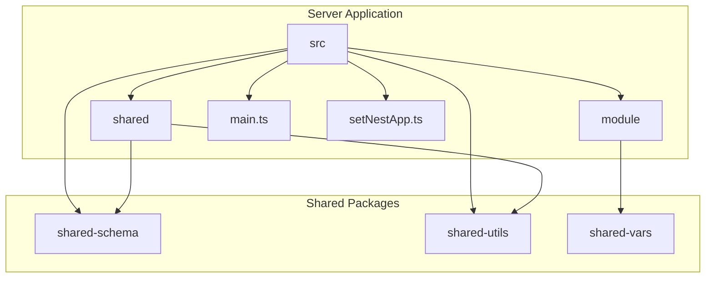
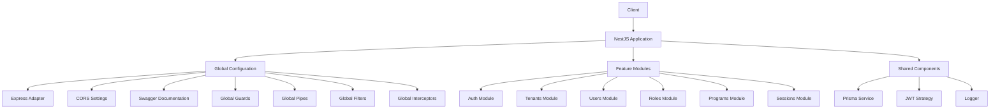
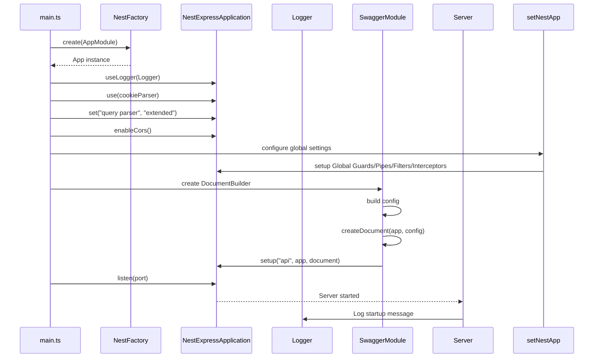
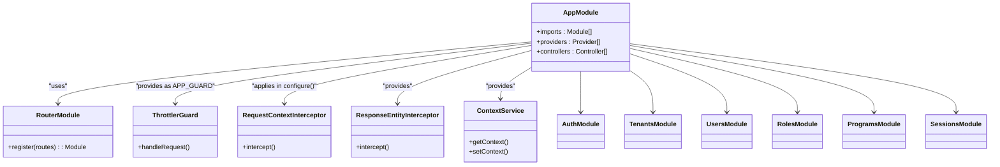
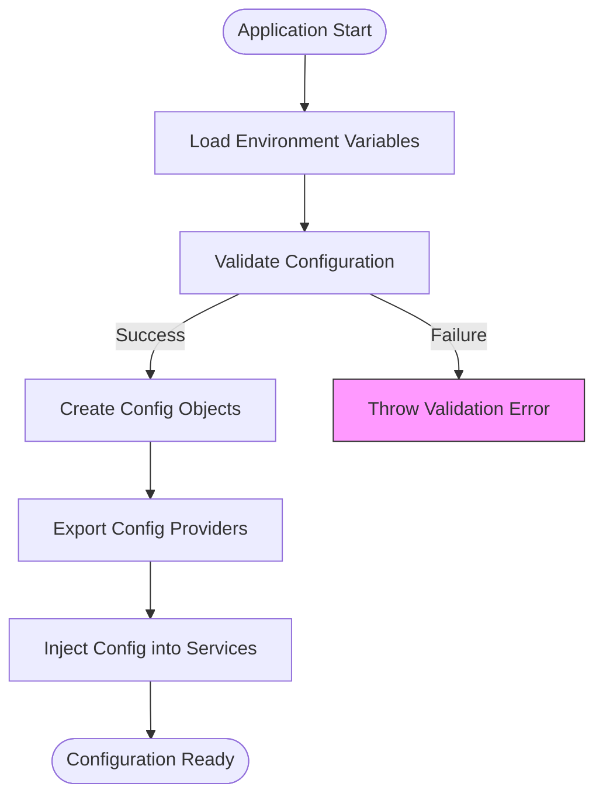

# Backend API Server

<cite>
**Referenced Files in This Document**   
- [main.ts](file://apps/server/src/main.ts)
- [app.module.ts](file://apps/server/src/module/app.module.ts)
- [setNestApp.ts](file://apps/server/src/setNestApp.ts)
- [prisma.module.ts](file://apps/server/src/module/prisma.module.ts)
- [auth.module.ts](file://apps/server/src/module/auth.module.ts)
- [tenants.module.ts](file://apps/server/src/module/tenants.module.ts)
- [shared/index.ts](file://apps/server/src/shared/index.ts)
- [shared/guard/jwt.auth-guard.ts](file://apps/server/src/shared/guard/jwt.auth-guard.ts)
- [shared/strategy/jwt.strategy.ts](file://apps/server/src/shared/strategy/jwt.strategy.ts)
- [shared/config/app.config.ts](file://apps/server/src/shared/config/app.config.ts)
- [shared/config/config.type.ts](file://apps/server/src/shared/config/config.type.ts)
</cite>

## Table of Contents
1. [Introduction](#introduction)
2. [Project Structure](#project-structure)
3. [Core Components](#core-components)
4. [Architecture Overview](#architecture-overview)
5. [Detailed Component Analysis](#detailed-component-analysis)
6. [Dependency Analysis](#dependency-analysis)
7. [Performance Considerations](#performance-considerations)
8. [Troubleshooting Guide](#troubleshooting-guide)
9. [Conclusion](#conclusion)

## Introduction
The Backend API Server component of prj-core is a NestJS-based application that serves as the central hub for handling API requests from both admin and mobile clients. This document provides a comprehensive analysis of the server's implementation, focusing on its bootstrap process, module organization, configuration, and integration with shared packages. The server leverages NestJS's modular architecture to provide a scalable and maintainable codebase, with clear separation of concerns between different functional domains.

## Project Structure
The Backend API Server follows a well-organized structure that separates concerns and promotes reusability. The main application resides in the `apps/server` directory, with source code organized into logical modules and shared components. The server uses a monorepo architecture with shared packages that provide common functionality across different applications.



**Diagram sources**
- [main.ts](file://apps/server/src/main.ts)
- [app.module.ts](file://apps/server/src/module/app.module.ts)

**Section sources**
- [main.ts](file://apps/server/src/main.ts)
- [app.module.ts](file://apps/server/src/module/app.module.ts)

## Core Components
The Backend API Server consists of several core components that work together to provide a robust and scalable API service. The main entry point is `main.ts`, which bootstraps the application and configures essential settings. The `app.module.ts` file defines the application's module structure, importing various feature modules and configuring global providers. The `setNestApp.ts` file contains configuration logic for global guards, pipes, filters, and interceptors, ensuring consistent behavior across all endpoints.

**Section sources**
- [main.ts](file://apps/server/src/main.ts)
- [app.module.ts](file://apps/server/src/module/app.module.ts)
- [setNestApp.ts](file://apps/server/src/setNestApp.ts)

## Architecture Overview
The Backend API Server follows a layered architecture that separates concerns and promotes maintainability. At the core is the NestJS framework, which provides dependency injection, modular organization, and a rich ecosystem of features. The server is organized into feature modules, each responsible for a specific domain (e.g., users, roles, sessions). These modules are composed together in the `AppModule` to create the complete application.



**Diagram sources**
- [main.ts](file://apps/server/src/main.ts)
- [app.module.ts](file://apps/server/src/module/app.module.ts)
- [setNestApp.ts](file://apps/server/src/setNestApp.ts)

## Detailed Component Analysis

### Bootstrap Process Analysis
The server's bootstrap process in `main.ts` follows a structured approach to ensure proper initialization and configuration. The process begins with creating a NestJS application instance with Express adapter, followed by setting up logging, middleware, CORS, global configuration, and Swagger documentation.



**Diagram sources**
- [main.ts](file://apps/server/src/main.ts)

**Section sources**
- [main.ts](file://apps/server/src/main.ts)

### Module Organization Analysis
The server's module organization in `app.module.ts` demonstrates a clean and scalable approach to structuring a NestJS application. The `AppModule` imports various feature modules and configures global providers, including interceptors, filters, and guards. The module uses NestJS's `RouterModule` to define a hierarchical routing structure, with API endpoints organized under `/api/v1`.



**Diagram sources**
- [app.module.ts](file://apps/server/src/module/app.module.ts)

**Section sources**
- [app.module.ts](file://apps/server/src/module/app.module.ts)

### Configuration Analysis
The server's configuration system is designed to be flexible and maintainable, with environment-specific settings managed through NestJS's configuration module. The `app.config.ts` file defines validation rules for environment variables using class-validator, ensuring that required configuration is present and correctly formatted.



**Diagram sources**
- [shared/config/app.config.ts](file://apps/server/src/shared/config/app.config.ts)
- [shared/config/config.type.ts](file://apps/server/src/shared/config/config.type.ts)

**Section sources**
- [shared/config/app.config.ts](file://apps/server/src/shared/config/app.config.ts)
- [shared/config/config.type.ts](file://apps/server/src/shared/config/config.type.ts)

## Dependency Analysis
The Backend API Server has a well-defined dependency structure that promotes reusability and maintainability. The server depends on several shared packages, including `shared-schema` for database access, `shared-utils` for common functionality, and `shared-vars` for configuration. These shared packages are imported using TypeScript path aliases, making the code more readable and maintainable.

```mermaid
graph TD
A[Backend API Server] --> B[shared-schema]
A --> C[shared-utils]
A --> D[shared-vars]
A --> E[@nestjs/core]
A --> F[@nestjs/common]
A --> G[@nestjs/swagger]
A --> H[cookie-parser]
A --> I[nestjs-pino]
B --> J[Prisma Client]
C --> K[Logger]
C --> L[Validation Utilities]
D --> M[Route Names]
D --> N[API Endpoints]
classDef shared fill:#bbf,stroke:#333;
class B,C,D shared;
classDef nest fill:#fbb,stroke:#333;
class E,F,G shared;
classDef external fill:#bfb,stroke:#333;
class H,I,J,K,L,M,N external;
```

**Diagram sources**
- [main.ts](file://apps/server/src/main.ts)
- [app.module.ts](file://apps/server/src/module/app.module.ts)
- [shared/index.ts](file://apps/server/src/shared/index.ts)

**Section sources**
- [main.ts](file://apps/server/src/main.ts)
- [app.module.ts](file://apps/server/src/module/app.module.ts)
- [shared/index.ts](file://apps/server/src/shared/index.ts)

## Performance Considerations
The Backend API Server includes several performance optimizations to ensure efficient operation under load. The server uses global pipes for request validation and transformation, reducing the need for repetitive validation code in individual controllers. The use of global interceptors for logging and response formatting helps maintain consistent behavior across all endpoints while minimizing overhead.

The server also implements rate limiting through the `ThrottlerGuard`, which helps prevent abuse and ensures fair resource allocation among clients. Database operations are optimized through the use of Prisma, which provides efficient query generation and connection pooling.

For high-traffic scenarios, the server could benefit from additional caching mechanisms, such as Redis for frequently accessed data. The current implementation relies on database queries for most operations, which could be optimized with appropriate caching strategies.

## Troubleshooting Guide
Common issues with the Backend API Server typically fall into several categories: dependency injection errors, database connection problems, authentication issues, and configuration errors.

### Dependency Injection Errors
Dependency injection errors often occur when providers are not properly exported or imported between modules. To resolve these issues:
1. Ensure that services are properly provided in the correct module
2. Verify that modules export providers that need to be used by other modules
3. Check for circular dependencies between modules

### Database Connection Problems
Database connection issues can stem from incorrect configuration or network problems. To troubleshoot:
1. Verify that the `DATABASE_URL` environment variable is correctly set
2. Check that the database server is accessible from the application server
3. Ensure that database credentials are correct and have appropriate permissions
4. Verify that the Prisma schema is up to date with the database structure

### Authentication Issues
Authentication problems often relate to JWT token handling or strategy configuration. To address these:
1. Verify that JWT secrets are correctly configured in environment variables
2. Check that the `JwtStrategy` is properly validating user credentials
3. Ensure that the `JwtAuthGuard` is correctly applied to protected routes
4. Verify that token expiration times are appropriately set

### Configuration Errors
Configuration issues typically arise from missing or incorrectly formatted environment variables. To prevent these:
1. Use the validation decorators in `app.config.ts` to ensure required variables are present
2. Provide default values for optional configuration parameters
3. Use consistent naming conventions for environment variables
4. Document all required configuration parameters in the project README

**Section sources**
- [main.ts](file://apps/server/src/main.ts)
- [app.module.ts](file://apps/server/src/module/app.module.ts)
- [setNestApp.ts](file://apps/server/src/setNestApp.ts)
- [shared/guard/jwt.auth-guard.ts](file://apps/server/src/shared/guard/jwt.auth-guard.ts)
- [shared/strategy/jwt.strategy.ts](file://apps/server/src/shared/strategy/jwt.strategy.ts)

## Conclusion
The Backend API Server component of prj-core demonstrates a well-architected NestJS application with clear separation of concerns, robust configuration management, and effective use of shared packages. The server's modular design makes it easy to extend and maintain, while its use of global configuration ensures consistent behavior across all endpoints.

Key strengths of the implementation include:
- Comprehensive logging and error handling
- Well-organized module structure with clear routing hierarchy
- Effective use of shared packages for common functionality
- Robust authentication and authorization mechanisms
- Comprehensive API documentation through Swagger

For future improvements, consider implementing additional caching mechanisms, enhancing monitoring and observability, and expanding test coverage for critical components. The current architecture provides a solid foundation for these enhancements while maintaining the flexibility needed for evolving requirements.