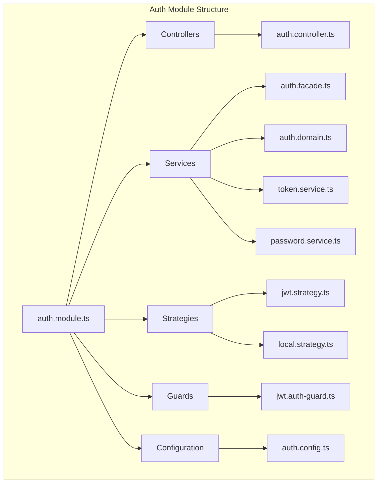
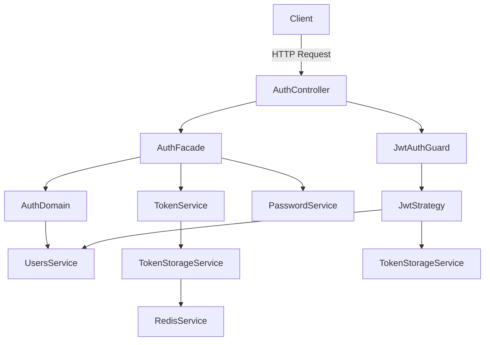
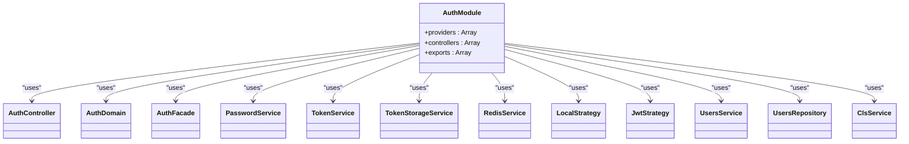
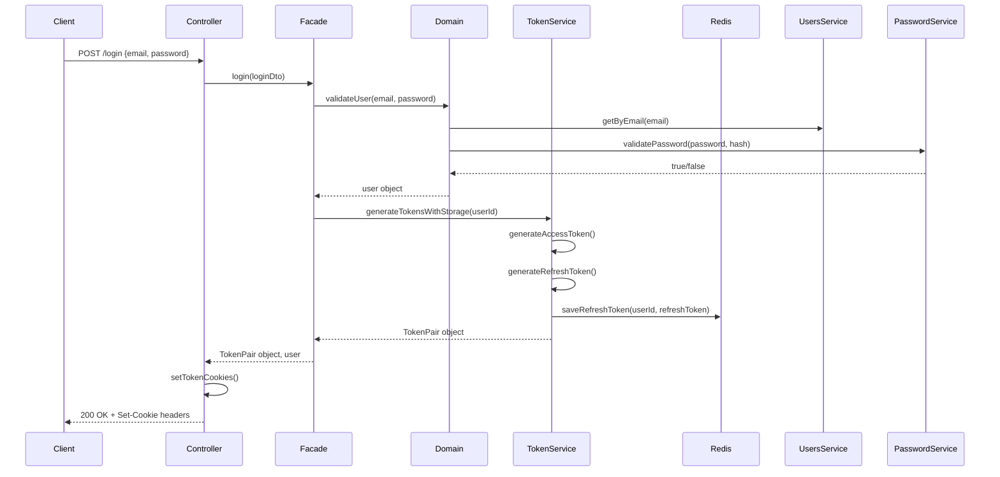
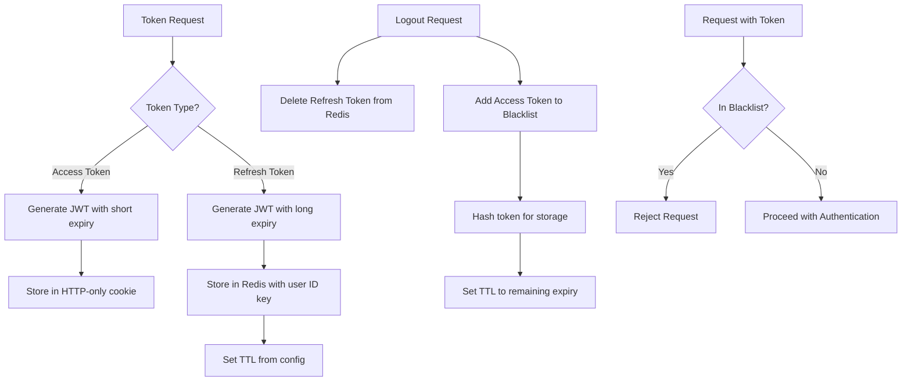

# Authentication Module

<cite>
**Referenced Files in This Document**   
- [auth.module.ts](file://apps/server/src/module/auth.module.ts)
- [auth.facade.ts](file://packages/service/src/facade/auth.facade.ts)
- [token.service.ts](file://packages/service/src/utils/token.service.ts)
- [plain-password.vo.ts](file://packages/vo/src/auth/password/plain-password.vo.ts)
- [hashed-password.vo.ts](file://packages/vo/src/auth/password/hashed-password.vo.ts)
- [token-pair.vo.ts](file://packages/vo/src/auth/token/token-pair.vo.ts)
- [cookie-options.vo.ts](file://packages/vo/src/auth/cookie/cookie-options.vo.ts)
- [context-keys.constant.ts](file://packages/constant/src/context/context-keys.constant.ts)
</cite>

## Update Summary
**Changes Made**   
- Updated password handling to use Value Object system with PlainPassword and HashedPassword
- Modified token generation to return TokenPair object
- Updated cookie options to use CookieOptionsVo subclasses
- Replaced ContextService with ClsService for context management
- Updated architecture overview and component analysis to reflect new implementation

## Table of Contents
1. [Introduction](#introduction)
2. [Project Structure](#project-structure)
3. [Core Components](#core-components)
4. [Architecture Overview](#architecture-overview)
5. [Detailed Component Analysis](#detailed-component-analysis)
6. [Dependency Analysis](#dependency-analysis)
7. [Performance Considerations](#performance-considerations)
8. [Troubleshooting Guide](#troubleshooting-guide)
9. [Conclusion](#conclusion)

## Introduction
The Authentication Module in prj-core provides a comprehensive security solution for user authentication and authorization using JWT tokens, Passport strategies, and NestJS guards. This document details the implementation of the AuthModule, explaining how it handles user login, token generation and verification, and route protection. The module follows a layered architecture with clear separation of concerns between facade, domain, and utility services. It implements robust security practices including password hashing with bcrypt, token storage in Redis, and protection against token reuse through blacklisting. The authentication flow supports standard login, refresh token rotation, and secure logout mechanisms, making it suitable for production applications with high security requirements. Recent updates have enhanced security by implementing a Value Object system for password handling and replacing ContextService with ClsService for improved context management.

## Project Structure
The authentication functionality is organized across multiple directories within the server application, following NestJS best practices for modular design. The core authentication logic is located in the shared module, allowing reuse across different parts of the application. The structure separates concerns into controllers, services, strategies, guards, and configuration files.



**Diagram sources**
- [auth.module.ts](file://apps/server/src/module/auth.module.ts)

**Section sources**
- [auth.module.ts](file://apps/server/src/module/auth.module.ts)

## Core Components
The Authentication Module consists of several key components that work together to provide secure user authentication. The AuthModule serves as the entry point, importing and exporting necessary providers and controllers. The AuthController handles HTTP requests for login, logout, and token refresh operations. The AuthFacade orchestrates the authentication flow by coordinating between domain logic and utility services. The AuthDomain contains the core business logic for user validation and account creation. Utility services including TokenService, PasswordService, and TokenStorageService handle specific technical concerns like token generation, password hashing, and Redis storage. The module uses Passport strategies (LocalStrategy and JwtStrategy) for credential validation and JWT extraction, while custom guards (JwtAuthGuard) protect routes requiring authentication.

**Section sources**
- [auth.module.ts](file://apps/server/src/module/auth.module.ts)
- [auth.controller.ts](file://apps/server/src/shared/controller/domains/auth.controller.ts)
- [auth.facade.ts](file://packages/service/src/facade/auth.facade.ts)
- [auth.domain.ts](file://apps/server/src/shared/service/domain/auth.domain.ts)

## Architecture Overview
The Authentication Module follows a layered architecture that separates concerns and promotes maintainability. At the top layer, the AuthController receives HTTP requests and returns responses. Below this, the AuthFacade acts as an orchestrator, coordinating between different services. The AuthDomain contains pure business logic without dependencies on external services. Utility services handle cross-cutting concerns like token management, password hashing, and Redis operations. The module integrates with Passport.js through custom strategies that validate credentials and extract tokens from requests. Custom guards protect routes by verifying token validity and checking against a blacklist. Configuration is externalized through NestJS config service, allowing environment-specific settings for JWT secrets, expiration times, and Redis connections.



**Diagram sources**
- [auth.module.ts](file://apps/server/src/module/auth.module.ts)
- [auth.controller.ts](file://apps/server/src/shared/controller/domains/auth.controller.ts)
- [auth.facade.ts](file://packages/service/src/facade/auth.facade.ts)
- [jwt.strategy.ts](file://apps/server/src/shared/strategy/jwt.strategy.ts)
- [token-storage.service.ts](file://packages/service/src/utils/token-storage.service.ts)

## Detailed Component Analysis

### AuthModule Analysis
The AuthModule is the central configuration point for the authentication system, defining all providers, controllers, and exports needed for authentication functionality. It imports various services and strategies from the shared module and organizes them into a cohesive unit.



**Diagram sources**
- [auth.module.ts](file://apps/server/src/module/auth.module.ts)

**Section sources**
- [auth.module.ts](file://apps/server/src/module/auth.module.ts)

### Authentication Flow Analysis
The authentication process in prj-core follows a secure flow from user login to protected resource access. When a user submits credentials, the AuthController receives the request and delegates to the AuthFacade. The facade validates the user through the AuthDomain, which verifies the password against the stored hash using the new Value Object system. Upon successful validation, tokens are generated and stored in Redis. The response includes HTTP-only cookies containing the access and refresh tokens, preventing client-side JavaScript access.



**Diagram sources**
- [auth.controller.ts](file://apps/server/src/shared/controller/domains/auth.controller.ts)
- [auth.facade.ts](file://packages/service/src/facade/auth.facade.ts)
- [auth.domain.ts](file://apps/server/src/shared/service/domain/auth.domain.ts)
- [token.service.ts](file://packages/service/src/utils/token.service.ts)
- [token-storage.service.ts](file://packages/service/src/utils/token-storage.service.ts)

### Token Management Analysis
The token management system in prj-core implements a secure approach to JWT handling with refresh token rotation and access token blacklisting. Tokens are stored in HTTP-only cookies to prevent XSS attacks, and refresh tokens are stored in Redis with the user ID as the key. When a token is refreshed, the old refresh token is invalidated and a new pair is generated. During logout, both the refresh token is deleted from Redis and the access token is added to a blacklist with a TTL equal to its remaining lifetime. The TokenService now uses CookieOptionsVo subclasses to generate secure Express cookie options based on JWT expiration settings.



**Diagram sources**
- [token.service.ts](file://packages/service/src/utils/token.service.ts)
- [token-storage.service.ts](file://packages/service/src/utils/token-storage.service.ts)
- [jwt.auth-guard.ts](file://apps/server/src/shared/guard/jwt.auth-guard.ts)

## Dependency Analysis
The Authentication Module has a well-defined dependency structure that follows dependency injection principles. The module depends on several external packages including NestJS core modules, Passport.js for authentication strategies, bcrypt for password hashing, and ioredis for Redis operations. Internal dependencies are organized in a layered architecture where higher-level components depend on lower-level services, but not vice versa. The AuthController depends on the AuthFacade, which in turn depends on the AuthDomain and utility services. The strategies depend on the UsersService to retrieve user information during JWT validation. All configuration is injected through the ConfigService, allowing for easy testing and environment-specific settings. The module now uses ClsService from nestjs-cls instead of ContextService for context management.

```mermaid
graph TD
A[AuthModule] --> B[NestJS Core]
A --> C[Passport.js]
A --> D[bcrypt]
A --> E[ioredis]
A --> F[ConfigService]
A --> G[cls-service]
B --> H[@nestjs/common]
B --> I[@nestjs/passport]
B --> J[@nestjs/jwt]
C --> K(passport-jwt]
C --> L(passport-local]
D --> M(bcrypt]
E --> N(ioredis]
F --> O(@nestjs/config]
G --> P(nestjs-cls]
```

**Diagram sources**
- [auth.module.ts](file://apps/server/src/module/auth.module.ts)
- [package.json](file://apps/server/package.json)

**Section sources**
- [auth.module.ts](file://apps/server/src/module/auth.module.ts)

## Performance Considerations
The authentication system is designed with performance in mind, particularly in its use of Redis for token storage and validation. Redis operations are asynchronous and non-blocking, ensuring that authentication checks do not degrade application performance. The token blacklist mechanism uses SHA-256 hashing to create fixed-length keys regardless of the original token size, optimizing storage and lookup performance. The system minimizes database queries by storing only the refresh token in Redis and relying on JWT claims for user identification. During JWT validation, the system first checks the Redis blacklist before proceeding with full token verification, providing an early exit for revoked tokens. The password hashing uses configurable bcrypt rounds, allowing administrators to balance security and performance based on their requirements. The new Value Object system for password handling provides additional validation and security checks without significant performance overhead.

## Troubleshooting Guide
Common issues with the authentication system typically involve token expiration, invalid credentials, or Redis connectivity problems. For token expiration issues, verify that the AUTH_JWT_TOKEN_EXPIRES_IN and AUTH_JWT_TOKEN_REFRESH_IN environment variables are properly set. If users cannot log in despite correct credentials, check that passwords are properly hashed and that the user exists in the database. Redis connectivity issues may prevent token storage and validation; ensure that the Redis server is running and that the connection configuration in the RedisService is correct. When debugging authentication flows, examine the logs from JwtAuthGuard and JwtStrategy, which provide detailed information about the authentication process. For CORS-related issues with cookie-based authentication, ensure that the frontend is configured to send credentials and that the backend CORS settings allow credentials. The new Value Object system for password handling includes built-in validation for password length (8-72 characters) and character composition (letters, numbers, special characters), which may cause login failures if these requirements are not met.

**Section sources**
- [auth.config.ts](file://apps/server/src/shared/config/auth.config.ts)
- [redis.service.ts](file://apps/server/src/shared/service/utils/redis.service.ts)
- [jwt.auth-guard.ts](file://apps/server/src/shared/guard/jwt.auth-guard.ts)
- [jwt.strategy.ts](file://apps/server/src/shared/strategy/jwt.strategy.ts)

## Conclusion
The Authentication Module in prj-core provides a robust, secure, and extensible solution for user authentication. By leveraging NestJS, Passport.js, and Redis, it implements industry-standard security practices while maintaining clean, maintainable code. The layered architecture separates concerns effectively, making the system easier to understand, test, and extend. The use of JWT with refresh token rotation and access token blacklisting provides strong protection against common security threats. The module's configuration through environment variables allows for easy adaptation to different deployment environments. Recent updates have enhanced security by implementing a Value Object system for password handling, which provides built-in validation and prevents common security issues. The replacement of ContextService with ClsService improves context management reliability. For future enhancements, consider implementing multi-factor authentication, device-specific tokens, or additional token revocation mechanisms to further strengthen security.