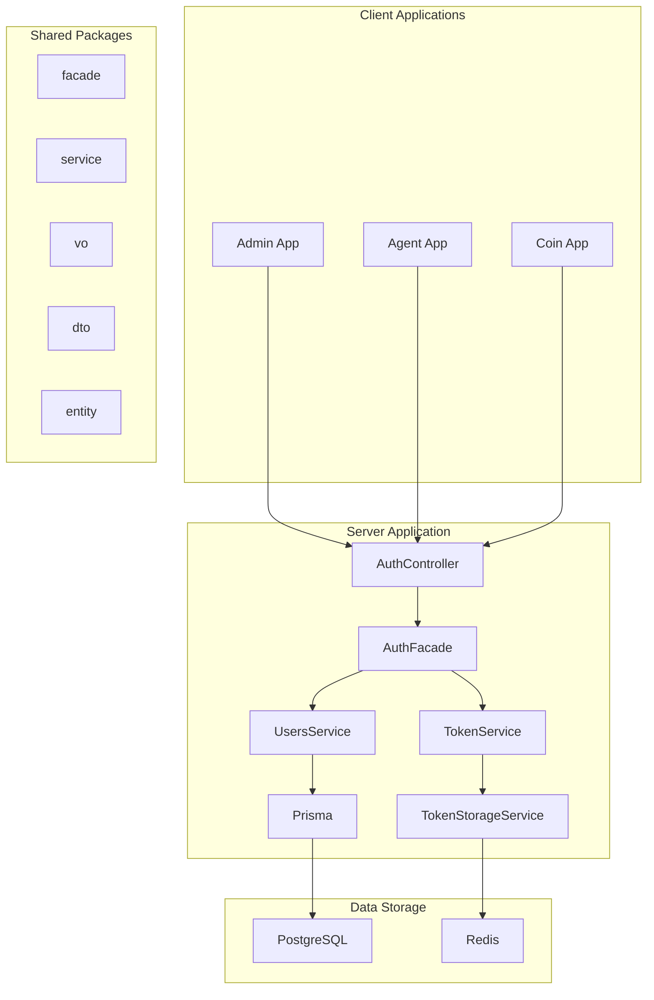
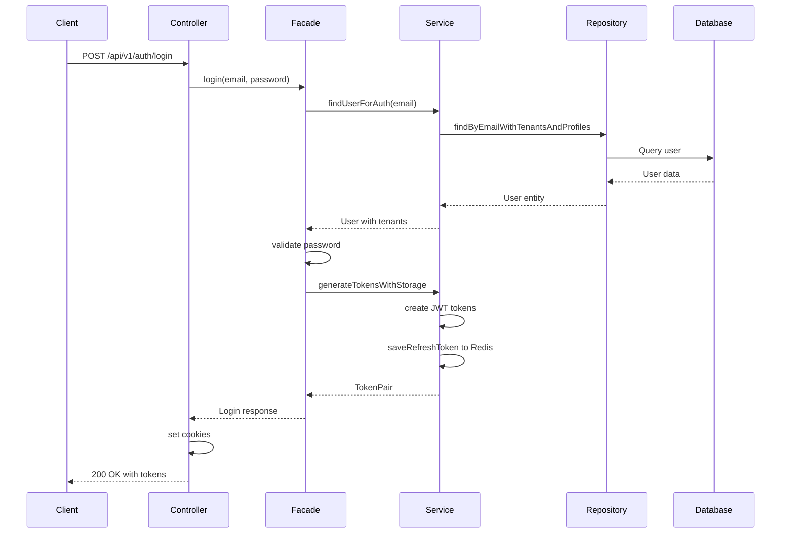
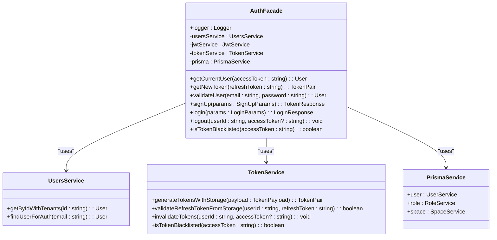
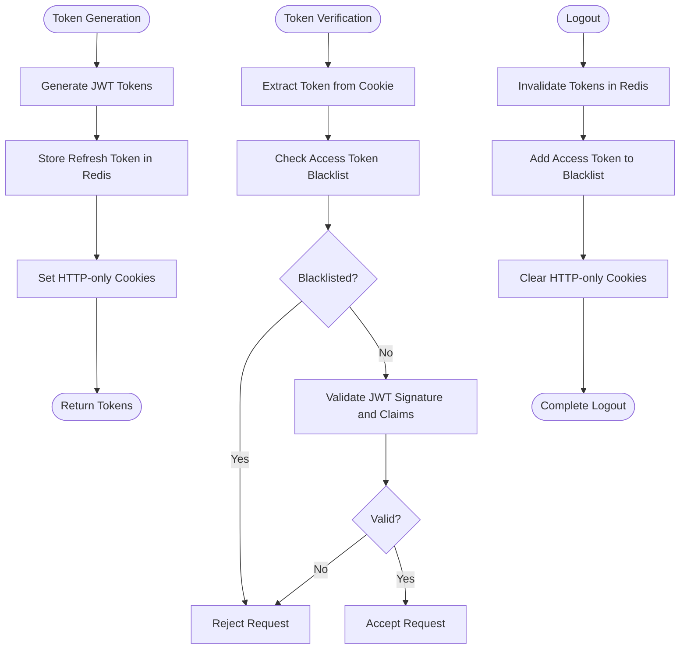
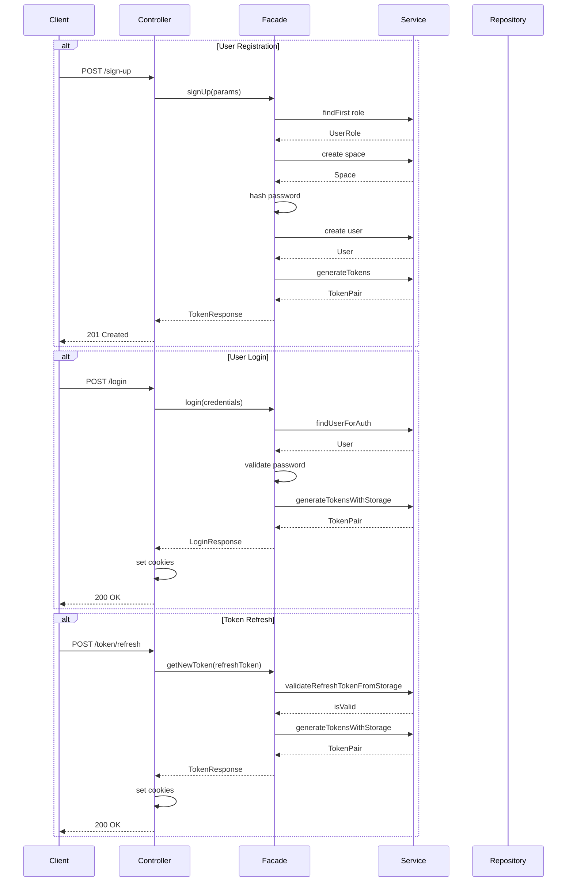
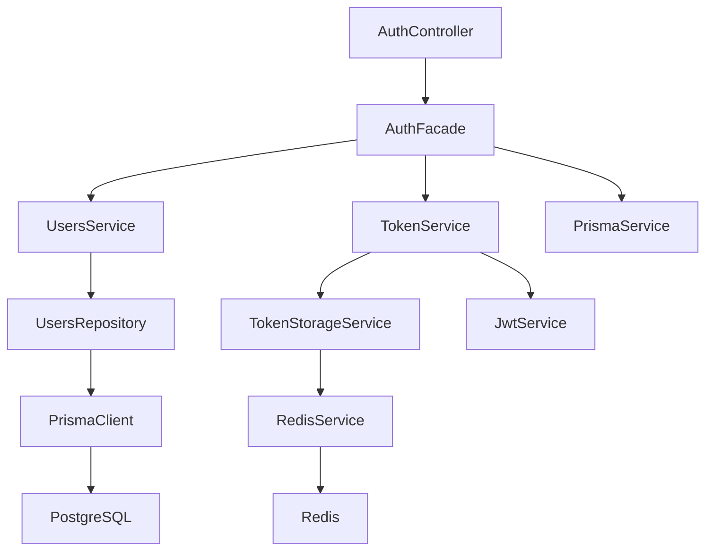

# Authentication Facade with Domain-Driven Design

<cite>
**Referenced Files in This Document**   
- [auth.facade.ts](file://packages/facade/src/auth.facade.ts)
- [auth.controller.ts](file://apps/server/src/module/auth/auth.controller.ts)
- [token.service.ts](file://packages/service/src/infra/token.service.ts)
- [token-storage.service.ts](file://packages/service/src/infra/token-storage.service.ts)
- [users.service.ts](file://packages/service/src/service/users.service.ts)
- [sign-up-payload.dto.ts](file://packages/dto/src/auth/sign-up-payload.dto.ts)
- [login-payload.dto.ts](file://packages/dto/src/auth/login-payload.dto.ts)
- [token.dto.ts](file://packages/dto/src/auth/token.dto.ts)
- [authStore.ts](file://packages/store/src/stores/authStore.ts)
</cite>

## Table of Contents
1. [Introduction](#introduction)
2. [Project Structure](#project-structure)
3. [Core Components](#core-components)
4. [Architecture Overview](#architecture-overview)
5. [Detailed Component Analysis](#detailed-component-analysis)
6. [Dependency Analysis](#dependency-analysis)
7. [Performance Considerations](#performance-considerations)
8. [Troubleshooting Guide](#troubleshooting-guide)
9. [Conclusion](#conclusion)

## Introduction
This document provides a comprehensive analysis of the Authentication Facade implementation using Domain-Driven Design principles within the prj-core repository. The authentication system follows a layered architecture with clear separation of concerns between facade, service, and infrastructure components. The design emphasizes security, scalability, and maintainability through the use of value objects, proper token management, and Redis-based storage for refresh tokens. The system handles user authentication, registration, token refresh, and logout operations while maintaining stateless JWT-based authentication with secure token storage mechanisms.

## Project Structure
The authentication system is organized across multiple packages and applications within the monorepo structure. The core authentication logic resides in the facade package, while supporting services and infrastructure components are distributed across related packages. The server application exposes the authentication endpoints through controllers, and client applications consume these services through API clients and stores.

**Diagram sources**
- [auth.controller.ts](file://apps/server/src/module/auth/auth.controller.ts)
- [auth.facade.ts](file://packages/facade/src/auth.facade.ts)
- [token.service.ts](file://packages/service/src/infra/token.service.ts)
- [token-storage.service.ts](file://packages/service/src/infra/token-storage.service.ts)

**Section sources**
- [auth.controller.ts](file://apps/server/src/module/auth/auth.controller.ts)
- [auth.facade.ts](file://packages/facade/src/auth.facade.ts)

## Core Components
The authentication system consists of several core components that work together to provide secure user authentication and authorization. The AuthFacade serves as the primary entry point for authentication operations, coordinating between various services and handling business logic. The TokenService manages JWT token creation, validation, and storage operations, while the UsersService handles user data retrieval and authentication checks. The TokenStorageService provides Redis-based persistence for refresh tokens and access token blacklisting, ensuring secure token management. Value objects such as PlainPassword and HashedPassword encapsulate password handling logic, providing type safety and security best practices.

**Section sources**
- [auth.facade.ts](file://packages/facade/src/auth.facade.ts)
- [token.service.ts](file://packages/service/src/infra/token.service.ts)
- [users.service.ts](file://packages/service/src/service/users.service.ts)

## Architecture Overview
The authentication architecture follows Domain-Driven Design principles with a clear separation between facade, domain logic, and infrastructure concerns. The system implements a layered approach where controllers handle HTTP requests and responses, facades coordinate business operations, services implement specific functionalities, and repositories manage data access. JWT tokens are used for stateless authentication, with access tokens stored in HTTP-only cookies and refresh tokens securely stored in Redis. The architecture includes token blacklisting to support immediate token invalidation during logout operations, enhancing security. The use of value objects for sensitive data like passwords ensures type safety and encapsulates domain-specific behaviors.

**Diagram sources**
- [auth.controller.ts](file://apps/server/src/module/auth/auth.controller.ts)
- [auth.facade.ts](file://packages/facade/src/auth.facade.ts)
- [token.service.ts](file://packages/service/src/infra/token.service.ts)

## Detailed Component Analysis

### AuthFacade Analysis
The AuthFacade class serves as the central coordination point for all authentication operations, implementing the Facade pattern to provide a simplified interface to complex subsystems. It handles user registration, login, token refresh, and logout operations while maintaining proper separation of concerns. The facade delegates specific responsibilities to specialized services while orchestrating the overall workflow. It uses dependency injection to receive instances of UsersService, JwtService, TokenService, and PrismaService, allowing for loose coupling and easier testing. The facade implements proper error handling and logging throughout its methods, providing visibility into authentication operations.

**Diagram sources**
- [auth.facade.ts](file://packages/facade/src/auth.facade.ts)
- [users.service.ts](file://packages/service/src/service/users.service.ts)
- [token.service.ts](file://packages/service/src/infra/token.service.ts)

**Section sources**
- [auth.facade.ts](file://packages/facade/src/auth.facade.ts)

### Token Management Analysis
The token management system implements a secure approach to JWT-based authentication with refresh token rotation and access token blacklisting. The TokenService handles JWT creation and validation using NestJS's JwtService, while the TokenStorageService manages persistent storage of refresh tokens in Redis. Refresh tokens are stored with a user-specific key prefix, allowing for efficient retrieval and validation. Access token blacklisting is implemented to support immediate token invalidation during logout operations, addressing the inherent statelessness of JWTs. The system uses HTTP-only cookies to transmit tokens, protecting against XSS attacks, while the secure flag ensures transmission only over HTTPS.

**Diagram sources**
- [token.service.ts](file://packages/service/src/infra/token.service.ts)
- [token-storage.service.ts](file://packages/service/src/infra/token-storage.service.ts)

**Section sources**
- [token.service.ts](file://packages/service/src/infra/token.service.ts)
- [token-storage.service.ts](file://packages/service/src/infra/token-storage.service.ts)

### Authentication Flow Analysis
The authentication system implements multiple flows for user registration, login, token refresh, and logout operations. Each flow follows a consistent pattern of input validation, business logic execution, and secure response handling. The registration flow creates a new user with associated space and tenant information, while the login flow verifies credentials and issues secure tokens. The token refresh flow validates the refresh token against Redis storage before issuing new tokens, implementing refresh token rotation for enhanced security. The logout flow invalidates tokens in both Redis and the blacklist system while clearing client-side cookies.

**Diagram sources**
- [auth.controller.ts](file://apps/server/src/module/auth/auth.controller.ts)
- [auth.facade.ts](file://packages/facade/src/auth.facade.ts)
- [token.service.ts](file://packages/service/src/infra/token.service.ts)

**Section sources**
- [auth.controller.ts](file://apps/server/src/module/auth/auth.controller.ts)
- [auth.facade.ts](file://packages/facade/src/auth.facade.ts)

## Dependency Analysis
The authentication components have well-defined dependencies that follow dependency inversion principles. The AuthFacade depends on abstractions rather than concrete implementations, receiving its dependencies through constructor injection. The system uses several shared packages that provide common functionality across the application. The @cocrepo/facade package contains the AuthFacade implementation, while @cocrepo/service provides the TokenService and UsersService. The @cocrepo/dto package defines data transfer objects for API requests and responses, and @cocrepo/entity contains the domain entities. The authentication system also depends on external services like Redis for token storage and PostgreSQL for persistent data storage.

**Diagram sources**
- [auth.controller.ts](file://apps/server/src/module/auth/auth.controller.ts)
- [auth.facade.ts](file://packages/facade/src/auth.facade.ts)
- [token.service.ts](file://packages/service/src/infra/token.service.ts)
- [token-storage.service.ts](file://packages/service/src/infra/token-storage.service.ts)

**Section sources**
- [auth.facade.ts](file://packages/facade/src/auth.facade.ts)
- [token.service.ts](file://packages/service/src/infra/token.service.ts)

## Performance Considerations
The authentication system has been designed with performance in mind, particularly in its use of Redis for fast token validation and storage operations. The token validation process involves minimal database queries, with most operations performed against Redis which provides sub-millisecond response times. The system implements connection pooling for both Redis and PostgreSQL connections to minimize connection overhead. Password hashing uses bcrypt with appropriate work factors to balance security and performance. The architecture supports horizontal scaling as the stateless JWT tokens allow any server instance to validate tokens without shared session state. The use of HTTP-only cookies reduces client-side storage operations and potential performance bottlenecks in browser JavaScript execution.

## Troubleshooting Guide
Common issues with the authentication system typically involve token validation failures, Redis connectivity problems, or database query issues. When users experience login failures, check the server logs for authentication error messages and verify that the user exists in the database with the correct password hash. For token refresh issues, verify that the refresh token exists in Redis and matches the expected value. If users are unexpectedly logged out, check the Redis connection and ensure that the token storage service can read and write to the Redis instance. Monitor the token blacklist to ensure it doesn't grow excessively large, which could impact performance. For registration issues, verify that the default USER role exists in the database and that space creation is functioning correctly.

**Section sources**
- [auth.facade.ts](file://packages/facade/src/auth.facade.ts)
- [token.service.ts](file://packages/service/src/infra/token.service.ts)
- [token-storage.service.ts](file://packages/service/src/infra/token-storage.service.ts)

## Conclusion
The Authentication Facade implementation with Domain-Driven Design provides a robust, secure, and maintainable solution for user authentication in the prj-core application. The system effectively separates concerns between facade, service, and infrastructure layers, making it easier to understand, test, and extend. The use of JWT tokens with Redis-backed refresh token storage balances security and performance requirements. The architecture supports future enhancements such as multi-factor authentication, social login integration, and improved audit logging without requiring significant changes to the existing codebase. The clear separation of responsibilities and adherence to DDD principles ensures that the authentication system remains maintainable as the application evolves.