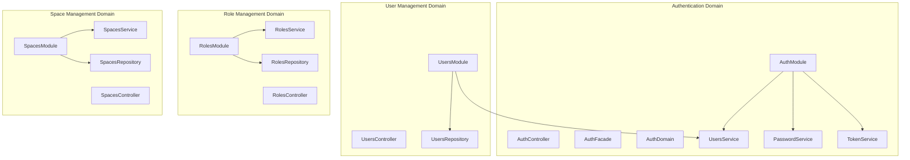
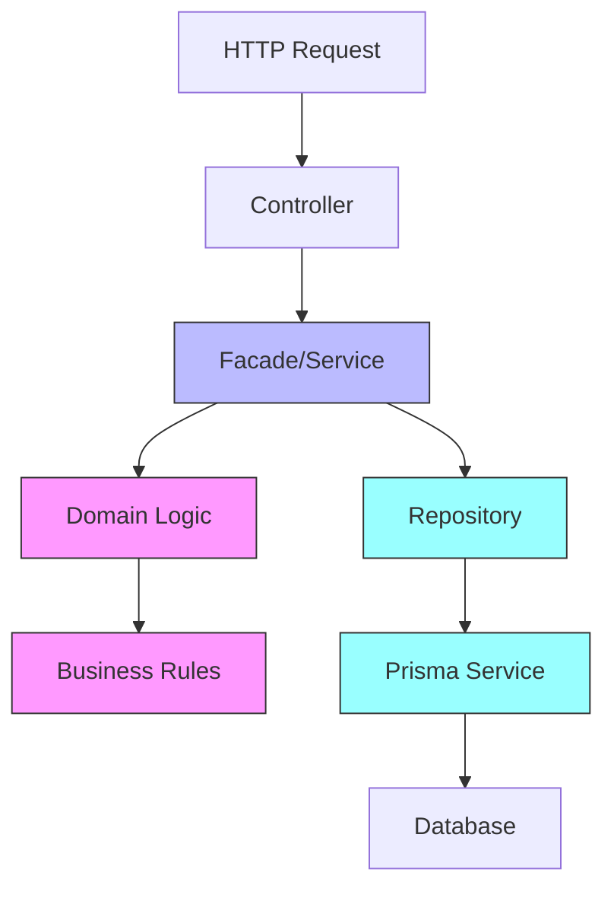
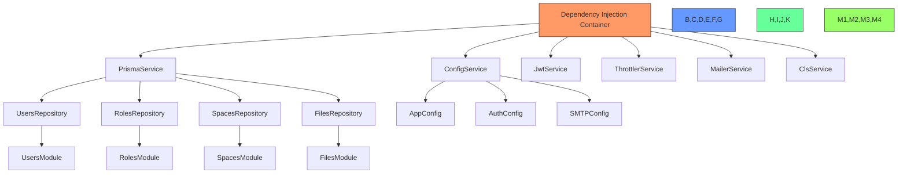

# Module Architecture

<cite>
**Referenced Files in This Document**   
- [app.module.ts](file://apps/server/src/module/app.module.ts)
- [auth.module.ts](file://apps/server/src/module/auth.module.ts)
- [users.module.ts](file://apps/server/src/module/users.module.ts)
- [roles.module.ts](file://apps/server/src/module/roles.module.ts)
- [spaces.module.ts](file://apps/server/src/module/spaces.module.ts)
- [tenants.module.ts](file://apps/server/src/module/tenants.module.ts)
- [categories.module.ts](file://apps/server/src/module/categories.module.ts)
- [groups.module.ts](file://apps/server/src/module/groups.module.ts)
- [prisma.module.ts](file://apps/server/src/module/prisma.module.ts)
- [global.module.ts](file://apps/server/src/global.module.ts)
- [shared/index.ts](file://apps/server/src/shared/index.ts)
</cite>

## Table of Contents
1. [Introduction](#introduction)
2. [Root AppModule Structure](#root-appmodule-structure)
3. [Feature Module Organization](#feature-module-organization)
4. [Domain-Driven Design Principles](#domain-driven-design-principles)
5. [Dependency Injection and Provider Sharing](#dependency-injection-and-provider-sharing)
6. [API Surface and Route Configuration](#api-surface-and-route-configuration)
7. [Common Issues and Solutions](#common-issues-and-solutions)
8. [Advanced Module Patterns](#advanced-module-patterns)
9. [Conclusion](#conclusion)

## Introduction
The prj-core NestJS backend implements a modular architecture that follows domain-driven design principles to organize business functionality into cohesive, maintainable units. This document details the hierarchical module structure starting from the root AppModule, which serves as the application's entry point and orchestrates the integration of various feature modules including AuthModule, UsersModule, RolesModule, and SpacesModule. The architecture emphasizes separation of concerns, encapsulation of related functionality, and clear dependency management through NestJS's dependency injection system. By examining the implementation details of these modules, we can understand how the application maintains scalability and testability while providing a well-structured API surface.

## Root AppModule Structure

The AppModule serves as the core container that bootstraps the entire application and coordinates the integration of all feature modules. It follows NestJS's module pattern by using the @Module decorator to define imports, providers, and configuration. The module imports a comprehensive set of feature modules that represent distinct business domains within the application, including user management, authentication, roles, spaces, and various content management entities.

The module's imports array includes both global configuration modules and specific feature modules, establishing the foundation for the application's functionality. It also configures essential application-wide providers such as request context interceptors, response entity interceptors, and context services that are available throughout the application. The AppModule implements the OnModuleInit interface to provide initialization logging, offering visibility into the application startup process.

```mermaid
graph TD
A[AppModule] --> B[Global Modules]
A --> C[PrismaModule]
A --> D[CaslModule]
A --> E[GroundsModule]
A --> F[UserClassificationsModule]
A --> G[RoleClassificationsModule]
A --> H[FileClassificationsModule]
A --> I[SpaceClassificationsModule]
A --> J[CategoriesModule]
A --> K[GroupsModule]
A --> L[SpacesModule]
A --> M[UsersModule]
A --> N[AuthModule]
A --> O[RolesModule]
A --> P[SubjectsModule]
A --> Q[TimelinesModule]
A --> R[SessionsModule]
A --> S[ProgramsModule]
A --> T[RoutinesModule]
A --> U[ExercisesModule]
A --> V[FilesModule]
A --> W[TenantsModule]
```



**Diagram sources**
- [app.module.ts](file://apps/server/src/module/app.module.ts#L42-L162)

**Section sources**
- [app.module.ts](file://apps/server/src/module/app.module.ts#L1-L186)

## Feature Module Organization

The application organizes its functionality into discrete feature modules that encapsulate related business domains. Each module follows a consistent pattern of controllers, providers, and repositories that handle specific aspects of the application's functionality. This organization enables teams to work on different features independently while maintaining a clear separation of concerns.

The AuthModule, for example, encapsulates all authentication-related functionality including login, registration, and token management. It exports the AuthFacade service to make authentication capabilities available to other modules that need to verify user credentials or manage sessions. Similarly, the UsersModule handles user management operations, the RolesModule manages role-based access control, and the SpacesModule manages spatial entities within the application.

This modular approach allows for clear boundaries between different functional areas of the application, making it easier to understand, test, and maintain each component. The modules are designed to be cohesive units that can be developed, tested, and potentially even deployed independently if needed.



**Diagram sources**
- [auth.module.ts](file://apps/server/src/module/auth.module.ts#L15-L29)
- [users.module.ts](file://apps/server/src/module/users.module.ts#L4-L7)
- [roles.module.ts](file://apps/server/src/module/roles.module.ts#L4-L7)
- [spaces.module.ts](file://apps/server/src/module/spaces.module.ts#L9-L12)

**Section sources**
- [auth.module.ts](file://apps/server/src/module/auth.module.ts#L1-L31)
- [users.module.ts](file://apps/server/src/module/users.module.ts#L1-L9)
- [roles.module.ts](file://apps/server/src/module/roles.module.ts#L1-L9)
- [spaces.module.ts](file://apps/server/src/module/spaces.module.ts#L1-L14)

## Domain-Driven Design Principles

The module architecture follows domain-driven design (DDD) principles by organizing the codebase around business capabilities rather than technical layers. Each module represents a bounded context that encapsulates a specific business domain, such as authentication, user management, or space management. This approach ensures that related functionality is kept together, making the codebase more intuitive and maintainable.

The implementation follows a clear separation between domain logic, application services, and infrastructure concerns. Domain services contain the core business rules and logic, while application services (facades) coordinate operations between domain services and infrastructure components like repositories. This separation allows the business logic to remain pure and independent of technical implementation details.

The use of shared components from the @shared namespace enables consistent implementation of cross-cutting concerns across different modules while maintaining the integrity of each domain. This approach supports the DDD principle of bounded contexts while allowing for necessary integration between domains through well-defined interfaces.



**Diagram sources**
- [shared/index.ts](file://apps/server/src/shared/index.ts#L117-L148)
- [auth.module.ts](file://apps/server/src/module/auth.module.ts#L16-L25)

## Dependency Injection and Provider Sharing

The application leverages NestJS's powerful dependency injection system to manage component dependencies and enable provider sharing across modules. The dependency injection container resolves dependencies automatically, allowing modules to declare their requirements through constructor parameters without needing to manage instantiation themselves.

The PrismaModule is configured as a global module using the @Global() decorator, making the PrismaService available to all other modules without requiring explicit imports. This pattern is appropriate for infrastructure services that are needed throughout the application. Other shared services like ContextService are imported directly into modules that require them, establishing clear dependency relationships.

The AuthModule exports the AuthFacade service, making it available to other modules that need authentication capabilities. This export mechanism allows for controlled sharing of functionality while maintaining encapsulation. The dependency injection system ensures that services are instantiated as singletons by default, providing consistent state management across the application.



**Diagram sources**
- [prisma.module.ts](file://apps/server/src/module/prisma.module.ts#L6-L18)
- [global.module.ts](file://apps/server/src/global.module.ts#L17-L134)
- [shared/index.ts](file://apps/server/src/shared/index.ts#L130)

**Section sources**
- [prisma.module.ts](file://apps/server/src/module/prisma.module.ts#L1-L20)
- [global.module.ts](file://apps/server/src/global.module.ts#L1-L134)

## API Surface and Route Configuration

The application's API surface is organized through a hierarchical routing structure configured in the AppModule using NestJS's RouterModule. The routes follow a versioned API pattern with all endpoints prefixed by "/api/v1/", providing a clear contract for clients and enabling future API evolution without breaking existing integrations.

The route configuration establishes a logical grouping of endpoints by business domain, with each feature module handling requests to its designated path. For example, the AuthModule handles requests to "/api/v1/auth/", the UsersModule handles requests to "/api/v1/users/", and the SpacesModule handles requests to "/api/v1/spaces/". This organization makes the API intuitive to navigate and understand.

Some modules also support nested routing for related resources. The SpacesModule, for instance, has a child route for space classifications, allowing for a natural hierarchy in the API design. This approach enables RESTful resource nesting while maintaining separation of concerns between different functional areas.

```mermaid
graph TD
A[/api] --> B[/v1]
B --> C[/tenants]
B --> D[/auth]
B --> E[/categories]
B --> F[/groups]
B --> G[/spaces]
B --> H[/users]
B --> I[/roles]
B --> J[/subjects]
B --> K[/sessions]
B --> L[/timelines]
B --> M[/programs]
B --> N[/routines]
B --> O[/exercises]
B --> P[/files]
B --> Q[/grounds]
G --> R[/classifications]
H --> S[/classifications]
I --> T[/classifications]
P --> U[/classifications]
C --> V[TenantsModule]
D --> W[AuthModule]
E --> X[CategoriesModule]
F --> Y[GroupsModule]
G --> Z[SpacesModule]
H --> AA[UsersModule]
I --> AB[RolesModule]
J --> AC[SubjectsModule]
K --> AD[SessionsModule]
L --> AE[TimelinesModule]
M --> AF[ProgramsModule]
N --> AG[RoutinesModule]
O --> AH[ExercisesModule]
P --> AI[FilesModule]
Q --> AJ[GroundsModule]
R --> AK[SpaceClassificationsModule]
S --> AL[UserClassificationsModule]
T --> AM[RoleClassificationsModule]
U --> AN[FileClassificationsModule]
```

**Diagram sources**
- [app.module.ts](file://apps/server/src/module/app.module.ts#L66-L161)

## Common Issues and Solutions

The module architecture addresses common challenges in large-scale NestJS applications, particularly around circular dependencies and module loading order. The application avoids circular dependencies through careful module organization and the strategic use of forward references when necessary. The hierarchical structure with the AppModule at the root importing all feature modules establishes a clear dependency graph that prevents circular references.

The use of global modules for shared infrastructure services like configuration, logging, and database access eliminates the need for these modules to be imported by every feature module, reducing complexity and potential dependency conflicts. The RouterModule configuration is centralized in the AppModule, ensuring consistent route registration and preventing conflicts that could arise from distributed route configuration.

For modules that need to share providers without creating tight coupling, the application uses the exports array to explicitly declare which services should be available to importing modules. This approach provides controlled sharing while maintaining encapsulation and making dependencies explicit in the module configuration.

**Section sources**
- [app.module.ts](file://apps/server/src/module/app.module.ts#L42-L162)
- [global.module.ts](file://apps/server/src/global.module.ts#L17-L134)

## Advanced Module Patterns

The application implements several advanced NestJS module patterns to enhance flexibility and reusability. The globalModules array in global.module.ts demonstrates the use of dynamic modules configured at runtime, allowing for environment-specific configuration of services like JWT, throttling, and mailer. This pattern enables the application to adapt its behavior based on configuration without requiring code changes.

The PrismaModule uses a factory provider pattern with useFactory and inject to create the PrismaService instance, allowing for custom initialization logic that depends on configuration values. This approach provides greater control over service instantiation compared to simple class providers.

The authentication system implements a layered service architecture with distinct domain, facade, and utility services, demonstrating how complex business logic can be organized within a module. The AuthDomain contains pure business logic, the AuthFacade provides the public interface and coordinates operations, and utility services like PasswordService and TokenService handle technical concerns.

**Section sources**
- [prisma.module.ts](file://apps/server/src/module/prisma.module.ts#L11-L15)
- [global.module.ts](file://apps/server/src/global.module.ts#L66-L87)
- [shared/index.ts](file://apps/server/src/shared/index.ts#L149-L152)

## Conclusion

The module architecture of prj-core demonstrates a well-structured NestJS backend that effectively applies domain-driven design principles to organize business functionality. The root AppModule serves as a central coordinator that integrates feature modules representing distinct business domains, each encapsulating related functionality and maintaining clear separation of concerns. The architecture leverages NestJS's dependency injection system to manage component dependencies and enable controlled sharing of providers across modules.

Through the use of global modules, dynamic module configuration, and strategic provider exports, the application achieves a balance between encapsulation and reusability. The hierarchical routing structure provides a logical API organization that reflects the underlying domain model, making the system intuitive to understand and extend. By following these patterns, the application maintains scalability, testability, and maintainability as it continues to evolve.