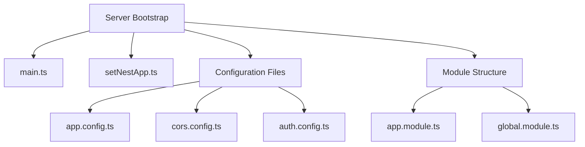
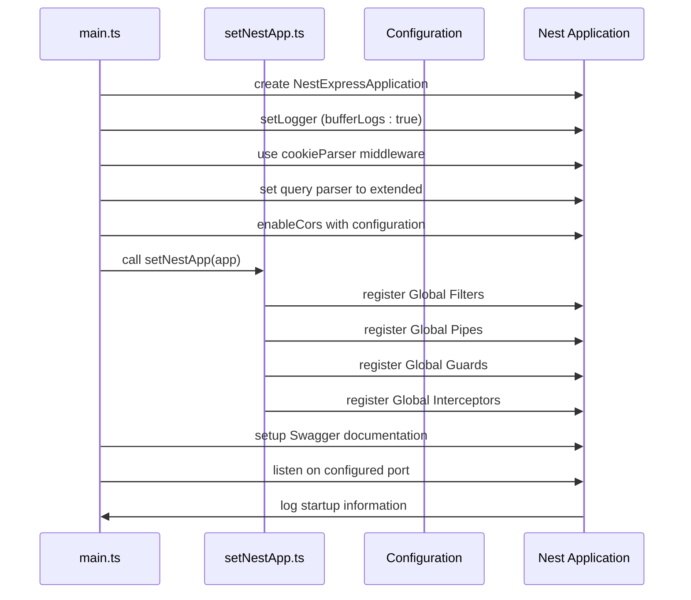
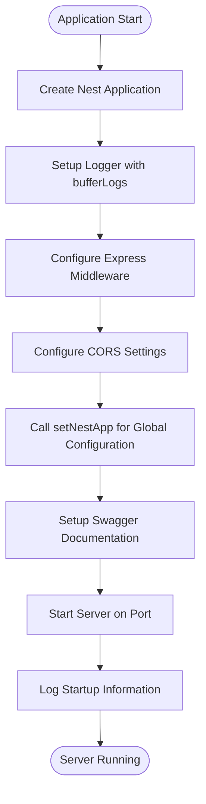
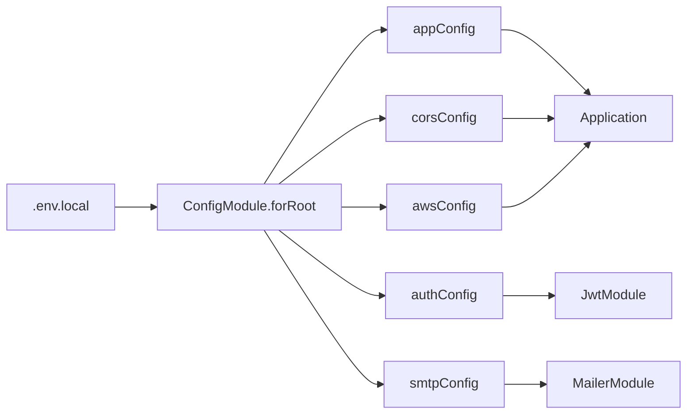
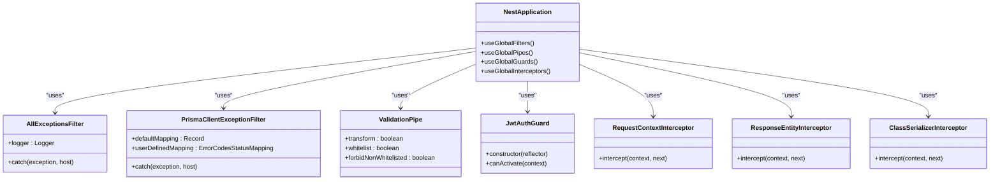
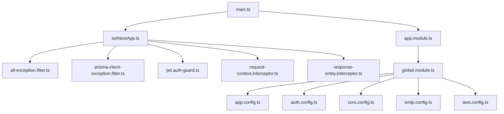

# Server Bootstrap Process

<cite>
**Referenced Files in This Document**   
- [main.ts](file://apps/server/src/main.ts)
- [setNestApp.ts](file://apps/server/src/setNestApp.ts)
- [app.module.ts](file://apps/server/src/module/app.module.ts)
- [app.config.ts](file://apps/server/src/shared/config/app.config.ts)
- [cors.config.ts](file://apps/server/src/shared/config/cors.config.ts)
- [auth.config.ts](file://apps/server/src/shared/config/auth.config.ts)
- [global.module.ts](file://apps/server/src/global.module.ts)
- [all-exception.filter.ts](file://apps/server/src/shared/filter/all-exception.filter.ts)
- [prisma-client-exception.filter.ts](file://apps/server/src/shared/filter/prisma-client-exception.filter.ts)
</cite>

## Table of Contents
1. [Introduction](#introduction)
2. [Project Structure](#project-structure)
3. [Core Components](#core-components)
4. [Architecture Overview](#architecture-overview)
5. [Detailed Component Analysis](#detailed-component-analysis)
6. [Dependency Analysis](#dependency-analysis)
7. [Performance Considerations](#performance-considerations)
8. [Troubleshooting Guide](#troubleshooting-guide)
9. [Conclusion](#conclusion)

## Introduction
This document provides a comprehensive analysis of the server bootstrap process in the prj-core NestJS application. It details the initialization sequence from the main.ts entry point, covering application creation, configuration setup, middleware registration, and server startup. The documentation explains how the application establishes a secure, well-structured API server through systematic configuration steps, including CORS setup, Swagger documentation integration, and global exception handling. The analysis includes implementation details of environment-specific configurations and addresses common startup issues with practical solutions based on the actual codebase.

## Project Structure
The server bootstrap process is centered in the apps/server directory, which contains the core initialization files and configuration modules. The structure follows a modular approach with clear separation of concerns between application setup, configuration management, and shared utilities.

**Diagram sources**
- [main.ts](file://apps/server/src/main.ts)
- [setNestApp.ts](file://apps/server/src/setNestApp.ts)
- [app.config.ts](file://apps/server/src/shared/config/app.config.ts)
- [app.module.ts](file://apps/server/src/module/app.module.ts)
- [global.module.ts](file://apps/server/src/global.module.ts)

**Section sources**
- [main.ts](file://apps/server/src/main.ts#L1-L88)
- [setNestApp.ts](file://apps/server/src/setNestApp.ts#L1-L49)

## Core Components
The server bootstrap process consists of several core components that work together to initialize the NestJS application. The main.ts file serves as the entry point, orchestrating the application creation and configuration sequence. The setNestApp.ts file contains the centralized configuration logic for global guards, pipes, filters, and interceptors. Configuration files in the shared/config directory manage environment-specific settings, while the app.module.ts defines the application's module structure and dependencies.

**Section sources**
- [main.ts](file://apps/server/src/main.ts#L1-L88)
- [setNestApp.ts](file://apps/server/src/setNestApp.ts#L1-L49)
- [app.module.ts](file://apps/server/src/module/app.module.ts#L1-L186)

## Architecture Overview
The server bootstrap architecture follows a sequential initialization pattern with well-defined phases. The process begins with application creation, followed by middleware setup, CORS configuration, global component registration, API documentation setup, and finally server startup. This layered approach ensures that each configuration step builds upon the previous one, creating a robust foundation for the API server.

**Diagram sources**
- [main.ts](file://apps/server/src/main.ts#L14-L87)
- [setNestApp.ts](file://apps/server/src/setNestApp.ts#L12-L48)

## Detailed Component Analysis

### Server Initialization Process
The server bootstrap process in prj-core follows a structured sequence of operations that ensures proper initialization of the NestJS application. The process begins in main.ts with the creation of a NestExpressApplication instance, which provides Express-specific functionality while maintaining NestJS's modular architecture.

#### Bootstrap Sequence

**Diagram sources**
- [main.ts](file://apps/server/src/main.ts#L14-L87)

**Section sources**
- [main.ts](file://apps/server/src/main.ts#L14-L87)

### Configuration Management
The application uses NestJS's ConfigModule to manage environment-specific configurations. Configuration files are organized in the shared/config directory, with each file responsible for a specific aspect of the application's settings.

#### Environment Configuration Flow

**Diagram sources**
- [global.module.ts](file://apps/server/src/global.module.ts#L17-L133)
- [app.config.ts](file://apps/server/src/shared/config/app.config.ts#L1-L57)
- [auth.config.ts](file://apps/server/src/shared/config/auth.config.ts#L1-L40)
- [cors.config.ts](file://apps/server/src/shared/config/cors.config.ts#L1-L18)

**Section sources**
- [global.module.ts](file://apps/server/src/global.module.ts#L17-L133)
- [app.config.ts](file://apps/server/src/shared/config/app.config.ts#L1-L57)

### Global Component Registration
The setNestApp function centralizes the registration of global components such as exception filters, pipes, guards, and interceptors. This approach ensures consistent application behavior across all controllers and routes.

#### Global Components Architecture

**Diagram sources**
- [setNestApp.ts](file://apps/server/src/setNestApp.ts#L12-L48)
- [all-exception.filter.ts](file://apps/server/src/shared/filter/all-exception.filter.ts#L1-L48)
- [prisma-client-exception.filter.ts](file://apps/server/src/shared/filter/prisma-client-exception.filter.ts#L1-L164)

**Section sources**
- [setNestApp.ts](file://apps/server/src/setNestApp.ts#L12-L48)

## Dependency Analysis
The server bootstrap process relies on a well-defined dependency chain that ensures proper initialization order and configuration. The main.ts file depends on setNestApp.ts for global configuration, while both depend on the configuration files in the shared/config directory.

**Diagram sources**
- [main.ts](file://apps/server/src/main.ts)
- [setNestApp.ts](file://apps/server/src/setNestApp.ts)
- [app.module.ts](file://apps/server/src/module/app.module.ts)
- [global.module.ts](file://apps/server/src/global.module.ts)

**Section sources**
- [main.ts](file://apps/server/src/main.ts#L1-L88)
- [setNestApp.ts](file://apps/server/src/setNestApp.ts#L1-L49)
- [app.module.ts](file://apps/server/src/module/app.module.ts#L1-L186)
- [global.module.ts](file://apps/server/src/global.module.ts#L1-L133)

## Performance Considerations
The server bootstrap process includes several performance optimizations that enhance the application's efficiency and responsiveness. The use of bufferLogs in the NestFactory configuration ensures that logs are properly captured from the earliest stages of application initialization. The structured configuration loading approach minimizes configuration parsing overhead by validating environment variables only once during startup.

The global exception filters are designed to provide detailed error information in development environments while maintaining security in production by omitting stack traces. The validation pipe with transform and whitelist options ensures data integrity while minimizing the risk of malicious input, contributing to both security and performance by preventing invalid data from propagating through the application layers.

## Troubleshooting Guide
Common issues during server startup can be addressed by understanding the bootstrap process and its dependencies. The following solutions are based on the actual implementation patterns in the codebase:

**Section sources**
- [main.ts](file://apps/server/src/main.ts#L77-L84)
- [app.config.ts](file://apps/server/src/shared/config/app.config.ts#L41-L56)
- [auth.config.ts](file://apps/server/src/shared/config/auth.config.ts#L20-L38)

### Port Conflict Resolution
When encountering port conflicts during startup, verify the APP_PORT environment variable in the .env.local file. The application defaults to port 3006 if not specified. Ensure no other process is using the designated port, or modify the APP_PORT value to an available port.

### Environment Variable Configuration
Missing or incorrect environment variables can prevent successful startup. Key variables include:
- APP_NAME: Required for application identification
- APP_PORT: Specifies the listening port
- AUTH_JWT_SECRET: Required for JWT authentication
- AUTH_JWT_TOKEN_EXPIRES_IN: Defines token expiration time
- AUTH_JWT_TOKEN_REFRESH_IN: Defines token refresh time

The configuration files use ValidationUtil.validateConfig to validate environment variables against defined schemas, providing clear error messages when required variables are missing or incorrectly formatted.

### CORS Configuration Issues
If CORS-related issues occur, verify the CORS_ENABLED environment variable in the .env.local file. The cors.config.ts file expects a boolean value ("true" or "false"). In development, CORS is typically enabled to allow requests from frontend applications running on different ports.

### Database Connection Problems
While not directly part of the bootstrap process, database connection issues can manifest during startup. Ensure that database configuration variables (DATABASE_URL, DATABASE_HOST, DATABASE_PORT, etc.) are correctly set in the environment file, though the specific database configuration is commented out in the current implementation.

## Conclusion
The server bootstrap process in prj-core demonstrates a well-structured approach to NestJS application initialization. By following a clear sequence of operations and leveraging NestJS's modular architecture, the application establishes a secure, well-configured API server. The separation of configuration concerns, centralized global component registration, and comprehensive error handling create a robust foundation for the application. The implementation patterns provide both flexibility for development and security for production environments, making the bootstrap process a critical component of the application's overall architecture.