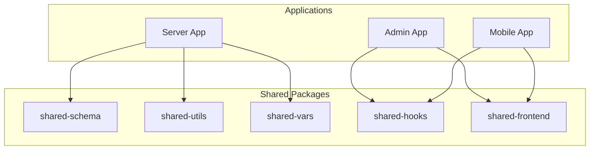
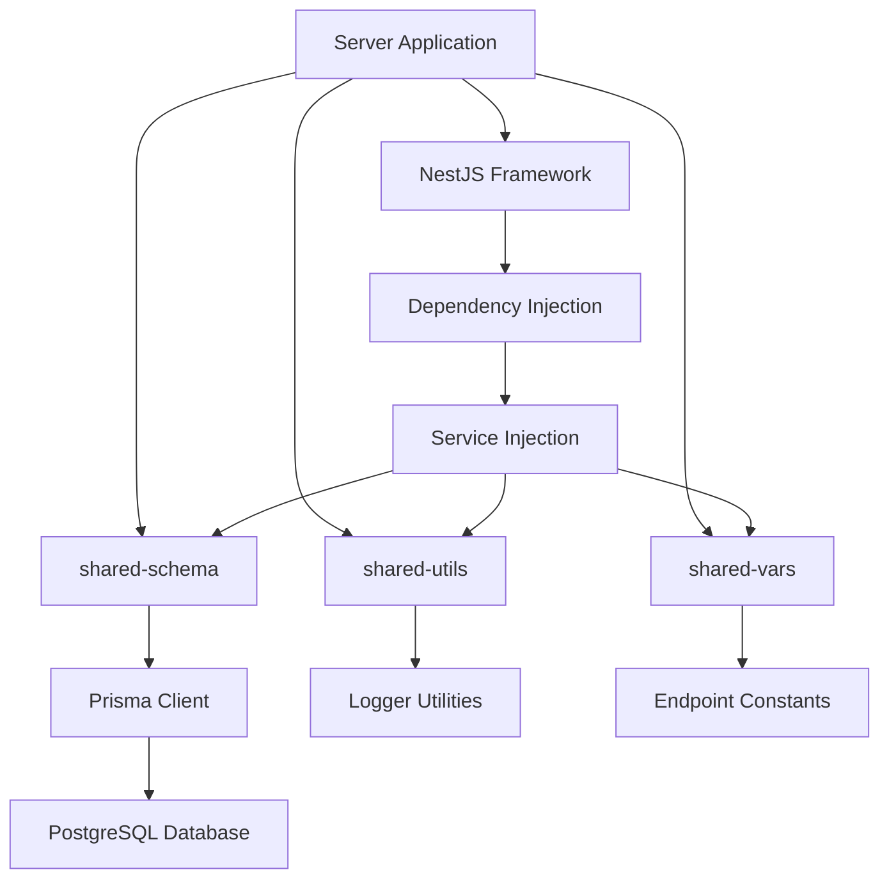
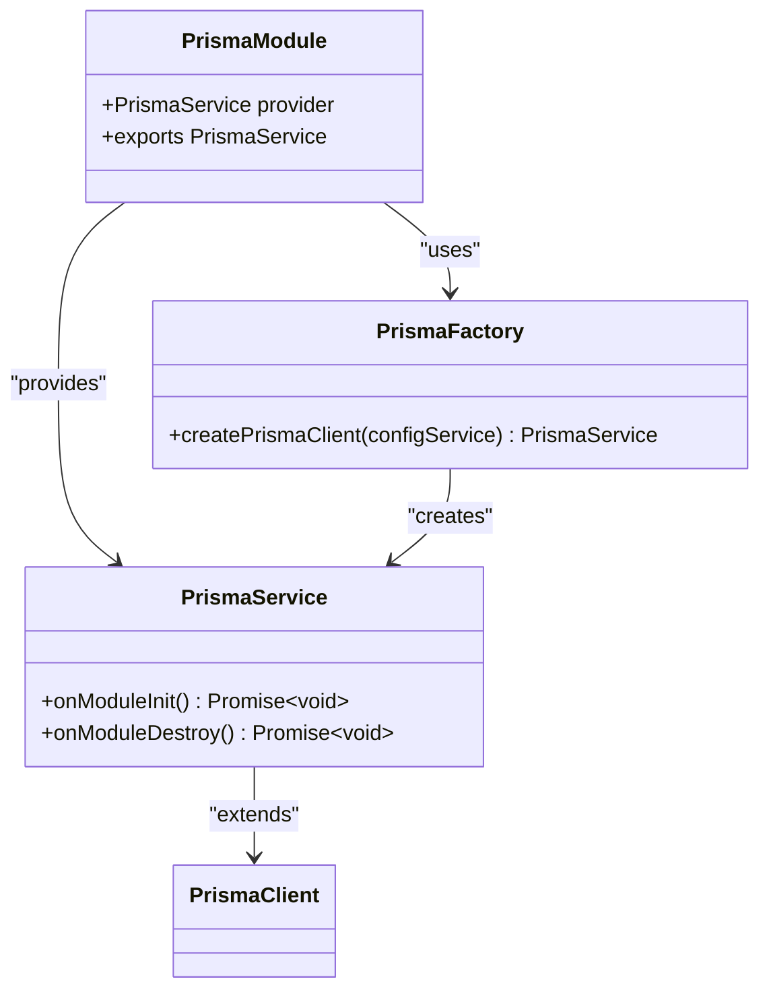
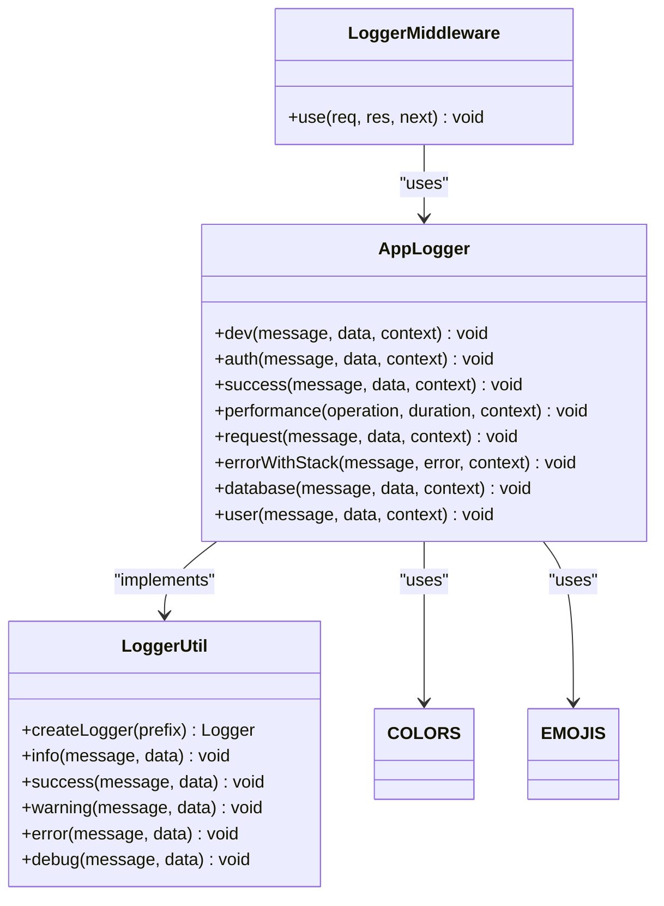
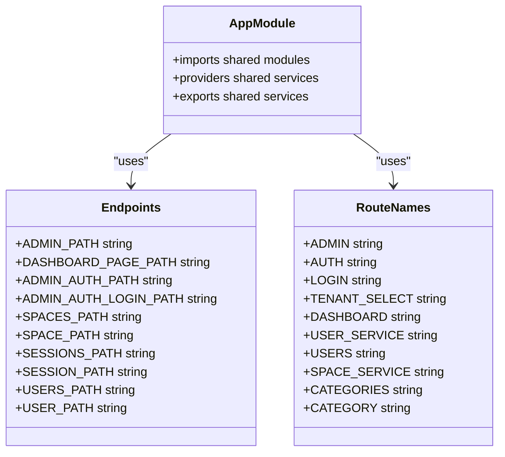
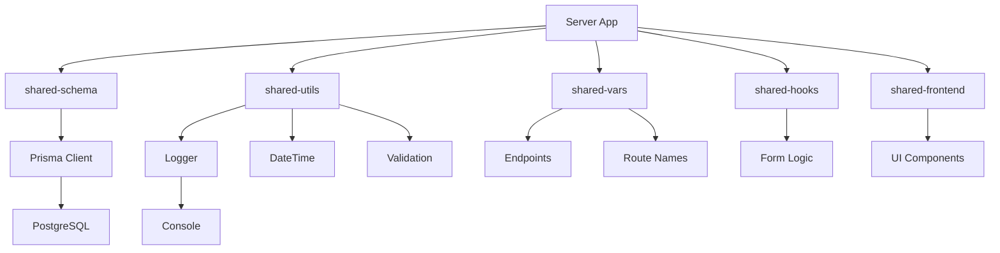

# Shared Package Integration

<cite>
**Referenced Files in This Document**   
- [main.ts](file://apps/server/src/main.ts)
- [app.module.ts](file://apps/server/src/module/app.module.ts)
- [setNestApp.ts](file://apps/server/src/setNestApp.ts)
- [prisma.module.ts](file://apps/server/src/module/prisma.module.ts)
- [prisma.service.ts](file://apps/server/src/shared/service/utils/prisma.service.ts)
- [prisma.factory.ts](file://apps/server/src/shared/service/utils/prisma.factory.ts)
- [app-logger.util.ts](file://apps/server/src/shared/util/app-logger.util.ts)
- [Logger.ts](file://packages/toolkit/src/Logger.ts)
- [endpoints.ts](file://packages/constants/src/endpoints.ts)
- [route-names.ts](file://packages/constants/src/route-names.ts)
- [index.ts](file://apps/server/src/shared/index.ts)
</cite>

## Table of Contents
1. [Introduction](#introduction)
2. [Project Structure](#project-structure)
3. [Core Components](#core-components)
4. [Architecture Overview](#architecture-overview)
5. [Detailed Component Analysis](#detailed-component-analysis)
6. [Dependency Analysis](#dependency-analysis)
7. [Performance Considerations](#performance-considerations)
8. [Troubleshooting Guide](#troubleshooting-guide)
9. [Conclusion](#conclusion)

## Introduction
This document provides a comprehensive analysis of the shared package integration within the prj-core monorepo. It details how the backend server integrates with shared packages for database access, logging functionality, and configuration management. The documentation explains the implementation patterns, type safety mechanisms, and architectural benefits of this shared package approach, providing both beginner-friendly explanations and advanced technical insights.

## Project Structure
The prj-core repository follows a monorepo architecture with applications and shared packages organized in a structured manner. The server application in the apps/server directory integrates with multiple shared packages located in the packages directory, including shared-schema for database access, shared-utils for common utilities, and shared-vars for configuration management.

**Diagram sources**
- [apps/server](file://apps/server)
- [packages](file://packages)

**Section sources**
- [project_structure](file://project_structure)

## Core Components
The core components of the shared package integration include the Prisma client for database operations, utility functions for common operations, and configuration constants for endpoint management. These components are designed to provide type safety, reusability, and consistency across the monorepo.

**Section sources**
- [main.ts](file://apps/server/src/main.ts)
- [app.module.ts](file://apps/server/src/module/app.module.ts)
- [index.ts](file://apps/server/src/shared/index.ts)

## Architecture Overview
The architecture of the shared package integration is based on a modular design where the server application imports and utilizes shared packages through well-defined interfaces. The integration follows dependency injection principles, with shared services and utilities being injected into the application modules.

**Diagram sources**
- [main.ts](file://apps/server/src/main.ts)
- [app.module.ts](file://apps/server/src/module/app.module.ts)
- [setNestApp.ts](file://apps/server/src/setNestApp.ts)

## Detailed Component Analysis

### Database Integration with shared-schema
The server integrates with the shared-schema package for database access through the Prisma client. This integration provides type-safe database operations and ensures consistency across the application.

#### Prisma Client Implementation
The Prisma client is implemented through a factory pattern that creates and configures the client with appropriate adapters and logging settings.

**Diagram sources**
- [prisma.service.ts](file://apps/server/src/shared/service/utils/prisma.service.ts)
- [prisma.module.ts](file://apps/server/src/module/prisma.module.ts)
- [prisma.factory.ts](file://apps/server/src/shared/service/utils/prisma.factory.ts)

**Section sources**
- [prisma.service.ts](file://apps/server/src/shared/service/utils/prisma.service.ts)
- [prisma.module.ts](file://apps/server/src/module/prisma.module.ts)
- [prisma.factory.ts](file://apps/server/src/shared/service/utils/prisma.factory.ts)

### Logging Functionality from shared-utils
The server utilizes logging utilities from the shared-utils package to provide consistent logging across the application. These utilities include enhanced logging features with emoji indicators and color formatting.

#### Logging Utility Implementation
The logging functionality is implemented through a custom AppLogger class that extends the NestJS Logger and adds enhanced formatting features.

**Diagram sources**
- [app-logger.util.ts](file://apps/server/src/shared/util/app-logger.util.ts)
- [Logger.ts](file://packages/toolkit/src/Logger.ts)

**Section sources**
- [app-logger.util.ts](file://apps/server/src/shared/util/app-logger.util.ts)
- [Logger.ts](file://packages/toolkit/src/Logger.ts)

### Configuration Management via shared-vars
The server uses the shared-vars package for configuration management, providing consistent endpoint definitions and route names across the application.

#### Configuration Constants Implementation
The configuration management is implemented through exported constants that define endpoint paths and route names.

**Diagram sources**
- [endpoints.ts](file://packages/constants/src/endpoints.ts)
- [route-names.ts](file://packages/constants/src/route-names.ts)

**Section sources**
- [endpoints.ts](file://packages/constants/src/endpoints.ts)
- [route-names.ts](file://packages/constants/src/route-names.ts)

## Dependency Analysis
The shared package integration creates a dependency graph where the server application depends on multiple shared packages, each providing specific functionality. This architecture promotes code reuse and consistency while maintaining separation of concerns.

**Diagram sources**
- [package.json](file://apps/server/package.json)
- [tsconfig.json](file://apps/server/tsconfig.json)

**Section sources**
- [package.json](file://apps/server/package.json)
- [tsconfig.json](file://apps/server/tsconfig.json)

## Performance Considerations
The shared package integration has several performance implications that should be considered:

1. **Tree-shaking**: The modular design allows for tree-shaking, where unused code can be eliminated during the build process.
2. **Bundle size**: Shared packages reduce overall bundle size by eliminating code duplication.
3. **Initialization time**: The factory pattern for Prisma client creation ensures efficient initialization.
4. **Connection pooling**: The PostgreSQL connection pool configuration optimizes database connection management.

The integration also supports optimization through:
- Lazy loading of shared modules
- Efficient dependency injection
- Type-safe operations that reduce runtime errors
- Centralized configuration that simplifies maintenance

## Troubleshooting Guide
Common issues with the shared package integration and their solutions:

### Version Mismatches
When shared packages are updated, version mismatches can occur between the server and shared packages.

**Solution**: Use workspace:^ versioning in package.json to ensure consistent versions across the monorepo.

### Dependency Resolution Problems
Circular dependencies or missing dependencies can cause build failures.

**Solution**: 
1. Check the dependency graph using `pnpm why <package-name>`
2. Ensure proper import ordering in shared packages
3. Use interfaces instead of concrete implementations when possible

### Prisma Client Issues
Database connection problems or schema mismatches can occur.

**Solution**:
1. Verify DATABASE_URL environment variable
2. Run `pnpm db:push` to synchronize schema
3. Check connection pool settings in prisma.factory.ts

### Logging Configuration Issues
Missing or incorrect log output.

**Solution**:
1. Verify logger initialization order in main.ts
2. Check NODE_ENV setting for development/production logging
3. Ensure LoggerMiddleware is properly configured

**Section sources**
- [main.ts](file://apps/server/src/main.ts)
- [prisma.factory.ts](file://apps/server/src/shared/service/utils/prisma.factory.ts)
- [app-logger.util.ts](file://apps/server/src/shared/util/app-logger.util.ts)

## Conclusion
The shared package integration in prj-core provides a robust foundation for building scalable applications. By centralizing common functionality in shared packages, the architecture promotes code reuse, consistency, and maintainability. The integration of shared-schema for database access, shared-utils for logging, and shared-vars for configuration management demonstrates a well-structured approach to monorepo development. This design enables both beginner developers to quickly understand the system and experienced developers to optimize performance through tree-shaking and efficient dependency management. The type-safe nature of the integration reduces runtime errors and improves developer productivity across the entire development team.