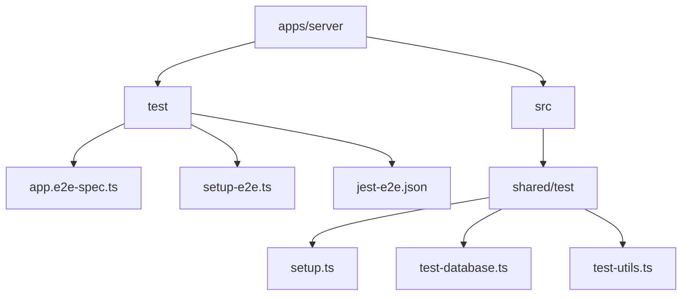
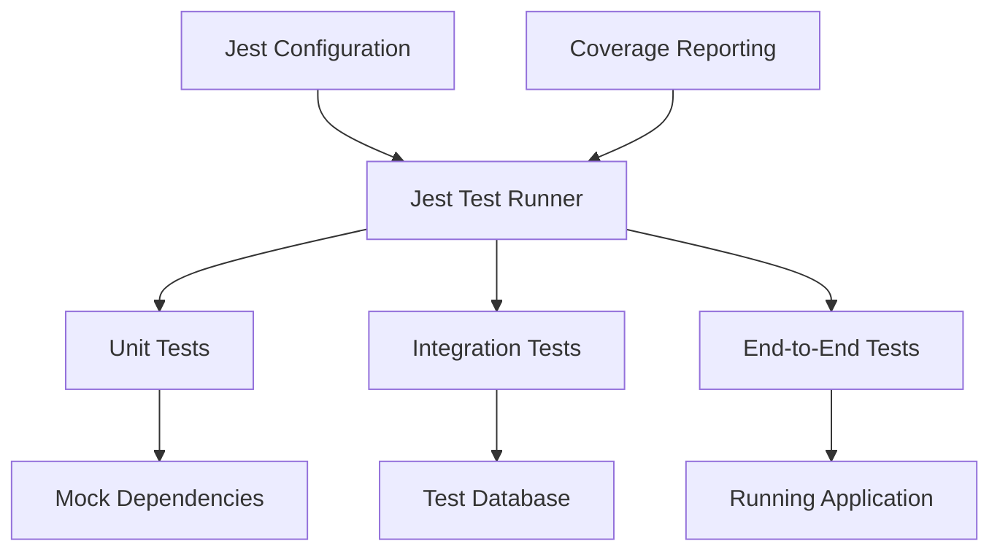
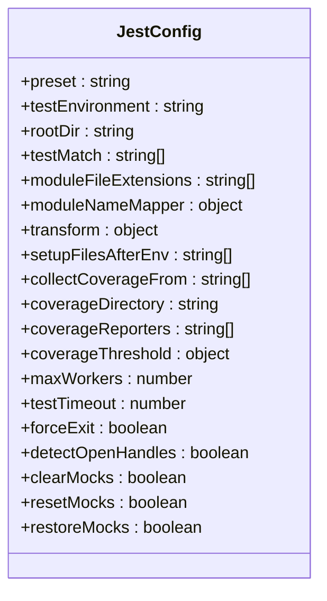
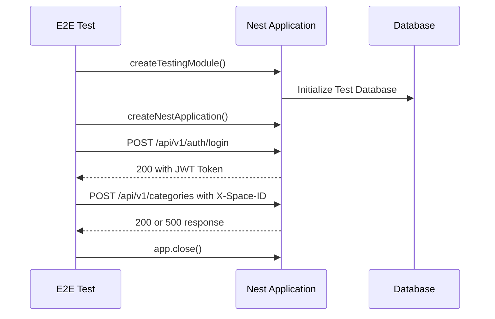
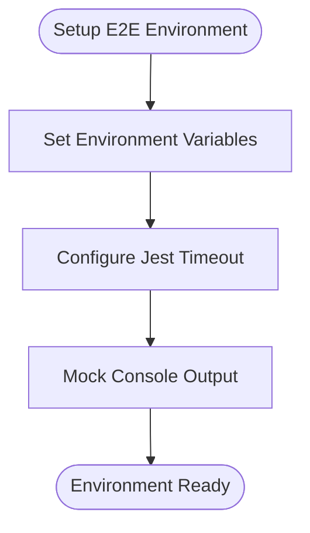
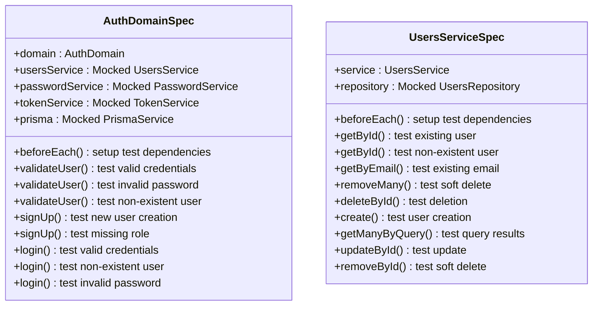
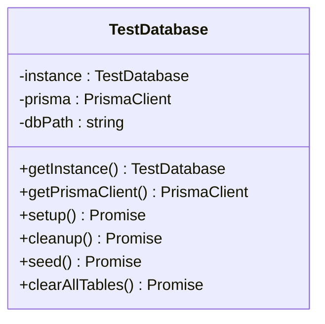
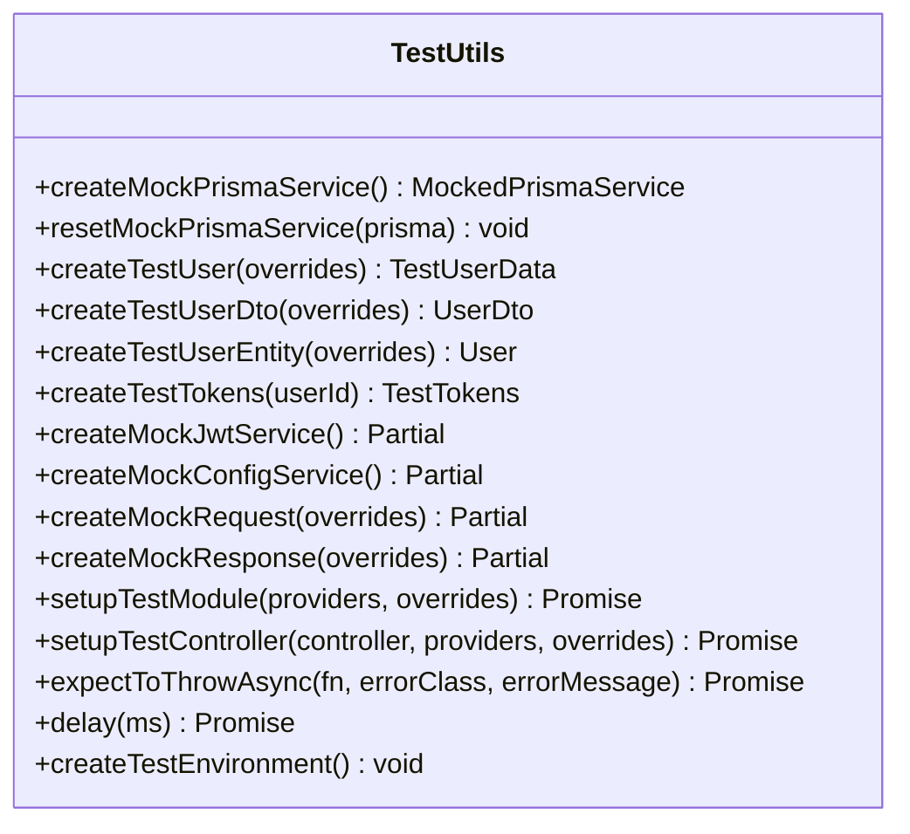
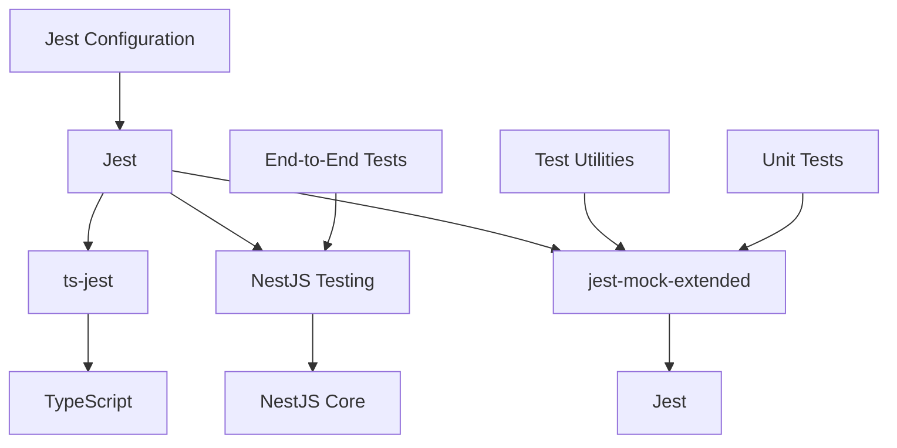

# Testing Configuration

<cite>
**Referenced Files in This Document**   
- [jest.config.js](file://apps/server/jest.config.js)
- [app.e2e-spec.ts](file://apps/server/test/app.e2e-spec.ts)
- [setup-e2e.ts](file://apps/server/test/setup-e2e.ts)
- [jest-e2e.json](file://apps/server/test/jest-e2e.json)
- [test-database.ts](file://apps/server/src/shared/test/test-database.ts)
- [test-utils.ts](file://apps/server/src/shared/test/test-utils.ts)
- [setup.ts](file://apps/server/src/shared/test/setup.ts)
- [auth.domain.spec.ts](file://apps/server/src/shared/service/domain/auth.domain.spec.ts)
- [users.service.spec.ts](file://apps/server/src/shared/service/resources/users.service.spec.ts)
- [test-runner.js](file://apps/server/test-runner.js)
</cite>

## Table of Contents
1. [Introduction](#introduction)
2. [Project Structure](#project-structure)
3. [Core Components](#core-components)
4. [Architecture Overview](#architecture-overview)
5. [Detailed Component Analysis](#detailed-component-analysis)
6. [Dependency Analysis](#dependency-analysis)
7. [Performance Considerations](#performance-considerations)
8. [Troubleshooting Guide](#troubleshooting-guide)
9. [Conclusion](#conclusion)

## Introduction
The prj-core NestJS backend implements a comprehensive testing framework using Jest as the primary test runner. The testing configuration supports three distinct testing levels: unit tests, integration tests, and end-to-end (E2E) tests. This documentation provides a detailed analysis of the testing setup, configuration files, and implementation patterns that ensure code quality and reliability across different layers of the application.

**Section sources**
- [jest.config.js](file://apps/server/jest.config.js)
- [app.e2e-spec.ts](file://apps/server/test/app.e2e-spec.ts)

## Project Structure
The testing infrastructure is organized within the server application directory with a clear separation between different test types. Unit and integration tests are colocated with their corresponding source files using the `.spec.ts` naming convention, while E2E tests are centralized in the `test` directory at the root of the server application. The shared testing utilities and database setup are located in the `src/shared/test` directory, providing reusable components across test suites.

**Diagram sources**
- [app.e2e-spec.ts](file://apps/server/test/app.e2e-spec.ts)
- [setup-e2e.ts](file://apps/server/test/setup-e2e.ts)
- [test-database.ts](file://apps/server/src/shared/test/test-database.ts)
- [test-utils.ts](file://apps/server/src/shared/test/test-utils.ts)

**Section sources**
- [app.e2e-spec.ts](file://apps/server/test/app.e2e-spec.ts)
- [setup-e2e.ts](file://apps/server/test/setup-e2e.ts)
- [test-database.ts](file://apps/server/src/shared/test/test-database.ts)

## Core Components
The testing framework consists of several core components that work together to provide a robust testing environment. The Jest configuration files define the global test settings, while the setup files initialize the test environment and mock external dependencies. The shared test utilities provide helper functions and mock objects that simplify test creation and maintenance across the codebase.

**Section sources**
- [jest.config.js](file://apps/server/jest.config.js)
- [setup.ts](file://apps/server/src/shared/test/setup.ts)
- [test-utils.ts](file://apps/server/src/shared/test/test-utils.ts)

## Architecture Overview
The testing architecture follows a layered approach with distinct configurations for different test types. Unit tests focus on isolated components with extensive mocking, integration tests verify interactions between components, and E2E tests validate the complete application flow through HTTP requests. The architecture leverages Jest's capabilities for test discovery, execution, and coverage reporting, with custom configurations tailored to the NestJS application structure.

**Diagram sources**
- [jest.config.js](file://apps/server/jest.config.js)
- [jest-e2e.json](file://apps/server/test/jest-e2e.json)
- [test-database.ts](file://apps/server/src/shared/test/test-database.ts)

## Detailed Component Analysis

### Jest Configuration Analysis
The Jest configuration in `jest.config.js` establishes the foundation for the testing environment. It uses the `ts-jest` preset to handle TypeScript compilation and specifies the test environment as "node" for server-side testing. The configuration includes important settings such as test file matching patterns, module resolution with `moduleNameMapper` for path aliases, and code coverage collection with specific thresholds for quality assurance.

**Diagram sources**
- [jest.config.js](file://apps/server/jest.config.js)

**Section sources**
- [jest.config.js](file://apps/server/jest.config.js)

### End-to-End Test Structure
The end-to-end test structure in `app.e2e-spec.ts` demonstrates how the application is tested through its HTTP interface. The test uses NestJS's TestingModule to create an application instance that can handle HTTP requests. It includes setup and teardown hooks to initialize and clean up the test environment, and organizes tests into logical groups using describe blocks. The test verifies authentication flows and API endpoints with proper headers and request payloads.

**Diagram sources**
- [app.e2e-spec.ts](file://apps/server/test/app.e2e-spec.ts)
- [setup-e2e.ts](file://apps/server/test/setup-e2e.ts)

**Section sources**
- [app.e2e-spec.ts](file://apps/server/test/app.e2e-spec.ts)

### Test Environment Setup
The test environment setup in `setup-e2e.ts` configures the global test environment for E2E tests. It sets environment variables specific to the test environment, including JWT secrets and database URLs. The file also configures Jest's global timeout and mocks console output to reduce noise during test execution while preserving error messages for debugging purposes.

**Diagram sources**
- [setup-e2e.ts](file://apps/server/test/setup-e2e.ts)

**Section sources**
- [setup-e2e.ts](file://apps/server/test/setup-e2e.ts)

### Unit Test Implementation Patterns
Unit test implementation patterns are demonstrated in files like `auth.domain.spec.ts` and `users.service.spec.ts`. These tests follow the Arrange-Act-Assert pattern and use Jest's mocking capabilities to isolate the component under test. The tests verify both successful execution paths and error handling scenarios, ensuring comprehensive coverage of business logic.

**Diagram sources**
- [auth.domain.spec.ts](file://apps/server/src/shared/service/domain/auth.domain.spec.ts)
- [users.service.spec.ts](file://apps/server/src/shared/service/resources/users.service.spec.ts)

**Section sources**
- [auth.domain.spec.ts](file://apps/server/src/shared/service/domain/auth.domain.spec.ts)
- [users.service.spec.ts](file://apps/server/src/shared/service/resources/users.service.spec.ts)

### Test Database Management
The test database management system implemented in `test-database.ts` provides a dedicated database instance for testing purposes. It uses SQLite with a file-based database that is created and destroyed for each test run, ensuring test isolation and preventing data pollution between test runs. The class handles database setup, migration application, and cleanup operations.

**Diagram sources**
- [test-database.ts](file://apps/server/src/shared/test/test-database.ts)

**Section sources**
- [test-database.ts](file://apps/server/src/shared/test/test-database.ts)

### Shared Test Utilities
The shared test utilities in `test-utils.ts` provide a collection of helper functions and mock objects that simplify test creation across the codebase. These utilities include functions for creating test data, setting up test modules with dependency injection, and common assertion patterns. The file also includes mock implementations for frequently used services like JWT and configuration services.

**Diagram sources**
- [test-utils.ts](file://apps/server/src/shared/test/test-utils.ts)

**Section sources**
- [test-utils.ts](file://apps/server/src/shared/test/test-utils.ts)

## Dependency Analysis
The testing framework has a well-defined dependency structure that ensures test isolation and reliability. The main dependencies include Jest as the test runner, ts-jest for TypeScript support, and NestJS testing utilities for application integration. The configuration files show dependencies on Prisma for database operations and various mocking libraries for dependency isolation.

**Diagram sources**
- [jest.config.js](file://apps/server/jest.config.js)
- [jest-e2e.json](file://apps/server/test/jest-e2e.json)
- [test-utils.ts](file://apps/server/src/shared/test/test-utils.ts)

**Section sources**
- [jest.config.js](file://apps/server/jest.config.js)
- [jest-e2e.json](file://apps/server/test/jest-e2e.json)

## Performance Considerations
The testing configuration includes several performance optimizations to ensure efficient test execution. The `maxWorkers: 1` setting limits parallel execution to prevent database connection conflicts, while the `testTimeout` settings provide appropriate time limits for different test types. The coverage threshold enforces minimum quality standards, and the `forceExit` option ensures clean test runner termination.

**Section sources**
- [jest.config.js](file://apps/server/jest.config.js)
- [setup-e2e.ts](file://apps/server/test/setup-e2e.ts)

## Troubleshooting Guide
Common issues in the testing setup include database connection problems, mock configuration errors, and timeout failures. The configuration addresses these through dedicated test database management, comprehensive mock utilities, and appropriate timeout settings. When tests fail, the preserved error console output helps identify the root cause, while the isolated test database prevents data-related issues between test runs.

**Section sources**
- [test-database.ts](file://apps/server/src/shared/test/test-database.ts)
- [setup.ts](file://apps/server/src/shared/test/setup.ts)
- [setup-e2e.ts](file://apps/server/test/setup-e2e.ts)

## Conclusion
The testing configuration in prj-core provides a comprehensive framework for ensuring code quality and reliability. By leveraging Jest with custom configurations for different test types, the system supports unit, integration, and end-to-end testing with proper isolation and coverage reporting. The shared utilities and database management system simplify test creation and maintenance, while the clear structure promotes consistency across the codebase. This robust testing infrastructure enables confident development and deployment of the NestJS backend application.