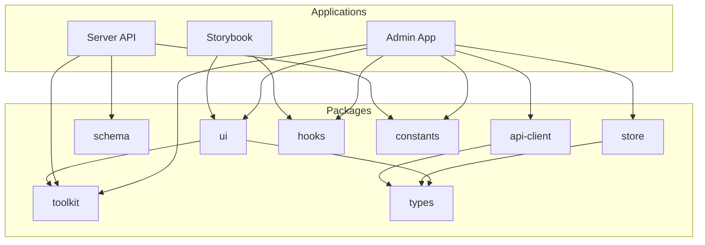
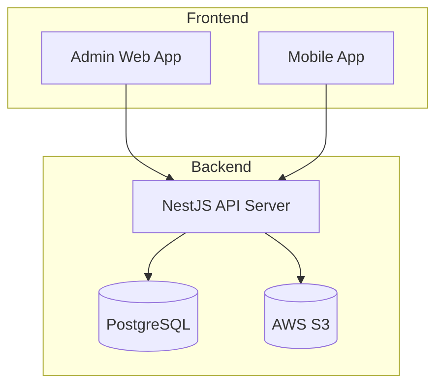
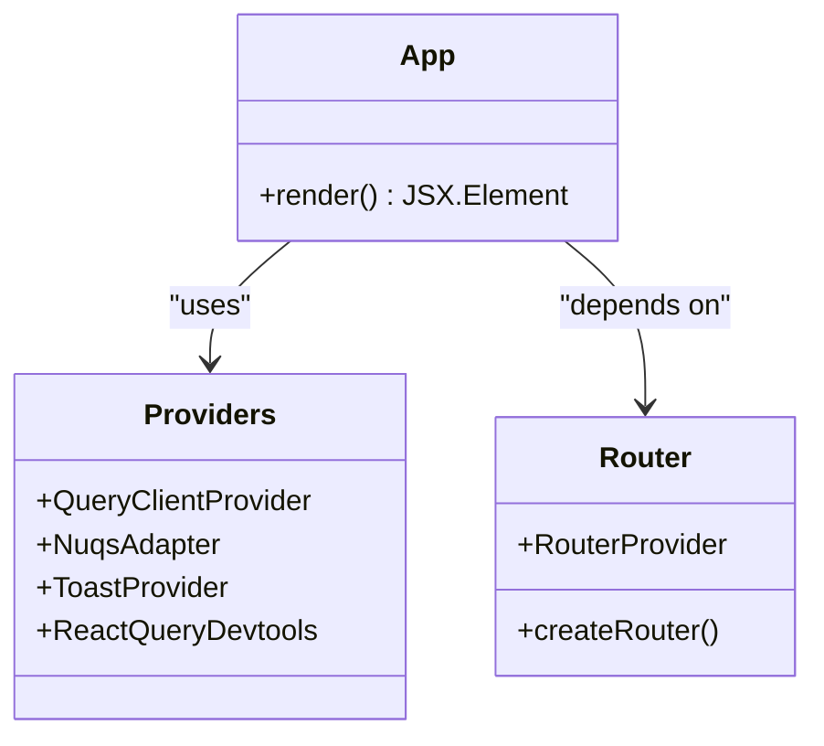
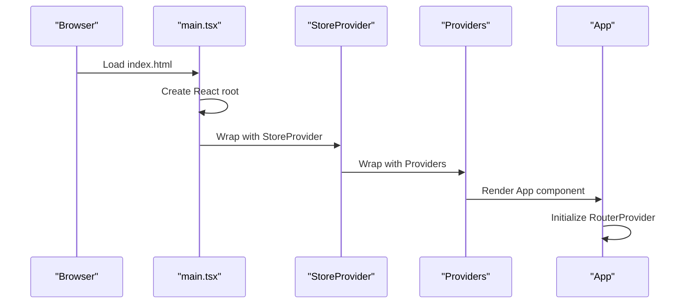
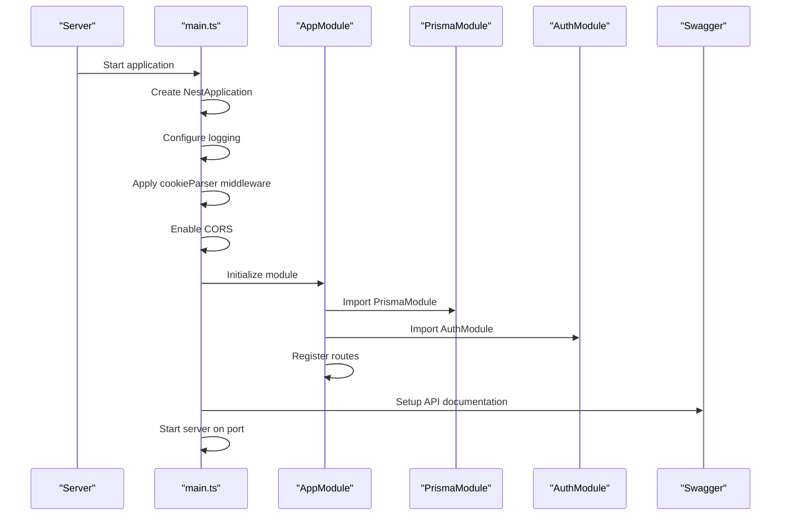
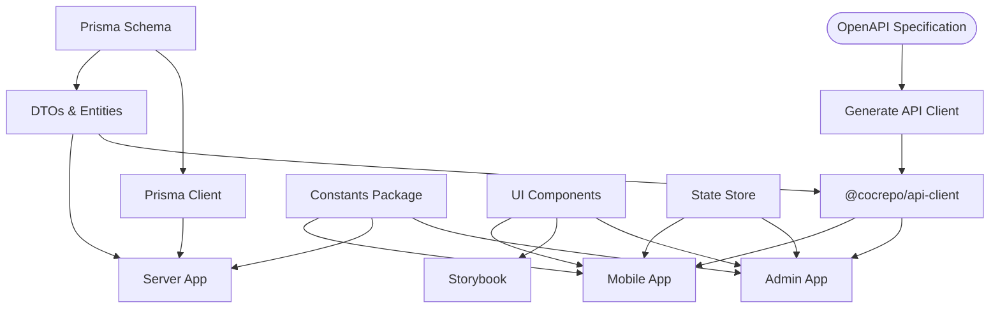

# Core Components

<cite>
**Referenced Files in This Document**   
- [main.tsx](file://apps/admin/src/main.tsx)
- [App.tsx](file://apps/admin/src/App.tsx)
- [Providers.tsx](file://apps/admin/src/providers/Providers.tsx)
- [main.ts](file://apps/server/src/main.ts)
- [app.module.ts](file://apps/server/src/module/app.module.ts)
- [package.json](file://apps/admin/package.json)
- [package.json](file://apps/server/package.json)
- [package.json](file://packages/api-client/package.json)
</cite>

## Table of Contents
1. [Introduction](#introduction)
2. [Project Structure](#project-structure)
3. [Core Components](#core-components)
4. [Architecture Overview](#architecture-overview)
5. [Detailed Component Analysis](#detailed-component-analysis)
6. [Dependency Analysis](#dependency-analysis)
7. [Performance Considerations](#performance-considerations)
8. [Troubleshooting Guide](#troubleshooting-guide)
9. [Conclusion](#conclusion)

## Introduction
This document provides a comprehensive analysis of the core components within the prj-core system, a modern full-stack reservation platform built with a monorepo architecture. The system comprises multiple applications including an admin interface built with React and Vite, a mobile application using React Native and Expo, a backend API server with NestJS, and shared frontend components. The documentation focuses on implementation details, invocation relationships, interfaces, domain models, and usage patterns for each main application. It explains how these components are bootstrapped and configured, their relationships through shared packages, and addresses common integration issues with solutions. The content is designed to be accessible to beginners while providing sufficient technical depth for experienced developers regarding component architecture and initialization.

## Project Structure
The prj-core system follows a monorepo architecture using Turborepo and pnpm workspace, enabling efficient code sharing and development workflows. The project is organized into two main directories: `apps` and `packages`. The `apps` directory contains the main applications: admin (React + Vite), server (NestJS API), mobile (React Native + Expo), and storybook (UI component documentation). The `packages` directory houses shared resources including API clients, constants, hooks, providers, schema definitions, stores, toolkits, types, and UI components. This structure promotes code reuse, type safety, and independent development of applications while maintaining a unified codebase.



**Diagram sources**
- [README.md](file://README.md#L166-L203)

**Section sources**
- [README.md](file://README.md#L117-L203)
- [package.json](file://package.json)

## Core Components
The prj-core system consists of several core components that work together to provide a comprehensive reservation platform. The admin application serves as the web interface built with React and Vite, utilizing TanStack Router for type-safe routing and MobX for state management. The server application is a NestJS-based API server that handles business logic, data persistence with Prisma ORM, and authentication/authorization. Shared packages enable code reuse across applications, including API clients generated from OpenAPI specifications, UI components, state management stores, and utility functions. These components are interconnected through well-defined interfaces and dependency management, allowing for independent development and deployment while maintaining consistency across the platform.

**Section sources**
- [README.md](file://README.md#L26-L460)
- [package.json](file://package.json)

## Architecture Overview
The prj-core system follows a modern full-stack architecture with clear separation of concerns between frontend, backend, and shared components. The backend API server built with NestJS exposes RESTful endpoints that are consumed by both the admin web application and mobile application. The architecture leverages a monorepo structure with shared packages to maximize code reuse and maintain consistency across applications. The system implements a multi-tenant architecture with role-based access control (RBAC) at both space and tenant levels, enabling support for multiple business domains such as fitness, hair salons, and massage services. Data persistence is handled by PostgreSQL with Prisma ORM providing type-safe database access, while file storage is integrated with AWS S3 for media management.



**Diagram sources**
- [README.md](file://README.md#L385-L414)

**Section sources**
- [README.md](file://README.md#L71-L115)
- [package.json](file://package.json)

## Detailed Component Analysis
The prj-core system's components are designed with modularity and reusability in mind, following modern software engineering practices. Each application is bootstrapped with specific initialization patterns, and shared packages provide common functionality across the ecosystem. The analysis below examines key components in detail, focusing on their implementation, configuration, and integration patterns.

### Admin Application Analysis
The admin application is a React-based web interface built with Vite, serving as the primary administrative interface for the reservation platform. It follows a modular structure with clear separation between routing, state management, and UI components. The application is bootstrapped through the main.tsx file, which initializes the React root and wraps the application with necessary providers for state management and data fetching.

#### For Object-Oriented Components:


**Diagram sources**
- [main.tsx](file://apps/admin/src/main.tsx)
- [App.tsx](file://apps/admin/src/App.tsx)
- [Providers.tsx](file://apps/admin/src/providers/Providers.tsx)

#### For API/Service Components:


**Diagram sources**
- [main.tsx](file://apps/admin/src/main.tsx)
- [App.tsx](file://apps/admin/src/App.tsx)
- [Providers.tsx](file://apps/admin/src/providers/Providers.tsx)

**Section sources**
- [main.tsx](file://apps/admin/src/main.tsx)
- [App.tsx](file://apps/admin/src/App.tsx)
- [Providers.tsx](file://apps/admin/src/providers/Providers.tsx)
- [package.json](file://apps/admin/package.json)

### Server Application Analysis
The server application is a NestJS-based API server that serves as the backend for the prj-core system. It follows NestJS's modular architecture pattern, with feature modules organized by domain functionality. The application is bootstrapped through the main.ts file, which creates the NestJS application instance, configures middleware, sets up CORS, applies global guards and interceptors, and initializes Swagger documentation. The app.module.ts file defines the application's module structure, importing all feature modules and configuring the routing hierarchy.

#### For Object-Oriented Components:
```mermaid
classDiagram
class AppModule {
+imports : Module[]
+providers : Provider[]
+configure(consumer : MiddlewareConsumer)
+onModuleInit()
}
class Main {
+bootstrap()
+create NestApplication
+configure middleware
+enable CORS
+set global guards
+setup Swagger
+start server
}
class PrismaModule {
+PrismaService
+PrismaClient
}
class AuthModule {
+AuthService
+AuthController
+JwtStrategy
}
Main --> AppModule : "bootstraps"
AppModule --> PrismaModule : "imports"
AppModule --> AuthModule : "imports"
AppModule --> "Other Feature Modules" : "imports"
```

**Diagram sources**
- [main.ts](file://apps/server/src/main.ts)
- [app.module.ts](file://apps/server/src/module/app.module.ts)

#### For API/Service Components:


**Diagram sources**
- [main.ts](file://apps/server/src/main.ts)
- [app.module.ts](file://apps/server/src/module/app.module.ts)

**Section sources**
- [main.ts](file://apps/server/src/main.ts)
- [app.module.ts](file://apps/server/src/module/app.module.ts)
- [package.json](file://apps/server/package.json)

### Shared Packages Analysis
The shared packages in the prj-core system enable code reuse across applications, promoting consistency and reducing duplication. The shared-api-client package contains automatically generated API clients and types from OpenAPI specifications, allowing both frontend applications to interact with the backend API in a type-safe manner. The shared-schema package contains Prisma schema definitions, DTOs, entities, and enums used by both the backend and API client generation process. Other shared packages include UI components, state management stores, utility functions, and configuration constants.

#### For Complex Logic Components:


**Diagram sources**
- [package.json](file://packages/api-client/package.json)
- [README.md](file://README.md#L137-L155)

**Section sources**
- [package.json](file://packages/api-client/package.json)
- [README.md](file://README.md#L137-L155)

## Dependency Analysis
The prj-core system has a well-defined dependency structure that enables code reuse while maintaining separation of concerns. The dependency graph shows how applications depend on shared packages, and how shared packages may depend on each other. The admin application depends on several shared packages including the API client, UI components, state store, toolkit utilities, hooks, and constants. The server application depends on the schema package for data models, toolkit utilities, and constants. Shared packages themselves have dependencies, with UI components depending on the toolkit and types packages, and the API client depending on the types package.


**Diagram sources**
- [README.md](file://README.md#L166-L203)

**Section sources**
- [package.json](file://package.json)
- [README.md](file://README.md#L166-L203)

## Performance Considerations
The prj-core system incorporates several performance optimizations at both the application and infrastructure levels. The use of Turborepo enables incremental builds and caching, significantly reducing build times for the monorepo. The admin application leverages Vite's fast development server and optimized production builds with code splitting. The server application uses NestJS's efficient module system and dependency injection, along with Prisma's optimized database queries. The architecture supports horizontal scaling of the API server and database, while AWS S3 provides scalable storage for media files. Caching strategies are implemented through React Query on the frontend and can be extended with Redis or similar solutions on the backend for improved response times.

**Section sources**
- [README.md](file://README.md#L71-L115)
- [package.json](file://package.json)

## Troubleshooting Guide
Common issues in the prj-core system typically relate to environment configuration, dependency management, and integration between components. When encountering issues, first verify that environment variables are properly configured, especially database connection strings and AWS credentials. Ensure that all dependencies are installed by running `pnpm install` at the root level. For API client issues, regenerate the client using `pnpm generate` in the api-client package. Database-related issues can often be resolved by running Prisma migrations with `pnpm prisma migrate dev`. When facing type errors between shared packages and applications, ensure version compatibility and consider rebuilding the affected packages. Development server issues can often be resolved by cleaning the build cache with `pnpm clean` and restarting the development servers.

**Section sources**
- [README.md](file://README.md#L205-L384)
- [package.json](file://package.json)

## Conclusion
The prj-core system demonstrates a well-architected monorepo approach to building a modern full-stack reservation platform. By leveraging Turborepo, pnpm workspace, and a clear separation between applications and shared packages, the system achieves high code reuse, type safety, and development efficiency. The admin interface built with React and Vite provides a responsive web experience, while the mobile application extends accessibility to mobile users. The NestJS backend offers a robust API with comprehensive features for reservation management, user authentication, and multi-tenancy support. Shared packages enable consistent implementation across applications while allowing for independent development and deployment. This architecture provides a solid foundation for scaling the platform to support additional business domains and features in the future.