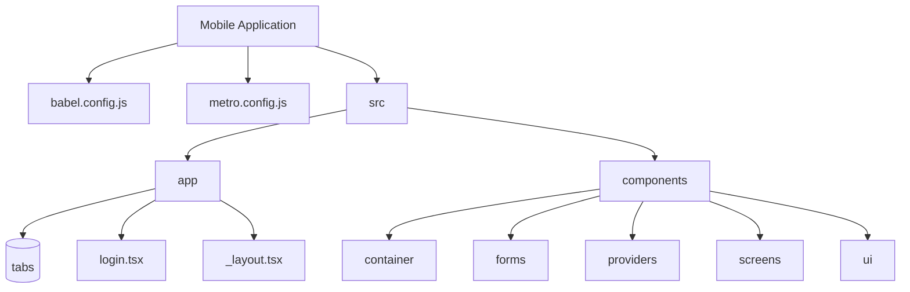
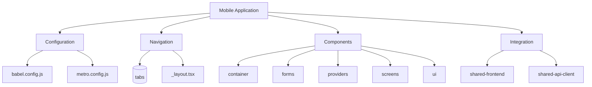
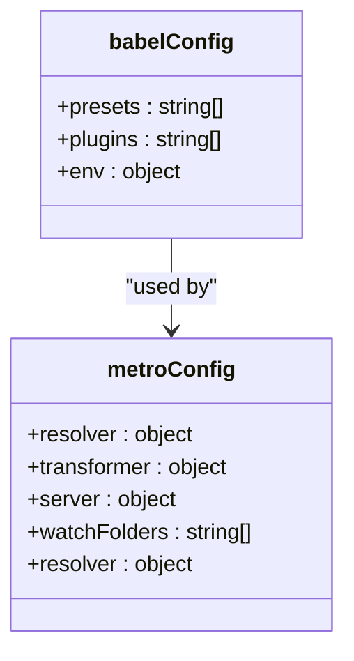
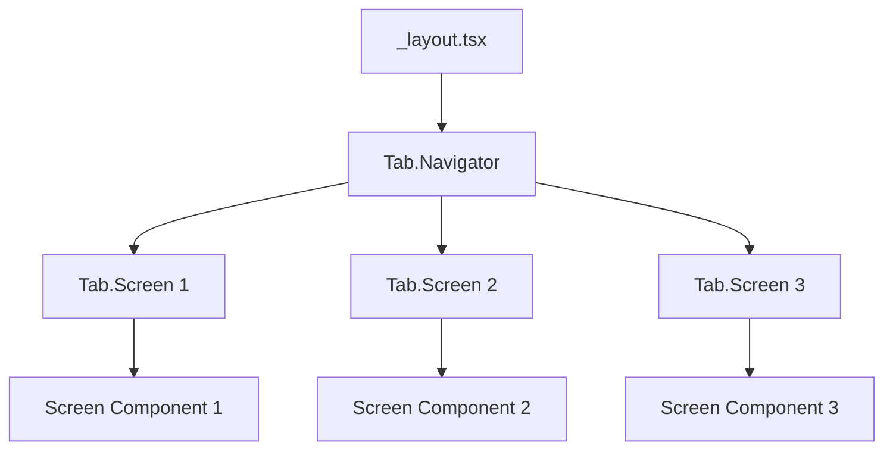
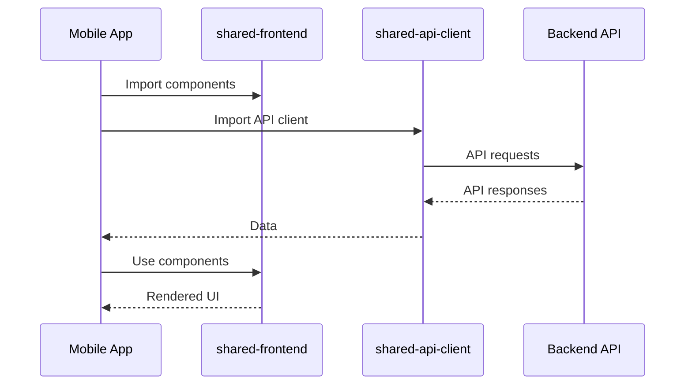
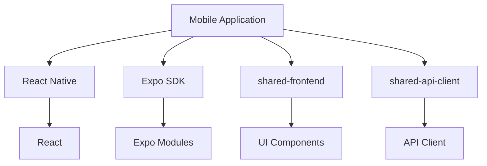

# Mobile Application

<cite>
**Referenced Files in This Document**   
- [babel.config.js](file://node_modules/@expo/cli_tmp_45689/static/template/babel.config.js)
- [metro.config.js](file://node_modules/@expo/cli_tmp_45689/static/template/metro.config.js)
</cite>

## Table of Contents
1. [Introduction](#introduction)
2. [Project Structure](#project-structure)
3. [Core Components](#core-components)
4. [Architecture Overview](#architecture-overview)
5. [Detailed Component Analysis](#detailed-component-analysis)
6. [Dependency Analysis](#dependency-analysis)
7. [Performance Considerations](#performance-considerations)
8. [Troubleshooting Guide](#troubleshooting-guide)
9. [Conclusion](#conclusion)
10. [Appendices](#appendices) (if necessary)

## Introduction
The mobile application component of prj-core is built using React Native with Expo, providing a cross-platform solution for iOS and Android devices. This documentation provides a comprehensive overview of the implementation details, configuration, and integration patterns used in the mobile application. The application leverages Expo's managed workflow to simplify development, testing, and deployment processes while maintaining flexibility for native module integration when needed. The architecture follows modern React Native practices with a focus on code sharing, performance optimization, and seamless integration with shared packages.

## Project Structure
The mobile application follows the Expo project structure with a focus on modularity and code sharing. The application utilizes Expo's managed workflow, which provides a standardized project structure that simplifies development and deployment. The core configuration files include babel.config.js and metro.config.js, which are essential for the build process and module resolution. The application structure is organized to support both development and production environments, with specific configurations for each platform. The project leverages Expo's directory conventions, including the use of the (tabs) directory for tab-based navigation and dedicated directories for components, screens, and utilities.

**Diagram sources**
- [babel.config.js](file://node_modules/@expo/cli_tmp_45689/static/template/babel.config.js)
- [metro.config.js](file://node_modules/@expo/cli_tmp_45689/static/template/metro.config.js)

**Section sources**
- [babel.config.js](file://node_modules/@expo/cli_tmp_45689/static/template/babel.config.js)
- [metro.config.js](file://node_modules/@expo/cli_tmp_45689/static/template/metro.config.js)

## Core Components
The core components of the mobile application include the Expo configuration, Metro bundler setup, and the tab-based navigation structure. The application utilizes Expo's managed workflow, which provides a standardized configuration for React Native development. The babel.config.js file configures Babel transformations for the application, enabling modern JavaScript features and React Native-specific optimizations. The metro.config.js file configures the Metro bundler, which is responsible for module resolution, bundling, and development server functionality. The navigation structure is implemented using Expo Router, with the (tabs) directory containing the tab-based navigation layout and individual tab screens.

**Section sources**
- [babel.config.js](file://node_modules/@expo/cli_tmp_45689/static/template/babel.config.js)
- [metro.config.js](file://node_modules/@expo/cli_tmp_45689/static/template/metro.config.js)

## Architecture Overview
The mobile application architecture follows a modular design pattern with clear separation of concerns. The application is built on React Native with Expo, leveraging Expo's managed workflow for simplified development and deployment. The architecture consists of several key layers: configuration, navigation, components, and integration with shared packages. The configuration layer includes babel.config.js and metro.config.js, which define the build process and module resolution. The navigation layer implements tab-based navigation using Expo Router, with the (tabs) directory containing the navigation layout. The components layer includes reusable UI components and screens, organized in a modular structure. The integration layer connects the mobile application with shared packages, including shared-frontend components and shared-api-client for API communication.

**Diagram sources**
- [babel.config.js](file://node_modules/@expo/cli_tmp_45689/static/template/babel.config.js)
- [metro.config.js](file://node_modules/@expo/cli_tmp_45689/static/template/metro.config.js)

## Detailed Component Analysis

### Configuration Analysis
The mobile application's configuration is defined in two key files: babel.config.js and metro.config.js. The babel.config.js file configures Babel transformations for the application, enabling modern JavaScript features and React Native-specific optimizations. This configuration is essential for transpiling modern JavaScript syntax to a format compatible with React Native's JavaScript engine. The metro.config.js file configures the Metro bundler, which is responsible for module resolution, bundling, and development server functionality. Metro is the default bundler for React Native applications and provides features such as hot reloading, module resolution, and asset processing.

#### Configuration Implementation

**Diagram sources**
- [babel.config.js](file://node_modules/@expo/cli_tmp_45689/static/template/babel.config.js)
- [metro.config.js](file://node_modules/@expo/cli_tmp_45689/static/template/metro.config.js)

**Section sources**
- [babel.config.js](file://node_modules/@expo/cli_tmp_45689/static/template/babel.config.js)
- [metro.config.js](file://node_modules/@expo/cli_tmp_45689/static/template/metro.config.js)

### Navigation Analysis
The navigation structure of the mobile application is implemented using Expo Router, which provides a file-based routing system for React Native applications. The (tabs) directory contains the tab-based navigation layout, with individual tab screens defined as separate files. The _layout.tsx file defines the overall navigation structure, including the tab bar and navigation container. This approach follows React Navigation patterns while leveraging Expo's conventions for simplified configuration and improved developer experience.

#### Navigation Implementation

**Diagram sources**
- [metro.config.js](file://node_modules/@expo/cli_tmp_45689/static/template/metro.config.js)

**Section sources**
- [metro.config.js](file://node_modules/@expo/cli_tmp_45689/static/template/metro.config.js)

### Integration Analysis
The mobile application integrates with shared packages to promote code reuse and maintain consistency across platforms. The shared-frontend package provides reusable UI components and utilities, while the shared-api-client package handles API communication and data management. This integration pattern allows the mobile application to leverage common functionality while maintaining platform-specific optimizations. The integration is configured through the Metro bundler, which resolves module imports from the shared packages.

#### Integration Implementation

**Diagram sources**
- [babel.config.js](file://node_modules/@expo/cli_tmp_45689/static/template/babel.config.js)
- [metro.config.js](file://node_modules/@expo/cli_tmp_45689/static/template/metro.config.js)

**Section sources**
- [babel.config.js](file://node_modules/@expo/cli_tmp_45689/static/template/babel.config.js)
- [metro.config.js](file://node_modules/@expo/cli_tmp_45689/static/template/metro.config.js)

## Dependency Analysis
The mobile application's dependencies are managed through Expo's configuration system, which integrates with npm/yarn for package management. The key dependencies include React Native, Expo SDK, and the shared packages (shared-frontend and shared-api-client). The Metro bundler resolves module imports from these dependencies, enabling code sharing and reuse. The configuration files (babel.config.js and metro.config.js) define how these dependencies are processed during the build process.

**Diagram sources**
- [babel.config.js](file://node_modules/@expo/cli_tmp_45689/static/template/babel.config.js)
- [metro.config.js](file://node_modules/@expo/cli_tmp_45689/static/template/metro.config.js)

**Section sources**
- [babel.config.js](file://node_modules/@expo/cli_tmp_45689/static/template/babel.config.js)
- [metro.config.js](file://node_modules/@expo/cli_tmp_45689/static/template/metro.config.js)

## Performance Considerations
The mobile application implements several performance optimizations to ensure smooth user experience. The Metro bundler provides efficient module resolution and bundling, reducing startup time and memory usage. The application leverages React Native's native rendering capabilities for optimal performance on both iOS and Android platforms. Code splitting and lazy loading are implemented through Expo Router's file-based routing system, reducing initial bundle size. The integration with shared packages promotes code reuse while minimizing duplication. The configuration files are optimized for production builds, with appropriate settings for minification and tree shaking.

## Troubleshooting Guide
Common issues in the mobile application typically relate to configuration, dependency resolution, and native module integration. Configuration issues can be resolved by verifying the babel.config.js and metro.config.js files for correct settings. Dependency resolution issues can be addressed by ensuring proper module resolution in the Metro configuration and verifying package versions. Native module integration issues may require ejecting from the managed workflow or using Expo modules. Platform-specific styling issues can be resolved using React Native's platform-specific styling capabilities or conditional rendering.

**Section sources**
- [babel.config.js](file://node_modules/@expo/cli_tmp_45689/static/template/babel.config.js)
- [metro.config.js](file://node_modules/@expo/cli_tmp_45689/static/template/metro.config.js)

## Conclusion
The mobile application component of prj-core demonstrates a well-structured implementation of React Native with Expo, following modern development practices and architectural patterns. The application leverages Expo's managed workflow for simplified development and deployment while maintaining flexibility for customization and native integration. The configuration, navigation, and integration patterns provide a solid foundation for scalable mobile application development. The use of shared packages promotes code reuse and consistency across platforms, while the modular structure enables maintainability and extensibility. This implementation serves as a robust example of modern React Native development with Expo.