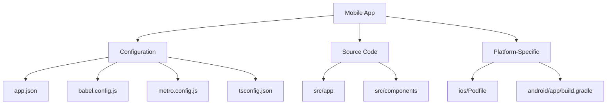
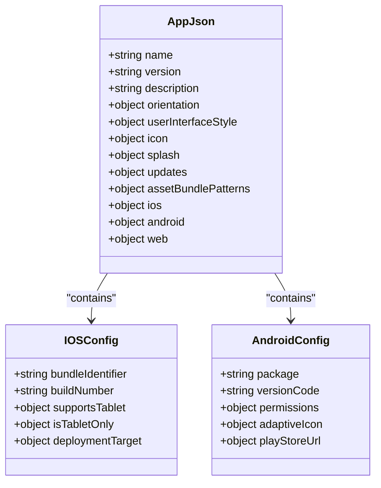
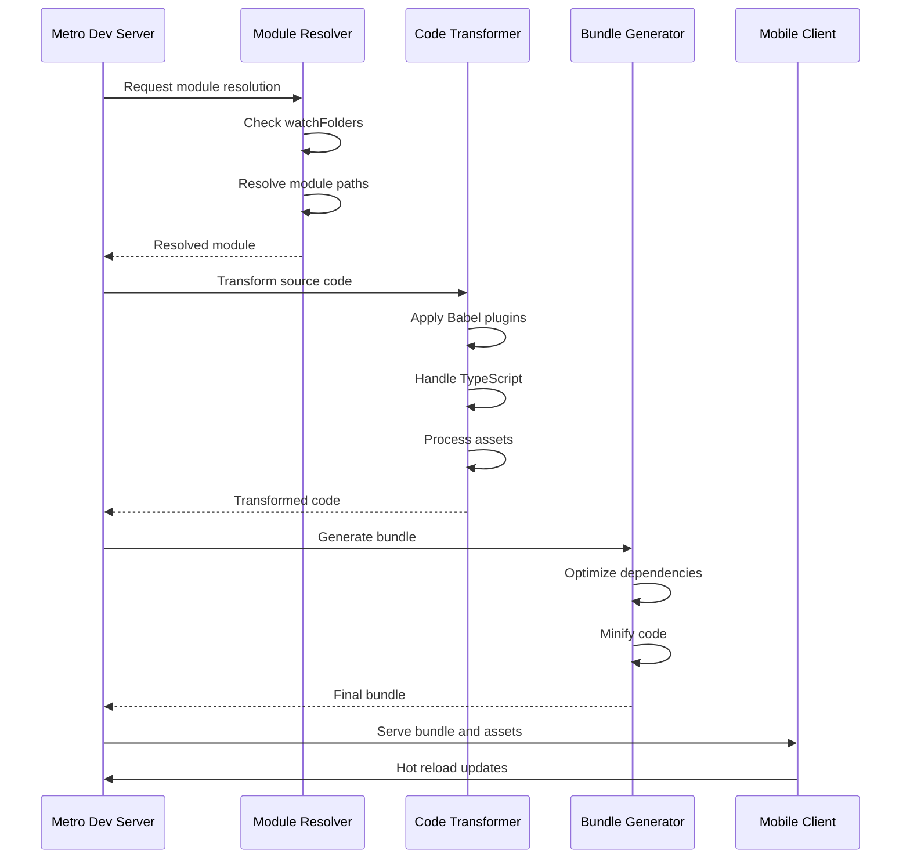
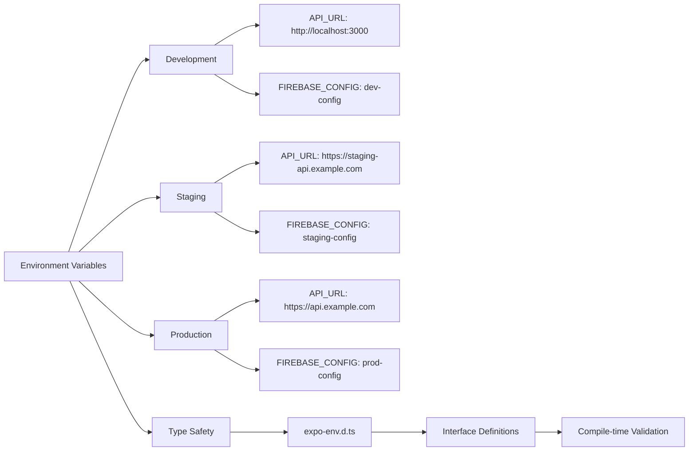
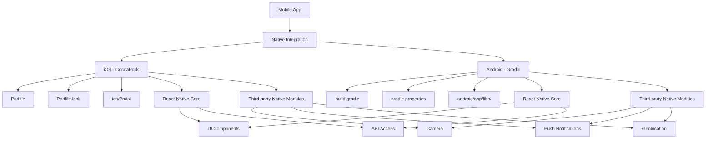
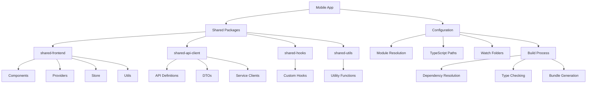
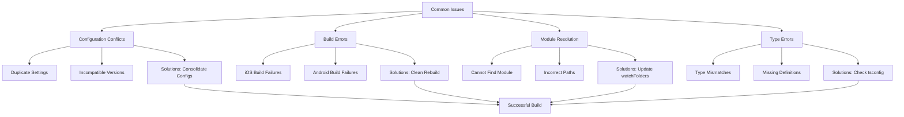

# Mobile Configuration

<cite>
**Referenced Files in This Document**   
- [package.json](file://apps/mobile/package.json)
- [app.json](file://apps/mobile/app.json)
- [babel.config.js](file://apps/mobile/babel.config.js)
- [metro.config.js](file://apps/mobile/metro.config.js)
- [expo-env.d.ts](file://apps/mobile/expo-env.d.ts)
- [tsconfig.json](file://apps/mobile/tsconfig.json)
- [Podfile](file://apps/mobile/ios/Podfile)
- [build.gradle](file://apps/mobile/android/app/build.gradle)
</cite>

## Table of Contents
1. [Introduction](#introduction)
2. [Project Structure](#project-structure)
3. [Expo Configuration](#expo-configuration)
4. [Babel Configuration](#babel-configuration)
5. [Metro Bundler Configuration](#metro-bundler-configuration)
6. [Environment Management](#environment-management)
7. [Native Module Integration](#native-module-integration)
8. [Shared Package Consumption](#shared-package-consumption)
9. [Common Issues and Solutions](#common-issues-and-solutions)
10. [Conclusion](#conclusion)

## Introduction
The mobile application in the prj-core repository is built using Expo, a framework and platform for universal React applications. This document provides comprehensive documentation on the mobile application's configuration, covering Expo settings, Babel transpilation, Metro bundling, environment management, and integration with native modules. The configuration enables the mobile app to consume shared components from the shared-frontend package while maintaining platform-specific capabilities through native module integration.

## Project Structure
The mobile application follows a standard Expo project structure with platform-specific directories for iOS and Android configurations. The core configuration files are located at the root of the mobile app directory, while shared components and business logic are organized in the src directory.



**Diagram sources**
- [app.json](file://apps/mobile/app.json)
- [babel.config.js](file://apps/mobile/babel.config.js)
- [metro.config.js](file://apps/mobile/metro.config.js)

**Section sources**
- [app.json](file://apps/mobile/app.json)
- [babel.config.js](file://apps/mobile/babel.config.js)
- [metro.config.js](file://apps/mobile/metro.config.js)

## Expo Configuration
The Expo configuration in app.json defines essential metadata, permissions, and platform-specific settings for the mobile application. The configuration includes the application name, version, icon, splash screen, and various platform-specific settings that control the app's behavior on iOS and Android.

The app.json configuration extends Expo's default settings with custom properties that enable specific capabilities and define the app's appearance and behavior. Key configuration sections include the application metadata (name, version, description), asset references (icon, splash screen), and platform-specific configurations that control native functionality.



**Diagram sources**
- [app.json](file://apps/mobile/app.json)

**Section sources**
- [app.json](file://apps/mobile/app.json)

## Babel Configuration
The Babel configuration file (babel.config.js) is responsible for transpiling modern JavaScript and TypeScript code into versions compatible with the target mobile platforms. The configuration extends Expo's default Babel preset while allowing for custom transformations and plugin additions.

The Babel configuration in prj-core's mobile app is optimized for performance and compatibility, leveraging the @expo/webpack-config preset which includes essential plugins for React Native development. The configuration supports TypeScript compilation, JSX transformation, and various language features while maintaining compatibility with the Expo runtime.

```mermaid
flowchart TD
A[Source Code] --> B[Babel Configuration]
B --> C[Expo Preset]
B --> D[Custom Plugins]
B --> E[TypeScript Support]
C --> C1[@babel/preset-env]
C --> C2[@babel/preset-react]
C --> C3[@babel/preset-typescript]
D --> D1[babel-plugin-module-resolver]
D --> D2[babel-plugin-transform-typescript-metadata]
D --> D3[@babel/plugin-proposal-decorators]
E --> E1[TS Compiler Options]
E --> E2[Type Checking]
B --> F[Transpiled Code]
```

**Diagram sources**
- [babel.config.js](file://apps/mobile/babel.config.js)

**Section sources**
- [babel.config.js](file://apps/mobile/babel.config.js)

## Metro Bundler Configuration
The Metro bundler configuration (metro.config.js) customizes the development server and bundling process for the mobile application. Metro is React Native's default bundler, responsible for transforming, bundling, and serving JavaScript code during development and for production builds.

The configuration in prj-core's mobile app extends the default Metro configuration with custom settings that optimize the development experience and ensure proper resolution of modules, particularly when consuming shared packages. Key configuration aspects include resolver settings, transformer options, and watch folder configurations that enable efficient development workflows.



**Diagram sources**
- [metro.config.js](file://apps/mobile/metro.config.js)

**Section sources**
- [metro.config.js](file://apps/mobile/metro.config.js)

## Environment Management
Environment variable management in the mobile application is handled through a combination of Expo's built-in environment system and TypeScript type definitions. The expo-env.d.ts file provides type safety for environment variables, ensuring that developers can safely access configuration values with proper type checking.

The environment configuration supports different deployment scenarios (development, staging, production) by allowing different values to be injected at build time. This approach enables the application to connect to appropriate backend services, use correct API endpoints, and configure feature flags based on the deployment environment.



**Diagram sources**
- [expo-env.d.ts](file://apps/mobile/expo-env.d.ts)

**Section sources**
- [expo-env.d.ts](file://apps/mobile/expo-env.d.ts)

## Native Module Integration
Native module integration is achieved through platform-specific package managers: CocoaPods for iOS and Gradle for Android. The configuration enables the mobile app to leverage native capabilities and third-party libraries that require native code.

For iOS, the Podfile in the ios directory manages dependencies through CocoaPods, specifying the platform version, workspace settings, and individual pod dependencies. The configuration includes essential React Native pods as well as any additional native modules required by the application.

For Android, the build.gradle file in the android/app directory manages dependencies through Gradle, specifying the compile SDK version, build tools version, and dependency configurations. The Android configuration ensures proper integration of native modules and compatibility with the Android runtime.



**Diagram sources**
- [Podfile](file://apps/mobile/ios/Podfile)
- [build.gradle](file://apps/mobile/android/app/build.gradle)

**Section sources**
- [Podfile](file://apps/mobile/ios/Podfile)
- [build.gradle](file://apps/mobile/android/app/build.gradle)

## Shared Package Consumption
The mobile application consumes shared components and utilities from the shared-frontend package, enabling code reuse across different applications in the prj-core monorepo. The configuration supports this consumption through proper module resolution settings in the Metro bundler and appropriate TypeScript configuration.

The shared-frontend package provides UI components, providers, and utilities that are used throughout the mobile application, ensuring consistency in design and behavior. The configuration ensures that these shared components are properly resolved and bundled with the mobile app, while maintaining type safety through TypeScript.



**Diagram sources**
- [metro.config.js](file://apps/mobile/metro.config.js)
- [tsconfig.json](file://apps/mobile/tsconfig.json)

**Section sources**
- [metro.config.js](file://apps/mobile/metro.config.js)
- [tsconfig.json](file://apps/mobile/tsconfig.json)

## Common Issues and Solutions
Several common issues may arise when configuring and building the mobile application. These include configuration conflicts, platform-specific build errors, and module resolution problems when consuming shared packages.

Configuration conflicts often occur when multiple configuration files define overlapping settings. The recommended solution is to ensure that configuration files are properly structured and that settings are not duplicated across files. For platform-specific build errors, verifying that the correct SDK versions are installed and that native dependencies are properly linked is essential.

Module resolution issues when consuming shared packages can be resolved by ensuring that the Metro bundler's watchFolders configuration includes the paths to shared packages and that TypeScript paths are correctly configured. Additionally, clearing the Metro cache and rebuilding the application can resolve many configuration-related issues.



**Diagram sources**
- [metro.config.js](file://apps/mobile/metro.config.js)
- [babel.config.js](file://apps/mobile/babel.config.js)
- [tsconfig.json](file://apps/mobile/tsconfig.json)

**Section sources**
- [metro.config.js](file://apps/mobile/metro.config.js)
- [babel.config.js](file://apps/mobile/babel.config.js)
- [tsconfig.json](file://apps/mobile/tsconfig.json)

## Conclusion
The mobile application configuration in prj-core demonstrates a well-structured approach to building a React Native application with Expo. The configuration balances the convenience of Expo's managed workflow with the flexibility needed to integrate native modules and consume shared packages. By properly configuring Expo, Babel, Metro, and platform-specific settings, the mobile app maintains a robust development environment while enabling code reuse and consistent behavior across platforms. The documented solutions to common issues provide valuable guidance for maintaining and troubleshooting the mobile application configuration.