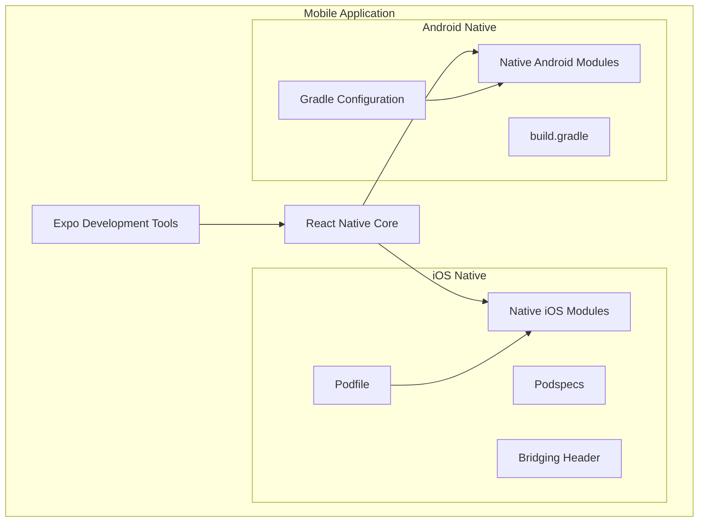
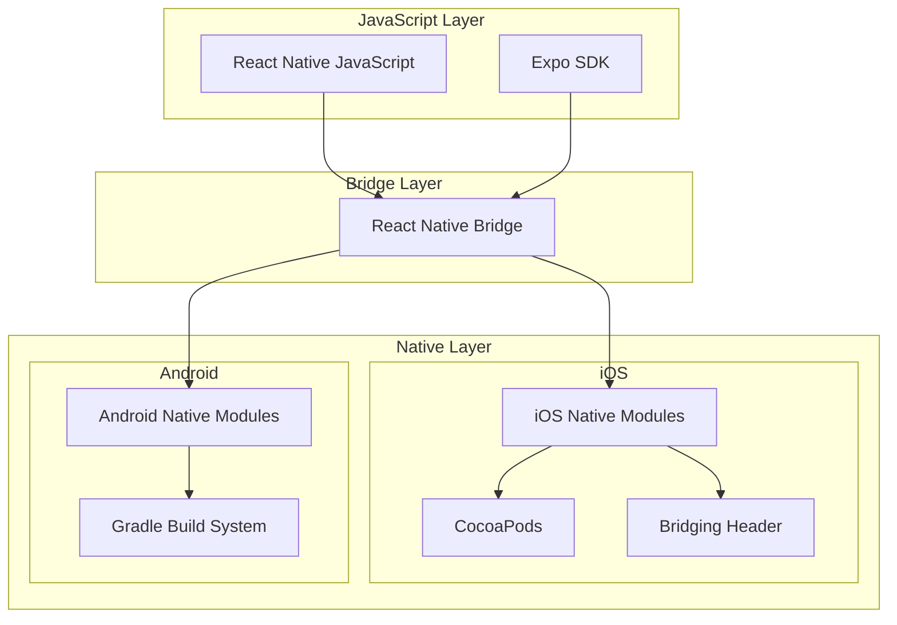
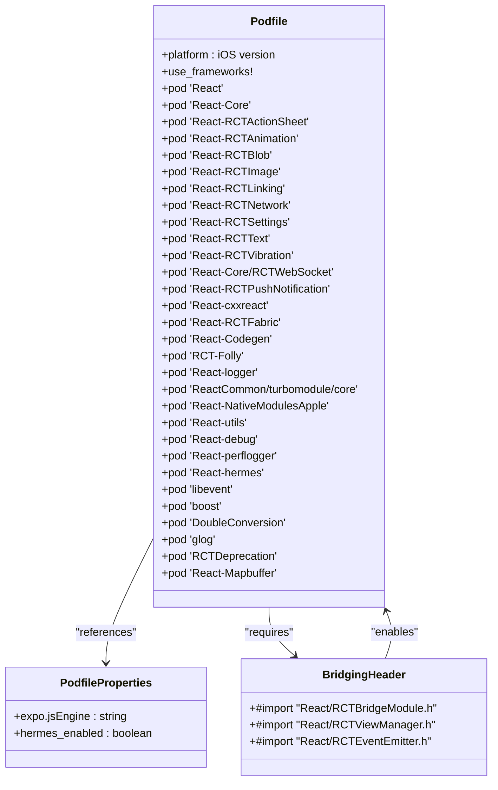
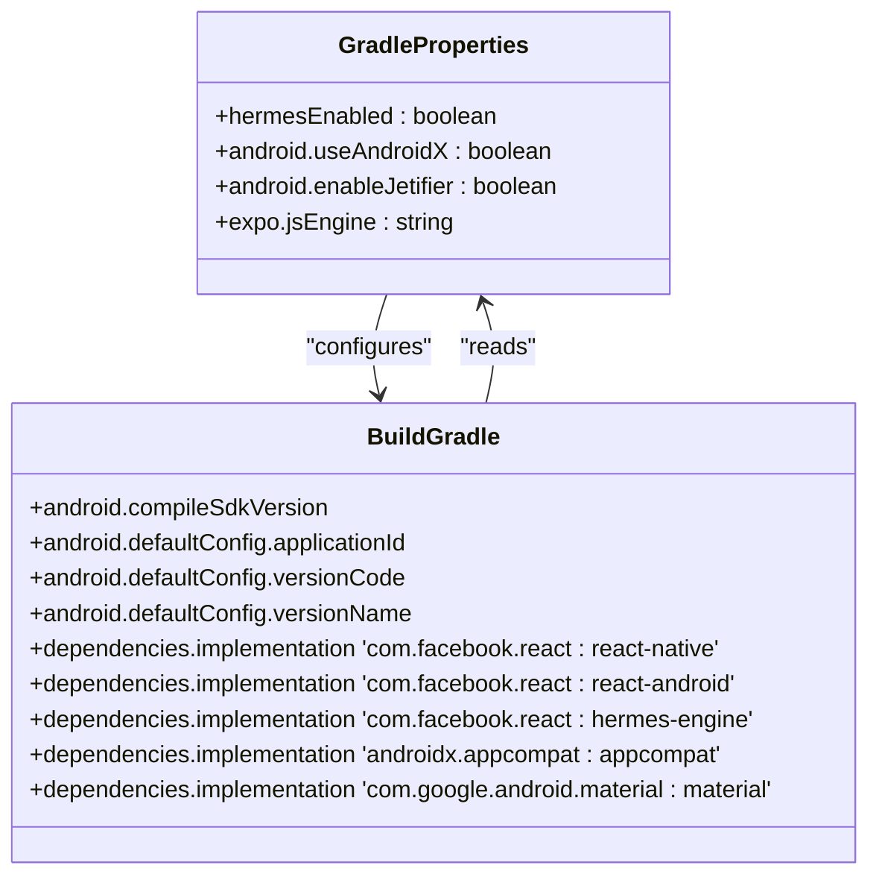
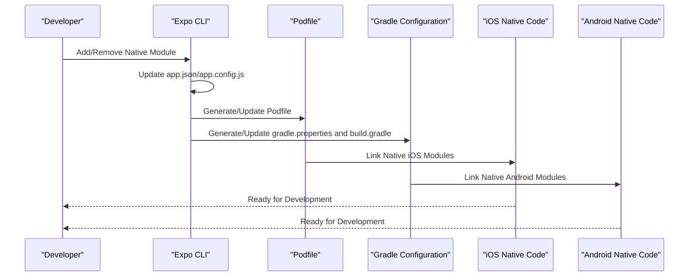
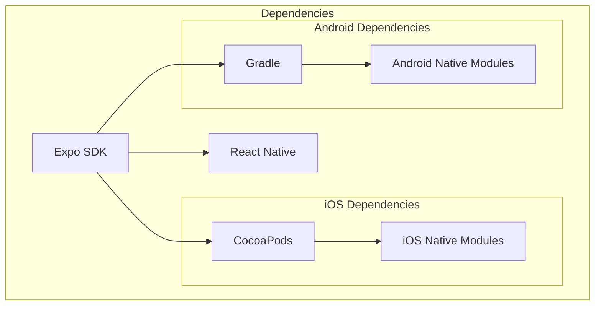

# Native Integration

<cite>
**Referenced Files in This Document**   
- [package.json](file://apps/mobile/package.json)
- [Podfile](file://apps/mobile/ios/Podfile)
- [Podfile.properties.json](file://apps/mobile/ios/Podfile.properties.json)
- [gradle.properties](file://apps/mobile/android/gradle.properties)
- [build.gradle](file://apps/mobile/android/app/build.gradle)
- [mobile-Bridging-Header.h](file://apps/mobile/ios/mobile/mobile-Bridging-Header.h)
- [metro.config.js](file://node_modules/@expo/cli_tmp_45689/static/template/metro.config.js)
- [babel.config.js](file://node_modules/@expo/cli_tmp_45689/static/template/babel.config.js)
</cite>

## Table of Contents
1. [Introduction](#introduction)
2. [Project Structure](#project-structure)
3. [Core Components](#core-components)
4. [Architecture Overview](#architecture-overview)
5. [Detailed Component Analysis](#detailed-component-analysis)
6. [Dependency Analysis](#dependency-analysis)
7. [Performance Considerations](#performance-considerations)
8. [Troubleshooting Guide](#troubleshooting-guide)
9. [Conclusion](#conclusion)

## Introduction
This document provides a comprehensive analysis of the native integration aspects of the React Native mobile application in prj-core. It details how the application integrates with native iOS and Android modules through CocoaPods and Gradle, explaining the configuration of native dependencies and the role of key integration components. The document covers the Expo development workflow, shared package integration, and addresses common issues with native module linking and platform-specific compilation.

## Project Structure
The mobile application in prj-core follows a React Native architecture with Expo integration, enabling both managed and bare workflow capabilities. The project structure reveals dedicated directories for platform-specific native code: `ios` for iOS and `android` for Android. These directories contain the necessary configuration files and native code that bridge the React Native JavaScript layer with native platform capabilities.

The presence of `Podfile` and `Podfile.properties.json` in the `ios` directory indicates the use of CocoaPods for managing iOS native dependencies, while the `android` directory contains Gradle configuration files (`gradle.properties` and `build.gradle`) for Android native dependency management. The `.expo` directory suggests the use of Expo's development tools and services.

**Diagram sources**
- [Podfile](file://apps/mobile/ios/Podfile)
- [gradle.properties](file://apps/mobile/android/gradle.properties)
- [build.gradle](file://apps/mobile/android/app/build.gradle)

**Section sources**
- [Podfile](file://apps/mobile/ios/Podfile)
- [gradle.properties](file://apps/mobile/android/gradle.properties)
- [build.gradle](file://apps/mobile/android/app/build.gradle)

## Core Components
The core components of the native integration system include the React Native bridge, platform-specific dependency managers (CocoaPods for iOS and Gradle for Android), and the Expo development framework. These components work together to enable seamless communication between JavaScript code and native platform capabilities.

The React Native bridge facilitates the exchange of data and method calls between JavaScript and native code, while CocoaPods and Gradle handle the compilation and linking of native dependencies. The Expo framework provides additional abstractions and tools that simplify the development process and enhance the integration between JavaScript and native code.

**Section sources**
- [package.json](file://apps/mobile/package.json)
- [metro.config.js](file://node_modules/@expo/cli_tmp_45689/static/template/metro.config.js)
- [babel.config.js](file://node_modules/@expo/cli_tmp_45689/static/template/babel.config.js)

## Architecture Overview
The architecture of the native integration system follows a layered approach where the React Native JavaScript layer sits on top of platform-specific native layers. The Expo development framework provides an additional abstraction layer that simplifies the integration process and enables features like over-the-air updates and simplified deployment.

For iOS, the architecture relies on CocoaPods to manage native dependencies, with the Podfile specifying which native modules to include and their versions. The bridging header facilitates communication between Swift/Objective-C code and JavaScript. For Android, Gradle manages the build process and native dependencies, with the build.gradle file configuring the Android application and its dependencies.

**Diagram sources**
- [Podfile](file://apps/mobile/ios/Podfile)
- [gradle.properties](file://apps/mobile/android/gradle.properties)
- [build.gradle](file://apps/mobile/android/app/build.gradle)
- [mobile-Bridging-Header.h](file://apps/mobile/ios/mobile/mobile-Bridging-Header.h)

## Detailed Component Analysis

### iOS Native Integration
The iOS native integration relies on CocoaPods for dependency management, with the Podfile serving as the central configuration file. The Podfile specifies the iOS platform version and includes the React Native pods along with any additional native modules required by the application.

The Podfile.properties.json file contains properties that can be referenced within the Podfile, allowing for dynamic configuration of native dependencies. This approach enables consistent configuration across different environments and simplifies the management of native module versions.

The bridging header (mobile-Bridging-Header.h) plays a crucial role in enabling communication between Swift/Objective-C code and JavaScript. It imports the necessary native modules and exposes them to the React Native bridge, allowing JavaScript code to call native methods and receive callbacks.

**Diagram sources**
- [Podfile](file://apps/mobile/ios/Podfile)
- [Podfile.properties.json](file://apps/mobile/ios/Podfile.properties.json)
- [mobile-Bridging-Header.h](file://apps/mobile/ios/mobile/mobile-Bridging-Header.h)

**Section sources**
- [Podfile](file://apps/mobile/ios/Podfile)
- [Podfile.properties.json](file://apps/mobile/ios/Podfile.properties.json)
- [mobile-Bridging-Header.h](file://apps/mobile/ios/mobile/mobile-Bridging-Header.h)

### Android Native Integration
The Android native integration uses Gradle as the build system and dependency manager. The gradle.properties file contains configuration properties that control various aspects of the build process, including the JavaScript engine (Hermes or JSC) and other build optimizations.

The build.gradle file in the android/app directory configures the Android application, specifying the application ID, version code, version name, and other Android-specific settings. It also defines the dependencies for the application, including React Native and any additional native modules.

The integration with Expo simplifies the configuration process by providing default settings and abstractions that reduce the need for manual configuration of native modules. However, when custom native modules are required, they must be properly linked in the build.gradle file.

**Diagram sources**
- [gradle.properties](file://apps/mobile/android/gradle.properties)
- [build.gradle](file://apps/mobile/android/app/build.gradle)

**Section sources**
- [gradle.properties](file://apps/mobile/android/gradle.properties)
- [build.gradle](file://apps/mobile/android/app/build.gradle)

### Expo Development Workflow Integration
The Expo development workflow integrates with the native modules through a prebuild process that generates the necessary native project files based on the JavaScript configuration. This approach allows developers to manage most of the application configuration in JavaScript while still having access to native capabilities.

The expo-cli tools handle the generation of the iOS and Android native projects, including the Podfile, gradle.properties, and build.gradle files. This ensures consistency between the JavaScript configuration and the native configuration, reducing the potential for configuration mismatches.

When native modules are added or removed, the Expo prebuild process updates the native configuration files accordingly, maintaining the link between JavaScript and native code. This automated process simplifies the management of native dependencies and reduces the risk of configuration errors.

**Diagram sources**
- [package.json](file://apps/mobile/package.json)
- [Podfile](file://apps/mobile/ios/Podfile)
- [gradle.properties](file://apps/mobile/android/gradle.properties)
- [build.gradle](file://apps/mobile/android/app/build.gradle)

**Section sources**
- [package.json](file://apps/mobile/package.json)
- [Podfile](file://apps/mobile/ios/Podfile)
- [gradle.properties](file://apps/mobile/android/gradle.properties)
- [build.gradle](file://apps/mobile/android/app/build.gradle)

## Dependency Analysis
The dependency analysis reveals a well-structured integration between the React Native application and native modules. The use of CocoaPods for iOS and Gradle for Android ensures that native dependencies are managed consistently and efficiently.

The Expo framework acts as a unifying layer that coordinates the configuration of native dependencies across both platforms. This approach reduces the complexity of managing platform-specific configurations and ensures consistency between iOS and Android builds.

The analysis of the package.json file shows dependencies on Expo SDK packages and React Native, indicating a managed workflow with the ability to eject to a bare workflow when needed. The presence of native module dependencies in the Podfile and build.gradle files confirms the integration of native capabilities into the application.

**Diagram sources**
- [package.json](file://apps/mobile/package.json)
- [Podfile](file://apps/mobile/ios/Podfile)
- [gradle.properties](file://apps/mobile/android/gradle.properties)
- [build.gradle](file://apps/mobile/android/app/build.gradle)

**Section sources**
- [package.json](file://apps/mobile/package.json)
- [Podfile](file://apps/mobile/ios/Podfile)
- [gradle.properties](file://apps/mobile/android/gradle.properties)
- [build.gradle](file://apps/mobile/android/app/build.gradle)

## Performance Considerations
The native integration architecture has several performance implications that should be considered. The use of Hermes as the JavaScript engine (indicated by configuration in Podfile.properties.json and gradle.properties) provides significant performance improvements over the default JavaScriptCore engine, particularly in startup time and memory usage.

The configuration of native modules through CocoaPods and Gradle affects build times, with the number and complexity of native dependencies directly impacting the time required to build the application. The Expo prebuild process adds an additional step to the build process but can improve consistency and reduce configuration errors.

The bridging overhead between JavaScript and native code should be minimized by batching operations and avoiding frequent cross-bridge calls. For performance-critical operations, implementing the functionality in native code and exposing it through a minimal JavaScript interface can provide significant performance benefits.

## Troubleshooting Guide
Common issues in native integration typically fall into several categories: configuration mismatches, linking failures, and platform-specific compilation errors.

Configuration mismatches often occur when there is inconsistency between the JavaScript configuration (app.json/app.config.js) and the native configuration files (Podfile, gradle.properties, build.gradle). This can be resolved by ensuring that the JavaScript engine configuration (Hermes vs. JSC) is consistent across all configuration files.

Linking failures may occur when native modules are not properly linked in the native configuration files. This can be addressed by verifying that the native module is correctly specified in the Podfile for iOS and in the build.gradle file for Android.

Platform-specific compilation errors often result from version incompatibilities between native modules or missing dependencies. These can be resolved by ensuring that all native dependencies are compatible with the target platform version and that all required dependencies are included in the configuration files.

The Expo prebuild process can help resolve many of these issues by regenerating the native configuration files based on the JavaScript configuration, ensuring consistency across the application.

**Section sources**
- [Podfile](file://apps/mobile/ios/Podfile)
- [gradle.properties](file://apps/mobile/android/gradle.properties)
- [build.gradle](file://apps/mobile/android/app/build.gradle)
- [Podfile.properties.json](file://apps/mobile/ios/Podfile.properties.json)

## Conclusion
The native integration architecture in prj-core's mobile application effectively combines React Native with native iOS and Android capabilities through CocoaPods and Gradle. The integration with Expo provides a streamlined development workflow while maintaining access to native functionality when needed.

The configuration of native dependencies through Podfile, gradle.properties, and build.gradle files ensures that the application can leverage platform-specific features and optimizations. The bridging header facilitates communication between JavaScript and native code, enabling a seamless user experience.

By following best practices for native integration and leveraging the tools provided by Expo, developers can create high-performance mobile applications that take full advantage of both React Native's cross-platform capabilities and the native platform's performance and features.