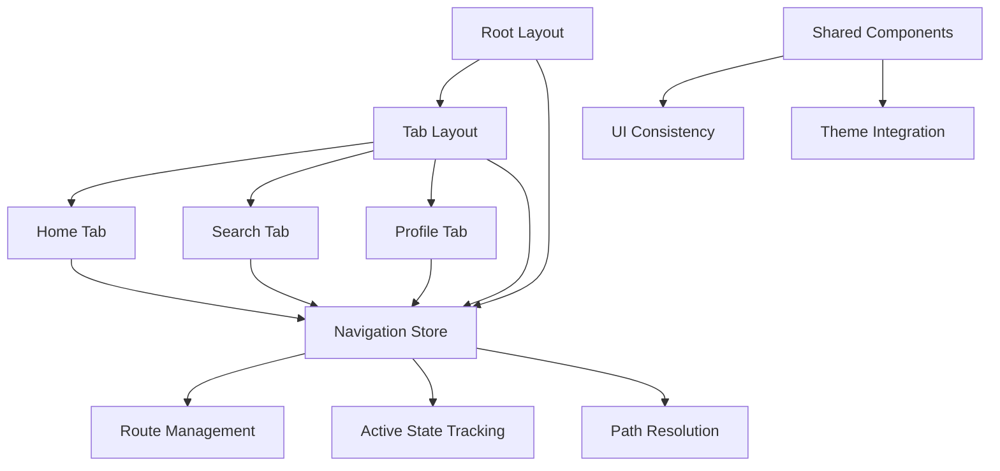
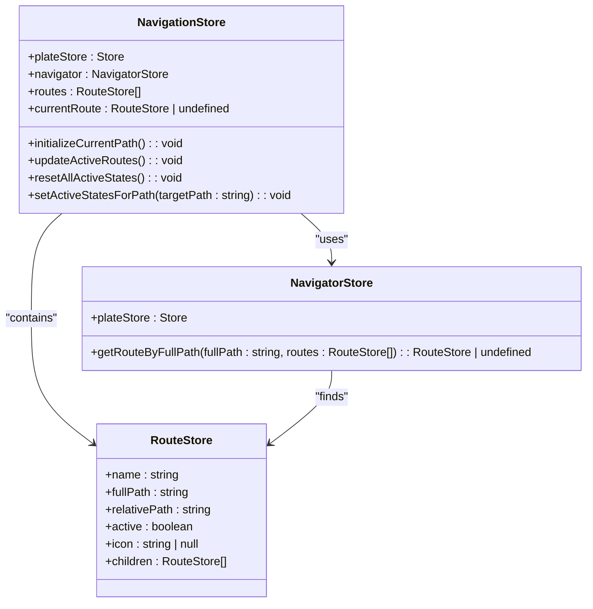
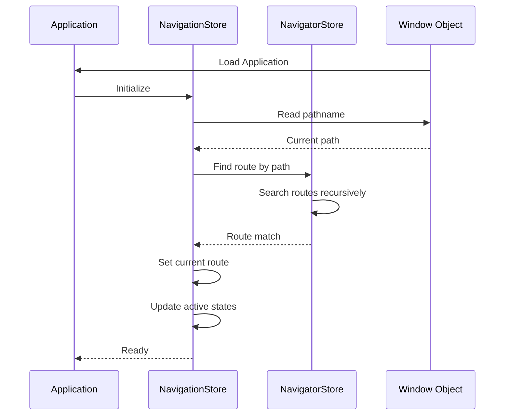
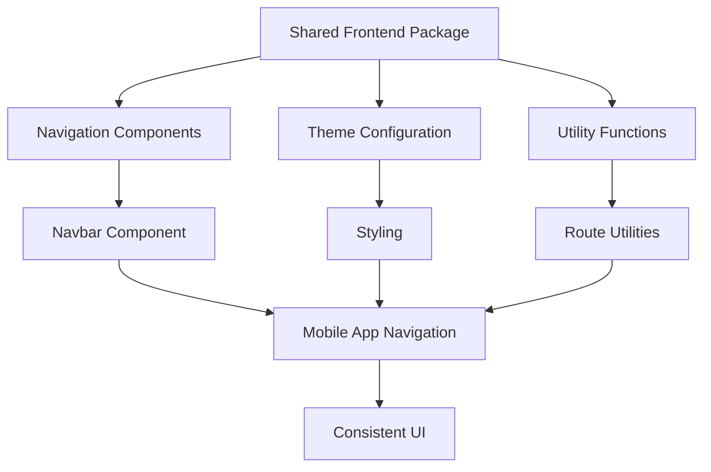

# Navigation Structure

<cite>
**Referenced Files in This Document**   
- [navigationStore.ts](file://packages/store/src/stores/navigationStore.ts)
- [navigatorStore.ts](file://packages/store/src/stores/navigatorStore.ts)
- [routeStore.ts](file://packages/store/src/stores/routeStore.ts)
- [routes.ts](file://apps/server/src/shared/vars/routes.ts)
- [types.ts](file://packages/ui/src/components/ui/Navbar/types.ts)
- [utils.ts](file://packages/ui/src/components/ui/Navbar/utils.ts)
</cite>

## Table of Contents
1. [Introduction](#introduction)
2. [Navigation Architecture Overview](#navigation-architecture-overview)
3. [Core Navigation Components](#core-navigation-components)
4. [State Management and Persistence](#state-management-and-persistence)
5. [Integration with Shared Packages](#integration-with-shared-packages)
6. [Common Navigation Issues and Solutions](#common-navigation-issues-and-solutions)
7. [Conclusion](#conclusion)

## Introduction
The navigation structure in prj-core's mobile application implements a sophisticated routing system built on Expo Router, designed to provide a seamless user experience through tab-based navigation. This documentation details the implementation of the navigation system, focusing on the relationship between layout components, state management, and theme configuration. The system leverages shared packages to ensure UI consistency across the application while maintaining flexibility for platform-specific implementations. The navigation architecture is designed to handle complex routing requirements including nested navigation, deep linking, and state persistence.

## Navigation Architecture Overview

The navigation system in prj-core follows a hierarchical structure that organizes routes and navigation state in a predictable pattern. At its core, the system uses a combination of Expo Router for routing functionality and MobX for state management, creating a robust foundation for navigation across the application.

**Diagram sources**
- [navigationStore.ts](file://packages/store/src/stores/navigationStore.ts)
- [routes.ts](file://apps/server/src/shared/vars/routes.ts)

**Section sources**
- [navigationStore.ts](file://packages/store/src/stores/navigationStore.ts)
- [routes.ts](file://apps/server/src/shared/vars/routes.ts)

## Core Navigation Components

The navigation system is built around several key components that work together to provide a cohesive navigation experience. The architecture follows the Expo Router convention of using layout files to define navigation hierarchies, with the root layout establishing the foundation for the entire application's navigation structure.

The tab-based navigation is implemented through a combination of layout components that define the navigation hierarchy. The system uses a nested route structure where the root layout contains the tab layout, which in turn manages the individual tab screens. This approach allows for shared functionality and consistent UI elements across all tabs while maintaining separation of concerns.

**Diagram sources**
- [navigationStore.ts](file://packages/store/src/stores/navigationStore.ts)
- [navigatorStore.ts](file://packages/store/src/stores/navigatorStore.ts)
- [routeStore.ts](file://packages/store/src/stores/routeStore.ts)

**Section sources**
- [navigationStore.ts](file://packages/store/src/stores/navigationStore.ts)
- [navigatorStore.ts](file://packages/store/src/stores/navigatorStore.ts)
- [routeStore.ts](file://packages/store/src/stores/routeStore.ts)

## State Management and Persistence

Navigation state management in prj-core is implemented using MobX, providing a reactive approach to tracking the current route and active states across the application. The NavigationStore serves as the central authority for navigation state, maintaining references to all available routes and tracking the current route.

The system handles state persistence through a combination of URL-based routing and localStorage integration. When the application initializes, it reads the current path from window.location.pathname and attempts to match it with the available routes. This ensures that deep links work correctly and that users can bookmark specific application states.

**Diagram sources**
- [navigationStore.ts](file://packages/store/src/stores/navigationStore.ts)
- [navigatorStore.ts](file://packages/store/src/stores/navigatorStore.ts)

**Section sources**
- [navigationStore.ts](file://packages/store/src/stores/navigationStore.ts)
- [navigatorStore.ts](file://packages/store/src/stores/navigatorStore.ts)

## Integration with Shared Packages

The navigation system integrates closely with shared packages to ensure UI consistency and reduce code duplication across the application. The shared-frontend package provides essential components and utilities that are used throughout the navigation implementation.

Key integration points include:
- Route definitions from shared-frontend components
- UI consistency through shared navigation components
- Theme configuration that affects navigation appearance
- Utility functions for route handling and display

The system uses the Navbar component from shared-frontend, which consumes route data and renders navigation elements consistently across different parts of the application. This approach ensures that navigation UI elements maintain a uniform appearance and behavior regardless of where they appear in the application.

**Diagram sources**
- [types.ts](file://packages/ui/src/components/ui/Navbar/types.ts)
- [utils.ts](file://packages/ui/src/components/ui/Navbar/utils.ts)

**Section sources**
- [types.ts](file://packages/ui/src/components/ui/Navbar/types.ts)
- [utils.ts](file://packages/ui/src/components/ui/Navbar/utils.ts)

## Common Navigation Issues and Solutions

The navigation implementation in prj-core addresses several common challenges in mobile application development, particularly around state persistence and deep linking.

### Navigation State Persistence
One common issue in single-page applications is maintaining navigation state across page refreshes. The prj-core implementation solves this by:
- Reading the initial path from window.location.pathname
- Using the NavigatorStore to find the matching route
- Setting the current route and updating active states accordingly

### Deep Linking
Deep linking is supported through the route resolution system, which can handle arbitrary paths and map them to the appropriate route. The getRouteByFullPath method in NavigatorStore recursively searches through the route hierarchy to find a match, enabling complex nested routes to be resolved correctly.

### Active State Management
The system automatically manages active states for navigation elements by:
- Resetting all active states when the current route changes
- Setting active states for the current route and its ancestors
- Handling both exact matches and path prefixes

These solutions ensure that the navigation system remains robust and user-friendly, even when users navigate directly to specific application states through bookmarks or external links.

**Section sources**
- [navigationStore.ts](file://packages/store/src/stores/navigationStore.ts)
- [navigatorStore.ts](file://packages/store/src/stores/navigatorStore.ts)

## Conclusion
The navigation structure in prj-core's mobile application demonstrates a well-architected approach to tab-based navigation using Expo Router and MobX state management. By leveraging shared packages and implementing robust state persistence mechanisms, the system provides a consistent and reliable navigation experience. The hierarchical layout structure, combined with centralized state management, creates a maintainable and scalable foundation for the application's navigation needs. This implementation effectively balances the requirements of modern mobile applications, including deep linking support, state persistence, and UI consistency across shared components.