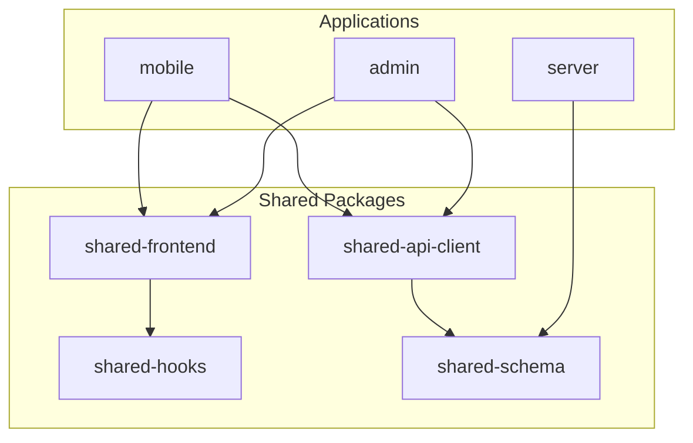
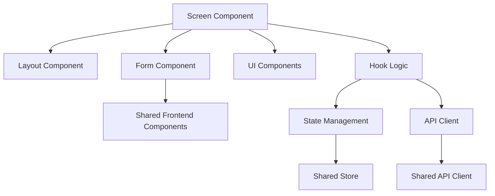
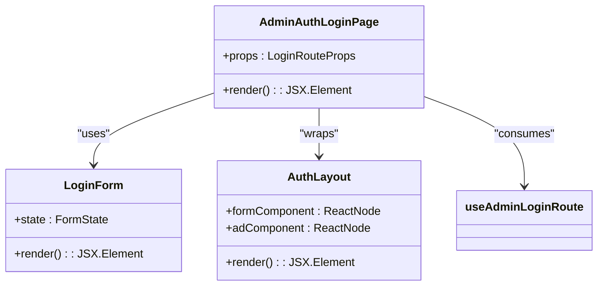
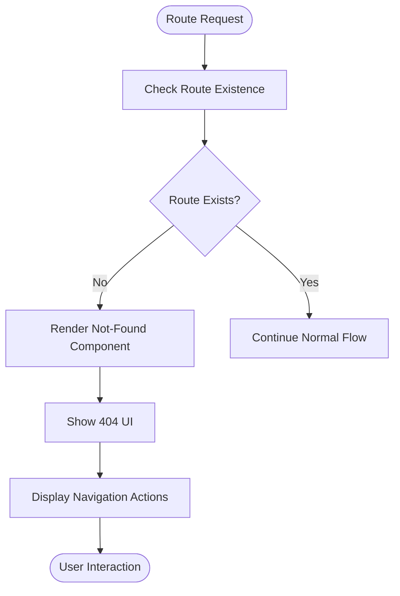
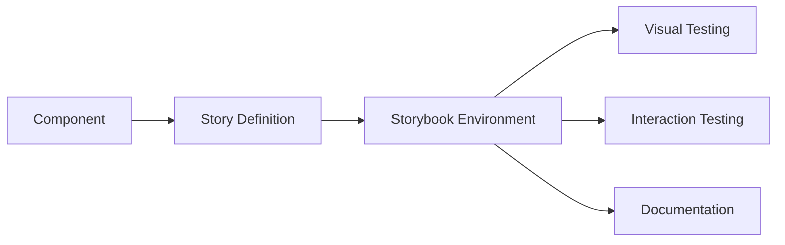
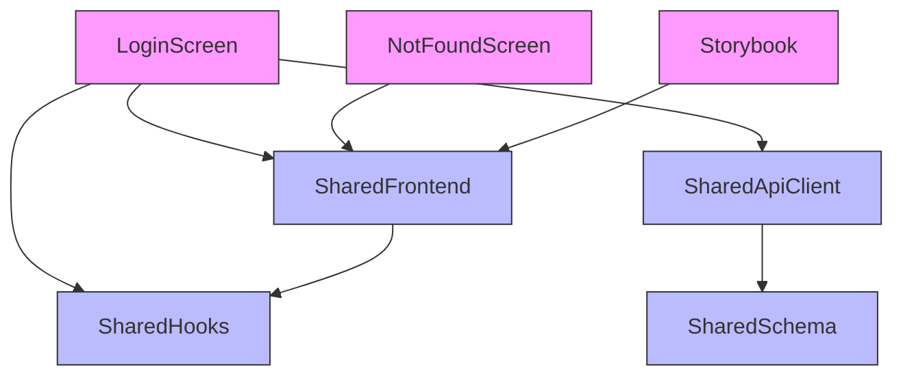

# Screen Components

<cite>
**Referenced Files in This Document**   
- [login.tsx](file://apps/admin/src/routes/admin/auth/login.tsx)
- [AdminAuthLoginPage.tsx](file://packages/ui/src/components/page/AdminAuthLoginPage.tsx)
- [LoginForm.tsx](file://packages/ui/src/components/form/LoginForm/LoginForm.tsx)
- [AuthLayout.tsx](file://packages/ui/src/components/layout/Auth/AuthLayout.tsx)
- [NotFound.tsx](file://packages/ui/src/components/ui/NotFound/NotFound.tsx)
- [useAdminLoginRoute.ts](file://apps/admin/src/hooks/useAdminLoginRoute.ts)
</cite>

## Table of Contents
1. [Introduction](#introduction)
2. [Project Structure](#project-structure)
3. [Core Components](#core-components)
4. [Architecture Overview](#architecture-overview)
5. [Detailed Component Analysis](#detailed-component-analysis)
6. [Dependency Analysis](#dependency-analysis)
7. [Performance Considerations](#performance-considerations)
8. [Troubleshooting Guide](#troubleshooting-guide)
9. [Conclusion](#conclusion)

## Introduction
This document provides a comprehensive analysis of the screen components within the prj-core mobile application ecosystem. The focus is on key screens including login functionality, custom HTML handling, error handling for not-found routes, and Storybook integration. The documentation details how these screen components interact with shared packages such as shared-frontend UI components and shared-api-client for data fetching. Special attention is given to implementation patterns, component relationships, and optimization techniques that ensure robust performance and maintainable code structure.

## Project Structure
The project follows a monorepo architecture with distinct applications and shared packages. The mobile application components are organized within the apps directory, with shared UI components and utilities centralized in the packages directory for reuse across different applications.

**Diagram sources**
- [turbo.json](file://turbo.json#L142-L149)
- [pnpm-workspace.yaml](file://pnpm-workspace.yaml)

**Section sources**
- [turbo.json](file://turbo.json#L1-L167)
- [package.json](file://package.json#L1-L50)

## Core Components
The core screen components in the prj-core application include authentication screens, error handling components, and specialized routing handlers. These components are designed to be reusable across different applications while maintaining consistent user experience and behavior.

**Section sources**
- [login.tsx](file://apps/admin/src/routes/admin/auth/login.tsx#L1-L100)
- [AdminAuthLoginPage.tsx](file://packages/ui/src/components/page/AdminAuthLoginPage.tsx#L1-L28)
- [NotFound.tsx](file://packages/ui/src/components/ui/NotFound/NotFound.tsx#L1-L106)

## Architecture Overview
The screen component architecture follows a modular design pattern where UI components are separated from business logic and data fetching concerns. This separation enables better testability, reusability, and maintainability across the application ecosystem.

**Diagram sources**
- [AdminAuthLoginPage.tsx](file://packages/ui/src/components/page/AdminAuthLoginPage.tsx#L1-L28)
- [AuthLayout.tsx](file://packages/ui/src/components/layout/Auth/AuthLayout.tsx#L1-L48)

## Detailed Component Analysis

### Login Screen Implementation
The login screen implementation demonstrates a clean separation of concerns between presentation and logic. The component consumes shared UI components from the shared-frontend package and integrates with authentication flows through dedicated hooks.

#### Login Component Structure

**Diagram sources**
- [AdminAuthLoginPage.tsx](file://packages/ui/src/components/page/AdminAuthLoginPage.tsx#L1-L28)
- [LoginForm.tsx](file://packages/ui/src/components/form/LoginForm/LoginForm.tsx#L1-L50)
- [AuthLayout.tsx](file://packages/ui/src/components/layout/Auth/AuthLayout.tsx#L1-L48)

**Section sources**
- [AdminAuthLoginPage.tsx](file://packages/ui/src/components/page/AdminAuthLoginPage.tsx#L1-L28)
- [login.tsx](file://apps/admin/src/routes/admin/auth/login.tsx#L1-L100)

### Special Routing Handlers
The application implements special routing handlers for custom HTML content and not-found routes. These handlers provide consistent user experience across different navigation scenarios.

#### Not-Found Route Handling

**Diagram sources**
- [NotFound.tsx](file://packages/ui/src/components/ui/NotFound/NotFound.tsx#L1-L106)

**Section sources**
- [NotFound.tsx](file://packages/ui/src/components/ui/NotFound/NotFound.tsx#L1-L106)

### Storybook Integration
The component library is integrated with Storybook for isolated component development and testing. This allows developers to preview components in different states and ensure consistent design system adherence.

**Diagram sources**
- [.storybook](file://apps/admin/.storybook#L1-L10)
- [preview.ts](file://apps/admin/.storybook/preview.ts#L1-L20)

## Dependency Analysis
The screen components have well-defined dependencies on shared packages, ensuring consistency and reducing code duplication across the application ecosystem.

**Diagram sources**
- [package.json](file://apps/admin/package.json#L1-L20)
- [tsconfig.json](file://apps/admin/tsconfig.json#L1-L10)

**Section sources**
- [package.json](file://apps/admin/package.json#L1-L50)
- [turbo.json](file://turbo.json#L1-L167)

## Performance Considerations
The screen components implement several performance optimization techniques to ensure smooth user experience, particularly in mobile environments with limited resources.

### Rendering Performance
- **Lazy Loading**: Components are loaded on-demand to reduce initial bundle size
- **Memoization**: Expensive computations and component renders are memoized
- **Code Splitting**: Routes are split into separate chunks for faster loading
- **Image Optimization**: Ad images are optimized and loaded appropriately for device size

### Navigation Transitions
- **Animated Transitions**: Smooth transitions between screens enhance user experience
- **Skeleton Screens**: Loading states provide immediate feedback during navigation
- **Prefetching**: Next possible screens are prefetched based on user behavior patterns
- **Caching**: Frequently accessed screens and data are cached for instant retrieval

**Section sources**
- [AuthLayout.tsx](file://packages/ui/src/components/layout/Auth/AuthLayout.tsx#L1-L48)
- [SplashScreen.tsx](file://packages/ui/src/components/ui/SplashScreen/SplashScreen.tsx#L1-L42)

## Troubleshooting Guide
Common issues with screen components and their solutions:

### Screen Rendering Issues
- **Blank Screen**: Check if required shared packages are properly linked
- **Layout Distortion**: Verify responsive design breakpoints and container constraints
- **Missing Styles**: Ensure CSS modules are correctly imported and applied

### Authentication Flow Problems
- **Login Failures**: Verify API client configuration and endpoint URLs
- **Session Persistence**: Check token storage implementation and expiration handling
- **Redirect Loops**: Validate route guard logic and authentication state management

### Storybook Integration Issues
- **Component Not Rendering**: Ensure all dependencies are properly mocked
- **Style Inconsistencies**: Verify theme provider is correctly configured in preview
- **Interaction Test Failures**: Check event handlers and state update logic

**Section sources**
- [useAdminLoginRoute.ts](file://apps/admin/src/hooks/useAdminLoginRoute.ts#L1-L20)
- [auth.module.ts](file://apps/server/src/module/auth.module.ts#L1-L50)

## Conclusion
The screen components in prj-core demonstrate a well-architected approach to mobile application development, with clear separation of concerns, reusable UI components, and robust integration with shared packages. The implementation patterns prioritize performance, maintainability, and consistent user experience across different screens and navigation scenarios. By leveraging shared-frontend components and shared-api-client for data fetching, the application ensures consistency while enabling efficient development workflows through Storybook integration and modular design principles.