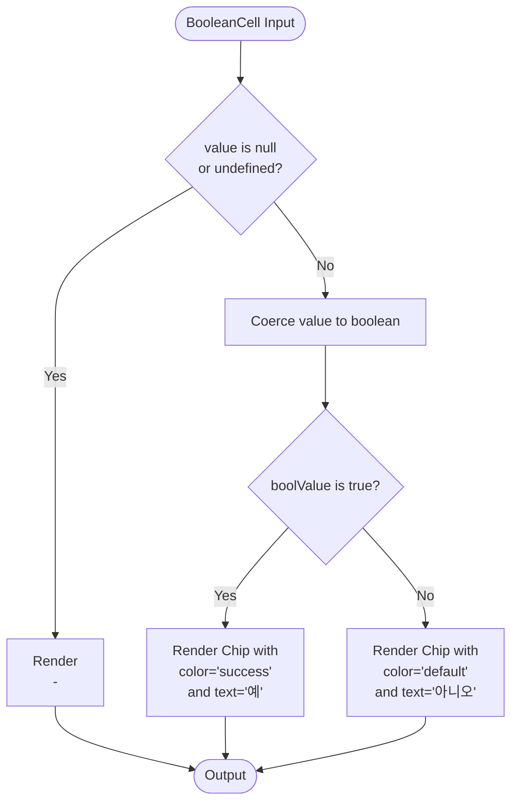
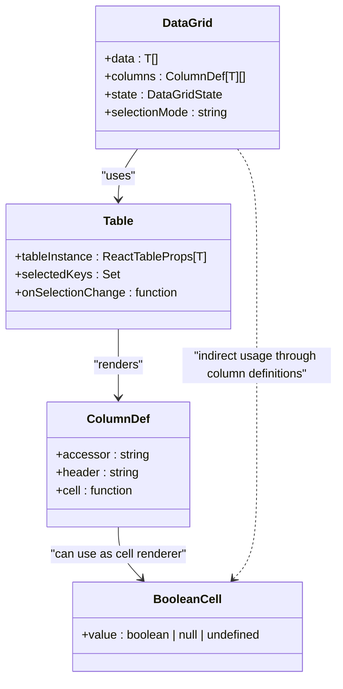

# BooleanCell Component

<cite>
**Referenced Files in This Document**   
- [BooleanCell.tsx](file://packages/ui/src/components/ui/data-display/cells/BooleanCell/BooleanCell.tsx)
- [BooleanCell.stories.tsx](file://packages/ui/src/components/ui/data-display/cells/BooleanCell/BooleanCell.stories.tsx)
- [DataGrid.tsx](file://packages/ui/src/components/ui/data-display/DataGrid/DataGrid.tsx)
- [Table.tsx](file://packages/ui/src/components/ui/data-display/Table/Table.tsx)
- [index.ts](file://packages/ui/src/components/ui/data-display/cells/index.ts)
</cite>

## Table of Contents
1. [Introduction](#introduction)
2. [Core Implementation](#core-implementation)
3. [Props and Configuration](#props-and-configuration)
4. [Visual Design and Styling](#visual-design-and-styling)
5. [Integration with DataGrid and Table Components](#integration-with-datagrid-and-table-components)
6. [Accessibility Considerations](#accessibility-considerations)
7. [Internationalization Support](#internationalization-support)
8. [Performance Optimization](#performance-optimization)
9. [Usage Examples](#usage-examples)
10. [Common Issues and Solutions](#common-issues-and-solutions)

## Introduction
The BooleanCell component is a specialized UI element designed for consistently rendering boolean values across both admin and mobile applications within the prj-core ecosystem. This component transforms boolean states into intuitive visual indicators using color-coded chips with clear textual labels, ensuring users can quickly interpret the status of various system properties such as active/inactive states, enabled/disabled features, and success/failure conditions. The component is part of the shared UI library, enabling consistent presentation across different application contexts while maintaining high accessibility standards and performance efficiency.

## Core Implementation

The BooleanCell component is implemented as a functional React component that accepts a boolean value and renders it using a Chip component from the @heroui/react library. The implementation handles three possible states: true, false, and null/undefined (representing missing or unknown values). For null or undefined values, the component displays a dash (-) to indicate the absence of data, maintaining visual consistency in data tables where some records may lack boolean values.

The component performs type coercion using JavaScript's Boolean() function to ensure consistent interpretation of the input value, preventing unexpected rendering behavior due to type mismatches. This robust handling ensures that truthy and falsy values are properly converted to their boolean equivalents before rendering.

**Section sources**
- [BooleanCell.tsx](file://packages/ui/src/components/ui/data-display/cells/BooleanCell/BooleanCell.tsx#L1-L19)

## Props and Configuration

The BooleanCell component accepts a single prop that defines the boolean state to be displayed:

- **value**: A property of type `boolean | null | undefined` that represents the boolean state to render. This flexible typing accommodates complete, incomplete, and missing data scenarios commonly encountered in real-world applications.

The component does not currently support additional configuration props for customizing labels or styling, as these are standardized across the application to maintain consistency. The design decision to limit configuration options ensures uniform user experience across all instances of the component throughout the admin and mobile interfaces.

**Section sources**
- [BooleanCell.tsx](file://packages/ui/src/components/ui/data-display/cells/BooleanCell/BooleanCell.tsx#L3-L5)

## Visual Design and Styling

The BooleanCell employs a chip-based visual design to clearly communicate boolean states through both color and text. The styling follows these conventions:

- **True values**: Rendered with a success color (typically green) using the Chip component's "success" color variant
- **False values**: Rendered with a default color (typically gray) using the Chip component's "default" color variant
- **Size**: Small-sized chips (size="sm") to optimize space usage in dense data displays
- **Variant**: Flat styling (variant="flat") to maintain a clean, minimalist appearance that doesn't distract from the data

The visual design leverages color psychology to provide immediate visual feedback, with green universally recognized as indicating positive or active states, while gray indicates neutral or inactive states. The small size ensures the component fits well within table cells and other compact UI elements without overwhelming the layout.

**Diagram sources**
- [BooleanCell.tsx](file://packages/ui/src/components/ui/data-display/cells/BooleanCell/BooleanCell.tsx#L8-L18)

## Integration with DataGrid and Table Components

The BooleanCell component is designed to work seamlessly with the DataGrid and Table components within the UI library. These components use React Table for data management and rendering, allowing BooleanCell to be specified as a cell renderer in column definitions.

When integrated with DataGrid or Table components, BooleanCell can be used in column configurations by specifying it as the cell renderer function. The parent table components pass the boolean value from the data row to the BooleanCell through the cell context, enabling consistent rendering of boolean fields across multiple rows and columns.

The integration follows the React Table pattern of column definitions, where each column can specify a cell rendering function that receives the row data and returns the appropriate UI element. This architecture allows for easy replacement or customization of cell renderers while maintaining the overall table structure and functionality.

**Diagram sources**
- [DataGrid.tsx](file://packages/ui/src/components/ui/data-display/DataGrid/DataGrid.tsx#L1-L58)
- [Table.tsx](file://packages/ui/src/components/ui/data-display/Table/Table.tsx#L1-L58)
- [BooleanCell.tsx](file://packages/ui/src/components/ui/data-display/cells/BooleanCell/BooleanCell.tsx#L1-L19)

## Accessibility Considerations

The BooleanCell component incorporates several accessibility features to ensure it is usable by all users, including those relying on assistive technologies:

- **Semantic HTML**: The component uses standard HTML paragraph and span elements that are naturally accessible to screen readers
- **Clear text labels**: Uses explicit Korean text labels "예" (yes) and "아니오" (no) rather than relying solely on color or icons, ensuring the meaning is conveyed even when color perception is limited
- **Consistent presentation**: Maintains the same visual pattern across all instances, allowing users to quickly learn and recognize the meaning of different states
- **Null value handling**: Displays a dash (-) for null or undefined values, providing a clear indication of missing data rather than leaving an empty space that might be misinterpreted

The component's reliance on text labels in addition to color coding ensures compliance with WCAG guidelines for color contrast and non-color-dependent information presentation. This dual-coding approach (color + text) makes the component accessible to users with color vision deficiencies while maintaining quick visual scanning capabilities for all users.

**Section sources**
- [BooleanCell.tsx](file://packages/ui/src/components/ui/data-display/cells/BooleanCell/BooleanCell.tsx#L16-L17)

## Internationalization Support

The BooleanCell component currently displays boolean states using Korean text labels ("예" for true and "아니오" for false). This implementation reflects the primary language of the application's user base. However, the component's design could be extended to support internationalization through several potential approaches:

- **Context-based language detection**: The component could read the current language setting from a context provider and display appropriate labels based on the user's language preference
- **Prop-based label customization**: Future versions could accept optional props for customizing the trueLabel and falseLabel text, allowing parent components to specify language-appropriate values
- **Translation service integration**: The component could integrate with a translation service or i18n library to automatically retrieve the appropriate labels based on the current locale

While the current implementation is optimized for Korean-speaking users, the component's structure is conducive to internationalization enhancements that would allow it to serve a global user base without compromising its core functionality or performance.

**Section sources**
- [BooleanCell.tsx](file://packages/ui/src/components/ui/data-display/cells/BooleanCell/BooleanCell.tsx#L16-L17)

## Performance Optimization

The BooleanCell component is designed with performance in mind, particularly for scenarios involving large datasets with numerous boolean values:

- **Lightweight implementation**: The component has minimal rendering logic and few conditional branches, ensuring fast execution
- **Memoization readiness**: The functional component pattern allows for easy implementation of React.memo() if needed to prevent unnecessary re-renders in large lists
- **Efficient DOM structure**: Uses simple HTML elements without complex nesting, reducing the browser's rendering workload
- **No side effects**: The component is purely presentational with no state management or side effects, making it predictable and efficient

When rendering large numbers of boolean cells in data grids, the component's simplicity contributes to smooth scrolling and quick initial rendering. The use of the Chip component from @heroui/react ensures consistent styling without requiring custom CSS for each instance, further optimizing performance.

For extremely large datasets, additional performance optimizations could include virtualized rendering of table rows, ensuring that only visible cells are rendered at any given time. The BooleanCell's lightweight nature makes it well-suited for such virtualized environments.

**Section sources**
- [BooleanCell.tsx](file://packages/ui/src/components/ui/data-display/cells/BooleanCell/BooleanCell.tsx#L7-L19)

## Usage Examples

The BooleanCell component is typically used within data grid or table column definitions to display boolean fields from data records. Common use cases include:

- **Status indicators**: Displaying active/inactive status of users, services, or system components
- **Feature flags**: Showing whether specific features are enabled or disabled for particular accounts or users
- **Completion states**: Indicating whether tasks, processes, or requirements have been completed
- **Permission states**: Displaying whether specific permissions or access rights are granted

In practice, the component is imported from the shared UI library and used as a cell renderer in column definitions. The DataGrid and Table components automatically pass the appropriate data value to the BooleanCell based on the column's accessor property, creating a clean separation between data management and presentation.

The component's storybook documentation provides visual examples of all possible states (true, false, null, and undefined), serving as a reference for developers and designers to understand its appearance and behavior in different scenarios.

**Section sources**
- [BooleanCell.stories.tsx](file://packages/ui/src/components/ui/data-display/cells/BooleanCell/BooleanCell.stories.tsx#L1-L52)
- [index.ts](file://packages/ui/src/components/ui/data-display/cells/index.ts#L1)

## Common Issues and Solutions

### Internationalization Limitations
**Issue**: The component currently only supports Korean labels, limiting its usability for international users.
**Solution**: Implement language-aware labeling by integrating with the application's i18n system, allowing dynamic label selection based on user preferences.

### Limited Styling Customization
**Issue**: The component does not expose styling props, preventing customization for specific use cases.
**Solution**: While consistency is prioritized, consider adding optional props for critical styling adjustments while maintaining default behavior for standard use cases.

### Accessibility in High-Contrast Modes
**Issue**: The color-based indicators may not be sufficiently distinct in high-contrast display modes.
**Solution**: Enhance visual distinction by adding subtle icons or patterns in addition to color coding, ensuring state differentiation remains clear in all display environments.

### Server-Side Rendering Considerations
**Issue**: When used in server-rendered contexts, the component must ensure consistent output between server and client to prevent hydration mismatches.
**Solution**: The component's pure functional nature and lack of browser-specific APIs make it inherently compatible with server-side rendering, but thorough testing should be conducted to verify consistent behavior.

### Scalability in Large Data Sets
**Issue**: Rendering thousands of BooleanCell instances simultaneously could impact performance.
**Solution**: Combine the component with virtualized table implementations that only render visible cells, and consider implementing React.memo() to prevent unnecessary re-renders when data updates occur.

**Section sources**
- [BooleanCell.tsx](file://packages/ui/src/components/ui/data-display/cells/BooleanCell/BooleanCell.tsx#L1-L19)
- [DataGrid.tsx](file://packages/ui/src/components/ui/data-display/DataGrid/DataGrid.tsx#L1-L58)