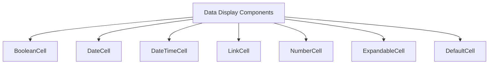
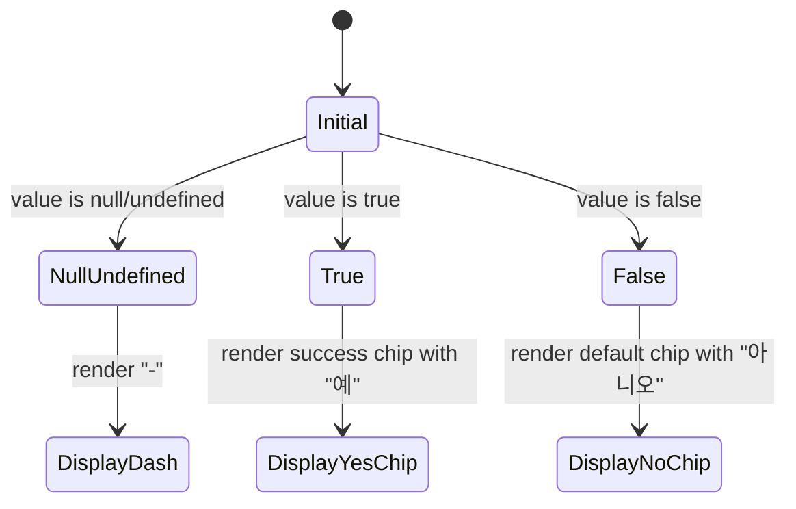
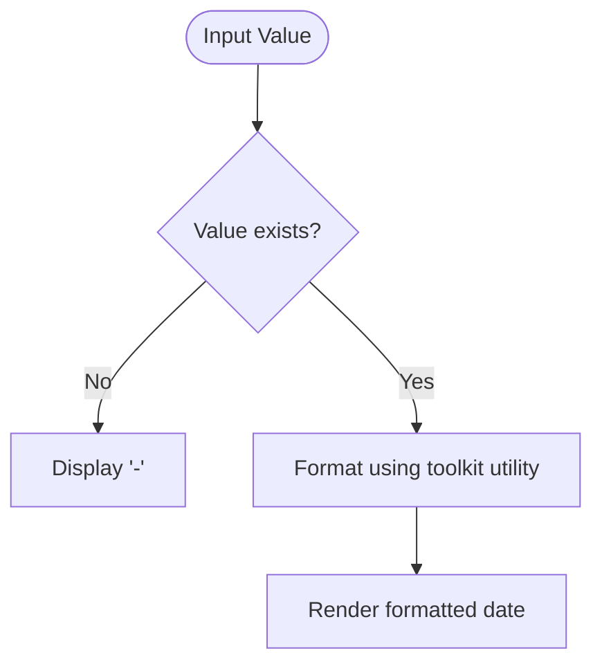
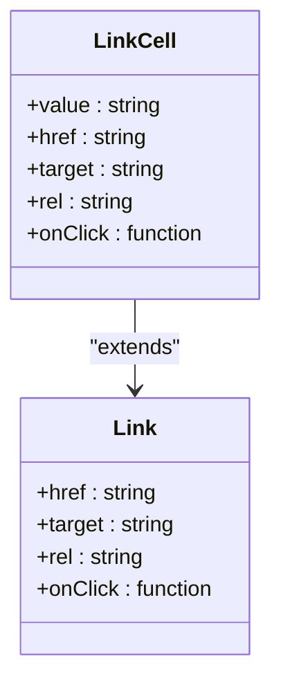
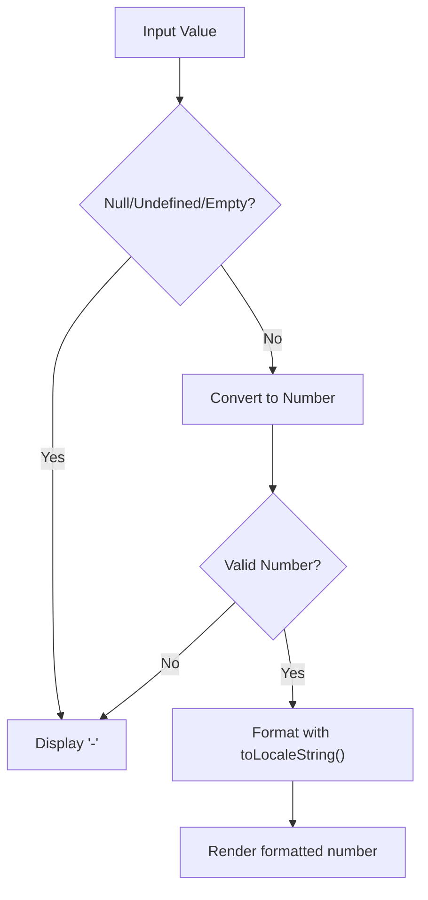
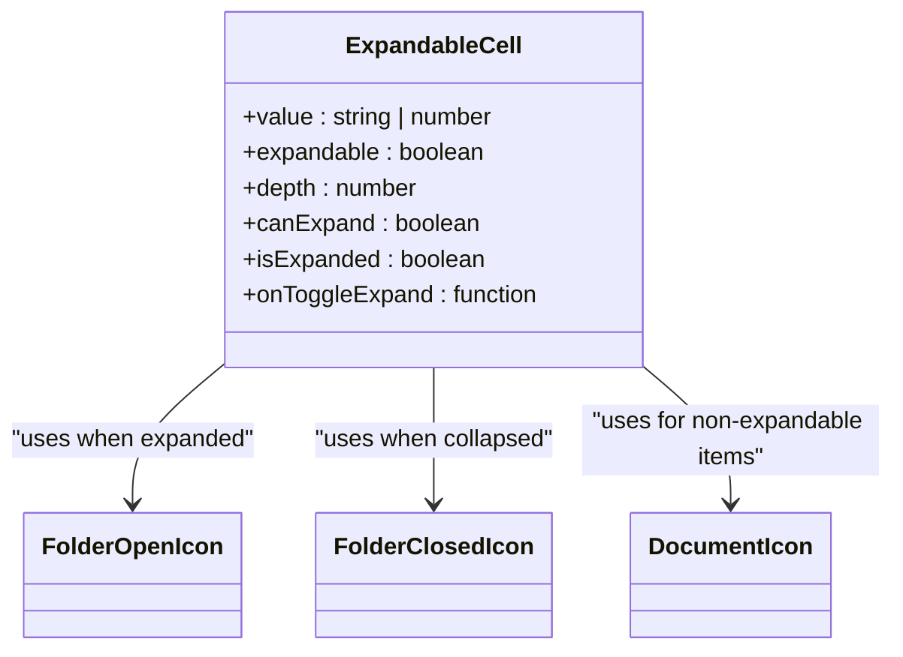
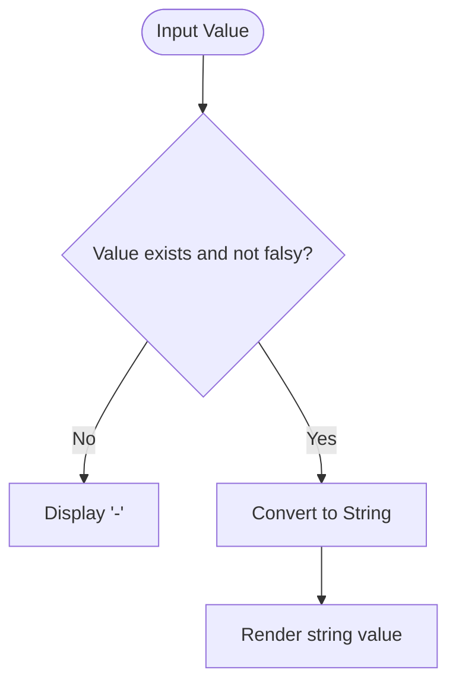
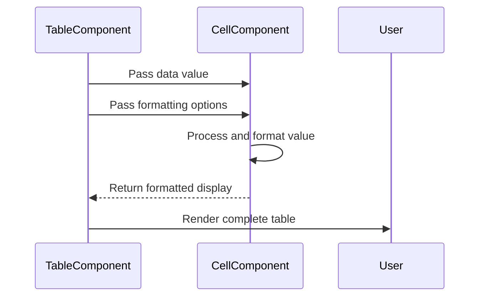

# Data Display Components

<cite>
**Referenced Files in This Document**   
- [BooleanCell.tsx](file://packages/ui/src/components/ui/data-display/cells/BooleanCell/BooleanCell.tsx)
- [DateCell.tsx](file://packages/ui/src/components/ui/data-display/cells/DateCell/DateCell.tsx)
- [DateTimeCell.tsx](file://packages/ui/src/components/ui/data-display/cells/DateTimeCell/DateTimeCell.tsx)
- [LinkCell.tsx](file://packages/ui/src/components/ui/data-display/cells/LinkCell/LinkCell.tsx)
- [NumberCell.tsx](file://packages/ui/src/components/ui/data-display/cells/NumberCell/NumberCell.tsx)
- [ExpandableCell.tsx](file://packages/ui/src/components/ui/data-display/cells/ExpandableCell/ExpandableCell.tsx)
- [DefaultCell.tsx](file://packages/ui/src/components/ui/data-display/cells/DefaultCell/DefaultCell.tsx)
- [index.ts](file://packages/ui/src/components/ui/data-display/cells/index.ts)
</cite>

## Table of Contents
1. [Introduction](#introduction)
2. [Core Cell Components](#core-cell-components)
3. [BooleanCell](#booleancell)
4. [DateCell and DateTimeCell](#datecell-and-datetimecell)
5. [LinkCell](#linkcell)
6. [NumberCell](#numbercell)
7. [ExpandableCell](#expandablecell)
8. [DefaultCell](#defaultcell)
9. [Integration with DataGrid/Table Components](#integration-with-datagridtable-components)
10. [Common Issues and Solutions](#common-issues-and-solutions)
11. [Conclusion](#conclusion)

## Introduction
The Data Display Components in the prj-core's shared-frontend package provide a consistent and accessible way to render data across both admin and mobile applications. These components are designed to handle various data types with proper formatting, localization support, and accessibility features. The cell components are part of the UI library and are used within tables and data grids to ensure uniform presentation of information throughout the application ecosystem.

**Section sources**
- [index.ts](file://packages/ui/src/components/ui/data-display/cells/index.ts)

## Core Cell Components
The shared-frontend package includes several specialized cell components for displaying different types of data: BooleanCell, DateCell, DateTimeCell, LinkCell, NumberCell, ExpandableCell, and DefaultCell. These components are exported from the cells directory and can be imported individually or as a group through the index file. Each component handles null, undefined, and empty values by displaying a consistent placeholder (typically a dash "-") to maintain visual consistency in data tables.

**Diagram sources**
- [index.ts](file://packages/ui/src/components/ui/data-display/cells/index.ts)

**Section sources**
- [index.ts](file://packages/ui/src/components/ui/data-display/cells/index.ts)

## BooleanCell
The BooleanCell component renders boolean values with visual indicators for better readability. When the value is true, it displays a success-colored chip with "예" (Yes), and when false, it shows a default-colored chip with "아니오" (No). The component properly handles null and undefined values by displaying a dash placeholder. This component uses the Chip component from the @heroui/react library to provide a consistent visual style across the application.

**Diagram sources**
- [BooleanCell.tsx](file://packages/ui/src/components/ui/data-display/cells/BooleanCell/BooleanCell.tsx)

**Section sources**
- [BooleanCell.tsx](file://packages/ui/src/components/ui/data-display/cells/BooleanCell/BooleanCell.tsx)

## DateCell and DateTimeCell
The DateCell and DateTimeCell components handle date and datetime values with proper formatting. Both components accept string or Date objects and convert them to a readable format using utility functions from the @cocrepo/toolkit package. The DateCell uses the formatDateTimeWithSeconds function, while the DateTimeCell uses the formatDateTime function. These components ensure consistent date formatting across the application and handle null, undefined, or empty values by displaying a dash placeholder.

**Diagram sources**
- [DateCell.tsx](file://packages/ui/src/components/ui/data-display/cells/DateCell/DateCell.tsx)
- [DateTimeCell.tsx](file://packages/ui/src/components/ui/data-display/cells/DateTimeCell/DateTimeCell.tsx)

**Section sources**
- [DateCell.tsx](file://packages/ui/src/components/ui/data-display/cells/DateCell/DateCell.tsx)
- [DateTimeCell.tsx](file://packages/ui/src/components/ui/data-display/cells/DateTimeCell/DateTimeCell.tsx)

## LinkCell
The LinkCell component renders clickable links with proper accessibility and security features. It extends the Link component from @heroui/react and accepts all standard link properties. The component takes a value prop for the link text and passes other properties (like href, target, rel) to the underlying Link component. This ensures consistent styling and behavior for all links in data tables while maintaining the flexibility to customize link behavior as needed.

**Diagram sources**
- [LinkCell.tsx](file://packages/ui/src/components/ui/data-display/cells/LinkCell/LinkCell.tsx)

**Section sources**
- [LinkCell.tsx](file://packages/ui/src/components/ui/data-display/cells/LinkCell/LinkCell.tsx)

## NumberCell
The NumberCell component formats numeric values with locale-specific number formatting. It accepts numbers, strings, null, or undefined values and converts them to properly formatted numbers using the toLocaleString method. The component handles invalid inputs by displaying a dash placeholder. This ensures that numeric data is presented consistently across different locales and that empty or invalid values don't disrupt the table layout.

**Diagram sources**
- [NumberCell.tsx](file://packages/ui/src/components/ui/data-display/cells/NumberCell/NumberCell.tsx)

**Section sources**
- [NumberCell.tsx](file://packages/ui/src/components/ui/data-display/cells/NumberCell/NumberCell.tsx)

## ExpandableCell
The ExpandableCell component provides a hierarchical data display with expandable/collapsible functionality. It supports tree-like structures with visual indicators for folders and documents. The component includes depth-based indentation, visual connection lines between parent and child items, and interactive folder icons that change based on expansion state. It uses custom SVG icons for folder open, folder closed, and document states, providing a clear visual hierarchy in data tables.

**Diagram sources**
- [ExpandableCell.tsx](file://packages/ui/src/components/ui/data-display/cells/ExpandableCell/ExpandableCell.tsx)

**Section sources**
- [ExpandableCell.tsx](file://packages/ui/src/components/ui/data-display/cells/ExpandableCell/ExpandableCell.tsx)

## DefaultCell
The DefaultCell component serves as a fallback for rendering basic string or number values. It converts the input value to a string and displays it within a paragraph element. The component handles falsy values (except 0) by displaying a dash placeholder, ensuring that empty cells maintain consistent spacing in tables. This component is used when no specialized cell component is needed for a particular data type.

**Diagram sources**
- [DefaultCell.tsx](file://packages/ui/src/components/ui/data-display/cells/DefaultCell/DefaultCell.tsx)

**Section sources**
- [DefaultCell.tsx](file://packages/ui/src/components/ui/data-display/cells/DefaultCell/DefaultCell.tsx)

## Integration with DataGrid/Table Components
The cell components are designed to integrate seamlessly with DataGrid and Table components across the admin and mobile applications. They handle sorting and filtering through their parent table components, which pass the appropriate values to each cell. The components support responsive display by inheriting the table's responsive behavior and adapting their content presentation based on available space. For large datasets, these components work with virtualized rendering to maintain performance by only rendering visible cells.

**Diagram sources**
- [BooleanCell.tsx](file://packages/ui/src/components/ui/data-display/cells/BooleanCell/BooleanCell.tsx)
- [DateCell.tsx](file://packages/ui/src/components/ui/data-display/cells/DateCell/DateCell.tsx)
- [NumberCell.tsx](file://packages/ui/src/components/ui/data-display/cells/NumberCell/NumberCell.tsx)

**Section sources**
- [BooleanCell.tsx](file://packages/ui/src/components/ui/data-display/cells/BooleanCell/BooleanCell.tsx)
- [DateCell.tsx](file://packages/ui/src/components/ui/data-display/cells/DateCell/DateCell.tsx)
- [DateTimeCell.tsx](file://packages/ui/src/components/ui/data-display/cells/DateTimeCell/DateTimeCell.tsx)
- [LinkCell.tsx](file://packages/ui/src/components/ui/data-display/cells/LinkCell/LinkCell.tsx)
- [NumberCell.tsx](file://packages/ui/src/components/ui/data-display/cells/NumberCell/NumberCell.tsx)
- [ExpandableCell.tsx](file://packages/ui/src/components/ui/data-display/cells/ExpandableCell/ExpandableCell.tsx)
- [DefaultCell.tsx](file://packages/ui/src/components/ui/data-display/cells/DefaultCell/DefaultCell.tsx)

## Common Issues and Solutions
The cell components address several common issues in data display. For date formatting inconsistencies, they use centralized formatting utilities from @cocrepo/toolkit to ensure consistent presentation. For link security, the LinkCell inherits security features from the @heroui/react Link component, which automatically handles target="_blank" with rel="noreferrer" when appropriate. For performance with large datasets, the components are designed to be lightweight and work with virtualized table implementations that only render visible cells, minimizing the performance impact of rendering thousands of rows.

**Section sources**
- [DateCell.tsx](file://packages/ui/src/components/ui/data-display/cells/DateCell/DateCell.tsx)
- [LinkCell.tsx](file://packages/ui/src/components/ui/data-display/cells/LinkCell/LinkCell.tsx)
- [ExpandableCell.tsx](file://packages/ui/src/components/ui/data-display/cells/ExpandableCell/ExpandableCell.tsx)

## Conclusion
The Data Display Components in the shared-frontend package provide a comprehensive solution for rendering data consistently across the prj-core applications. These components handle various data types with appropriate formatting, localization, and accessibility features while maintaining high performance even with large datasets. By using these standardized components, both admin and mobile applications can ensure a consistent user experience and reduce the risk of display inconsistencies or security issues.