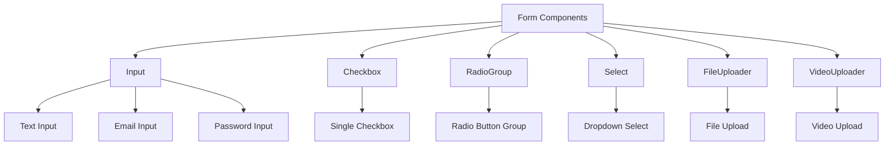
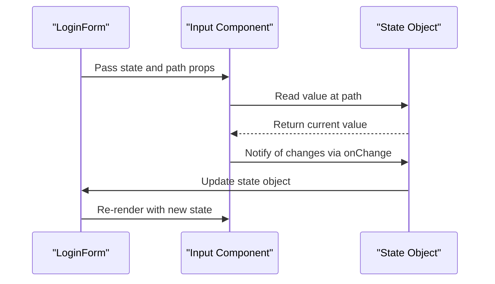
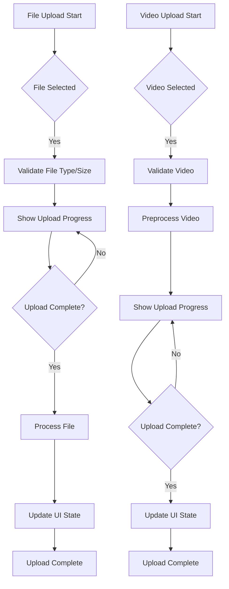

# Form and Input Components

<cite>
**Referenced Files in This Document**   
- [LoginForm.tsx](file://packages/ui/src/components/form/LoginForm/LoginForm.tsx)
- [Input.tsx](file://packages/ui/src/components/inputs/Input/Input.tsx)
- [Checkbox.tsx](file://packages/ui/src/components/inputs/Checkbox/Checkbox.tsx)
- [RadioGroup.tsx](file://packages/ui/src/components/inputs/RadioGroup/RadioGroup.tsx)
- [Select.tsx](file://packages/ui/src/components/ui/Select/Select.tsx)
- [FileUploader.tsx](file://packages/ui/src/components/inputs/FileUploader/FileUploader.tsx)
- [VideoUploader.tsx](file://packages/ui/src/components/inputs/VideoUploader/VideoUploader.tsx)
- [authStore.ts](file://packages/store/src/stores/authStore.ts)
</cite>

## Table of Contents
1. [Introduction](#introduction)
2. [Core Form Components](#core-form-components)
3. [Form State Management](#form-state-management)
4. [Validation Patterns](#validation-patterns)
5. [Error State Management](#error-state-management)
6. [Accessibility Implementation](#accessibility-implementation)
7. [LoginForm Component Analysis](#loginform-component-analysis)
8. [File and Video Upload Components](#file-and-video-upload-components)
9. [Common Issues and Solutions](#common-issues-and-solutions)
10. [Conclusion](#conclusion)

## Introduction
This document provides comprehensive documentation for the form and input components in the prj-core's UI package. The components are designed to provide a consistent, accessible, and reusable interface for user input across the application. The implementation focuses on accessibility, validation, and seamless integration with the application's state management system. The components are built with React and leverage the NextUI library for base styling and functionality.

## Core Form Components

The UI package provides a comprehensive set of form components including Input, Checkbox, RadioGroup, Select, FileUploader, and VideoUploader. These components are designed to work together seamlessly and provide a consistent user experience across the application.



**Diagram sources**
- [Input.tsx](file://packages/ui/src/components/inputs/Input/Input.tsx)
- [Checkbox.tsx](file://packages/ui/src/components/inputs/Checkbox/Checkbox.tsx)
- [RadioGroup.tsx](file://packages/ui/src/components/inputs/RadioGroup/RadioGroup.tsx)

**Section sources**
- [Input.tsx](file://packages/ui/src/components/inputs/Input/Input.tsx)
- [Checkbox.tsx](file://packages/ui/src/components/inputs/Checkbox/Checkbox.tsx)
- [RadioGroup.tsx](file://packages/ui/src/components/inputs/RadioGroup/RadioGroup.tsx)
- [Select.tsx](file://packages/ui/src/components/ui/Select/Select.tsx)

## Form State Management

The form components are designed to work with a state object that is passed as a prop. This pattern allows for centralized state management and makes it easy to integrate with the application's global state. The LoginForm component demonstrates this pattern by accepting a state object containing email and password fields.



**Diagram sources**
- [LoginForm.tsx](file://packages/ui/src/components/form/LoginForm/LoginForm.tsx)
- [Input.tsx](file://packages/ui/src/components/inputs/Input/Input.tsx)

**Section sources**
- [LoginForm.tsx](file://packages/ui/src/components/form/LoginForm/LoginForm.tsx)
- [Input.tsx](file://packages/ui/src/components/inputs/Input/Input.tsx)

## Validation Patterns

The form components implement validation through a combination of HTML5 validation attributes and custom validation logic. The Input component supports various input types (text, email, password) which provide built-in browser validation. Additional validation rules can be implemented through custom logic in the parent components or through integration with form validation libraries.

The validation system follows these principles:
- Client-side validation for immediate user feedback
- Server-side validation for security and data integrity
- Visual indicators for validation states
- Accessible error messaging

**Section sources**
- [Input.tsx](file://packages/ui/src/components/inputs/Input/Input.tsx)
- [Checkbox.tsx](file://packages/ui/src/components/inputs/Checkbox/Checkbox.tsx)
- [RadioGroup.tsx](file://packages/ui/src/components/inputs/RadioGroup/RadioGroup.tsx)

## Error State Management

Error state management is implemented through a combination of component props and visual styling. Components accept error state as a prop and adjust their appearance accordingly. Error messages are displayed below the input field and are properly associated with the input for screen reader accessibility.

The error state system includes:
- Visual indicators (border color, icons)
- Accessible error messaging
- Programmatic focus management
- Clear error dismissal patterns

**Section sources**
- [Input.tsx](file://packages/ui/src/components/inputs/Input/Input.tsx)
- [Checkbox.tsx](file://packages/ui/src/components/inputs/Checkbox/Checkbox.tsx)
- [FileUploader.tsx](file://packages/ui/src/components/inputs/FileUploader/FileUploader.tsx)

## Accessibility Implementation

The form components are designed with accessibility as a core requirement. All components follow WCAG 2.1 guidelines and implement proper ARIA attributes for screen reader support.

Key accessibility features include:
- Proper labeling with htmlFor and id attributes
- Keyboard navigation support
- Focus management
- ARIA attributes for dynamic content
- High contrast visual states
- Screen reader-friendly error messaging

The components ensure that all interactive elements are accessible via keyboard and that screen reader users receive appropriate feedback for all interactions.

**Section sources**
- [Input.tsx](file://packages/ui/src/components/inputs/Input/Input.tsx)
- [Checkbox.tsx](file://packages/ui/src/components/inputs/Checkbox/Checkbox.tsx)
- [RadioGroup.tsx](file://packages/ui/src/components/inputs/RadioGroup/RadioGroup.tsx)
- [Select.tsx](file://packages/ui/src/components/ui/Select/Select.tsx)

## LoginForm Component Analysis

The LoginForm component serves as a concrete example of how the form components are composed and integrated with the application's authentication state. It combines two Input components (for email and password) within a VStack layout container.

```mermaid
classDiagram
class LoginForm {
+state : {email : string, password : string}
+render()
}
class Input {
+path : string
+state : object
+variant : string
+type : string
+placeholder : string
+label : string
}
class VStack {
+fullWidth : boolean
+justifyContent : string
}
LoginForm --> Input : "composes"
LoginForm --> VStack : "wraps"
Input --> "email" : "path"
Input --> "password" : "path"
```

**Diagram sources**
- [LoginForm.tsx](file://packages/ui/src/components/form/LoginForm/LoginForm.tsx)
- [Input.tsx](file://packages/ui/src/components/inputs/Input/Input.tsx)
- [VStack.tsx](file://packages/ui/src/components/ui/VStack/VStack.tsx)

**Section sources**
- [LoginForm.tsx](file://packages/ui/src/components/form/LoginForm/LoginForm.tsx)
- [authStore.ts](file://packages/store/src/stores/authStore.ts)

The LoginForm interacts with the global authentication state through the state prop, which is typically connected to the authStore. This pattern allows the form to read current values and update the global state when inputs change.

## File and Video Upload Components

The FileUploader and VideoUploader components provide specialized interfaces for file and video uploads with progress tracking and preprocessing capabilities.



**Diagram sources**
- [FileUploader.tsx](file://packages/ui/src/components/inputs/FileUploader/FileUploader.tsx)
- [VideoUploader.tsx](file://packages/ui/src/components/inputs/VideoUploader/VideoUploader.tsx)

**Section sources**
- [FileUploader.tsx](file://packages/ui/src/components/inputs/FileUploader/FileUploader.tsx)
- [VideoUploader.tsx](file://packages/ui/src/components/inputs/VideoUploader/VideoUploader.tsx)

The components implement drag-and-drop functionality, file validation, progress tracking, and error handling for failed uploads. The VideoUploader includes additional preprocessing steps such as format conversion and compression.

## Common Issues and Solutions

### File Upload Progress Tracking
The FileUploader component implements progress tracking through event listeners on the underlying XMLHttpRequest or fetch API. Progress events are translated into visual feedback in the component's UI.

### Form State Persistence
Form state is persisted through the application's global state management system (MobX stores). The state object passed to form components is typically a reference to a store property, ensuring that state is maintained across component re-renders and navigation.

### Validation Error Handling
Validation errors are handled through a combination of immediate inline validation and summary validation. Inline validation provides immediate feedback for individual fields, while summary validation displays a comprehensive list of errors when form submission is attempted.

**Section sources**
- [FileUploader.tsx](file://packages/ui/src/components/inputs/FileUploader/FileUploader.tsx)
- [VideoUploader.tsx](file://packages/ui/src/components/inputs/VideoUploader/VideoUploader.tsx)
- [authStore.ts](file://packages/store/src/stores/authStore.ts)

## Conclusion
The form and input components in the prj-core UI package provide a robust, accessible, and reusable system for user input. The components are designed with accessibility as a core requirement and implement comprehensive validation and error handling patterns. The LoginForm component demonstrates how these components can be composed to create functional forms that integrate with the application's global state management system. The file and video upload components provide specialized interfaces with progress tracking and preprocessing capabilities, addressing common challenges in file handling.