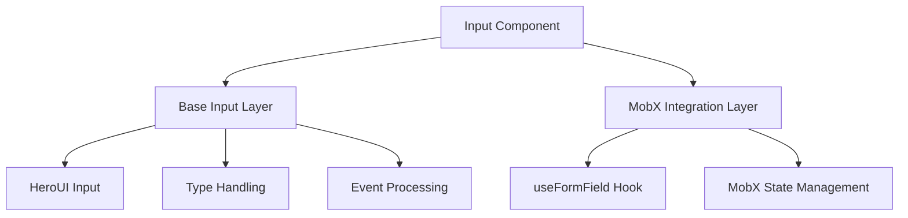
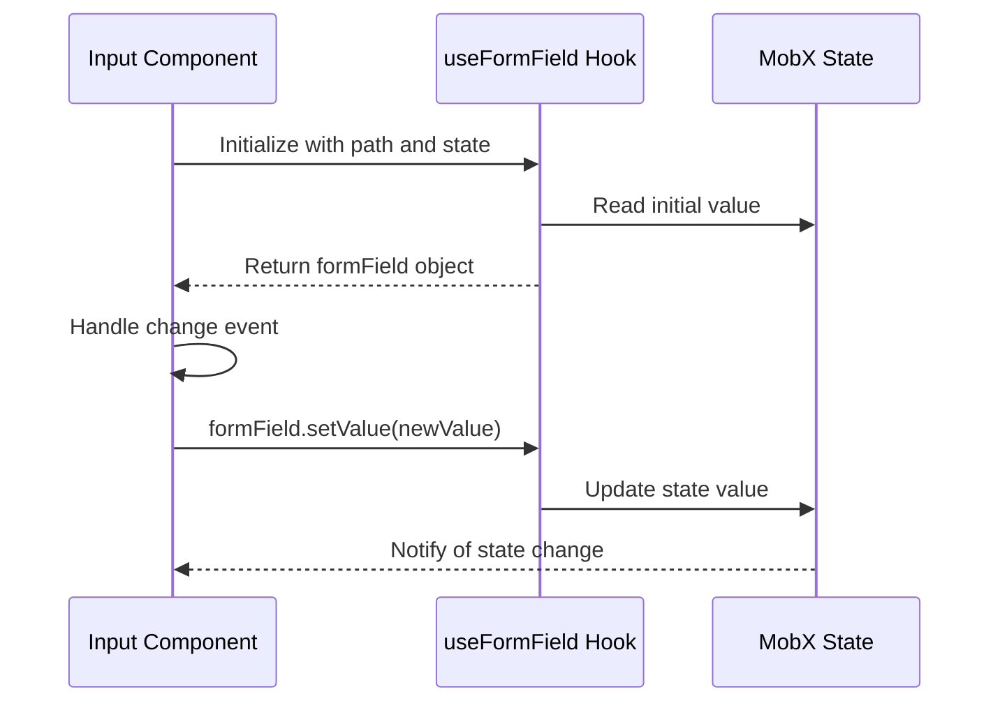
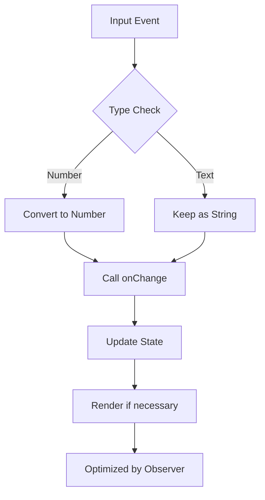

# Input Component

<cite>
**Referenced Files in This Document**   
- [Input.tsx](file://packages/ui/src/components/ui/inputs/Input/Input.tsx)
- [index.tsx](file://packages/ui/src/components/ui/inputs/Input/index.tsx)
- [package.json](file://packages/ui/package.json)
</cite>

## Table of Contents
1. [Introduction](#introduction)
2. [Core Implementation](#core-implementation)
3. [Props Interface](#props-interface)
4. [Form Integration](#form-integration)
5. [Input Types and Validation](#input-types-and-validation)
6. [Accessibility Features](#accessibility-features)
7. [Styling and Theming](#styling-and-theming)
8. [Error State Management](#error-state-management)
9. [Controlled vs Uncontrolled States](#controlled-vs-uncontrolled-states)
10. [Advanced Usage Patterns](#advanced-usage-patterns)
11. [Performance Considerations](#performance-considerations)

## Introduction
The Input component is a foundational UI element in the prj-core design system, providing a flexible and accessible way to capture user input across various applications. Built as a wrapper around the HeroUI Input component, it offers enhanced functionality for form integration, state management, and type handling. The component supports multiple input types including text, email, password, and number, with built-in handling for different value types and event callbacks.

**Section sources**
- [Input.tsx](file://packages/ui/src/components/ui/inputs/Input/Input.tsx#L1-L53)
- [index.tsx](file://packages/ui/src/components/ui/inputs/Input/index.tsx#L1-L38)

## Core Implementation
The Input component is implemented as a composition of two layers: a base input component and a MobX-integrated wrapper. The base component handles the core input functionality and event processing, while the wrapper provides integration with MobX state management and form field handling. This two-layer architecture allows for both standalone usage and integration with the application's global state system.

**Diagram sources**
- [Input.tsx](file://packages/ui/src/components/ui/inputs/Input/Input.tsx#L1-L53)
- [index.tsx](file://packages/ui/src/components/ui/inputs/Input/index.tsx#L1-L38)

**Section sources**
- [Input.tsx](file://packages/ui/src/components/ui/inputs/Input/Input.tsx#L1-L53)
- [index.tsx](file://packages/ui/src/components/ui/inputs/Input/index.tsx#L1-L38)

## Props Interface
The Input component exposes a comprehensive props interface that extends the base HeroUI InputProps while modifying key properties for enhanced functionality. The interface includes standard input properties such as type, size, and value, along with custom event handlers that accept string or number values rather than DOM events. The errorMessage prop is initialized with a default value of a single space character to ensure consistent rendering behavior.

**Section sources**
- [Input.tsx](file://packages/ui/src/components/ui/inputs/Input/Input.tsx#L7-L12)

## Form Integration
The Input component seamlessly integrates with form libraries through the useFormField hook from the shared-hooks package. This integration enables the component to work within MobX-based form state management systems, automatically synchronizing input values with the global application state. The wrapper component extracts the path and state properties from props, initializes the form field with the appropriate value, and handles value updates through the form field's setValue method.

**Diagram sources**
- [index.tsx](file://packages/ui/src/components/ui/inputs/Input/index.tsx#L1-L38)

**Section sources**
- [index.tsx](file://packages/ui/src/components/ui/inputs/Input/index.tsx#L1-L38)

## Input Types and Validation
The Input component supports various input types with special handling for numeric inputs. When the type is set to "number", the component automatically converts the string input value to a number before passing it to the onChange and onBlur callbacks. This ensures type consistency in form state management. The component does not implement client-side validation itself but provides the errorMessage prop to display validation messages from external validation systems.

**Section sources**
- [Input.tsx](file://packages/ui/src/components/ui/inputs/Input/Input.tsx#L25-L32)
- [Input.tsx](file://packages/ui/src/components/ui/inputs/Input/Input.tsx#L34-L40)

## Accessibility Features
The Input component inherits accessibility features from the HeroUI Input component, including proper labeling, focus management, and ARIA attribute support. The component maintains standard keyboard navigation and screen reader compatibility. While specific accessibility implementation details are handled by the underlying HeroUI component, the wrapper preserves all accessibility features through prop spreading.

**Section sources**
- [Input.tsx](file://packages/ui/src/components/ui/inputs/Input/Input.tsx#L43-L52)

## Styling and Theming
The Input component leverages Tailwind CSS for styling through the underlying HeroUI Input component. The size prop defaults to "sm" (small) and can be customized to match design system requirements. Additional styling is managed through the HeroUI theme system, with the component importing the use-theme package. Custom classes can be passed through the className prop for additional styling needs.

**Section sources**
- [Input.tsx](file://packages/ui/src/components/ui/inputs/Input/Input.tsx#L20)
- [package.json](file://packages/ui/package.json#L47)

## Error State Management
The component manages error states through the errorMessage prop, which defaults to a single space character to prevent layout shifts when errors appear or disappear. Error messages are displayed visually according to the HeroUI Input component's design system. The component does not handle validation logic internally but provides the necessary interface for external validation systems to communicate error states to the user.

**Section sources**
- [Input.tsx](file://packages/ui/src/components/ui/inputs/Input/Input.tsx#L18)
- [Input.tsx](file://packages/ui/src/components/ui/inputs/Input/Input.tsx#L49)

## Controlled vs Uncontrolled States
The Input component supports both controlled and uncontrolled usage patterns. In the MobX-integrated wrapper, the component operates as a controlled component, with its value managed by the MobX state system. The base component can be used independently as a controlled component by providing a value prop and onChange handler. The component converts all values to strings for the underlying input element while preserving the original type in event callbacks.

**Section sources**
- [Input.tsx](file://packages/ui/src/components/ui/inputs/Input/Input.tsx#L50)
- [index.tsx](file://packages/ui/src/components/ui/inputs/Input/index.tsx#L29-L31)

## Advanced Usage Patterns
The Input component supports advanced usage patterns through its integration with the MobX state management system. The useFormField hook enables complex form behaviors such as field-level validation, conditional rendering based on form state, and cross-field validation. The component can be used in dynamic forms where fields are added or removed based on user interactions, with the MobX integration ensuring consistent state management.

**Section sources**
- [index.tsx](file://packages/ui/src/components/ui/inputs/Input/index.tsx#L16-L17)
- [index.tsx](file://packages/ui/src/components/ui/inputs/Input/index.tsx#L18-L20)

## Performance Considerations
The Input component is optimized for performance through the use of the observer pattern from mobx-react-lite. This prevents unnecessary re-renders when the component's props or state change. The event handlers are defined as stable functions within the component, avoiding the creation of new function instances on each render. For high-frequency input scenarios, the component efficiently processes events without introducing performance bottlenecks.

**Diagram sources**
- [Input.tsx](file://packages/ui/src/components/ui/inputs/Input/Input.tsx#L25-L40)
- [index.tsx](file://packages/ui/src/components/ui/inputs/Input/index.tsx#L11-L34)

**Section sources**
- [index.tsx](file://packages/ui/src/components/ui/inputs/Input/index.tsx#L11-L34)
- [Input.tsx](file://packages/ui/src/components/ui/inputs/Input/Input.tsx#L25-L40)