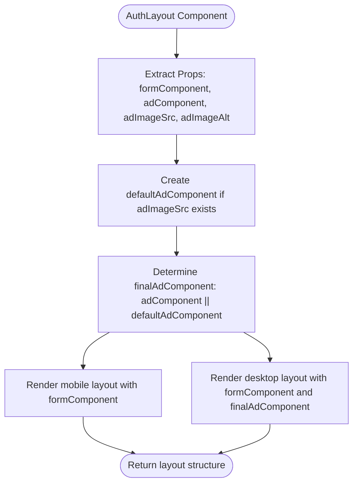
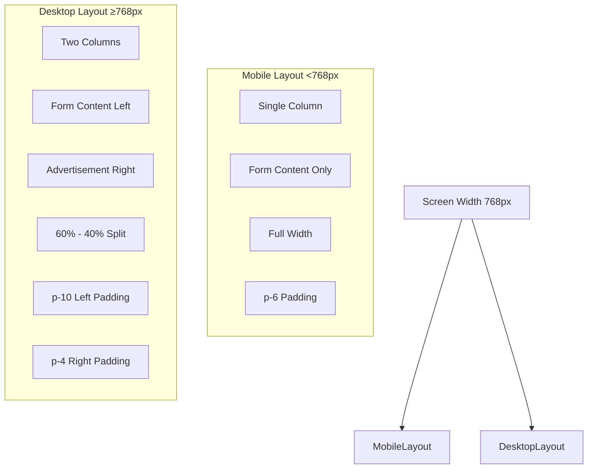
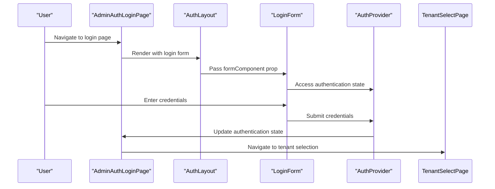
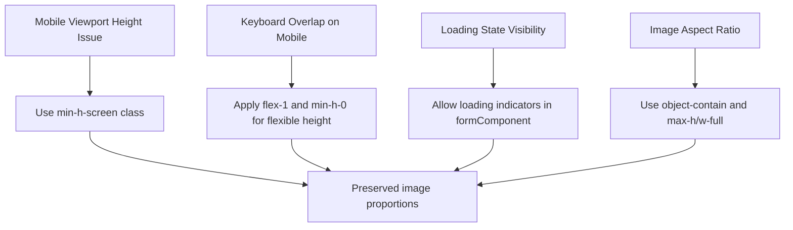
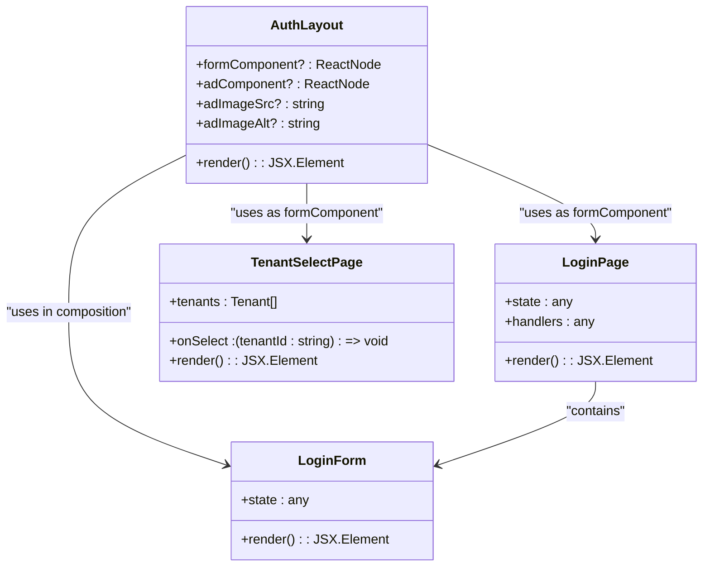

# Auth Layout Component

<cite>
**Referenced Files in This Document**   
- [AuthLayout.tsx](file://packages/ui/src/components/ui/layouts/Auth/AuthLayout.tsx)
- [AuthLayout.stories.tsx](file://packages/ui/src/components/ui/layouts/Auth/AuthLayout.stories.tsx)
- [LoginPage.tsx](file://packages/ui/src/components/page/LoginPage.tsx)
- [TenantSelectPage.tsx](file://packages/ui/src/components/page/TenantSelectPage.tsx)
- [login.tsx](file://apps/admin/src/routes/admin/auth/login.tsx)
- [tenant-select.tsx](file://apps/admin/src/routes/admin/auth/login/tenant-select.tsx)
- [auth.tsx](file://apps/admin/auth.tsx)
</cite>

## Table of Contents
1. [Introduction](#introduction)
2. [Core Implementation](#core-implementation)
3. [Responsive Design Strategy](#responsive-design-strategy)
4. [Authentication Flow Integration](#authentication-flow-integration)
5. [Accessibility Features](#accessibility-features)
6. [Common Issues and Solutions](#common-issues-and-solutions)
7. [Usage Examples](#usage-examples)
8. [Component Architecture](#component-architecture)
9. [Conclusion](#conclusion)

## Introduction
The AuthLayout component serves as a dedicated container for authentication pages within the prj-core platform, specifically designed for login and tenant selection workflows. This component provides a consistent, responsive layout structure that enhances user experience across different device types while maintaining brand consistency. The layout is optimized for authentication flows, featuring a flexible design that accommodates both form content and promotional/advertisement content on larger screens.

**Section sources**
- [AuthLayout.tsx](file://packages/ui/src/components/ui/layouts/Auth/AuthLayout.tsx#L1-L48)

## Core Implementation
The AuthLayout component is implemented as a React functional component that accepts several props to customize its behavior and appearance. The core implementation focuses on creating a responsive container that adapts to different screen sizes while maintaining proper content alignment and spacing.

The component accepts four primary props: `formComponent` for the authentication form content, `adComponent` for custom advertisement content, `adImageSrc` for simple image advertisements, and `adImageAlt` for accessibility purposes. When an advertisement image source is provided without a custom ad component, the layout automatically generates a default image container with appropriate styling.

**Diagram sources**
- [AuthLayout.tsx](file://packages/ui/src/components/ui/layouts/Auth/AuthLayout.tsx#L1-L48)

**Section sources**
- [AuthLayout.tsx](file://packages/ui/src/components/ui/layouts/Auth/AuthLayout.tsx#L1-L48)

## Responsive Design Strategy
The AuthLayout implements a mobile-first responsive design approach that adapts to different screen sizes using CSS flexbox and media queries. On mobile devices (screen width less than 768px), the layout displays the form content in a single column with appropriate padding. On desktop devices, the layout transforms into a two-column structure that places the form on the left and advertisement content on the right.

The responsive behavior is achieved through Tailwind CSS classes that control the display property based on screen size. The mobile layout uses `md:hidden` to hide the single-column layout on medium screens and larger, while the desktop layout uses `md:flex` to display the two-column layout only on medium screens and larger.

The layout also implements proper spacing and alignment on both mobile and desktop views. On mobile, the form content is given `p-6` padding for comfortable touch interaction, while on desktop, the left column has `p-10` padding and the right column has `p-4` padding to create visual hierarchy and balance.

**Diagram sources**
- [AuthLayout.tsx](file://packages/ui/src/components/ui/layouts/Auth/AuthLayout.tsx#L32-L44)

**Section sources**
- [AuthLayout.tsx](file://packages/ui/src/components/ui/layouts/Auth/AuthLayout.tsx#L30-L48)

## Authentication Flow Integration
The AuthLayout component is integrated into the authentication flow through its usage in key authentication pages such as AdminAuthLoginPage and AdminAuthTenantSelectPage. These pages leverage the layout to provide a consistent user experience across different stages of the authentication process.

In the login flow, the component is used to display the login form with email and password fields, while in the tenant selection phase, it hosts a modal-based selection interface. The layout's flexibility allows it to accommodate different types of form content while maintaining a consistent overall structure.

The integration with authentication state management is achieved through the AuthProvider context, which makes authentication state available to all components within the layout. This allows form components to access and update authentication state as needed during the login process.

**Diagram sources**
- [login.tsx](file://apps/admin/src/routes/admin/auth/login.tsx#L80-L88)
- [tenant-select.tsx](file://apps/admin/src/routes/admin/auth/login/tenant-select.tsx#L29-L46)

**Section sources**
- [login.tsx](file://apps/admin/src/routes/admin/auth/login.tsx#L1-L88)
- [tenant-select.tsx](file://apps/admin/src/routes/admin/auth/login/tenant-select.tsx#L1-L50)

## Accessibility Features
The AuthLayout component incorporates several accessibility features to ensure an inclusive user experience. The layout uses semantic HTML structure with appropriate ARIA attributes and follows accessibility best practices for form handling and focus management.

Key accessibility features include:
- Proper alt text for images through the `adImageAlt` prop with a default value of "Advertisement"
- Semantic structure that maintains logical reading order for screen readers
- Sufficient color contrast and spacing for users with visual impairments
- Keyboard navigation support through proper focus management
- Responsive design that adapts to different screen sizes and assistive technologies

The component also ensures that interactive elements are properly labeled and that form controls have associated labels, making it easier for screen reader users to understand and interact with the content.

**Section sources**
- [AuthLayout.tsx](file://packages/ui/src/components/ui/layouts/Auth/AuthLayout.tsx#L6-L13)

## Common Issues and Solutions
The AuthLayout implementation addresses several common issues encountered in authentication interfaces:

### Viewport Height Calculation on Mobile Devices
The layout uses `min-h-screen` to ensure the container fills at least the full viewport height, preventing content from appearing cut off on mobile devices with varying screen sizes and browser chrome.

### Keyboard Avoidance in Login Forms
On mobile devices, the layout's flexible structure with `flex-1` and `min-h-0` classes ensures that the form content remains visible when the virtual keyboard appears, preventing the form from being obscured.

### Loading State Presentation
While not directly implemented in the AuthLayout component, the pattern allows for easy integration of loading states through the formComponent prop. Loading indicators can be included within the form content, and the layout will properly display them in the centered position.

**Diagram sources**
- [AuthLayout.tsx](file://packages/ui/src/components/ui/layouts/Auth/AuthLayout.tsx#L30-L48)

**Section sources**
- [AuthLayout.tsx](file://packages/ui/src/components/ui/layouts/Auth/AuthLayout.tsx#L30-L48)

## Usage Examples
The AuthLayout component is used in various authentication scenarios throughout the application. Two primary examples demonstrate its flexibility and reusability:

### Admin Authentication Login Page
The AdminAuthLoginPage uses the AuthLayout to present a login form with email and password fields. The layout centers the form content and provides space for promotional content on desktop devices.

### Tenant Selection Page
The AdminAuthTenantSelectPage utilizes the AuthLayout to display a modal-based tenant selection interface. The layout adapts to host the modal content while maintaining consistent styling and positioning.

The component can be customized through its props to accommodate different advertisement types, from simple images to rich interactive content, making it versatile for various branding and marketing needs.

**Section sources**
- [LoginPage.tsx](file://packages/ui/src/components/page/LoginPage.tsx#L1-L26)
- [TenantSelectPage.tsx](file://packages/ui/src/components/page/TenantSelectPage.tsx#L1-L73)

## Component Architecture
The AuthLayout is part of a larger component hierarchy within the shared-frontend package. It serves as a specialized layout component that works in conjunction with page-level components and form components to create complete authentication experiences.

The architecture follows a composition pattern where higher-level components (like LoginPage and TenantSelectPage) are passed as the formComponent prop to AuthLayout. This separation of concerns allows for independent development and testing of form components while ensuring consistent layout and styling across authentication pages.

**Diagram sources**
- [AuthLayout.tsx](file://packages/ui/src/components/ui/layouts/Auth/AuthLayout.tsx#L3-L8)
- [LoginPage.tsx](file://packages/ui/src/components/page/LoginPage.tsx#L7-L25)
- [TenantSelectPage.tsx](file://packages/ui/src/components/page/TenantSelectPage.tsx#L24-L72)

**Section sources**
- [AuthLayout.tsx](file://packages/ui/src/components/ui/layouts/Auth/AuthLayout.tsx#L1-L48)
- [LoginPage.tsx](file://packages/ui/src/components/page/LoginPage.tsx#L1-L26)
- [TenantSelectPage.tsx](file://packages/ui/src/components/page/TenantSelectPage.tsx#L1-L73)

## Conclusion
The AuthLayout component provides a robust, flexible foundation for authentication interfaces in the prj-core platform. Its responsive design ensures optimal user experience across devices, while its component architecture promotes reusability and consistency. The layout effectively separates concerns between content and presentation, allowing teams to focus on form functionality while maintaining brand standards. With built-in accessibility features and solutions to common mobile interface challenges, the AuthLayout represents a comprehensive solution for authentication page design.