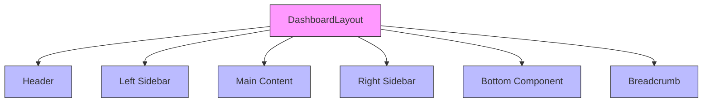

# Layout and Structure Components

<cite>
**Referenced Files in This Document**   
- [AuthLayout.tsx](file://packages/ui/src/components/layout/Auth/AuthLayout.tsx)
- [CollapsibleSidebarLayout.tsx](file://packages/ui/src/components/layout/CollapsibleSidebar/CollapsibleSidebarLayout.tsx)
- [DashboardLayout.tsx](file://packages/ui/src/components/layout/Dashboard/DashboardLayout.tsx)
- [Header.tsx](file://packages/ui/src/components/layout/Header/Header.tsx)
- [Main.tsx](file://packages/ui/src/components/layout/Main/Main.tsx)
- [Modal.tsx](file://packages/ui/src/components/layout/Modal/Modal.tsx)
- [index.ts](file://packages/ui/src/components/layout/index.ts)
</cite>

## Table of Contents
1. [Introduction](#introduction)
2. [Core Layout Components](#core-layout-components)
3. [Responsive Design Patterns](#responsive-design-patterns)
4. [State Management Integration](#state-management-integration)
5. [Accessibility Considerations](#accessibility-considerations)
6. [Common Issues and Solutions](#common-issues-and-solutions)
7. [Component Composition Examples](#component-composition-examples)
8. [Performance Optimization](#performance-optimization)

## Introduction
The shared-frontend package provides a comprehensive set of layout and structure components designed to create consistent, responsive, and accessible user interfaces across both admin and mobile applications. These components follow a modular architecture that enables flexible composition while maintaining a cohesive design system. The layout system is built on a foundation of reusable components that handle authentication flows, dashboard navigation, content organization, and modal interactions, with careful attention to responsive behavior across different screen sizes and device types.

## Core Layout Components

### AuthLayout
The AuthLayout component provides a structured layout for authentication pages with support for both form and advertisement content. It features a responsive design that adapts between mobile and desktop views, with the form component taking full width on mobile and being positioned alongside an advertisement section on desktop. The component supports custom advertisement components or can render a default image-based ad when provided with an image source.

**Section sources**
- [AuthLayout.tsx](file://packages/ui/src/components/layout/Auth/AuthLayout.tsx#L1-L49)

### CollapsibleSidebarLayout
The CollapsibleSidebarLayout component implements a toggleable sidebar navigation system with dynamic width based on collapse state. When collapsed, the sidebar reduces to 20 units width, displaying only icons and a toggle button. When expanded, it extends to 72 units width, showing parent menu information including name, icon, and a collapse toggle. The component includes accessibility features such as appropriate ARIA labels for the toggle button.

**Section sources**
- [CollapsibleSidebarLayout.tsx](file://packages/ui/src/components/layout/CollapsibleSidebar/CollapsibleSidebarLayout.tsx#L1-L83)

### Dashboard Container
The DashboardLayout component serves as the primary container for dashboard interfaces, implementing a responsive three-column layout system. It supports header, left sidebar, right sidebar, bottom component, and breadcrumb navigation as optional props, with fallback placeholder content when components are not provided. The layout adapts to different screen sizes, hiding the right sidebar below the xl breakpoint and displaying the bottom component only on mobile devices.

**Diagram sources**
- [DashboardLayout.tsx](file://packages/ui/src/components/layout/Dashboard/DashboardLayout.tsx#L1-L104)

**Section sources**
- [DashboardLayout.tsx](file://packages/ui/src/components/layout/Dashboard/DashboardLayout.tsx#L1-L104)

### Header
The Header component provides a flexible navigation bar with three distinct content areas: left, center, and right. This tripartite structure enables various layout patterns such as logo on the left, navigation in the center, and user controls on the right. The component uses the Navbar component from the UI library with backdrop blur effects and border styling to create a modern, floating header appearance.

**Section sources**
- [Header.tsx](file://packages/ui/src/components/layout/Header/Header.tsx#L1-L37)

### Main Content Area
The MainLayout component serves as a wrapper for primary content areas, providing consistent spacing and visual treatment. It uses a VStack (vertical stack) layout with margin, rounded corners, and a border to create a card-like container for content. This component ensures consistent presentation of main content across different pages and applications.

**Section sources**
- [Main.tsx](file://packages/ui/src/components/layout/Main/Main.tsx#L1-L13)

### Modal Components
The Modal component wraps the base modal functionality from the UI library with predefined default behaviors. It supports header, body, and footer sections through dedicated props, allowing for structured modal content. The component is configured with inside scroll behavior and a large (5xl) default size, with the ability to override these defaults through props. By default, it renders as an open modal with a no-op close function, leaving state management to the parent component.

**Section sources**
- [Modal.tsx](file://packages/ui/src/components/layout/Modal/Modal.tsx#L1-L38)

## Responsive Design Patterns

### Breakpoint Configuration
The layout components implement responsive behavior using Tailwind CSS breakpoints, with specific threshold points determining component visibility and layout changes:

- **Mobile (default)**: Full-width layouts, vertical stacking
- **Tablet (md: ≥768px)**: Introduction of side-by-side layouts
- **Desktop (xl: ≥1280px)**: Full three-column dashboard layouts

The DashboardLayout specifically uses the xl breakpoint to control the visibility of the right sidebar (hidden below xl) and the bottom component (hidden above xl), creating a mobile-first adaptive interface.

### Mobile Adaptation
On mobile devices, the layout system prioritizes content hierarchy and touch accessibility. The AuthLayout stacks form and advertisement content vertically, while the DashboardLayout replaces the right sidebar with a bottom component that serves as mobile navigation or toolbar. This bottom component is specifically designed for thumb-friendly access in portrait orientation.

### Desktop Optimization
On desktop, the layout components maximize screen real estate with multi-column layouts. The DashboardLayout implements a sticky header with backdrop blur effects, creating a modern, layered interface. The left sidebar maintains a fixed width of 72 units when expanded, providing ample space for navigation items and controls.

## State Management Integration

### Sidebar Collapse State
The CollapsibleSidebarLayout component integrates with global state management through its required props: `isCollapsed` and `onToggle`. This design pattern delegates state management to parent components or global stores, enabling synchronization of sidebar state across different parts of the application. The component itself is purely presentational, focusing on rendering based on the provided state.

### Dynamic Behavior Patterns
The layout components follow a controlled component pattern, where dynamic behaviors are managed externally. For example, the Modal component does not manage its open/closed state internally but expects this to be controlled by parent components. This approach enables consistent state management across the application and facilitates features like modal stacking and complex interaction flows.

## Accessibility Considerations

### Focus Trapping in Modal
While the base Modal component from the UI library likely implements focus trapping, the wrapper component maintains this accessibility feature through the `scrollBehavior="inside"` prop. This ensures that keyboard navigation remains confined within the modal when open, preventing users from accidentally navigating to background content.

### Keyboard Navigation Support
The layout components incorporate several accessibility features:
- The sidebar toggle button includes appropriate ARIA labels that change based on collapse state
- Interactive elements use semantic HTML and proper focus states
- Navigation components maintain logical tab order
- Visual indicators provide clear feedback for keyboard navigation

### Responsive Accessibility
The responsive design patterns inherently improve accessibility by adapting to different device capabilities and user preferences. The mobile-optimized layouts ensure adequate touch target sizes, while the desktop layouts provide efficient keyboard navigation paths through the three-column structure.

## Common Issues and Solutions

### Layout Shift
A potential source of layout shift is the conditional rendering of sidebar components. The DashboardLayout mitigates this by using consistent styling on the main content area regardless of sidebar presence. The left sidebar, when present, uses a fixed border and background that maintain visual continuity even when the right sidebar is hidden on smaller screens.

### Responsive Breakpoint Conflicts
The layout system avoids breakpoint conflicts by using a clear hierarchy of visibility rules. The right sidebar and bottom component have mutually exclusive visibility based on the xl breakpoint, preventing both from appearing simultaneously. This clean separation reduces complexity in responsive behavior and eliminates potential layout conflicts.

### Modal Stacking Problems
The Modal component design, which delegates state management to parent components, provides a foundation for implementing modal stacking. By controlling the `isOpen` prop externally, applications can manage multiple modal states and implement stacking behavior as needed, such as showing confirmation dialogs over form modals.

## Component Composition Examples

### Admin Application Layout
In the admin application, these components are composed to create a comprehensive dashboard interface. The DashboardLayout serves as the outer container, with the Header component providing top navigation, the CollapsibleSidebarLayout managing left navigation, and various content components filling the main area. The right sidebar can display contextual information or controls, while mobile views utilize the bottom component for navigation.

### Mobile Application Layout
For mobile applications, the composition emphasizes simplicity and touch accessibility. The AuthLayout presents login forms with supporting content in a vertical stack, while dashboard interfaces use the collapsed sidebar state by default, requiring users to explicitly expand for navigation. The bottom component provides persistent access to primary actions or navigation tabs.

## Performance Optimization

### Code Splitting Strategies
The layout components are designed to support code splitting through their modular architecture. Each component is exported individually from the index file, allowing applications to import only the components they need. This tree-shaking capability reduces bundle size, particularly important for mobile applications with limited bandwidth.

### Rendering Efficiency
The components implement several performance optimizations:
- Pure component design minimizes unnecessary re-renders
- Conditional rendering with null checks prevents empty component mounting
- Efficient CSS classes reduce style calculation overhead
- Virtualized scrolling in sidebar components handles large navigation sets

### Dynamic Viewport Calculations
The layout system uses CSS flexbox and viewport units to enable dynamic sizing without JavaScript calculations. The main content area flexes to fill available space, while fixed-width sidebars maintain consistent dimensions. This approach reduces JavaScript overhead and improves rendering performance, particularly during window resizing or orientation changes.

### Touch Gesture Support
While not explicitly implemented in the core layout components, the design accommodates touch gesture support through appropriate touch targets and spacing. The sidebar toggle button provides adequate size for touch interaction, and the responsive layouts ensure content is accessible without requiring precise finger placement.