# Shared Frontend Components

<cite>
**Referenced Files in This Document**   
- [Providers.tsx](file://packages/providers/src/Providers.tsx)
- [ui/README.md](file://packages/ui/README.md)
- [providers/README.md](file://packages/providers/README.md)
- [store/index.ts](file://packages/store/index.ts)
- [providers/index.ts](file://packages/providers/index.ts)
</cite>

## Table of Contents
1. [Introduction](#introduction)
2. [Project Structure](#project-structure)
3. [Core Components](#core-components)
4. [Architecture Overview](#architecture-overview)
5. [Detailed Component Analysis](#detailed-component-analysis)
6. [Dependency Analysis](#dependency-analysis)
7. [Performance Considerations](#performance-considerations)
8. [Troubleshooting Guide](#troubleshooting-guide)
9. [Conclusion](#conclusion)

## Introduction
The shared frontend components in the prj-core repository provide a unified UI and state management system across multiple applications. This documentation details the implementation of the shared-frontend package, focusing on the AppProviders component, UI component library, store system, and their integration with consuming applications (admin and mobile). The system leverages MobX for state management, React Query for data fetching, and Storybook for component isolation and testing.

## Project Structure
The shared frontend components are organized within the monorepo's packages directory, with clear separation between providers, UI components, and state management stores. The structure enables code reuse and consistent implementation across applications.

**Diagram sources**
- [packages/providers/src/Providers.tsx](file://packages/providers/src/Providers.tsx)
- [packages/ui/README.md](file://packages/ui/README.md)

**Section sources**
- [packages/providers/src/Providers.tsx](file://packages/providers/src/Providers.tsx)
- [packages/ui/README.md](file://packages/ui/README.md)

## Core Components
The shared frontend system consists of three main component categories: providers for global state and configuration, UI components organized by category, and stores for application state management. These components work together to create a consistent user experience across applications while enabling efficient development workflows.

**Section sources**
- [packages/providers/src/Providers.tsx](file://packages/providers/src/Providers.tsx)
- [packages/ui/README.md](file://packages/ui/README.md)
- [packages/store/index.ts](file://packages/store/index.ts)

## Architecture Overview
The shared frontend architecture follows a layered approach with clear separation of concerns. At the foundation are the providers that establish global context, followed by the UI component library that implements the visual design system, and finally the store system that manages application state.

**Diagram sources**
- [packages/providers/src/Providers.tsx](file://packages/providers/src/Providers.tsx)
- [packages/ui/README.md](file://packages/ui/README.md)

## Detailed Component Analysis

### AppProviders Analysis
The AppProviders component serves as the central configuration point for the application, wrapping the entire app with necessary providers for state management, data fetching, and UI libraries.

#### For API/Service Components:

**Diagram sources**
- [packages/providers/src/Providers.tsx](file://packages/providers/src/Providers.tsx)

**Section sources**
- [packages/providers/src/Providers.tsx](file://packages/providers/src/Providers.tsx)

### UI Component Library Analysis
The UI component library is organized by category (buttons, inputs, layout components) and follows a consistent API design pattern. Components are designed to be composable and theme-aware.

#### For Object-Oriented Components:

**Diagram sources**
- [packages/ui/README.md](file://packages/ui/README.md)

**Section sources**
- [packages/ui/README.md](file://packages/ui/README.md)

### Store System Analysis
The store system implements global state management using MobX, providing a reactive state container for authentication, navigation, and other shared application state.

#### For Complex Logic Components:

```mermaid
flowchart TD
Start([Store Initialization]) --> AuthStore["Create authStore instance"]
AuthStore --> TokenStore["Create tokenStore instance"]
TokenStore --> CookieStore["Create cookieStore instance"]
CookieStore --> NavigationStore["Create navigationStore instance"]
NavigationStore --> RouteStore["Create routeStore instance"]
RouteStore --> PlateStore["Create plateStore instance"]
PlateStore --> StorageStore["Create storageStore instance"]
StorageStore --> End([Stores Ready])
subgraph "State Flow"
A["Component Request"] --> B{"Store State Check"}
B --> |Valid| C["Return Cached State"]
B --> |Invalid| D["Fetch New Data"]
D --> E["Update Store State"]
E --> F["Persist to Storage"]
F --> C
end
```

**Diagram sources**
- [packages/store/index.ts](file://packages/store/index.ts)
- [packages/store/src/stores](file://packages/store/src/stores)

**Section sources**
- [packages/store/index.ts](file://packages/store/index.ts)
- [packages/store/src/stores](file://packages/store/src/stores)

## Dependency Analysis
The shared frontend components have well-defined dependencies that enable functionality while maintaining separation of concerns. The dependency graph shows how components relate to each other and to external libraries.

**Diagram sources**
- [packages/providers/README.md](file://packages/providers/README.md)
- [packages/ui/README.md](file://packages/ui/README.md)

**Section sources**
- [packages/providers/README.md](file://packages/providers/README.md)
- [packages/ui/README.md](file://packages/ui/README.md)

## Performance Considerations
The shared frontend components are optimized for performance through several key strategies: tree-shaking to eliminate unused code, memoization to prevent unnecessary re-renders, and lazy loading for improved initial load times. The components are designed to be lightweight and efficient, with careful attention to bundle size and runtime performance.

The implementation follows best practices for React optimization, including the use of React.memo for components that receive the same props, useCallback for function references, and useMemo for expensive calculations. The tree-shakable exports ensure that applications only include the components they actually use, minimizing bundle size.

## Troubleshooting Guide
Common issues with the shared frontend components typically relate to provider configuration, state synchronization, and theme context. When encountering problems, first verify that all necessary providers are properly wrapped around the application components in the correct order.

For state synchronization issues between applications, ensure that the store instances are properly initialized and that state updates are being propagated correctly. When working with the DarkModeSwitch component, verify that the theme context is properly configured and that the CSS variables for light and dark modes are correctly defined.

If components are not rendering as expected, check the Storybook examples to verify the correct usage pattern. The Storybook integration provides isolated component testing and documentation, making it easier to identify and resolve implementation issues.

**Section sources**
- [packages/providers/README.md](file://packages/providers/README.md)
- [packages/ui/README.md](file://packages/ui/README.md)

## Conclusion
The shared frontend components in prj-core provide a robust foundation for building consistent, maintainable user interfaces across multiple applications. By centralizing UI components, state management, and configuration, the system enables efficient development while ensuring a cohesive user experience. The combination of MobX for state management, React Query for data fetching, and Storybook for component isolation creates a powerful development environment that addresses common challenges like prop drilling and state synchronization. With proper implementation and adherence to best practices, these components can significantly improve development velocity and application quality.