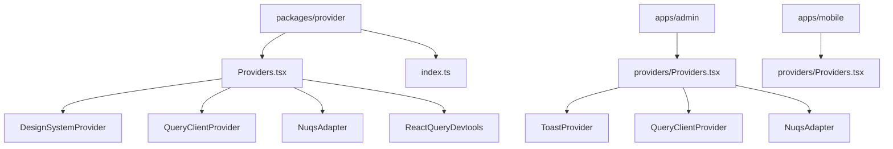
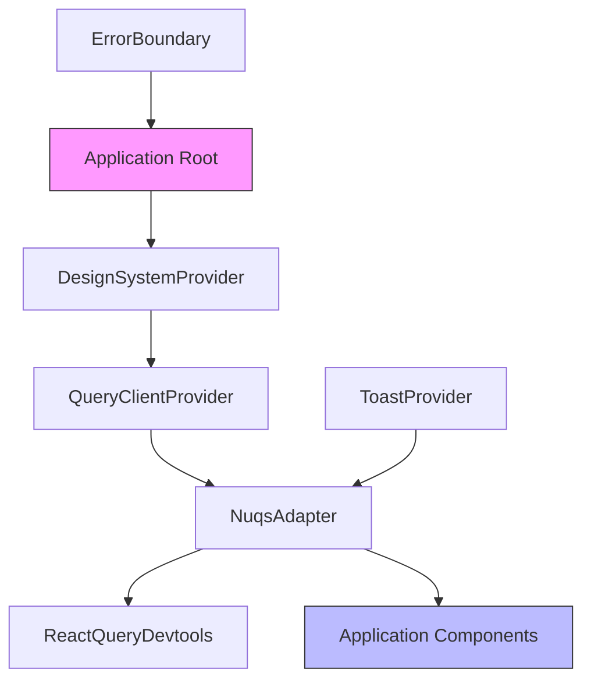
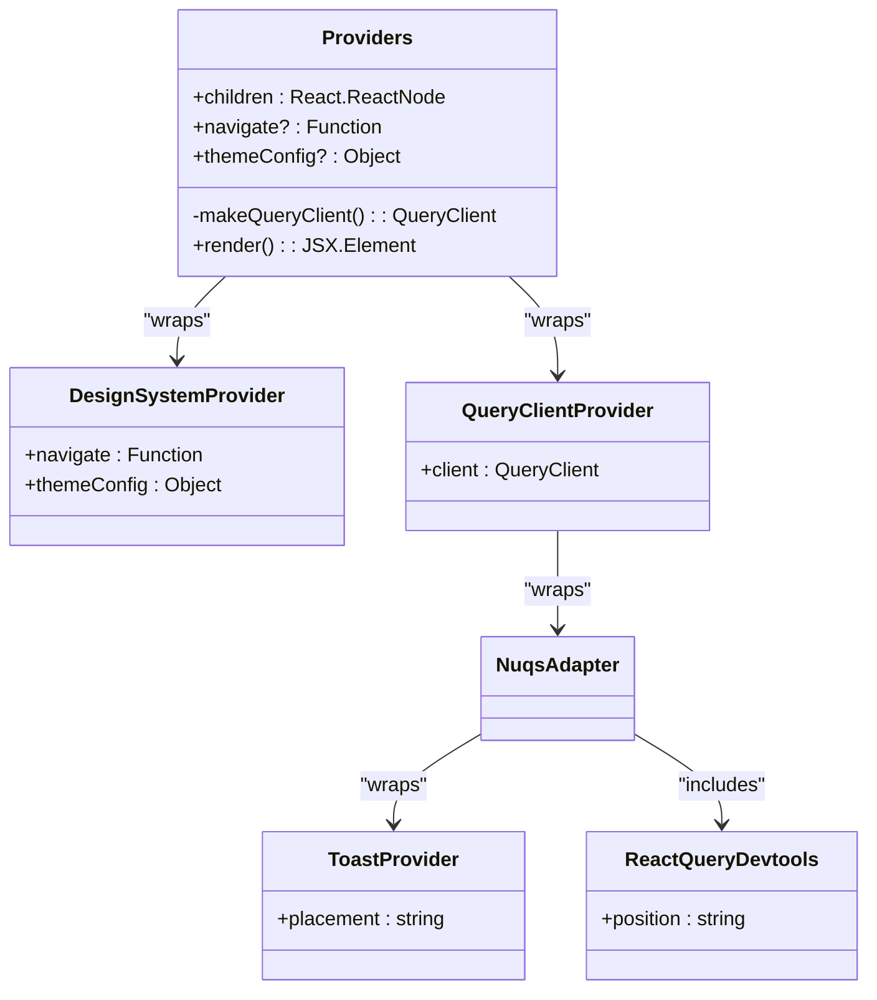
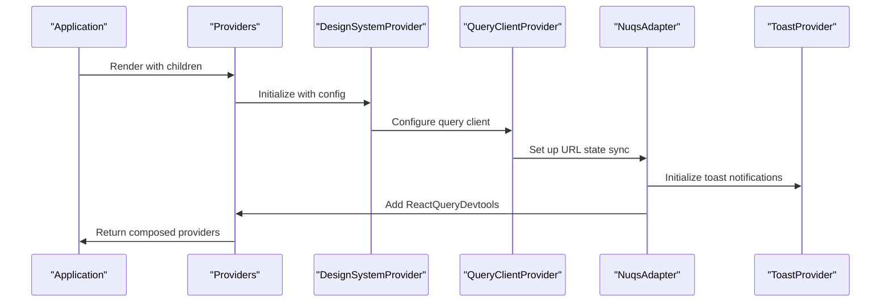
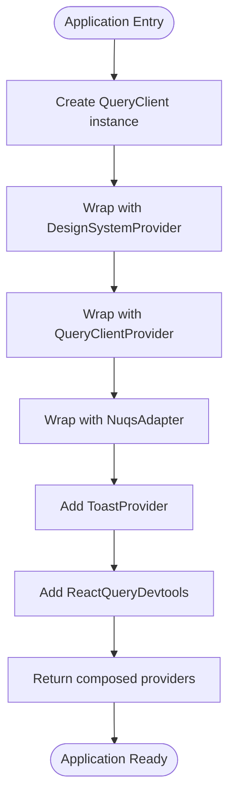
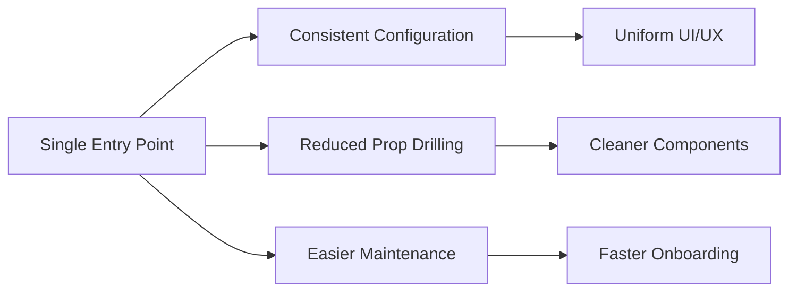
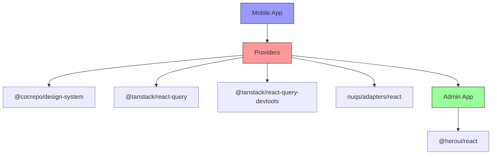

# AppProviders Composition

<cite>
**Referenced Files in This Document**   
- [Providers.tsx](file://packages/provider/src/Providers.tsx)
- [Providers.tsx](file://apps/admin/src/providers/Providers.tsx)
- [index.ts](file://packages/provider/index.ts)
- [README.md](file://packages/provider/README.md)
</cite>

## Table of Contents
1. [Introduction](#introduction)
2. [Project Structure](#project-structure)
3. [Core Components](#core-components)
4. [Architecture Overview](#architecture-overview)
5. [Detailed Component Analysis](#detailed-component-analysis)
6. [Dependency Analysis](#dependency-analysis)
7. [Performance Considerations](#performance-considerations)
8. [Troubleshooting Guide](#troubleshooting-guide)
9. [Conclusion](#conclusion)

## Introduction
The AppProviders composition pattern in prj-core serves as a centralized mechanism for orchestrating multiple context providers across applications. This documentation details how the Providers component acts as a root-level provider that composes various context layers including data management, UI libraries, and design system configurations. The pattern eliminates prop drilling by establishing a single entry point for all application-wide contexts, ensuring consistent state management across both admin and mobile applications within the monorepo.

## Project Structure
The provider composition system is organized as a shared package that can be consumed across multiple applications. The core implementation resides in the packages/provider directory, with application-specific adaptations in individual app directories such as apps/admin. This structure enables code reuse while allowing for application-specific configurations when needed.

**Diagram sources**
- [Providers.tsx](file://packages/provider/src/Providers.tsx)
- [Providers.tsx](file://apps/admin/src/providers/Providers.tsx)

**Section sources**
- [Providers.tsx](file://packages/provider/src/Providers.tsx)
- [Providers.tsx](file://apps/admin/src/providers/Providers.tsx)

## Core Components
The AppProviders composition pattern centers around the Providers component that combines multiple context providers into a single wrapper. This component imports and composes providers from various libraries including @cocrepo/design-system for UI theming, @tanstack/react-query for data fetching, and nuqs for URL state management. The composition follows a specific nesting order to ensure proper dependency resolution and context availability throughout the application tree.

**Section sources**
- [Providers.tsx](file://packages/provider/src/Providers.tsx)
- [index.ts](file://packages/provider/index.ts)

## Architecture Overview
The AppProviders architecture implements a layered approach to context composition, where each provider serves a specific purpose in the application stack. The design follows the principle of separation of concerns, with distinct layers for data management, UI configuration, and development tools. This architecture ensures that applications have access to all necessary contexts without requiring individual components to manage complex dependency chains.

**Diagram sources**
- [Providers.tsx](file://packages/provider/src/Providers.tsx)

## Detailed Component Analysis

### Provider Composition Analysis
The Providers component implements a composable pattern that wraps the application with multiple context providers in a specific order. This composition ensures that lower-level providers (closer to the root) can influence higher-level components while maintaining isolation between different concern areas. The pattern follows React's context composition best practices, with careful attention to the nesting order to prevent context unavailability issues.

#### For Object-Oriented Components:

**Diagram sources**
- [Providers.tsx](file://packages/provider/src/Providers.tsx)

#### For API/Service Components:

**Diagram sources**
- [Providers.tsx](file://packages/provider/src/Providers.tsx)

#### For Complex Logic Components:

**Diagram sources**
- [Providers.tsx](file://packages/provider/src/Providers.tsx)

**Section sources**
- [Providers.tsx](file://packages/provider/src/Providers.tsx)

### Conceptual Overview
The AppProviders pattern represents a strategic approach to managing global state and configuration in React applications. By consolidating multiple providers into a single composition point, the pattern simplifies application bootstrap and ensures consistency across different environments and applications within the monorepo. This approach reduces configuration drift and makes it easier to update provider configurations across all applications simultaneously.

## Dependency Analysis
The AppProviders composition has well-defined dependencies on several key libraries that serve specific purposes in the application architecture. These dependencies are carefully managed to ensure minimal bundle size while providing maximum functionality. The pattern leverages tree-shaking capabilities to ensure that only used providers are included in the final bundle.

**Diagram sources**
- [package.json](file://packages/provider/package.json)
- [Providers.tsx](file://packages/provider/src/Providers.tsx)

**Section sources**
- [Providers.tsx](file://packages/provider/src/Providers.tsx)
- [README.md](file://packages/provider/README.md)

## Performance Considerations
The AppProviders composition is designed with performance optimization in mind. The pattern implements several strategies to minimize runtime overhead and bundle size. The makeQueryClient function creates a new QueryClient instance only when needed, preventing unnecessary re-creation during component re-renders. The composition order is optimized to ensure that providers with the broadest impact are closest to the root, reducing context re-renders in deeply nested components.

The implementation also considers development vs production differences, including conditional rendering of ReactQueryDevtools only in development environments. This prevents debug tools from being included in production bundles, reducing payload size. Additionally, the modular nature of the composition allows applications to import only the providers they need, enabling tree-shaking to eliminate unused code.

**Section sources**
- [Providers.tsx](file://packages/provider/src/Providers.tsx)

## Troubleshooting Guide
Common issues with the AppProviders composition typically relate to provider ordering, missing dependencies, or configuration conflicts. When providers are nested in the wrong order, components may not have access to required contexts, resulting in runtime errors. To resolve ordering issues, ensure that providers with dependencies come after their dependencies in the composition chain.

Another common issue is missing provider imports, which can cause type errors or runtime failures. Always verify that all required providers are imported and properly composed. For configuration conflicts, particularly with theme or navigation settings, ensure that conflicting props are properly resolved at the composition level rather than within individual components.

When debugging provider-related issues, the React DevTools can be used to inspect the context tree and verify that all providers are properly mounted and configured. The ReactQueryDevtools also provides valuable insights into query state and can help identify data fetching issues that may be related to provider configuration.

**Section sources**
- [Providers.tsx](file://packages/provider/src/Providers.tsx)
- [README.md](file://packages/provider/README.md)

## Conclusion
The AppProviders composition pattern in prj-core provides a robust solution for managing global state and configuration across multiple applications. By centralizing provider composition, the pattern eliminates prop drilling, ensures consistency, and simplifies application bootstrap. The implementation demonstrates best practices in React context management, with careful attention to performance, maintainability, and developer experience. This approach enables both rapid development of new features and reliable maintenance of existing functionality across the monorepo ecosystem.