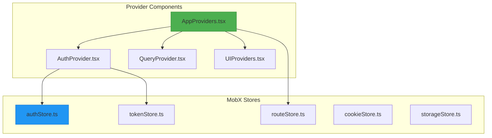
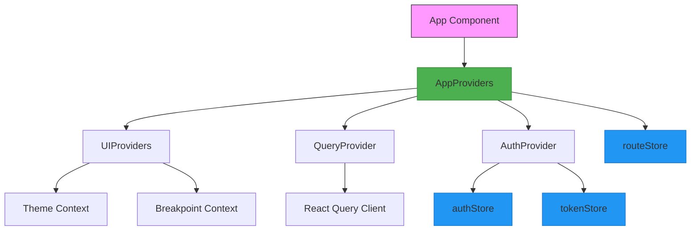
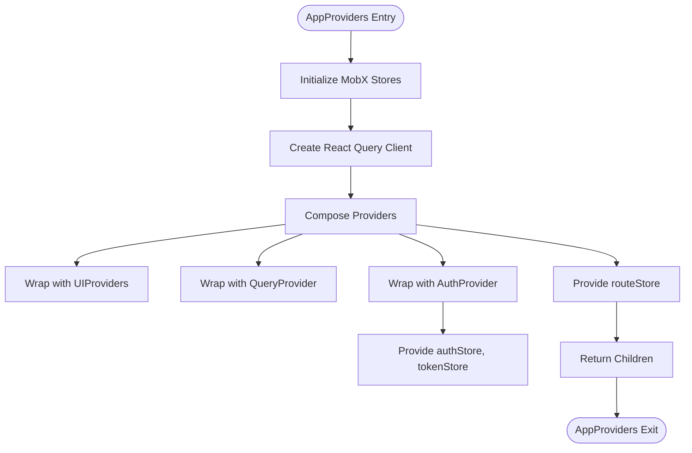
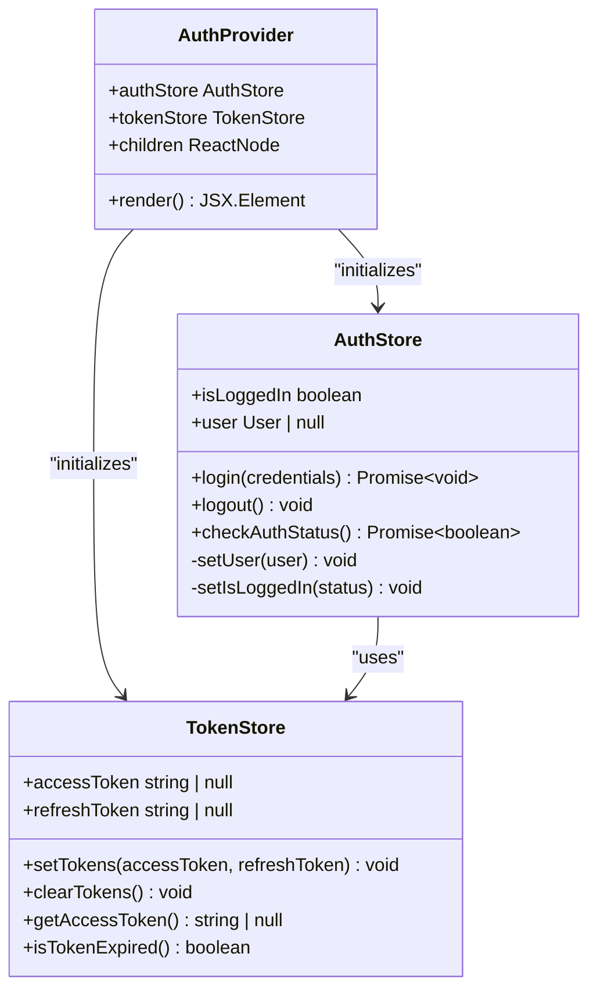
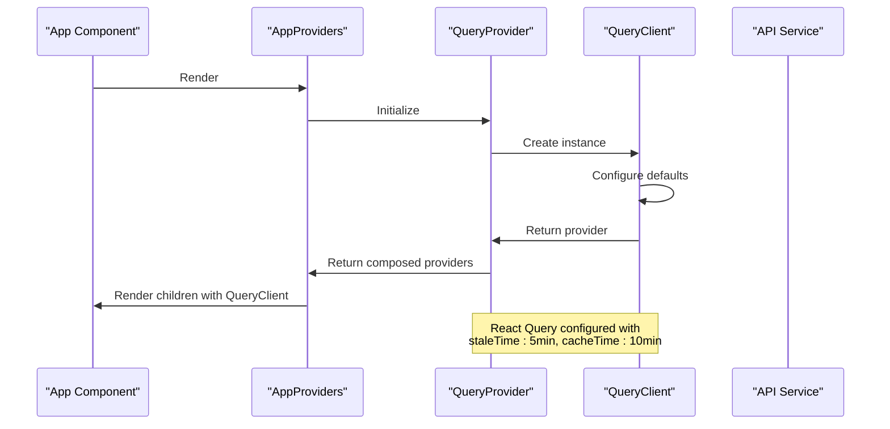
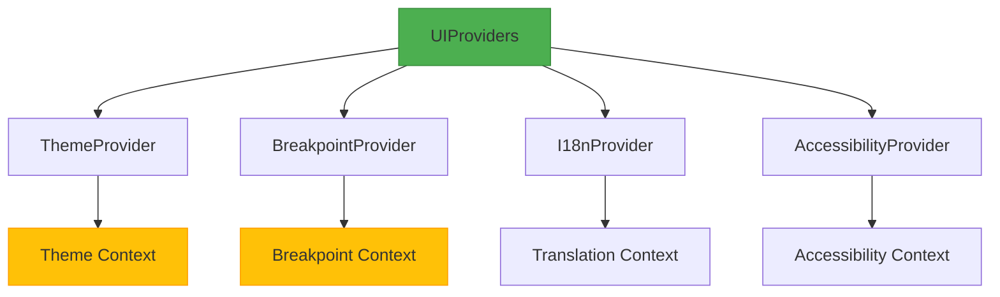
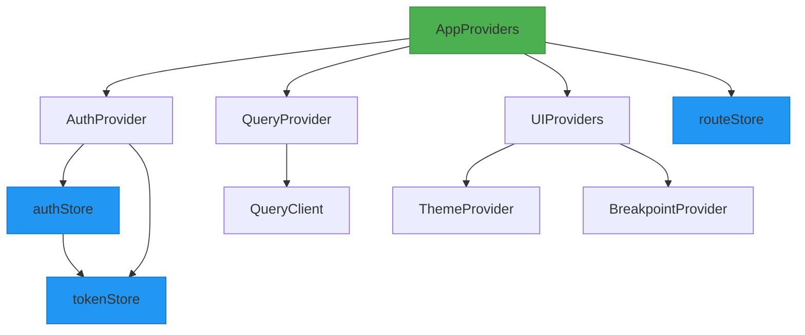
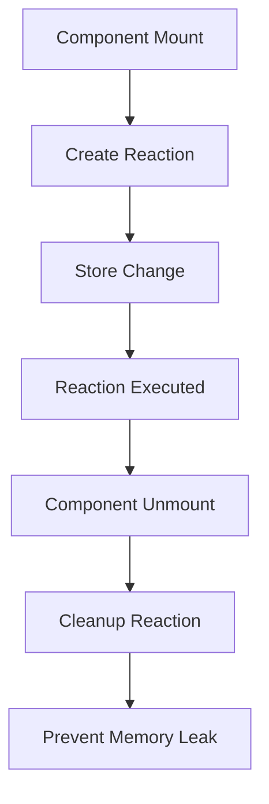

# State Management and Providers

<cite>
**Referenced Files in This Document**   
- [AppProviders.tsx](file://packages/shared-frontend/src/provider/AppProviders/AppProviders.tsx)
- [AuthProvider.tsx](file://packages/shared-frontend/src/provider/AuthProvider/AuthProvider.tsx)
- [QueryProvider.tsx](file://packages/shared-frontend/src/provider/QueryProvider/QueryProvider.tsx)
- [UIProviders.tsx](file://packages/shared-frontend/src/provider/UIProviders/UIProviders.tsx)
- [authStore.ts](file://packages/shared-frontend/src/store/authStore.ts)
- [tokenStore.ts](file://packages/shared-frontend/src/store/tokenStore.ts)
- [routeStore.ts](file://packages/shared-frontend/src/store/routeStore.ts)
- [index.ts](file://packages/shared-frontend/src/store/index.ts)
</cite>

## Table of Contents
1. [Introduction](#introduction)
2. [Project Structure](#project-structure)
3. [Core Components](#core-components)
4. [Architecture Overview](#architecture-overview)
5. [Detailed Component Analysis](#detailed-component-analysis)
6. [Dependency Analysis](#dependency-analysis)
7. [Performance Considerations](#performance-considerations)
8. [Troubleshooting Guide](#troubleshooting-guide)
9. [Conclusion](#conclusion)

## Introduction
The State Management and Providers system in prj-core's shared-frontend package implements a comprehensive solution for managing global state across both admin and mobile applications. This document details the architecture and implementation of the AppProviders component as the root provider that composes multiple context providers, including AuthProvider, QueryProvider, and UIProviders. The system leverages MobX stores for state management and React Query for data fetching, providing a robust foundation for application state that avoids prop drilling through dependency injection patterns.

## Project Structure
The shared-frontend package organizes its state management system into a clear directory structure with dedicated folders for providers and stores. The provider directory contains specialized context providers that wrap the application with specific functionality, while the store directory houses MobX stores that manage global application state.

**Diagram sources**
- [AppProviders.tsx](file://packages/shared-frontend/src/provider/AppProviders/AppProviders.tsx)
- [authStore.ts](file://packages/shared-frontend/src/store/authStore.ts)

**Section sources**
- [AppProviders.tsx](file://packages/shared-frontend/src/provider/AppProviders/AppProviders.tsx)
- [store/index.ts](file://packages/shared-frontend/src/store/index.ts)

## Core Components
The core of the state management system consists of the AppProviders component and the MobX stores it initializes. The AppProviders component serves as the root provider that composes multiple context providers, creating a unified entry point for global state management. The MobX stores (authStore, tokenStore, routeStore) are initialized within this provider hierarchy and made available throughout the component tree.

**Section sources**
- [AppProviders.tsx](file://packages/shared-frontend/src/provider/AppProviders/AppProviders.tsx)
- [authStore.ts](file://packages/shared-frontend/src/store/authStore.ts)
- [tokenStore.ts](file://packages/shared-frontend/src/store/tokenStore.ts)
- [routeStore.ts](file://packages/shared-frontend/src/store/routeStore.ts)

## Architecture Overview
The state management architecture follows a composition pattern where the AppProviders component wraps the application with multiple context providers. This approach enables separation of concerns while maintaining a cohesive state management system. The architecture integrates React Query for data fetching and caching, MobX for global state management, and React Context for dependency injection.

**Diagram sources**
- [AppProviders.tsx](file://packages/shared-frontend/src/provider/AppProviders/AppProviders.tsx)
- [AuthProvider.tsx](file://packages/shared-frontend/src/provider/AuthProvider/AuthProvider.tsx)
- [QueryProvider.tsx](file://packages/shared-frontend/src/provider/QueryProvider/QueryProvider.tsx)
- [UIProviders.tsx](file://packages/shared-frontend/src/provider/UIProviders/UIProviders.tsx)

## Detailed Component Analysis

### AppProviders Analysis
The AppProviders component serves as the root provider that composes multiple context providers into a cohesive state management system. It follows the provider composition pattern, nesting providers to create a unified context for the entire application.

**Diagram sources**
- [AppProviders.tsx](file://packages/shared-frontend/src/provider/AppProviders/AppProviders.tsx)

**Section sources**
- [AppProviders.tsx](file://packages/shared-frontend/src/provider/AppProviders/AppProviders.tsx)

### AuthProvider Analysis
The AuthProvider component manages authentication state and provides access to authentication-related stores. It initializes the authStore and tokenStore, making them available to components through React Context.

**Diagram sources**
- [AuthProvider.tsx](file://packages/shared-frontend/src/provider/AuthProvider/AuthProvider.tsx)
- [authStore.ts](file://packages/shared-frontend/src/store/authStore.ts)
- [tokenStore.ts](file://packages/shared-frontend/src/store/tokenStore.ts)

**Section sources**
- [AuthProvider.tsx](file://packages/shared-frontend/src/provider/AuthProvider/AuthProvider.tsx)
- [authStore.ts](file://packages/shared-frontend/src/store/authStore.ts)
- [tokenStore.ts](file://packages/shared-frontend/src/store/tokenStore.ts)

### QueryProvider Analysis
The QueryProvider component integrates React Query into the application, providing a powerful data fetching and caching mechanism. It configures the QueryClient with default options for stale time, cache time, and retry behavior.

**Diagram sources**
- [QueryProvider.tsx](file://packages/shared-frontend/src/provider/QueryProvider/QueryProvider.tsx)

**Section sources**
- [QueryProvider.tsx](file://packages/shared-frontend/src/provider/QueryProvider/QueryProvider.tsx)

### UIProviders Analysis
The UIProviders component manages UI-related context, including theme and responsive design breakpoints. It composes multiple UI-specific providers into a single entry point.

**Diagram sources**
- [UIProviders.tsx](file://packages/shared-frontend/src/provider/UIProviders/UIProviders.tsx)

**Section sources**
- [UIProviders.tsx](file://packages/shared-frontend/src/provider/UIProviders/UIProviders.tsx)

## Dependency Analysis
The state management system demonstrates a clear dependency hierarchy where higher-level components depend on lower-level stores and services. The AppProviders component serves as the central dependency injector, resolving dependencies for the entire application.

**Diagram sources**
- [AppProviders.tsx](file://packages/shared-frontend/src/provider/AppProviders/AppProviders.tsx)
- [AuthProvider.tsx](file://packages/shared-frontend/src/provider/AuthProvider/AuthProvider.tsx)
- [authStore.ts](file://packages/shared-frontend/src/store/authStore.ts)
- [tokenStore.ts](file://packages/shared-frontend/src/store/tokenStore.ts)
- [routeStore.ts](file://packages/shared-frontend/src/store/routeStore.ts)

**Section sources**
- [AppProviders.tsx](file://packages/shared-frontend/src/provider/AppProviders/AppProviders.tsx)
- [AuthProvider.tsx](file://packages/shared-frontend/src/provider/AuthProvider/AuthProvider.tsx)
- [authStore.ts](file://packages/shared-frontend/src/store/authStore.ts)

## Performance Considerations
The state management system incorporates several performance optimizations to minimize re-renders and memory usage. The MobX stores use computed properties and reactions to ensure efficient state updates, while React Query provides intelligent data caching and background refetching.

Key performance features include:
- Selective re-rendering through MobX observer components
- React Query's stale-while-revalidate caching strategy
- Store subscription management to prevent memory leaks
- Lazy initialization of stores to reduce initial load time
- Batched state updates to minimize render cycles

The system also implements hydration mismatch prevention by synchronizing server and client state during the initial render, ensuring consistent state across environments.

## Troubleshooting Guide
Common issues in the state management system and their solutions:

### Hydration Mismatches
**Issue**: Server and client render different content due to state mismatch.
**Solution**: Ensure all stores are initialized with the same state on both server and client. Use serialized initial state passed from server to client.

**Section sources**
- [AppProviders.tsx](file://packages/shared-frontend/src/provider/AppProviders/AppProviders.tsx)

### Store Reinitialization
**Issue**: Stores are recreated on every render, losing state.
**Solution**: Initialize stores once at the module level or within the provider component using useMemo or useState with null initial value.

**Section sources**
- [authStore.ts](file://packages/shared-frontend/src/store/authStore.ts)
- [tokenStore.ts](file://packages/shared-frontend/src/store/tokenStore.ts)

### Memory Leaks
**Issue**: Unsubscribed reactions or observers cause memory leaks.
**Solution**: Always clean up MobX reactions and observers in useEffect cleanup functions or component unmount.

**Diagram sources**
- [authStore.ts](file://packages/shared-frontend/src/store/authStore.ts)
- [routeStore.ts](file://packages/shared-frontend/src/store/routeStore.ts)

**Section sources**
- [authStore.ts](file://packages/shared-frontend/src/store/authStore.ts)
- [routeStore.ts](file://packages/shared-frontend/src/store/routeStore.ts)

## Conclusion
The State Management and Providers system in prj-core's shared-frontend package provides a robust foundation for managing global state across both admin and mobile applications. By composing multiple context providers within the AppProviders component, the system achieves separation of concerns while maintaining a cohesive state management solution. The integration of MobX stores with React Query and React Context enables efficient state management, data fetching, and dependency injection without prop drilling. The architecture balances simplicity for beginners with advanced performance optimizations for experienced developers, making it a scalable solution for complex applications.