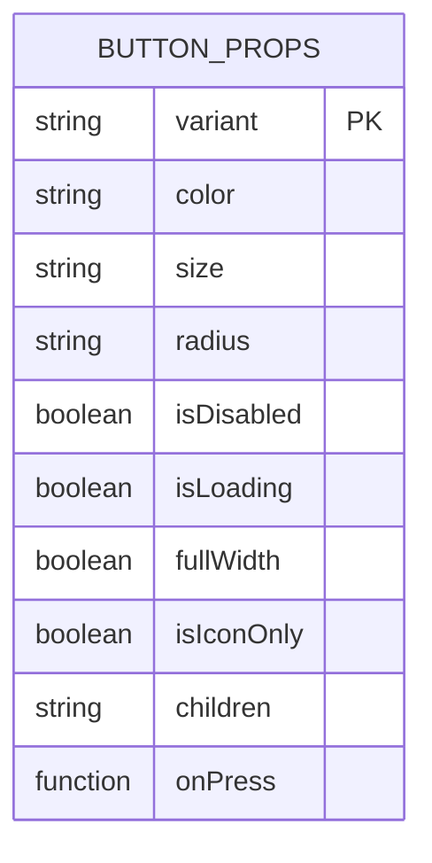
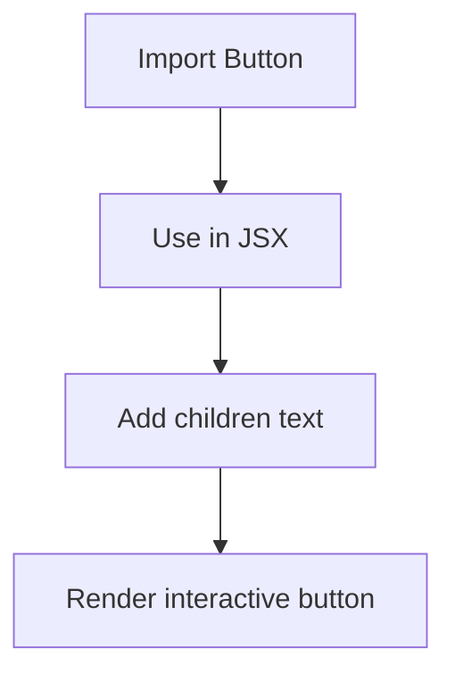
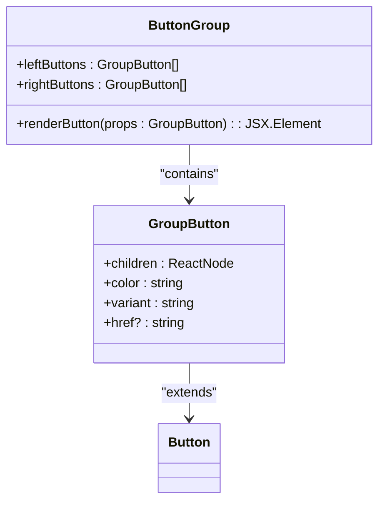

# Button Component

<cite>
**Referenced Files in This Document**   
- [Button.tsx](file://packages/ui/src/components/ui/inputs/Button/Button.tsx)
- [Button.stories.tsx](file://packages/ui/src/components/ui/inputs/Button/Button.stories.tsx)
- [ButtonGroup.tsx](file://packages/ui/src/components/ui/inputs/ButtonGroup/ButtonGroup.tsx)
- [ButtonGroup.stories.tsx](file://packages/ui/src/components/ui/inputs/ButtonGroup/ButtonGroup.stories.tsx)
- [index.ts](file://packages/ui/index.ts)
- [package.json](file://packages/ui/package.json)
</cite>

## Table of Contents
1. [Introduction](#introduction)
2. [Core Features](#core-features)
3. [Props API](#props-api)
4. [Usage Examples](#usage-examples)
5. [Accessibility Implementation](#accessibility-implementation)
6. [Styling Architecture](#styling-architecture)
7. [Button Group Integration](#button-group-integration)
8. [Common Issues and Solutions](#common-issues-and-solutions)
9. [Performance Optimization](#performance-optimization)
10. [Conclusion](#conclusion)

## Introduction
The Button component in the prj-core's shared-frontend package is a versatile UI element built on top of the @heroui/react library. It provides a consistent interface for user interactions across the application ecosystem. The component supports various visual styles, sizes, states, and integration patterns while maintaining accessibility standards. This documentation provides comprehensive guidance on implementing and using the Button component effectively.

**Section sources**
- [Button.tsx](file://packages/ui/src/components/ui/inputs/Button/Button.tsx)
- [Button.stories.tsx](file://packages/ui/src/components/ui/inputs/Button/Button.stories.tsx)

## Core Features

### Variant Types
The Button component supports multiple visual variants that define its appearance and emphasis level:
- **solid**: Default filled style with background color
- **bordered**: Outline style with border and transparent background
- **light**: Subtle style with minimal visual impact
- **flat**: Flat appearance without borders or shadows
- **faded**: Low-opacity style for secondary actions
- **shadow**: Elevated appearance with shadow effect
- **ghost**: Transparent style that appears on hover

### Size Options
Three predefined size options are available:
- **sm**: Small size for compact spaces
- **md**: Medium size (default) for standard usage
- **lg**: Large size for prominent actions

### Loading States
The component supports loading states through the `isLoading` prop, which displays a loading indicator and disables interactions during asynchronous operations.

### Icon Support
Buttons can display icons either alongside text or as icon-only elements using the `isIconOnly` prop. The component seamlessly integrates with the icon system through the shared utilities.

**Section sources**
- [Button.stories.tsx](file://packages/ui/src/components/ui/inputs/Button/Button.stories.tsx#L17-L27)

## Props API

### Button Props
The Button component accepts the following props:



**Diagram sources**
- [Button.stories.tsx](file://packages/ui/src/components/ui/inputs/Button/Button.stories.tsx#L16-L83)

#### Variant Prop
- **Type**: `"solid" | "bordered" | "light" | "flat" | "faded" | "shadow" | "ghost"`
- **Default**: `"solid"`
- **Description**: Controls the visual style of the button

#### Color Prop
- **Type**: `"default" | "primary" | "secondary" | "success" | "warning" | "danger"`
- **Default**: `"default"`
- **Description**: Determines the color theme of the button

#### Size Prop
- **Type**: `"sm" | "md" | "lg"`
- **Default**: `"md"`
- **Description**: Sets the size of the button

#### Radius Prop
- **Type**: `"none" | "sm" | "md" | "lg" | "full"`
- **Default**: `"md"`
- **Description**: Controls the border radius of the button

#### State Props
- **isDisabled**: Boolean that disables the button and prevents interactions
- **isLoading**: Boolean that shows a loading indicator and disables the button
- **fullWidth**: Boolean that makes the button span the full width of its container
- **isIconOnly**: Boolean that displays only the icon without text padding

#### Content and Interaction Props
- **children**: React node content to display inside the button
- **onPress**: Callback function triggered when the button is pressed

**Section sources**
- [Button.stories.tsx](file://packages/ui/src/components/ui/inputs/Button/Button.stories.tsx#L16-L83)
- [Button.tsx](file://packages/ui/src/components/ui/inputs/Button/Button.tsx#L3-L11)

## Usage Examples

### Basic Button


**Diagram sources**
- [Button.stories.tsx](file://packages/ui/src/components/ui/inputs/Button/Button.stories.tsx#L89-L93)

### Primary Action Button
For primary actions, use the primary color with solid variant:
```typescript
<Button color="primary" variant="solid">
  Submit Form
</Button>
```

### Secondary Action Button
For secondary actions, use bordered variant with appropriate color:
```typescript
<Button color="secondary" variant="bordered">
  Cancel
</Button>
```

### Danger Action Button
For destructive actions, use danger color:
```typescript
<Button color="danger">
  Delete Item
</Button>
```

### Loading State
During asynchronous operations:
```typescript
<Button isLoading color="primary">
  Processing...
</Button>
```

### Icon-Only Button
For compact interface elements:
```typescript
<Button isIconOnly color="danger" variant="light">
  ❤️
</Button>
```

**Section sources**
- [Button.stories.tsx](file://packages/ui/src/components/ui/inputs/Button/Button.stories.tsx#L102-L260)

## Accessibility Implementation

### ARIA Attributes
The Button component automatically handles accessibility attributes:
- **role**: Implicitly set to "button" for proper screen reader interpretation
- **aria-disabled**: Automatically applied when `isDisabled` prop is true
- **tabindex**: Managed internally for keyboard navigation

### Keyboard Navigation
The component supports standard keyboard interactions:
- **Enter/Space**: Trigger button action
- **Tab**: Navigate to button
- **Shift+Tab**: Navigate from button

### Focus States
Visual focus indicators are implemented using Tailwind CSS classes, ensuring visible focus rings for keyboard users while maintaining aesthetic consistency with the design system.

**Section sources**
- [Button.tsx](file://packages/ui/src/components/ui/inputs/Button/Button.tsx#L3-L11)
- [Button.stories.tsx](file://packages/ui/src/components/ui/inputs/Button/Button.stories.tsx#L174-L186)

## Styling Architecture

### Tailwind CSS Integration
The Button component leverages Tailwind CSS utility classes for styling, inheriting configuration from the global theme. The underlying @heroui/react Button component handles the class composition based on props.

### Theme Customization
Theme support is provided through the @heroui/use-theme package, allowing for consistent styling across the application. The button colors and variants align with the project's design tokens.

### Responsive Design
The component automatically adapts to different screen sizes through responsive utility classes. The `fullWidth` prop enables responsive width behavior for mobile interfaces.

**Section sources**
- [Button.tsx](file://packages/ui/src/components/ui/inputs/Button/Button.tsx#L3-L11)
- [package.json](file://packages/ui/package.json#L46-L47)

## Button Group Integration

### ButtonGroup Component
The ButtonGroup component provides a structured way to organize multiple buttons:



**Diagram sources**
- [ButtonGroup.tsx](file://packages/ui/src/components/ui/inputs/ButtonGroup/ButtonGroup.tsx#L4-L11)
- [ButtonGroup.stories.tsx](file://packages/ui/src/components/ui/inputs/ButtonGroup/ButtonGroup.stories.tsx#L31-L53)

### Layout Structure
The ButtonGroup arranges buttons in a flex layout with:
- Left-aligned buttons in the left container
- Right-aligned buttons in the right container
- Equal distribution of space between containers

### Navigation Integration
The ButtonGroup supports React Router integration through the `href` prop in GroupButton, automatically wrapping buttons in Link components when navigation is required.

### Usage Patterns
Common usage patterns include:
- Form action groups (Save, Cancel, Reset)
- Toolbar controls
- Pagination controls
- Modal dialog actions

**Section sources**
- [ButtonGroup.tsx](file://packages/ui/src/components/ui/inputs/ButtonGroup/ButtonGroup.tsx)
- [ButtonGroup.stories.tsx](file://packages/ui/src/components/ui/inputs/ButtonGroup/ButtonGroup.stories.tsx)

## Common Issues and Solutions

### Inconsistent Spacing
Issue: Buttons may have inconsistent spacing in different contexts.
Solution: Use the `fullWidth` prop for consistent width behavior, or wrap buttons in appropriate layout containers.

### Focus State Visibility
Issue: Focus states may not be sufficiently visible.
Solution: Ensure the global theme includes adequate focus ring styles, and test with keyboard navigation.

### Disabled Button Behavior
Issue: Disabled buttons may still appear interactive.
Solution: The component automatically applies appropriate styling and `aria-disabled` attributes, but ensure the `isDisabled` prop is properly bound to application state.

### Loading State Feedback
Issue: Users may not recognize loading states.
Solution: Always pair `isLoading` with appropriate text (e.g., "Loading...") and ensure the loading indicator is visible.

**Section sources**
- [Button.stories.tsx](file://packages/ui/src/components/ui/inputs/Button/Button.stories.tsx#L174-L186)
- [ButtonGroup.stories.tsx](file://packages/ui/src/components/ui/inputs/ButtonGroup/ButtonGroup.stories.tsx#L227-L236)

## Performance Optimization

### High-Frequency Rendering
For scenarios with frequent button state changes:
- Use memoization for button props when possible
- Avoid inline function creation in render methods
- Leverage React's useCallback for event handlers

### Bundle Size Considerations
The component is tree-shakable, so only imported components are included in the final bundle. The implementation re-exports from @heroui/react without adding significant overhead.

### Memory Management
The component does not maintain internal state beyond what is provided through props, minimizing memory footprint and preventing potential memory leaks.

**Section sources**
- [Button.tsx](file://packages/ui/src/components/ui/inputs/Button/Button.tsx)
- [index.ts](file://packages/ui/index.ts)

## Conclusion
The Button component in prj-core's shared-frontend package provides a robust, accessible, and visually consistent interface element for user interactions. By leveraging the @heroui/react foundation, it offers extensive customization options while maintaining performance and accessibility standards. The component integrates seamlessly with the broader design system and supports various usage patterns, from simple actions to complex button groups with navigation capabilities. Developers should follow the documented patterns for optimal results and consistent user experience across applications.