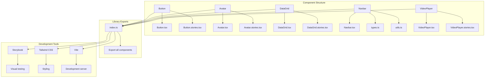
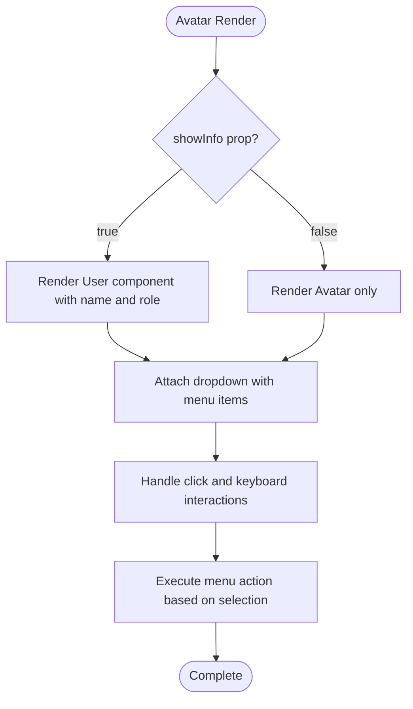
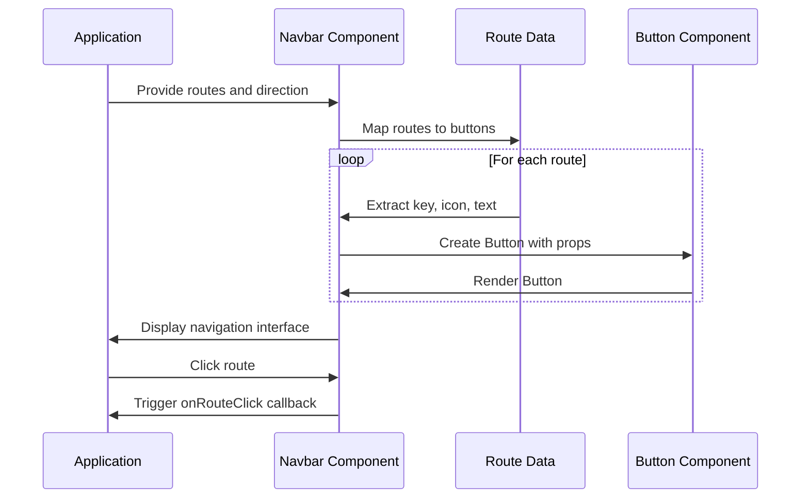
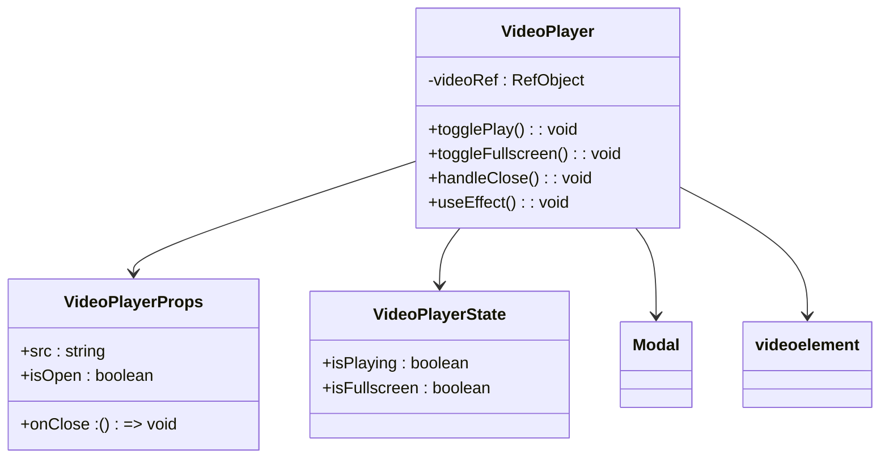

# UI Component Library

<cite>
**Referenced Files in This Document**   
- [Button.tsx](file://packages/ui/src/components/ui/Button/Button.tsx)
- [Avatar.tsx](file://packages/ui/src/components/ui/Avatar/Avatar.tsx)
- [DataGrid.tsx](file://packages/ui/src/components/ui/DataGrid/DataGrid.tsx)
- [Navbar.tsx](file://packages/ui/src/components/ui/Navbar/Navbar.tsx)
- [VideoPlayer.tsx](file://packages/ui/src/components/ui/VideoPlayer/VideoPlayer.tsx)
- [VideoPlayer.stories.tsx](file://packages/ui/src/components/ui/VideoPlayer/VideoPlayer.stories.tsx)
- [Avatar.stories.tsx](file://packages/ui/src/components/ui/Avatar/Avatar.stories.tsx)
- [index.ts](file://packages/ui/src/components/ui/index.ts)
- [package.json](file://packages/ui/package.json)
</cite>

## Table of Contents
1. [Introduction](#introduction)
2. [Project Structure](#project-structure)
3. [Core Components](#core-components)
4. [Architecture Overview](#architecture-overview)
5. [Detailed Component Analysis](#detailed-component-analysis)
6. [Dependency Analysis](#dependency-analysis)
7. [Performance Considerations](#performance-considerations)
8. [Troubleshooting Guide](#troubleshooting-guide)
9. [Conclusion](#conclusion)

## Introduction
This document provides comprehensive documentation for the UI Component Library in the prj-core's shared-frontend package, now correctly identified as the `@cocrepo/ui` package located in `packages/ui`. The library offers a collection of reusable UI components built with React, leveraging Tailwind CSS for styling and Storybook for component isolation and documentation. The components are designed to promote consistency across applications while providing flexibility through configurable props and theming support. This documentation covers the implementation details of core components including Button, Avatar, DataGrid, Navbar, and VideoPlayer, with special attention to accessibility, responsive design, and development workflows.

## Project Structure
The UI Component Library follows a modular structure organized by component type and functionality. Each component resides in its own directory under `packages/ui/src/components/ui/`, containing the component implementation file, stories for Storybook, and any supporting types or utilities. The library exports all components through a central index file, enabling easy imports across the codebase. The project leverages modern frontend tooling including Vite for development, Tailwind CSS for utility-first styling, and Storybook for visual testing and documentation.



**Diagram sources**
- [index.ts](file://packages/ui/src/components/ui/index.ts)
- [package.json](file://packages/ui/package.json)

**Section sources**
- [index.ts](file://packages/ui/src/components/ui/index.ts)
- [package.json](file://packages/ui/package.json)

## Core Components
The UI Component Library provides a comprehensive set of core components designed to address common interface patterns across applications. These components are built with accessibility, responsiveness, and reusability as primary concerns. The Button component serves as a wrapper around the underlying UI library's button implementation, providing a consistent interface. The Avatar component displays user information with interactive menu options. The DataGrid component offers a powerful table interface with selection and expansion capabilities. The Navbar component renders navigation routes with visual feedback for active states. The VideoPlayer component provides a modal-based video playback interface with playback controls. All components are designed to work seamlessly together while maintaining independence through well-defined props APIs.

**Section sources**
- [Button.tsx](file://packages/ui/src/components/ui/Button/Button.tsx)
- [Avatar.tsx](file://packages/ui/src/components/ui/Avatar/Avatar.tsx)
- [DataGrid.tsx](file://packages/ui/src/components/ui/DataGrid/DataGrid.tsx)
- [Navbar.tsx](file://packages/ui/src/components/ui/Navbar/Navbar.tsx)
- [VideoPlayer.tsx](file://packages/ui/src/components/ui/VideoPlayer/VideoPlayer.tsx)

## Architecture Overview
The UI Component Library follows a composition-based architecture that leverages existing UI libraries while providing a consistent interface layer. The components are built on top of `@heroui/react`, which provides the foundational UI primitives, while the library adds application-specific styling, behavior, and composition patterns. The architecture emphasizes separation of concerns, with each component responsible for its own presentation and interaction logic. The library uses Tailwind CSS for styling, enabling utility-first development and responsive design. Storybook is integrated for component isolation, visual testing, and documentation generation. The components are designed to be framework-agnostic in their interface while leveraging React-specific patterns for state management and lifecycle handling.

```mermaid
graph TD
A[Application] --> B[UI Component Library]
B --> C[@heroui/react]
B --> D[Tailwind CSS]
B --> E[Storybook]
B --> F[@tanstack/react-table]
G[DataGrid] --> F
H[VideoPlayer] --> C
I[Avatar] --> C
J[Button] --> C
K[Navbar] --> C
B --> L[Theme Context]
B --> M[Accessibility]
```

**Diagram sources**
- [package.json](file://packages/ui/package.json)
- [Button.tsx](file://packages/ui/src/components/ui/Button/Button.tsx)
- [DataGrid.tsx](file://packages/ui/src/components/ui/DataGrid/DataGrid.tsx)

## Detailed Component Analysis

### Button Component Analysis
The Button component serves as a wrapper around the `@heroui/react` Button component, providing a consistent interface across the application. It accepts all props from the underlying Button component and passes them through, enabling full access to the original component's functionality while maintaining a consistent import path and interface.

```mermaid
classDiagram
class Button {
+children : ReactNode
+onPress : () => void
+variant : string
+color : string
+isIconOnly : boolean
+className : string
}
Button --> "@heroui/react Button" : "wraps"
```

**Diagram sources**
- [Button.tsx](file://packages/ui/src/components/ui/Button/Button.tsx)

**Section sources**
- [Button.tsx](file://packages/ui/src/components/ui/Button/Button.tsx)

### Avatar Component Analysis
The Avatar component displays user information with an interactive dropdown menu. It supports two display modes: showing full user information with name and role, or showing only the avatar image. The component integrates with the application's environment detection to display the current environment in the menu. It uses the `@heroui/react` User and Avatar components for rendering, with custom SVG icons for menu items.

#### Accessibility Implementation
The Avatar component implements several accessibility features:
- Keyboard navigation through the dropdown menu
- ARIA labels for interactive elements
- Proper focus management
- Semantic HTML structure



**Diagram sources**
- [Avatar.tsx](file://packages/ui/src/components/ui/Avatar/Avatar.tsx)

**Section sources**
- [Avatar.tsx](file://packages/ui/src/components/ui/Avatar/Avatar.tsx)
- [Avatar.stories.tsx](file://packages/ui/src/components/ui/Avatar/Avatar.stories.tsx)

### DataGrid Component Analysis
The DataGrid component provides a powerful table interface built on top of `@tanstack/react-table`. It supports row selection, expansion of hierarchical data, and customizable columns. The component acts as a wrapper around the Table component, providing additional state management for selection and expansion.

#### Virtualized Rendering Considerations
While the current implementation does not include virtualized rendering, the architecture is compatible with such enhancements. The use of `@tanstack/react-table` provides a solid foundation for implementing virtualization to improve performance with large datasets.

```mermaid
classDiagram
class DataGridProps {
+data : Array<T & {id : Key}>
+columns : ColumnDef<T, any>[]
+state : DataGridState
+selectionMode : string
}
class DataGridState {
+selectedKeys : Key[] | null
}
class DataGrid {
-expanded : ExpandedState
-table : TableInstance
+useReactTable() : TableInstance
+onSelectionChange() : Selection
}
DataGrid --> DataGridProps
DataGrid --> DataGridState
DataGrid --> "@tanstack/react-table"
DataGrid --> Table
```

**Diagram sources**
- [DataGrid.tsx](file://packages/ui/src/components/ui/DataGrid/DataGrid.tsx)

**Section sources**
- [DataGrid.tsx](file://packages/ui/src/components/ui/DataGrid/DataGrid.tsx)

### Navbar Component Analysis
The Navbar component renders a navigation interface that can be displayed horizontally or vertically. It accepts a list of routes with properties for display text, icons, and active state. The component uses memoization to optimize rendering performance and provides callbacks for route selection.

#### Responsive Design Patterns
The Navbar component adapts to different screen sizes through its direction prop, allowing it to be used in both horizontal navigation bars and vertical sidebars. The styling uses Tailwind CSS classes that respond to screen size changes.



**Diagram sources**
- [Navbar.tsx](file://packages/ui/src/components/ui/Navbar/Navbar.tsx)

**Section sources**
- [Navbar.tsx](file://packages/ui/src/components/ui/Navbar/Navbar.tsx)

### VideoPlayer Component Analysis
The VideoPlayer component provides a modal-based interface for video playback. It supports play/pause functionality, fullscreen mode, and proper cleanup when closed. The component uses the native HTML5 video element with custom controls.

#### Lazy Loading Implementation
The VideoPlayer implements lazy loading by only loading the video content when the modal is opened. This prevents unnecessary network requests and bandwidth usage when the video is not being viewed.



**Diagram sources**
- [VideoPlayer.tsx](file://packages/ui/src/components/ui/VideoPlayer/VideoPlayer.tsx)

**Section sources**
- [VideoPlayer.tsx](file://packages/ui/src/components/ui/VideoPlayer/VideoPlayer.tsx)
- [VideoPlayer.stories.tsx](file://packages/ui/src/components/ui/VideoPlayer/VideoPlayer.stories.tsx)

## Dependency Analysis
The UI Component Library has a well-defined dependency structure that balances functionality with bundle size considerations. The library relies on several key external dependencies:

```mermaid
graph TD
A[@cocrepo/ui] --> B[@heroui/react]
A --> C[@tanstack/react-table]
A --> D[Tailwind CSS]
A --> E[Storybook]
A --> F[lucide-react]
A --> G[@cocrepo/toolkit]
B --> H[React]
B --> I[Framer Motion]
C --> H
D --> J[PostCSS]
E --> H
F --> H
G --> H
```

The library uses `@heroui/react` as its foundational UI component library, which provides the base implementations for many components. `@tanstack/react-table` is used for the DataGrid component, providing powerful table functionality. Tailwind CSS handles all styling needs with its utility-first approach. Storybook is used for development and documentation. The library also depends on `@cocrepo/toolkit` for environment detection and other utilities.

**Diagram sources**
- [package.json](file://packages/ui/package.json)

**Section sources**
- [package.json](file://packages/ui/package.json)

## Performance Considerations
The UI Component Library implements several performance optimizations to ensure responsive and efficient rendering:

1. **Memoization**: Components like Navbar use React.memo and useMemo to prevent unnecessary re-renders.
2. **Lazy Loading**: The VideoPlayer component only loads video content when the modal is opened.
3. **Efficient State Management**: Components use local state only when necessary, minimizing re-renders.
4. **Tree Shaking**: The library structure enables tree shaking, allowing applications to import only the components they need.
5. **Virtualization Potential**: The DataGrid component is built on `@tanstack/react-table`, which supports virtualization for large datasets.

For complex components like DataGrid, performance can be further optimized by implementing virtualized rendering to handle large datasets efficiently. The current implementation may experience performance degradation with very large datasets due to the lack of virtualization.

## Troubleshooting Guide
Common issues with the UI Component Library and their solutions:

1. **Inconsistent Styling**: Ensure Tailwind CSS is properly configured in the consuming application. The library relies on Tailwind's utility classes for styling.
2. **Accessibility Violations**: Verify that all interactive elements have proper ARIA labels and keyboard navigation support. Test with screen readers and keyboard-only navigation.
3. **Performance Bottlenecks in DataGrid**: For large datasets, consider implementing virtualized rendering or pagination to improve performance.
4. **Theme Inconsistencies**: Ensure the consuming application properly sets up the theme context that the components rely on.
5. **Missing Icons**: Verify that lucide-react is installed and properly configured for icon rendering.

When encountering issues, first check the Storybook documentation for the component, as it provides working examples and prop documentation.

**Section sources**
- [Button.tsx](file://packages/ui/src/components/ui/Button/Button.tsx)
- [Avatar.tsx](file://packages/ui/src/components/ui/Avatar/Avatar.tsx)
- [DataGrid.tsx](file://packages/ui/src/components/ui/DataGrid/DataGrid.tsx)
- [VideoPlayer.tsx](file://packages/ui/src/components/ui/VideoPlayer/VideoPlayer.tsx)

## Conclusion
The UI Component Library provides a robust foundation for building consistent and accessible user interfaces across the prj-core ecosystem. By leveraging modern React patterns, utility-first CSS, and comprehensive documentation through Storybook, the library enables rapid development while maintaining high quality standards. The component architecture balances reusability with flexibility, allowing teams to build custom interfaces while adhering to design system guidelines. Future enhancements could include virtualized rendering for the DataGrid component, improved theming support, and expanded accessibility features. The library serves as a critical piece of the frontend architecture, promoting consistency and efficiency across applications.