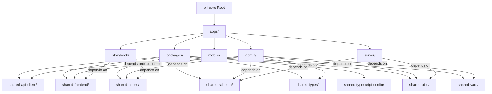
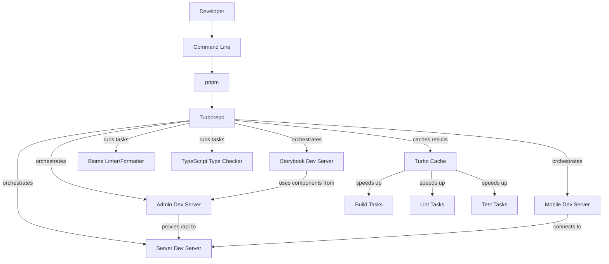
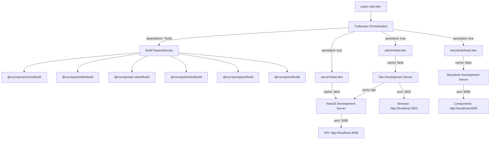
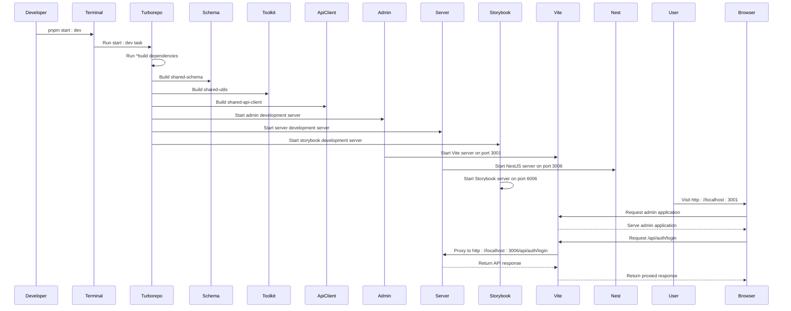

# Development Workflow

<cite>
**Referenced Files in This Document**   
- [package.json](file://package.json)
- [turbo.json](file://turbo.json)
- [pnpm-workspace.yaml](file://pnpm-workspace.yaml)
- [README.md](file://README.md)
- [biome.json](file://biome.json)
- [apps/admin/package.json](file://apps/admin/package.json)
- [apps/server/package.json](file://apps/server/package.json)
- [apps/storybook/package.json](file://apps/storybook/package.json)
- [apps/admin/vite.config.ts](file://apps/admin/vite.config.ts)
- [apps/server/src/main.ts](file://apps/server/src/main.ts)
</cite>

## Table of Contents
1. [Introduction](#introduction)
2. [Project Structure](#project-structure)
3. [Core Components](#core-components)
4. [Architecture Overview](#architecture-overview)
5. [Detailed Component Analysis](#detailed-component-analysis)
6. [Dependency Analysis](#dependency-analysis)
7. [Performance Considerations](#performance-considerations)
8. [Troubleshooting Guide](#troubleshooting-guide)
9. [Conclusion](#conclusion)

## Introduction
The prj-core development workflow is built on a modern monorepo architecture using pnpm and Turborepo for efficient dependency management and task orchestration. This document provides a comprehensive guide to the development process, covering everything from initial setup to daily development tasks and deployment preparation. The workflow supports concurrent development servers for multiple applications, including an admin web application, a mobile application, a backend server, and a Storybook component library. The system leverages TypeScript, React, NestJS, and Prisma to create a type-safe, scalable, and maintainable codebase.

## Project Structure
The prj-core repository follows a monorepo structure with applications and shared packages organized in a clear hierarchy. The root directory contains configuration files for the monorepo tooling, while the `apps` directory houses the main applications and the `packages` directory contains shared libraries that can be consumed across applications.



**Diagram sources**
- [package.json](file://package.json)
- [pnpm-workspace.yaml](file://pnpm-workspace.yaml)

**Section sources**
- [package.json](file://package.json)
- [pnpm-workspace.yaml](file://pnpm-workspace.yaml)
- [README.md](file://README.md)

## Core Components
The prj-core development workflow is centered around several core components that work together to provide a seamless development experience. The pnpm package manager handles dependency installation with efficient disk usage through hard linking, while Turborepo orchestrates task execution across the monorepo with intelligent caching and parallelization. The Biome tool provides unified linting, formatting, and type checking, ensuring code quality across the entire codebase. Each application in the monorepo has its own development server that can be run independently or concurrently with other applications.

**Section sources**
- [package.json](file://package.json)
- [turbo.json](file://turbo.json)
- [biome.json](file://biome.json)

## Architecture Overview
The prj-core development architecture is designed to maximize developer productivity and code quality through a combination of modern tooling and best practices. The monorepo structure enables code sharing and consistent tooling across applications, while Turborepo's task orchestration ensures efficient builds and development server startup. The architecture supports concurrent development of multiple applications, with each application running on its own port and with its own development server configuration.



**Diagram sources**
- [package.json](file://package.json)
- [turbo.json](file://turbo.json)
- [apps/admin/vite.config.ts](file://apps/admin/vite.config.ts)

**Section sources**
- [package.json](file://package.json)
- [turbo.json](file://turbo.json)
- [README.md](file://README.md)

## Detailed Component Analysis

### Package Management with pnpm
The prj-core repository uses pnpm as its package manager, which provides efficient disk usage through the use of hard links and a content-addressable store. The pnpm workspace configuration in `pnpm-workspace.yaml` defines the packages that are part of the monorepo, allowing for shared dependencies and consistent versioning across applications.

```mermaid
graph TD
Root[prj-core Root]
--> PNPM[pnpm-workspace.yaml]
PNPM --> Apps[apps/*]
PNPM --> Packages[packages/*]
Apps --> Admin[admin/]
Apps --> Server[server/]
Apps --> Storybook[storybook/]
Apps --> Mobile[mobile/]
Packages --> ApiClient[shared-api-client/]
Packages --> Frontend[shared-frontend/]
Packages --> Hooks[shared-hooks/]
Packages --> Schema[shared-schema/]
Packages --> Types[shared-types/]
Packages --> TypescriptConfig[shared-typescript-config/]
Packages --> Utils[shared-utils/]
Packages --> Vars[shared-vars/]
PNPM --> Catalog[Dependency Catalog]
Catalog --> Biome[@biomejs/biome]
Catalog --> React[react]
Catalog --> Tailwind[tailwindcss]
Catalog --> Typescript[typescript]
Catalog --> Vite[vite]
Catalog --> Vitest[vitest]
```

**Diagram sources**
- [pnpm-workspace.yaml](file://pnpm-workspace.yaml)

**Section sources**
- [pnpm-workspace.yaml](file://pnpm-workspace.yaml)
- [package.json](file://package.json)

### Task Orchestration with Turborepo
Turborepo is the backbone of the prj-core development workflow, providing intelligent task orchestration and caching. The `turbo.json` configuration file defines tasks for building, testing, linting, and running applications, with dependencies between tasks ensuring correct execution order. Turborepo's caching mechanism stores the results of expensive operations like builds and type checking, dramatically reducing development server startup time on subsequent runs.



**Diagram sources**
- [turbo.json](file://turbo.json)
- [package.json](file://package.json)

**Section sources**
- [turbo.json](file://turbo.json)
- [package.json](file://package.json)

### Development Server Configuration
Each application in the prj-core monorepo has its own development server configuration tailored to its specific needs. The admin application uses Vite with React SWC for fast hot module replacement, while the server application uses NestJS with nodemon for automatic restarts on code changes. The development servers are configured to run on different ports to allow concurrent execution, with proxy configuration in the admin application routing API requests to the server application.



**Diagram sources**
- [apps/admin/package.json](file://apps/admin/package.json)
- [apps/server/package.json](file://apps/server/package.json)
- [apps/admin/vite.config.ts](file://apps/admin/vite.config.ts)
- [apps/server/src/main.ts](file://apps/server/src/main.ts)

**Section sources**
- [apps/admin/package.json](file://apps/admin/package.json)
- [apps/server/package.json](file://apps/server/package.json)
- [apps/admin/vite.config.ts](file://apps/admin/vite.config.ts)
- [apps/server/src/main.ts](file://apps/server/src/main.ts)

## Dependency Analysis
The prj-core monorepo has a well-defined dependency graph that ensures consistent versioning and efficient dependency installation. The root `package.json` file contains devDependencies that are shared across all packages, while each application and package has its own `package.json` file with specific dependencies. The pnpm workspace configuration enables dependency hoisting, reducing disk usage and installation time.

```mermaid
graph TD
Root[Root package.json]
--> Biome[@biomejs/biome]
--> Vite[vite]
--> ReactSWC[@vitejs/plugin-react-swc]
--> Vitest[vitest]
--> Typescript[typescript]
--> NodeTypes[@types/node]
Admin[apps/admin/package.json]
--> ApiClient[@cocrepo/api-client]
--> Store[@cocrepo/store]
--> Toolkit[@cocrepo/toolkit]
--> UI[@cocrepo/ui]
--> DndKit[@dnd-kit/core]
--> TanStack[@tanstack/react-query]
--> TanStackRouter[@tanstack/react-router]
--> HeroUI[@heroui/react]
--> Tailwind[tailwindcss]
--> FramerMotion[framer-motion]
--> Lucide[lucide-react]
--> MobX[mobx]
--> MobXReact[mobx-react-lite]
--> Valtio[valtio]
Server[apps/server/package.json]
--> Schema[@cocrepo/schema]
--> Toolkit[@cocrepo/toolkit]
--> NestJS[@nestjs/core]
--> Prisma[@prisma/client]
--> Casl[@casl/ability]
--> Passport[@nestjs/passport]
--> Jwt[@nestjs/jwt]
--> Swagger[@nestjs/swagger]
--> Pino[nestjs-pino]
--> Sharp[sharp]
--> Bcrypt[bcrypt]
Storybook[apps/storybook/package.json]
--> UI[@cocrepo/ui]
--> Hooks[@cocrepo/hooks]
--> Store[@cocrepo/store]
--> Toolkit[@cocrepo/toolkit]
--> HeroUI[@heroui/react]
--> Tailwind[tailwindcss]
--> Storybook[storybook]
ApiClient[packages/shared-api-client/package.json]
--> Types[@cocrepo/types]
--> Orval[orval]
Frontend[packages/shared-frontend/package.json]
--> UI[@cocrepo/ui]
--> Store[@cocrepo/store]
--> Hooks[@cocrepo/hooks]
--> Toolkit[@cocrepo/toolkit]
--> Types[@cocrepo/types]
Schema[packages/shared-schema/package.json]
--> Prisma[prisma]
--> Types[@cocrepo/types]
--> Toolkit[@cocrepo/toolkit]
Utils[packages/shared-utils/package.json]
--> Types[@cocrepo/types]
```

**Diagram sources**
- [package.json](file://package.json)
- [apps/admin/package.json](file://apps/admin/package.json)
- [apps/server/package.json](file://apps/server/package.json)
- [apps/storybook/package.json](file://apps/storybook/package.json)
- [packages/api-client/package.json](file://packages/shared-api-client/package.json)
- [packages/shared-frontend/package.json](file://packages/shared-frontend/package.json)
- [packages/shared-schema/package.json](file://packages/shared-schema/package.json)
- [packages/shared-utils/package.json](file://packages/shared-utils/package.json)

**Section sources**
- [package.json](file://package.json)
- [pnpm-workspace.yaml](file://pnpm-workspace.yaml)

## Performance Considerations
The prj-core development workflow is optimized for performance through several key strategies. Turborepo's caching mechanism stores the results of expensive operations like builds and type checking, ensuring that subsequent runs are much faster. The use of Vite for the admin application provides lightning-fast hot module replacement, while the monorepo structure enables code sharing and reduces duplication. The development servers are configured to run concurrently, allowing developers to work on multiple applications simultaneously without performance degradation.

```mermaid
flowchart TD
Subgraph PerformanceOptimizations
TurborepoCache["Turborepo Cache"]
--> |Caches| BuildCache["Build Results"]
--> |Caches| TypeCheckCache["Type Checking Results"]
--> |Caches| LintCache["Linting Results"]
ViteHMR["Vite HMR"]
--> |Fast| ModuleReplacement["Module Replacement"]
--> |No Full Reload| FastFeedback["Fast Feedback Loop"]
MonorepoSharing["Monorepo Code Sharing"]
--> |Reduces| Duplication["Code Duplication"]
--> |Improves| BundleSize["Bundle Size"]
--> |Improves| LoadTime["Load Time"]
ConcurrentServers["Concurrent Development Servers"]
--> |Allows| ParallelWork["Parallel Development"]
--> |Improves| Productivity["Developer Productivity"]
End
```

**Diagram sources**
- [turbo.json](file://turbo.json)
- [apps/admin/vite.config.ts](file://apps/admin/vite.config.ts)

**Section sources**
- [turbo.json](file://turbo.json)
- [apps/admin/vite.config.ts](file://apps/admin/vite.config.ts)
- [README.md](file://README.md)

## Troubleshooting Guide
Common issues in the prj-core development workflow typically relate to dependency installation, port conflicts, or environment configuration. This section provides guidance for resolving these issues and maintaining a smooth development experience.

### Dependency Installation Issues
When encountering issues with dependency installation, first ensure that you are using the correct version of pnpm as specified in the `packageManager` field of the root `package.json` file. If dependencies are not resolving correctly, try clearing the pnpm store and reinstalling:

```bash
pnpm store prune
pnpm install
```

If you encounter issues with workspace dependencies, verify that the `pnpm-workspace.yaml` file includes the correct patterns for your packages.

### Port Conflicts
The prj-core development servers are configured to run on specific ports:
- Admin application: 3001
- Server application: 3006
- Storybook: 6006

If you encounter port conflicts, you can modify the port configuration in the respective application's configuration files:
- Admin: `apps/admin/vite.config.ts`
- Server: `apps/server/src/main.ts`
- Storybook: `apps/storybook/package.json`

### Environment Configuration
Ensure that your environment variables are properly configured, especially for database connections and authentication. The server application requires a `.env` file with the necessary configuration. If you encounter issues with environment variables, verify that they are correctly loaded in the application code and that there are no typos in the variable names.

**Section sources**
- [package.json](file://package.json)
- [pnpm-workspace.yaml](file://pnpm-workspace.yaml)
- [apps/admin/vite.config.ts](file://apps/admin/vite.config.ts)
- [apps/server/src/main.ts](file://apps/server/src/main.ts)
- [README.md](file://README.md)

## Conclusion
The prj-core development workflow provides a comprehensive and efficient environment for building modern web applications. By leveraging a monorepo architecture with pnpm and Turborepo, developers can enjoy fast dependency installation, intelligent task orchestration, and seamless code sharing across applications. The use of modern tools like Vite, NestJS, and Biome ensures a high-quality development experience with fast feedback loops and consistent code quality. With proper configuration and understanding of the workflow, developers can quickly get up to speed and contribute effectively to the project.