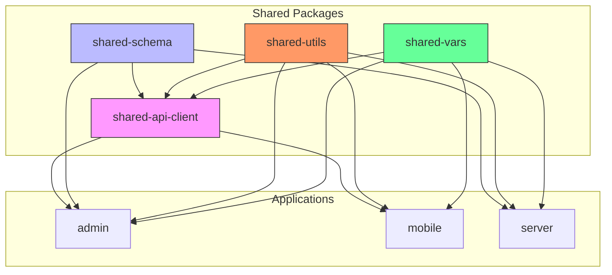
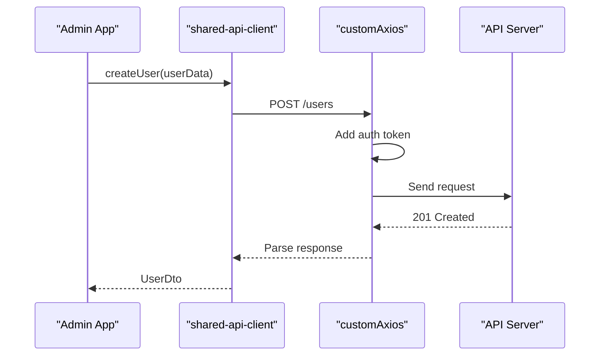
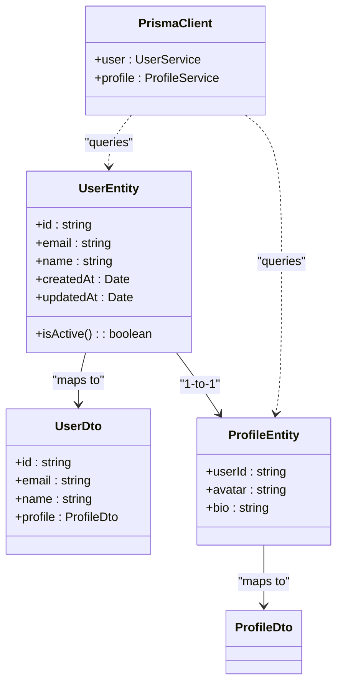
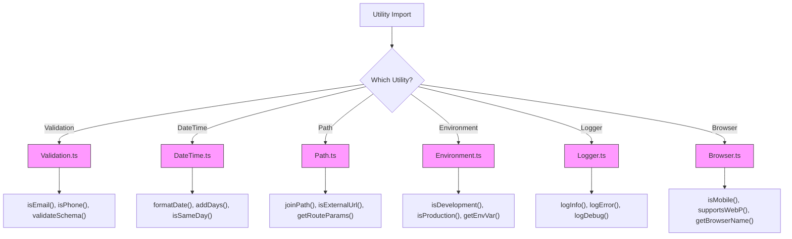
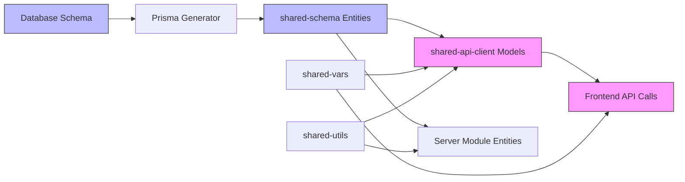
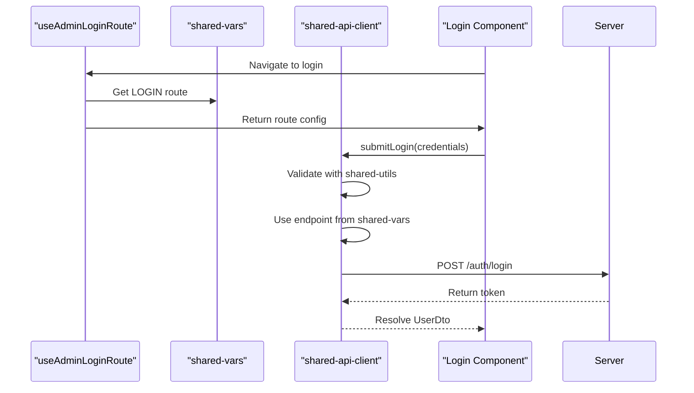

# Shared Ecosystem

<cite>
**Referenced Files in This Document**   
- [shared-api-client/src/apis.ts](file://packages/shared-api-client/src/apis.ts)
- [shared-api-client/src/model/index.ts](file://packages/shared-api-client/src/model/index.ts)
- [shared-api-client/src/libs/customAxios.ts](file://packages/shared-api-client/src/libs/customAxios.ts)
- [shared-schema/src/entity/user.entity.ts](file://packages/shared-schema/src/entity/user.entity.ts)
- [shared-schema/src/dto/user.dto.ts](file://packages/shared-schema/src/dto/user.dto.ts)
- [shared-schema/prisma/seed.ts](file://packages/shared-schema/prisma/seed.ts)
- [shared-utils/src/Validation.ts](file://packages/shared-utils/src/Validation.ts)
- [shared-utils/src/DateTime.ts](file://packages/shared-utils/src/DateTime.ts)
- [shared-vars/src/endpoints.ts](file://packages/shared-vars/src/endpoints.ts)
- [shared-vars/src/route-names.ts](file://packages/shared-vars/src/route-names.ts)
- [apps/admin/src/hooks/useAdminLoginRoute.ts](file://apps/admin/src/hooks/useAdminLoginRoute.ts)
- [apps/server/src/main.ts](file://apps/server/src/main.ts)
</cite>

## Table of Contents
1. [Introduction](#introduction)
2. [Shared Package Architecture](#shared-package-architecture)
3. [shared-api-client: Type-Safe API Access](#shared-api-client-type-safe-api-access)
4. [shared-schema: Database Consistency with Prisma](#shared-schema-database-consistency-with-prisma)
5. [shared-utils: Reusable Utility Functions](#shared-utils-reusable-utility-functions)
6. [shared-vars: Centralized Configuration Management](#shared-vars-centralized-configuration-management)
7. [Cross-Package Relationships and Impact on Code Consistency](#cross-package-relationships-and-impact-on-code-consistency)
8. [Versioning and Dependency Management Challenges](#versioning-and-dependency-management-challenges)
9. [Consumption Patterns in Applications](#consumption-patterns-in-applications)
10. [Conclusion](#conclusion)

## Introduction
The prj-core monorepo implements a robust shared ecosystem through a collection of reusable packages that ensure consistency, reduce duplication, and accelerate development across multiple applications. This document provides a comprehensive analysis of the shared packages—shared-api-client, shared-schema, shared-utils, and shared-vars—detailing their implementation, interfaces, domain models, and usage patterns. The ecosystem enables type-safe API interactions, consistent database schema management, reusable utility logic, and centralized configuration, forming the foundation for scalable and maintainable application development within the monorepo.

## Shared Package Architecture



**Diagram sources**
- [packages/shared-api-client](file://packages/shared-api-client)
- [packages/shared-schema](file://packages/shared-schema)
- [packages/shared-utils](file://packages/shared-utils)
- [packages/shared-vars](file://packages/shared-vars)

**Section sources**
- [pnpm-workspace.yaml](file://pnpm-workspace.yaml)
- [turbo.json](file://turbo.json)

## shared-api-client: Type-Safe API Access

The shared-api-client package provides type-safe access to backend APIs through Orval-generated clients, ensuring compile-time safety and reducing runtime errors. It leverages OpenAPI specifications to automatically generate TypeScript interfaces, DTOs, and service clients that mirror the server's contract.

Orval configurations (`orval.*.config.js`) define generation rules for different environments, producing API clients with consistent error handling, request/response interceptors, and Axios integration. The generated `apis.ts` exports service functions for each endpoint, accepting strongly-typed parameters and returning Promise-wrapped responses with accurate type inference.

Custom Axios instances in `customAxios.ts` handle authentication headers, base URLs, and global error interception, ensuring consistent HTTP behavior across all consuming applications.



**Diagram sources**
- [shared-api-client/src/apis.ts](file://packages/shared-api-client/src/apis.ts)
- [shared-api-client/src/libs/customAxios.ts](file://packages/shared-api-client/src/libs/customAxios.ts)

**Section sources**
- [shared-api-client/src/apis.ts](file://packages/shared-api-client/src/apis.ts)
- [shared-api-client/src/model/index.ts](file://packages/shared-api-client/src/model/index.ts)
- [shared-api-client/orval.dev.config.js](file://packages/shared-api-client/orval.dev.config.js)

## shared-schema: Database Consistency with Prisma

The shared-schema package maintains database consistency through Prisma ORM, providing a single source of truth for data models across the monorepo. The Prisma schema defines all entities, relationships, and constraints, while the generated Prisma Client enables type-safe database operations.

Domain models in the `entity/` directory extend Prisma-generated types with business logic and validation decorators. DTOs in the `dto/` directory define data transfer contracts for API requests and responses, ensuring proper type mapping between layers.

The package includes migration scripts and seed data (`seed.ts`, `seed-data.ts`) for consistent database initialization across environments. Enumerations and constants (e.g., `role-types.enum.ts`, `category-types.enum.ts`) ensure data integrity by restricting field values to predefined options.



**Diagram sources**
- [shared-schema/src/entity/user.entity.ts](file://packages/shared-schema/src/entity/user.entity.ts)
- [shared-schema/src/dto/user.dto.ts](file://packages/shared-schema/src/dto/user.dto.ts)
- [shared-schema/prisma/schema.prisma](file://packages/shared-schema/prisma/schema.prisma)

**Section sources**
- [shared-schema/src/entity/](file://packages/shared-schema/src/entity/)
- [shared-schema/src/dto/](file://packages/shared-schema/src/dto/)
- [shared-schema/prisma/migrations/](file://packages/shared-schema/prisma/migrations/)

## shared-utils: Reusable Utility Functions

The shared-utils package provides a collection of reusable utility functions that address common development needs across applications. These utilities promote code consistency and reduce duplication of common logic.

Key modules include:
- **Validation.ts**: Input validation utilities with type guards and schema validation
- **DateTime.ts**: Date and time manipulation functions with timezone handling
- **Path.ts**: URL and route path utilities
- **Environment.ts**: Environment detection and configuration
- **Logger.ts**: Structured logging with consistent formatting
- **Browser.ts**: Browser feature detection and compatibility utilities

Each utility is thoroughly tested (`__tests__/`) and designed with tree-shakable exports to minimize bundle size. The modular design allows applications to import only the specific utilities they need.



**Diagram sources**
- [shared-utils/src/Validation.ts](file://packages/shared-utils/src/Validation.ts)
- [shared-utils/src/DateTime.ts](file://packages/shared-utils/src/DateTime.ts)
- [shared-utils/src/Path.ts](file://packages/shared-utils/src/Path.ts)

**Section sources**
- [shared-utils/src/](file://packages/shared-utils/src/)
- [shared-utils/src/__tests__/](file://packages/shared-utils/src/__tests__/)

## shared-vars: Centralized Configuration Management

The shared-vars package centralizes configuration values and constants used across applications, ensuring consistency and simplifying maintenance. It exports named constants for endpoints, route names, and other shared configuration values.

The `endpoints.ts` file defines API endpoint URLs, enabling consistent service invocation across applications. The `route-names.ts` file exports route path constants, preventing hard-coded strings and enabling safe route navigation.

This centralized approach allows for easy configuration updates—changing an endpoint URL or route path requires modification in only one location, with automatic propagation to all consuming applications through versioned package updates.

```mermaid
erDiagram
CONFIGURATION ||--o{ ENDPOINTS : contains
CONFIGURATION ||--o{ ROUTE_NAMES : contains
ENDPOINTS {
string AUTH_LOGIN "auth/login"
string USERS_LIST "users"
string USERS_DETAIL "users/{id}"
string TENANTS_LIST "tenants"
}
ROUTE_NAMES {
string LOGIN "/login"
string DASHBOARD "/dashboard"
string USERS "/users"
string TENANTS "/tenants"
string PROFILE "/profile"
}
class Application {
+useEndpoint(name)
+useRoute(name)
}
Application ..> ENDPOINTS : consumes
Application ..> ROUTE_NAMES : consumes
```

**Diagram sources**
- [shared-vars/src/endpoints.ts](file://packages/shared-vars/src/endpoints.ts)
- [shared-vars/src/route-names.ts](file://packages/shared-vars/src/route-names.ts)

**Section sources**
- [shared-vars/src/endpoints.ts](file://packages/shared-vars/src/endpoints.ts)
- [shared-vars/src/route-names.ts](file://packages/shared-vars/src/route-names.ts)

## Cross-Package Relationships and Impact on Code Consistency

The shared packages form an interdependent ecosystem that enforces code consistency across the monorepo. Key relationships include:

- **shared-schema → shared-api-client**: API DTOs are derived from shared schema entities, ensuring data model consistency between frontend and backend
- **shared-utils → shared-api-client**: Validation and HTTP utilities enhance API client reliability
- **shared-vars → shared-api-client**: Endpoint constants configure API base URLs and paths
- **shared-schema → server application**: Direct import of entities and DTOs ensures type alignment

This architecture creates a "type-safe pipeline" from database schema to API contracts to frontend consumption, minimizing inconsistencies and reducing integration errors. Changes to domain models propagate through the ecosystem with clear version boundaries.



**Diagram sources**
- [shared-schema/src/entity/](file://packages/shared-schema/src/entity/)
- [shared-api-client/src/model/](file://packages/shared-api-client/src/model/)
- [apps/server/src/module/](file://apps/server/src/module/)

**Section sources**
- [packages/shared-schema](file://packages/shared-schema)
- [packages/shared-api-client](file://packages/shared-api-client)

## Versioning and Dependency Management Challenges

The shared ecosystem faces common monorepo challenges in versioning and dependency management:

1. **Breaking Changes**: Schema modifications in shared-schema require coordinated updates across all dependent packages and applications
2. **Version Pinning**: Applications may pin to specific shared package versions, creating fragmentation
3. **Circular Dependencies**: Risk of circular imports between shared packages
4. **Release Coordination**: Synchronizing releases of interdependent packages

Solutions implemented in prj-core include:
- **Semantic Versioning**: Strict adherence to semver for shared packages
- **Automated Testing**: Comprehensive test suite ensuring backward compatibility
- **Turbo for Task Orchestration**: Using turbo.json to coordinate builds and tests
- **Gradual Migration**: Supporting multiple API versions during transitions
- **Deprecation Warnings**: Clear deprecation notices before removing functionality

The pnpm workspace enables efficient dependency resolution and hoisting, while Orval's code generation ensures API client updates are atomic and consistent.

**Section sources**
- [turbo.json](file://turbo.json)
- [pnpm-workspace.yaml](file://pnpm-workspace.yaml)
- [package.json](file://package.json)

## Consumption Patterns in Applications

Applications consume shared packages through standardized import patterns and integration points. For example, the admin application uses shared-api-client for data fetching and shared-vars for route navigation:



The server application imports shared-schema entities directly, ensuring domain model consistency between API and persistence layers. The mobile application leverages shared-utils for cross-platform compatibility and shared-api-client for type-safe API interactions.

**Diagram sources**
- [apps/admin/src/hooks/useAdminLoginRoute.ts](file://apps/admin/src/hooks/useAdminLoginRoute.ts)
- [shared-api-client/src/apis.ts](file://packages/shared-api-client/src/apis.ts)

**Section sources**
- [apps/admin/src/hooks/useAdminLoginRoute.ts](file://apps/admin/src/hooks/useAdminLoginRoute.ts)
- [apps/server/src/main.ts](file://apps/server/src/main.ts)

## Conclusion

The shared ecosystem in prj-core provides a robust foundation for scalable application development through well-defined, reusable packages. By centralizing API clients, data models, utilities, and configuration, the ecosystem ensures consistency, reduces duplication, and accelerates development. The integration of Orval, Prisma, and utility libraries creates a type-safe development experience from database to UI. While versioning and dependency management present challenges, the implementation of semantic versioning, automated testing, and coordinated release processes ensures stability and reliability across the monorepo. This architecture serves as a model for effective shared package design in large-scale TypeScript applications.