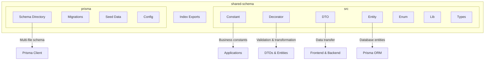
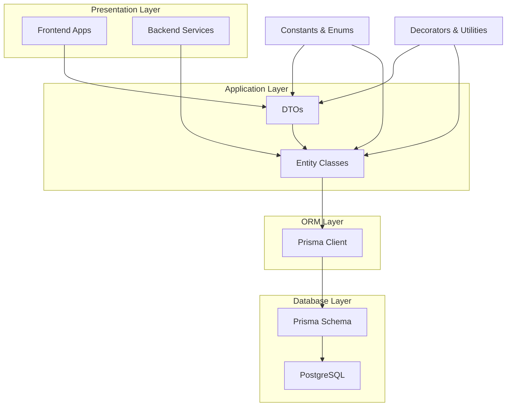
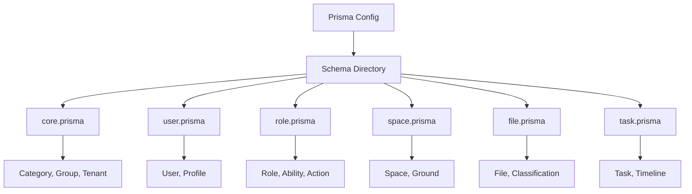
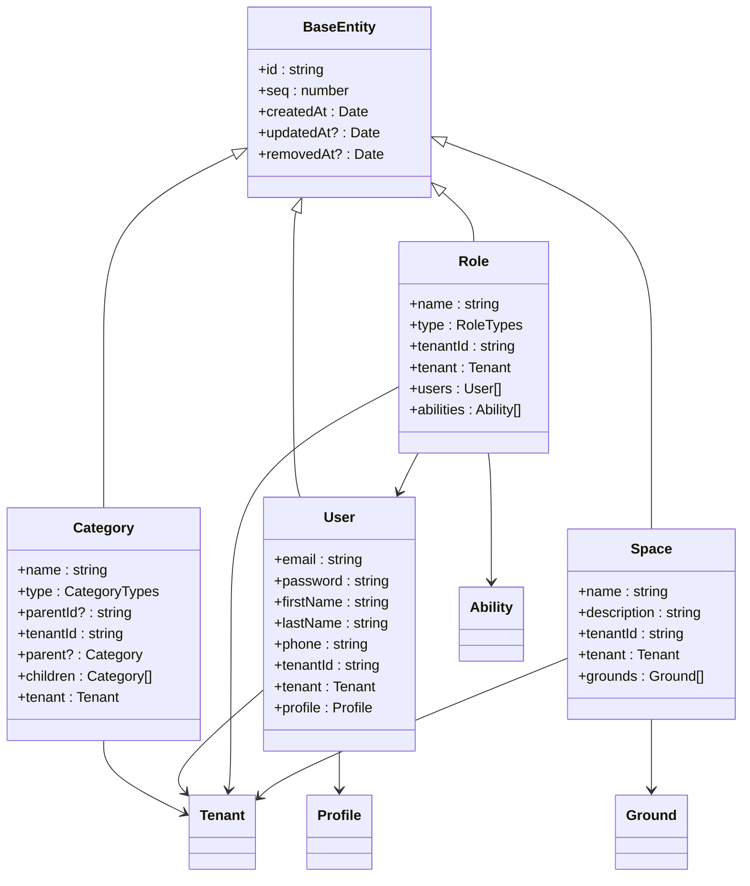
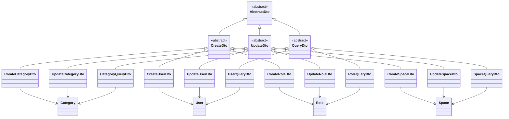
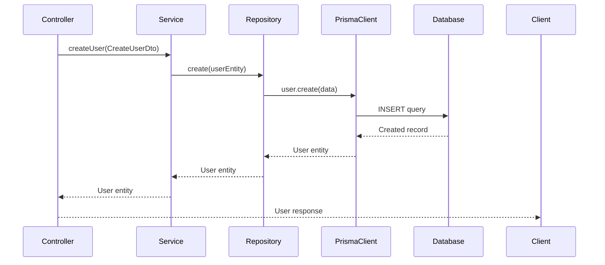
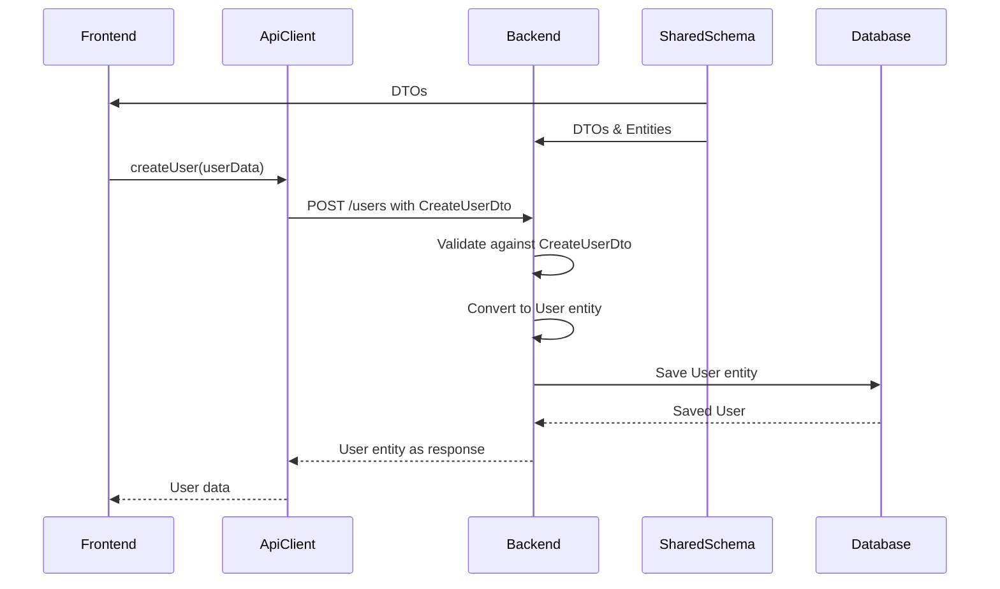
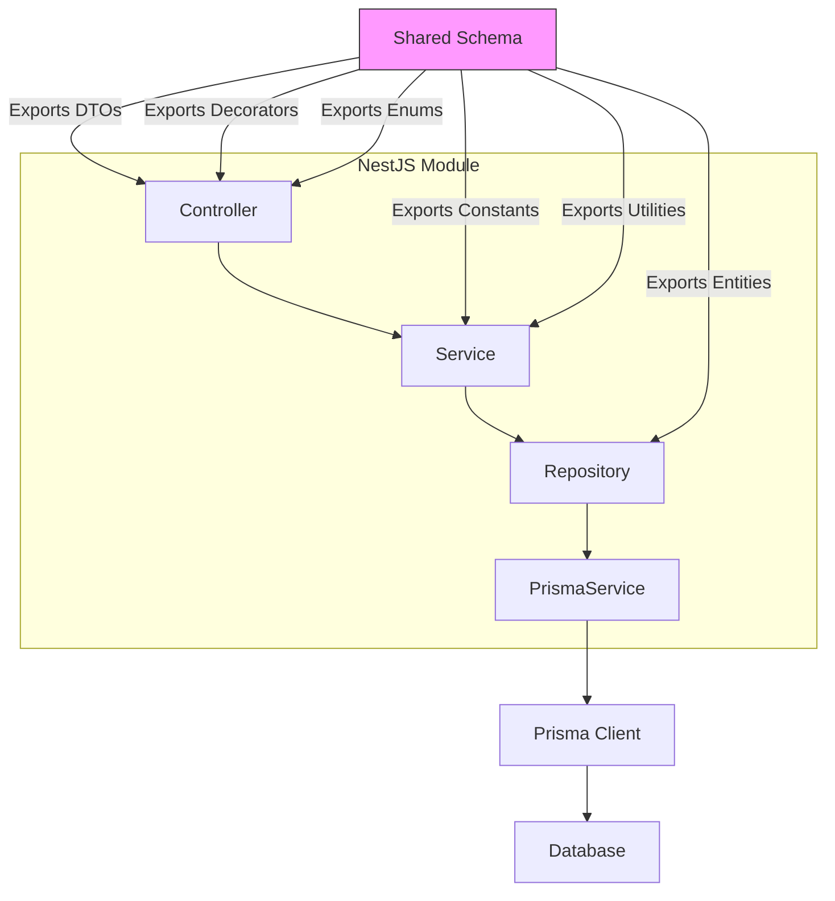
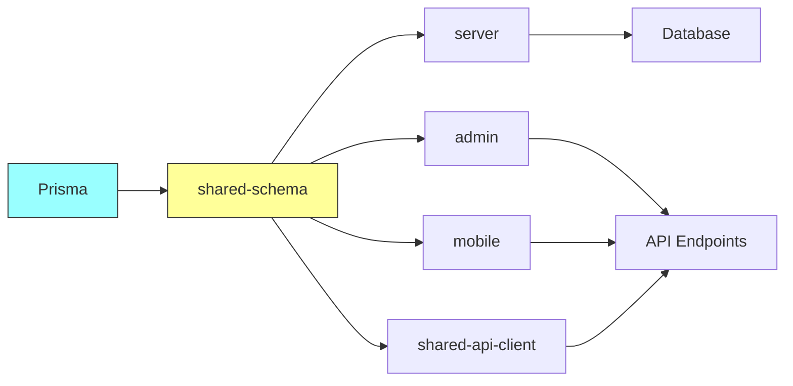

# Shared Schema

<cite>
**Referenced Files in This Document**   
- [index.ts](file://packages/schema/src/index.ts)
- [README.md](file://packages/schema/README.md)
- [_base.prisma](file://packages/schema/prisma/schema/_base.prisma)
- [core.prisma](file://packages/schema/prisma/schema/core.prisma)
- [user.prisma](file://packages/schema/prisma/schema/user.prisma)
- [role.prisma](file://packages/schema/prisma/schema/role.prisma)
- [space.prisma](file://packages/schema/prisma/schema/space.prisma)
- [file.prisma](file://packages/schema/prisma/schema/file.prisma)
- [task.prisma](file://packages/schema/prisma/schema/task.prisma)
- [prisma.config.ts](file://packages/schema/prisma.config.ts)
- [dto/index.ts](file://packages/schema/src/dto/index.ts)
- [entity/index.ts](file://packages/schema/src/entity/index.ts)
- [constant/index.ts](file://packages/schema/src/constant/index.ts)
- [decorator/index.ts](file://packages/schema/src/decorator/index.ts)
- [PaginationUtil.ts](file://packages/schema/src/lib/PaginationUtil.ts)
</cite>

## Table of Contents
1. [Introduction](#introduction)
2. [Project Structure](#project-structure)
3. [Core Components](#core-components)
4. [Architecture Overview](#architecture-overview)
5. [Detailed Component Analysis](#detailed-component-analysis)
6. [Dependency Analysis](#dependency-analysis)
7. [Performance Considerations](#performance-considerations)
8. [Troubleshooting Guide](#troubleshooting-guide)
9. [Conclusion](#conclusion)

## Introduction
The shared-schema package serves as the single source of truth for database entities, DTOs, and business constants across the prj-core monorepo. This comprehensive documentation explains how the package enables type-safe database access through Prisma, standardizes data transfer objects between frontend and backend, and provides a centralized location for business logic and validation rules. The package is designed to ensure data consistency across all applications in the monorepo while providing developers with a robust, type-safe development experience.

## Project Structure
The shared-schema package follows a well-organized structure that separates concerns and promotes reusability across the monorepo. The package is divided into several key directories that handle different aspects of the shared schema.

**Diagram sources**
- [README.md](file://packages/schema/README.md)
- [index.ts](file://packages/schema/src/index.ts)

**Section sources**
- [README.md](file://packages/schema/README.md)
- [index.ts](file://packages/schema/src/index.ts)

## Core Components
The shared-schema package consists of several core components that work together to provide a unified data layer for the entire monorepo. These components include the Prisma schema definitions, entity models, DTOs, constants, and utility functions that are shared across all applications.

**Section sources**
- [index.ts](file://packages/schema/src/index.ts)
- [README.md](file://packages/schema/README.md)

## Architecture Overview
The shared-schema package implements a multi-layered architecture that separates database schema definitions from application-level data transfer objects. This separation allows for flexibility in how data is represented at different layers of the application while maintaining a single source of truth for the underlying data model.

**Diagram sources**
- [README.md](file://packages/schema/README.md)
- [index.ts](file://packages/schema/src/index.ts)

## Detailed Component Analysis

### Prisma Schema Definition
The Prisma schema in the shared-schema package serves as the single source of truth for the database structure. It uses Prisma's multi-file schema support to organize models into domain-specific files, making the schema more maintainable and easier to understand.

**Diagram sources**
- [prisma.config.ts](file://packages/schema/prisma.config.ts)
- [core.prisma](file://packages/schema/prisma/schema/core.prisma)
- [user.prisma](file://packages/schema/prisma/schema/user.prisma)
- [role.prisma](file://packages/schema/prisma/schema/role.prisma)
- [space.prisma](file://packages/schema/prisma/schema/space.prisma)
- [file.prisma](file://packages/schema/prisma/schema/file.prisma)
- [task.prisma](file://packages/schema/prisma/schema/task.prisma)

**Section sources**
- [prisma.config.ts](file://packages/schema/prisma.config.ts)
- [core.prisma](file://packages/schema/prisma/schema/core.prisma)

### Entity Directory
The entity directory contains TypeScript classes that map to Prisma models with additional decorators for validation and transformation. These entities serve as the bridge between the database layer and the application layer.

**Diagram sources**
- [entity/index.ts](file://packages/schema/src/entity/index.ts)
- [core.prisma](file://packages/schema/prisma/schema/core.prisma)
- [user.prisma](file://packages/schema/prisma/schema/user.prisma)

**Section sources**
- [entity/index.ts](file://packages/schema/src/entity/index.ts)

### DTO Hierarchy
The DTO hierarchy in the shared-schema package standardizes data transfer objects between frontend and backend applications. The hierarchy is organized into create, update, and query DTOs, each serving a specific purpose in the data flow.

**Diagram sources**
- [dto/index.ts](file://packages/schema/src/dto/index.ts)
- [entity/index.ts](file://packages/schema/src/entity/index.ts)

**Section sources**
- [dto/index.ts](file://packages/schema/src/dto/index.ts)

### Server Module Integration
The server module imports entities from the shared-schema package for ORM operations, ensuring type safety and consistency across database interactions. This integration pattern is used throughout the backend services.

**Diagram sources**
- [entity/index.ts](file://packages/schema/src/entity/index.ts)
- [dto/index.ts](file://packages/schema/src/dto/index.ts)

**Section sources**
- [entity/index.ts](file://packages/schema/src/entity/index.ts)
- [dto/index.ts](file://packages/schema/src/dto/index.ts)

### Shared API Client Usage
The shared-api-client uses DTOs from the shared-schema package for payload definitions, ensuring that frontend applications use the same data structures as the backend. This creates a type-safe contract between frontend and backend.

**Diagram sources**
- [dto/index.ts](file://packages/schema/src/dto/index.ts)
- [entity/index.ts](file://packages/schema/src/entity/index.ts)

**Section sources**
- [dto/index.ts](file://packages/schema/src/dto/index.ts)

### NestJS Module Relationships
The shared-schema package is integrated with NestJS modules through dependency injection, where controllers and services depend on shared DTOs and entities. This creates a consistent pattern across the backend application.

**Diagram sources**
- [index.ts](file://packages/schema/src/index.ts)
- [dto/index.ts](file://packages/schema/src/dto/index.ts)
- [entity/index.ts](file://packages/schema/src/entity/index.ts)

**Section sources**
- [index.ts](file://packages/schema/src/index.ts)

## Dependency Analysis
The shared-schema package has a well-defined dependency structure that ensures type safety and consistency across the monorepo. The package depends on Prisma for database schema management and provides exports that are consumed by various applications.

**Diagram sources**
- [package.json](file://packages/schema/package.json)
- [index.ts](file://packages/schema/src/index.ts)

**Section sources**
- [package.json](file://packages/schema/package.json)

## Performance Considerations
The shared-schema package is designed with performance in mind, leveraging Prisma's query optimization capabilities and providing utility functions for efficient data handling. The multi-file schema organization improves build times by allowing selective regeneration of only changed schema files.

## Troubleshooting Guide
Common issues with the shared-schema package typically relate to schema migrations, circular dependencies, and DTO evolution. The following solutions address these common challenges:

**Section sources**
- [README.md](file://packages/schema/README.md)
- [prisma.config.ts](file://packages/schema/prisma.config.ts)

## Conclusion
The shared-schema package serves as the foundation for data consistency and type safety across the prj-core monorepo. By centralizing database entities, DTOs, and business constants, the package enables seamless integration between frontend and backend applications while reducing duplication and potential inconsistencies. The use of Prisma for type-safe database access, combined with a well-structured DTO hierarchy, creates a robust development experience that scales effectively across multiple applications. Developers can leverage this shared schema to build features quickly while maintaining high code quality and data integrity.