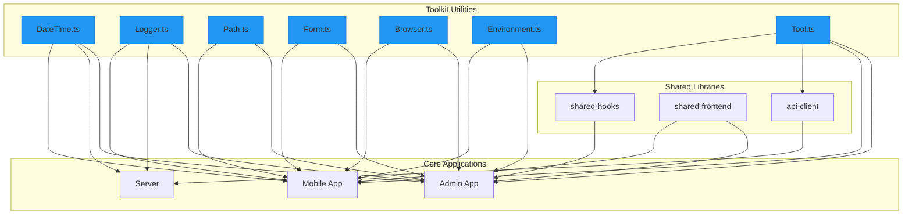
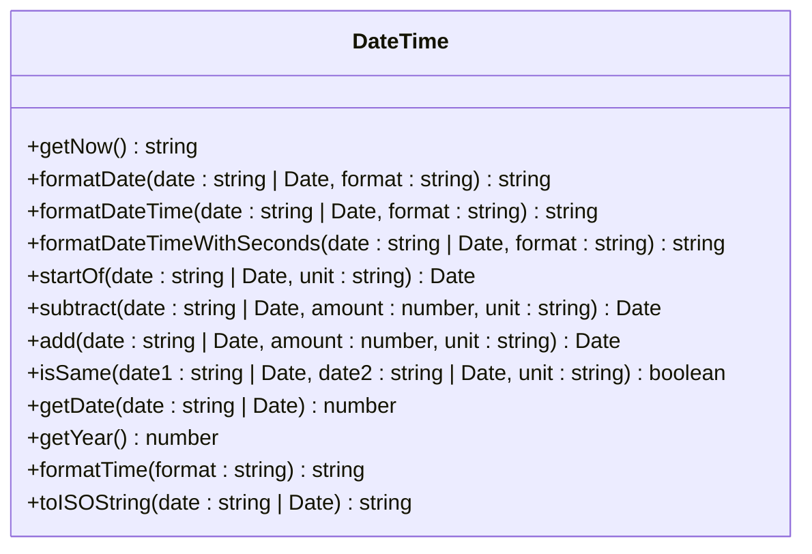
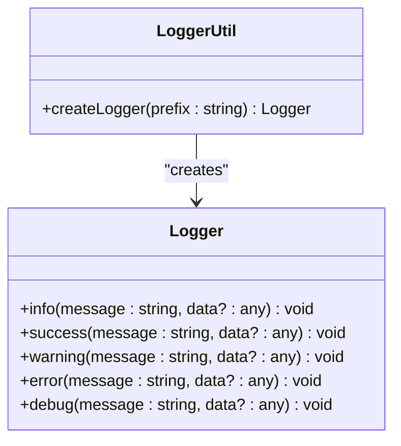
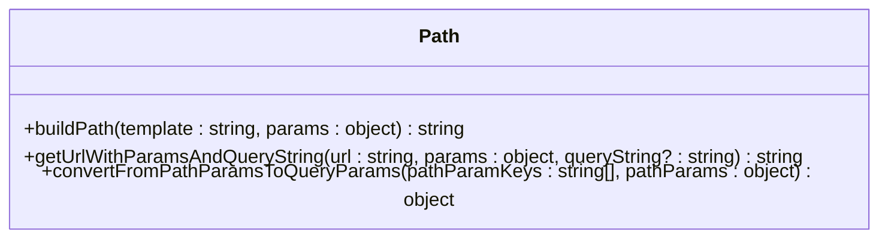
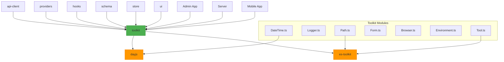

# Shared Utilities

<cite>
**Referenced Files in This Document**   
- [DateTime.ts](file://packages/toolkit/src/DateTime.ts)
- [Logger.ts](file://packages/toolkit/src/Logger.ts)
- [Path.ts](file://packages/toolkit/src/Path.ts)
- [Form.ts](file://packages/toolkit/src/Form.ts)
- [Browser.ts](file://packages/toolkit/src/Browser.ts)
- [Environment.ts](file://packages/toolkit/src/Environment.ts)
- [Tool.ts](file://packages/toolkit/src/Tool.ts)
- [customAxios.ts](file://packages/api-client/src/libs/customAxios.ts)
- [Providers.tsx](file://packages/providers/src/Providers.tsx)
- [useFormField.ts](file://packages/hooks/src/useFormField.ts)
</cite>

## Table of Contents
1. [Introduction](#introduction)
2. [Project Structure](#project-structure)
3. [Core Components](#core-components)
4. [Architecture Overview](#architecture-overview)
5. [Detailed Component Analysis](#detailed-component-analysis)
6. [Dependency Analysis](#dependency-analysis)
7. [Performance Considerations](#performance-considerations)
8. [Troubleshooting Guide](#troubleshooting-guide)
9. [Conclusion](#conclusion)

## Introduction
The toolkit package in prj-core provides a comprehensive collection of reusable utility functions that are shared across all applications in the monorepo. This documentation thoroughly explains how these utilities support consistent functionality, improve development efficiency, and maintain code quality across the admin app, server, and mobile applications. The toolkit package serves as a foundational layer that enables functional programming patterns and promotes code reuse throughout the ecosystem.

## Project Structure

```mermaid
graph TD
subgraph "Applications"
Admin[Admin App]
Server[Server]
Mobile[Mobile App]
end
subgraph "Shared Packages"
Toolkit[toolkit]
ApiClient[api-client]
Providers[providers]
Hooks[hooks]
Schema[schema]
Store[store]
Ui[ui]
Constants[constants]
Types[types]
end
Admin --> Toolkit
Server --> Toolkit
Mobile --> Toolkit
ApiClient --> Toolkit
Providers --> Toolkit
Hooks --> Toolkit
Schema --> Toolkit
Store --> Toolkit
Ui --> Toolkit
Toolkit --> "es-toolkit"
Toolkit --> "dayjs"
style Toolkit fill:#4CAF50,stroke:#388E3C
```

**Diagram sources**
- [package.json](file://packages/toolkit/package.json#L1-L50)

**Section sources**
- [package.json](file://packages/toolkit/package.json#L1-L50)

## Core Components

The toolkit package contains several key utility modules that provide essential functionality across the monorepo. These include DateTime for date manipulation, Logger for consistent logging, Path for URL/path operations, Form for input validation, Browser for browser-specific utilities, Environment for environment detection, and Tool for general-purpose utilities. These components are designed to be lightweight, tree-shakable, and compatible with both client and server environments.

**Section sources**
- [DateTime.ts](file://packages/toolkit/src/DateTime.ts#L1-L82)
- [Logger.ts](file://packages/toolkit/src/Logger.ts#L1-L78)
- [Path.ts](file://packages/toolkit/src/Path.ts#L1-L49)
- [Form.ts](file://packages/toolkit/src/Form.ts#L1-L97)

## Architecture Overview



**Diagram sources**
- [DateTime.ts](file://packages/toolkit/src/DateTime.ts#L1-L82)
- [Logger.ts](file://packages/toolkit/src/Logger.ts#L1-L78)
- [Path.ts](file://packages/toolkit/src/Path.ts#L1-L49)
- [Form.ts](file://packages/toolkit/src/Form.ts#L1-L97)
- [Browser.ts](file://packages/toolkit/src/Browser.ts#L1-L122)
- [Environment.ts](file://packages/toolkit/src/Environment.ts#L1-L90)
- [Tool.ts](file://packages/toolkit/src/Tool.ts#L1-L42)

## Detailed Component Analysis

### DateTime Utilities
The DateTime module provides comprehensive date manipulation and formatting capabilities using the dayjs library. It offers functions for formatting dates in various patterns, manipulating dates by adding or subtracting time units, comparing dates, and extracting date components.



**Diagram sources**
- [DateTime.ts](file://packages/toolkit/src/DateTime.ts#L1-L82)

#### Usage Example: Admin App Session Scheduling
The admin app utilizes DateTime utilities for session scheduling functionality. When creating or editing sessions, the application uses `formatDateTime` to display session times in a consistent format and `add`/`subtract` functions to calculate session durations and recurrence patterns.

**Section sources**
- [DateTime.ts](file://packages/toolkit/src/DateTime.ts#L1-L82)

### Logger Utilities
The Logger module provides a consistent logging interface with emoji indicators for different log levels. It supports creating named loggers with prefixes for better traceability and offers methods for info, success, warning, error, and debug messages.



**Diagram sources**
- [Logger.ts](file://packages/toolkit/src/Logger.ts#L1-L78)

#### Usage Example: Server Request Sanitization
The server uses Logger utilities to maintain consistent logging across request handling. During request sanitization, the server employs `logger.warning` for validation warnings and `logger.error` for failed validation cases, ensuring that all security-related events are properly logged with appropriate context.

**Section sources**
- [Logger.ts](file://packages/toolkit/src/Logger.ts#L1-L78)

### Path Utilities
The Path module provides functions for URL path manipulation, including building paths with parameters and handling query strings. It enables dynamic URL construction based on route templates and parameter objects.



**Diagram sources**
- [Path.ts](file://packages/toolkit/src/Path.ts#L1-L49)

#### Usage Example: Mobile App Navigation
The mobile app leverages Path utilities for navigation between screens. When navigating to user profile pages or content details, the app uses `getUrlWithParamsAndQueryString` to construct URLs with dynamic parameters, ensuring consistent URL patterns across the application.

**Section sources**
- [Path.ts](file://packages/toolkit/src/Path.ts#L1-L49)

### Form Validation Utilities
The Form module provides robust input validation capabilities with support for required fields, length constraints, numerical ranges, and pattern matching. It offers both single field validation and batch validation for multiple fields.

```mermaid
classDiagram
class Validation {
+timings : ("onBlur" | "onChange" | "onFocus")[]
+required : {value : boolean, message : string}
+minLength : {value : number, message : string}
+maxLength : {value : number, message : string}
+min : {value : number, message : string}
+max : {value : number, message : string}
+patterns : {value : RegExp | string, message : string}[]
}
class Form {
+validateSingleField(value : any, validation : Validation) {isValid : boolean, errorMessage? : string}
+validateFields(state : any, validationFields : Record<string, Validation>) {isValid : boolean, errorMessage? : string}
}
```

**Diagram sources**
- [Form.ts](file://packages/toolkit/src/Form.ts#L1-L97)

## Dependency Analysis



**Diagram sources**
- [package.json](file://packages/toolkit/package.json#L1-L50)
- [DateTime.ts](file://packages/toolkit/src/DateTime.ts#L1-L82)
- [Path.ts](file://packages/toolkit/src/Path.ts#L1-L49)
- [Tool.ts](file://packages/toolkit/src/Tool.ts#L1-L42)

## Performance Considerations

The toolkit package is designed with performance and bundle size optimization in mind. All utilities are implemented as standalone functions that support tree-shaking, ensuring that applications only include the code they actually use. The package has minimal dependencies, relying primarily on dayjs for date operations and es-toolkit for utility functions, both of which are lightweight and well-maintained libraries.

To address tree-shaking optimization, the toolkit package exports functions individually in addition to providing a default export, allowing bundlers to eliminate unused code effectively. Version compatibility is maintained through strict version pinning in the package.json file and comprehensive testing across different environments.

Testing strategies for utility functions include unit tests for each function with various input scenarios, edge cases, and error conditions. The __tests__ directory contains comprehensive test coverage to ensure reliability and prevent regressions.

**Section sources**
- [package.json](file://packages/toolkit/package.json#L1-L50)
- [vitest.config.ts](file://packages/toolkit/vitest.config.ts#L1-L20)

## Troubleshooting Guide

Common issues with the toolkit package typically relate to environment detection, date formatting inconsistencies, or logging configuration. For environment detection issues, ensure that the hostname and port configurations in Environment.ts match your deployment setup. For date formatting problems, verify that the dayjs library is properly imported and that format strings follow dayjs conventions.

When experiencing tree-shaking issues, confirm that your bundler configuration supports dead code elimination and that you're importing functions directly rather than the entire module. For version compatibility problems between packages, use the workspace's package manager (pnpm) to ensure consistent dependency resolution across all packages.

**Section sources**
- [Environment.ts](file://packages/toolkit/src/Environment.ts#L1-L90)
- [DateTime.ts](file://packages/toolkit/src/DateTime.ts#L1-L82)
- [Logger.ts](file://packages/toolkit/src/Logger.ts#L1-L78)

## Conclusion

The toolkit package serves as a foundational utility library that provides essential functionality across the prj-core monorepo. By offering consistent implementations for date manipulation, logging, path operations, form validation, and other common tasks, it promotes code reuse, reduces duplication, and ensures uniform behavior across applications. The modular design supports tree-shaking for optimal bundle sizes, while the comprehensive testing strategy ensures reliability and stability. As the central utility package, toolkit enables other shared packages like api-client and providers to build upon a solid foundation of well-tested, reusable functions.