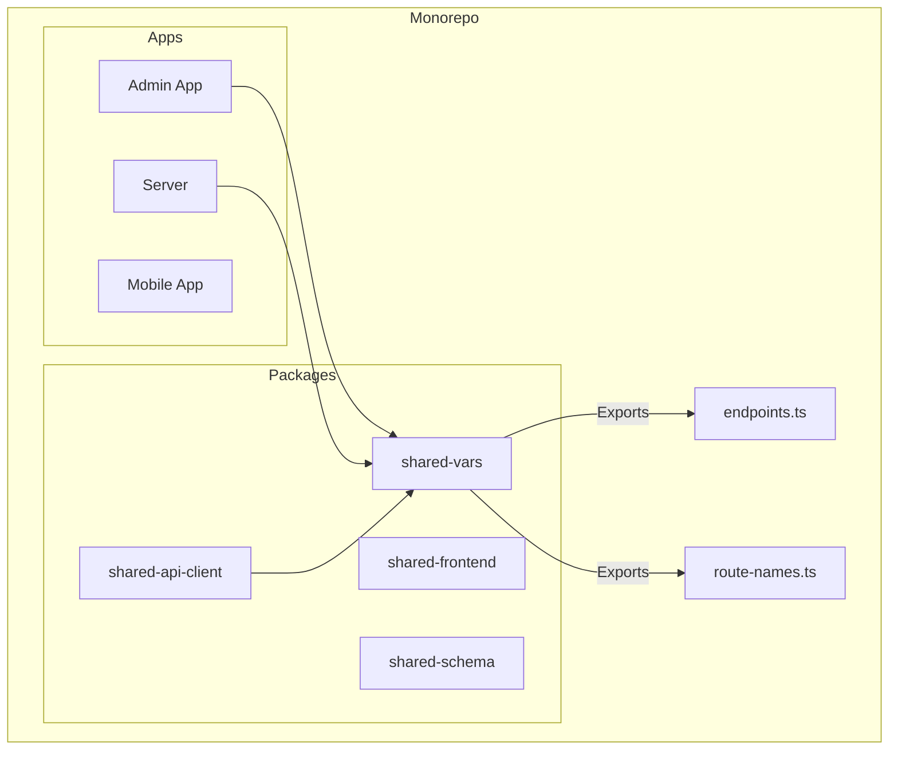
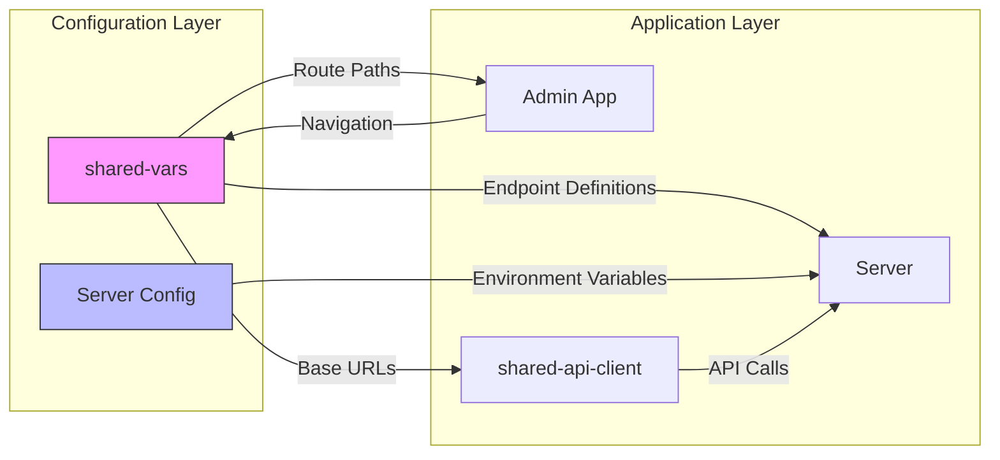
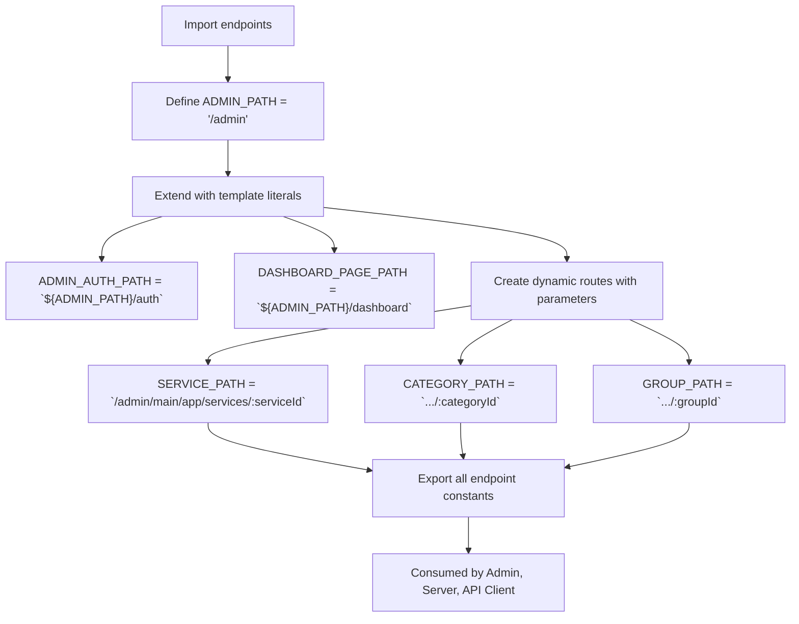
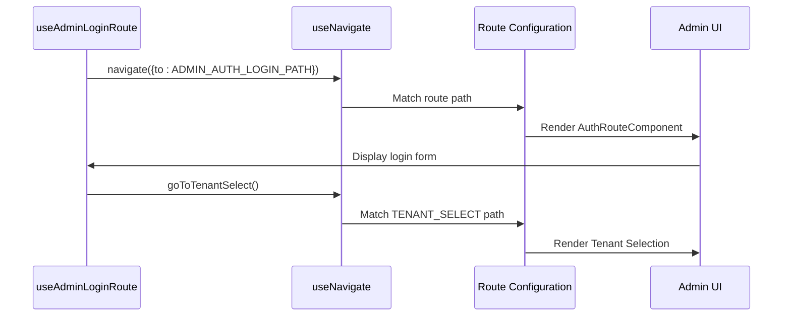

# Shared Variables

<cite>
**Referenced Files in This Document**   
- [endpoints.ts](file://packages/shared-vars/src/endpoints.ts)
- [route-names.ts](file://packages/shared-vars/src/route-names.ts)
- [useAdminLoginRoute.ts](file://apps/admin/src/hooks/useAdminLoginRoute.ts)
- [admin/auth.tsx](file://apps/admin/src/routes/admin/auth.tsx)
- [dashboard.tsx](file://apps/admin/src/routes/admin/dashboard.tsx)
- [app.config.ts](file://apps/server/src/shared/config/app.config.ts)
- [auth.config.ts](file://apps/server/src/shared/config/auth.config.ts)
- [index.ts](file://apps/server/src/shared/config/index.ts)
</cite>

## Table of Contents
1. [Introduction](#introduction)
2. [Project Structure](#project-structure)
3. [Core Components](#core-components)
4. [Architecture Overview](#architecture-overview)
5. [Detailed Component Analysis](#detailed-component-analysis)
6. [Dependency Analysis](#dependency-analysis)
7. [Performance Considerations](#performance-considerations)
8. [Troubleshooting Guide](#troubleshooting-guide)
9. [Conclusion](#conclusion)

## Introduction
The `shared-vars` package in the `prj-core` monorepo serves as a centralized configuration hub for shared constants and variables across multiple applications. This document provides a comprehensive analysis of how this package enables consistent routing, API endpoint definitions, and environment configuration management. It explores the implementation of `endpoints.ts` for route paths and `route-names.ts` for human-readable route identifiers, demonstrating their usage across the admin application, server, and shared API client. The documentation addresses configuration patterns, type safety, build-time optimizations, and common issues such as environment-specific variable management and circular dependencies.

## Project Structure



**Diagram sources**
- [endpoints.ts](file://packages/shared-vars/src/endpoints.ts)
- [route-names.ts](file://packages/shared-vars/src/route-names.ts)

**Section sources**
- [endpoints.ts](file://packages/shared-vars/src/endpoints.ts)
- [route-names.ts](file://packages/shared-vars/src/route-names.ts)

## Core Components

The `shared-vars` package contains two primary files that centralize configuration across the monorepo: `endpoints.ts` defines URL paths for routing and API endpoints, while `route-names.ts` provides human-readable labels for navigation and UI display. These files are consumed by the admin application for route definitions, the server for API consistency, and the shared API client for base URL configuration. The implementation uses TypeScript const assertions to ensure type safety and prevent accidental mutations.

**Section sources**
- [endpoints.ts](file://packages/shared-vars/src/endpoints.ts)
- [route-names.ts](file://packages/shared-vars/src/route-names.ts)

## Architecture Overview



**Diagram sources**
- [endpoints.ts](file://packages/shared-vars/src/endpoints.ts)
- [route-names.ts](file://packages/shared-vars/src/route-names.ts)
- [app.config.ts](file://apps/server/src/shared/config/app.config.ts)

## Detailed Component Analysis

### Endpoints Configuration Analysis

The `endpoints.ts` file defines a comprehensive set of route paths used throughout the application. These constants follow a hierarchical structure starting with `ADMIN_PATH` and extending to specific feature areas like dashboard, authentication, and service management. The implementation uses template literals to create dynamic routes with parameters (e.g., `:serviceId`, `:groupId`). This approach ensures consistency across the codebase and enables type-safe routing.



**Diagram sources**
- [endpoints.ts](file://packages/shared-vars/src/endpoints.ts)

**Section sources**
- [endpoints.ts](file://packages/shared-vars/src/endpoints.ts)

### Route Names Configuration Analysis

The `route-names.ts` file provides human-readable labels for routes, enabling consistent UI text across the application. Implemented as a const assertion object, it ensures type safety and prevents runtime mutations. The route names are used in navigation menus, breadcrumbs, and page titles, providing a single source of truth for display text. This separation of route paths (technical) from route names (user-facing) allows for independent maintenance and localization.

```mermaid
classDiagram
class RouteNames {
+ADMIN : "관리자"
+AUTH : "인증"
+LOGIN : "로그인"
+TENANT_SELECT : "테넌트 선택"
+TENANT : "테넌트"
+DASHBOARD : "대시보드"
+USER_SERVICE : "유저 서비스"
+USERS : "유저"
+SPACE_SERVICE : "공간 서비스"
+GROUNDS : "그라운드 리스트"
+CATEGORIES : "카테고리 리스트"
+GROUPS : "그룹 리스트"
}
note right of RouteNames
Implemented as const assertion
Ensures type safety and immutability
Used for UI display text
end note
```

**Diagram sources**
- [route-names.ts](file://packages/shared-vars/src/route-names.ts)

**Section sources**
- [route-names.ts](file://packages/shared-vars/src/route-names.ts)

### Admin Application Integration

The admin application imports route names and paths from `shared-vars` to define its routing structure and navigation components. Route hooks like `useAdminLoginRoute` utilize these constants for navigation, ensuring consistency between the routing configuration and application logic. The implementation demonstrates how shared variables enable type-safe navigation and prevent hardcoded strings throughout the UI.



**Diagram sources**
- [useAdminLoginRoute.ts](file://apps/admin/src/hooks/useAdminLoginRoute.ts)
- [endpoints.ts](file://packages/shared-vars/src/endpoints.ts)

**Section sources**
- [useAdminLoginRoute.ts](file://apps/admin/src/hooks/useAdminLoginRoute.ts)
- [admin/auth.tsx](file://apps/admin/src/routes/admin/auth.tsx)
- [dashboard.tsx](file://apps/admin/src/routes/admin/dashboard.tsx)

## Dependency Analysis

```mermaid
graph TD
subgraph "Shared"
SharedVars[shared-vars]
end
subgraph "Consumers"
Admin[Admin App]
Server[Server]
ApiClient[shared-api-client]
end
SharedVars --> Admin
SharedVars --> Server
SharedVars --> ApiClient
Admin --> Server
ApiClient --> Server
style SharedVars fill:#f96,stroke:#333,stroke-width:2px
style Admin fill:#6f9,stroke:#333
style Server fill:#96f,stroke:#333
style ApiClient fill:#69f,stroke:#333
note right of SharedVars
Central configuration package
No external dependencies
Exported as npm package
end note
```

**Diagram sources**
- [endpoints.ts](file://packages/shared-vars/src/endpoints.ts)
- [route-names.ts](file://packages/shared-vars/src/route-names.ts)

**Section sources**
- [endpoints.ts](file://packages/shared-vars/src/endpoints.ts)
- [route-names.ts](file://packages/shared-vars/src/route-names.ts)

## Performance Considerations

The `shared-vars` package is optimized for tree-shaking, allowing applications to import only the constants they need. The implementation uses ES6 exports, enabling build-time optimization to eliminate unused variables. This approach minimizes bundle size while maintaining type safety. The constants are resolved at compile time, resulting in zero runtime performance overhead. The separation of configuration from logic also enables faster development and testing cycles.

## Troubleshooting Guide

Common issues with the `shared-vars` package include environment-specific configuration mismatches, circular dependencies, and type errors. To resolve environment issues, ensure that environment variables are properly loaded in `app.config.ts` and `auth.config.ts`. Prevent circular dependencies by organizing imports carefully and avoiding bidirectional references between packages. Address type errors by ensuring consistent TypeScript configurations across packages and using strict type checking. When adding new endpoints or route names, update all dependent applications simultaneously to maintain consistency.

**Section sources**
- [app.config.ts](file://apps/server/src/shared/config/app.config.ts)
- [auth.config.ts](file://apps/server/src/shared/config/auth.config.ts)
- [index.ts](file://apps/server/src/shared/config/index.ts)

## Conclusion

The `shared-vars` package effectively centralizes configuration variables and constants across the `prj-core` monorepo, providing a single source of truth for routing, API endpoints, and display names. Its implementation enables consistent patterns across applications while maintaining type safety and build-time optimizations. The package demonstrates best practices in monorepo configuration management, addressing common challenges such as environment-specific variables and circular dependencies. By leveraging TypeScript features like const assertions and proper module organization, it provides a robust foundation for scalable application development.