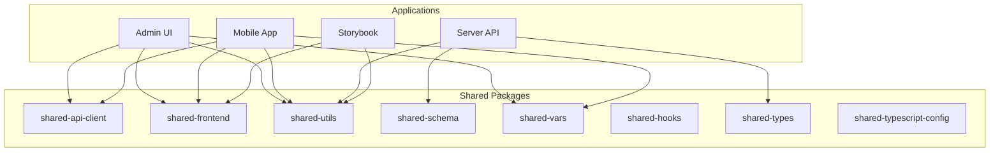

# System Overview

<cite>
**Referenced Files in This Document**   
- [README.md](file://README.md)
- [main.ts](file://apps/server/src/main.ts)
- [main.tsx](file://apps/admin/src/main.tsx)
- [AppProviders.tsx](file://packages/shared-frontend/src/provider/AppProviders/AppProviders.tsx)
- [apis.ts](file://packages/shared-api-client/src/apis.ts)
- [user.entity.ts](file://packages/shared-schema/src/entity/user.entity.ts)
- [user.dto.ts](file://packages/shared-schema/src/dto/user.dto.ts)
- [auth.module.ts](file://apps/server/src/module/auth.module.ts)
- [users.module.ts](file://apps/server/src/module/users.module.ts)
- [app.module.ts](file://apps/server/src/module/app.module.ts)
- [main.config.ts](file://apps/server/src/main.config.ts)
- [useAdminLoginRoute.ts](file://apps/admin/src/hooks/useAdminLoginRoute.ts)
- [authStore.ts](file://packages/shared-frontend/src/store/authStore.ts)
- [route-names.ts](file://packages/shared-vars/src/route-names.ts)
- [login.tsx](file://apps/mobile/src/app/login.tsx)
- [package.json](file://apps/admin/package.json)
- [package.json](file://apps/mobile/package.json)
- [package.json](file://apps/server/package.json)
- [package.json](file://packages/shared-api-client/package.json)
- [package.json](file://packages/shared-frontend/package.json)
</cite>

## Table of Contents
1. [Introduction](#introduction)
2. [Project Structure](#project-structure)
3. [Core Components](#core-components)
4. [Architecture Overview](#architecture-overview)
5. [Shared Components and Data Flow](#shared-components-and-data-flow)
6. [Authentication Flow](#authentication-flow)
7. [Development and Deployment Workflow](#development-and-deployment-workflow)
8. [Conclusion](#conclusion)

## Introduction

The **prj-core** system is a full-stack monorepo application built using **Turborepo** and **pnpm** to manage multiple applications and shared packages efficiently. It serves as a unified platform for an admin interface, mobile application, backend API server, and component development environment. The architecture is designed to promote code reuse, maintainability, and scalability across frontend and backend services.

This document provides a comprehensive overview of the system's architecture, key components, their relationships, and practical examples of how different applications interact through shared packages. It caters to both beginners seeking conceptual understanding and experienced developers looking for technical depth.

## Project Structure

The prj-core repository follows a monorepo structure with two main directories: `apps` and `packages`. The `apps` directory contains standalone applications, while `packages` holds reusable libraries shared across these applications.



**Diagram sources**
- [README.md](file://README.md)

### Applications

- **admin**: A React-based admin interface built with Vite, providing a web UI for system management.
- **mobile**: A React Native application for mobile access, configured with Expo.
- **server**: A NestJS backend API server that exposes RESTful endpoints.
- **storybook**: A Next.js application for developing and previewing UI components in isolation.

### Packages

- **shared-api-client**: Automatically generated API client using Orval, based on OpenAPI specifications.
- **shared-frontend**: Shared React components, providers, and UI elements used by both admin and mobile apps.
- **shared-utils**: Utility functions for common operations like logging, environment checks, and form handling.
- **shared-schema**: Prisma schema, DTOs (Data Transfer Objects), and entity definitions shared between frontend and backend.
- **shared-vars**: Constants such as route names and API endpoints.
- **shared-hooks**: Custom React hooks for shared logic.
- **shared-types**: Shared TypeScript types.
- **shared-typescript-config**: Shared TypeScript configuration.

**Section sources**
- [README.md](file://README.md)

## Core Components

The prj-core system is composed of several core components that work together to deliver a cohesive full-stack experience.

### Admin Application

The admin application is a React frontend built with Vite, located in `apps/admin`. It uses TanStack Router for routing and integrates with shared components via the `AppProviders` wrapper.

```tsx
// apps/admin/src/main.tsx
import { AppProviders } from "@shared/frontend";
import ReactDOM from "react-dom/client";
import { App } from "./App";

const rootElement = document.getElementById("root")!;

if (!rootElement.innerHTML) {
	ReactDOM.createRoot(rootElement).render(
		<AppProviders>
			<App />
		</AppProviders>,
	);
}
```

**Section sources**
- [main.tsx](file://apps/admin/src/main.tsx)

### Mobile Application

The mobile application is a React Native app using Expo, located in `apps/mobile`. It shares UI components and state management with the admin app through the `shared-frontend` package.

```tsx
// apps/mobile/src/app/login.tsx
import { View } from "react-native";
import { Text } from "@/components/ui/Text";

export default function Login() {
	return (
		<View>
			<Text>Login Screen</Text>
		</View>
	);
}
```

**Section sources**
- [login.tsx](file://apps/mobile/src/app/login.tsx)

### Server Application

The server is a NestJS application that defines modules for various domain entities such as users, roles, spaces, and sessions. It uses Prisma for database access and exposes REST APIs secured with JWT authentication.

```ts
// apps/server/src/main.ts
async function bootstrap() {
  const app = await NestFactory.create<NestExpressApplication>(AppModule, {
    bufferLogs: true,
  });

  app.useGlobalFilters(
    new AllExceptionsFilter(httpAdapterHost.httpAdapter),
    new PrismaClientExceptionFilter(httpAdapterHost.httpAdapter)
  );

  app.useGlobalPipes(
    new ValidationPipe({
      transform: true,
      whitelist: true,
    })
  );

  const config = new DocumentBuilder()
    .setVersion("1.0.0")
    .addBearerAuth()
    .build();

  const document = SwaggerModule.createDocument(app, config);
  SwaggerModule.setup("api", app, document);

  await app.listen(3005);
}
```

**Section sources**
- [main.ts](file://apps/server/src/main.ts)

## Architecture Overview

The prj-core system follows a modular monolithic architecture with clear separation of concerns between frontend, backend, and shared logic.

```mermaid
graph TD
subgraph "Frontend"
A[Admin UI]
B[Mobile App]
C[Storybook]
end
subgraph "Shared"
D[shared-frontend]
E[shared-api-client]
F[shared-utils]
G[shared-schema]
H[shared-vars]
end
subgraph "Backend"
I[Server API]
J[Database (Prisma)]
end
A --> D
A --> E
A --> F
A --> G
A --> H
B --> D
B --> E
B --> F
B --> G
B --> H
C --> D
C --> F
I --> G
I --> F
I --> J
E --> I
D --> F
```

**Diagram sources**
- [README.md](file://README.md)
- [main.ts](file://apps/server/src/main.ts)
- [main.tsx](file://apps/admin/src/main.tsx)

The architecture leverages **Turborepo** for efficient task orchestration, enabling parallel execution of builds, tests, and linting across all packages and applications. This ensures fast development cycles and consistent outputs.

## Shared Components and Data Flow

Shared packages play a crucial role in maintaining consistency and reducing duplication across the system.

### AppProviders

The `AppProviders` component from `shared-frontend` wraps both admin and mobile applications, providing essential global providers:

```tsx
// packages/shared-frontend/src/provider/AppProviders/AppProviders.tsx
export const AppProviders = (props: AppProvidersProps) => {
	return (
		<QueryProvider>
			<NuqsAdapter>
				<AuthProvider>{children}</AuthProvider>
				<ToastProvider placement="bottom-center" />
			</NuqsAdapter>
		</QueryProvider>
	);
};
```

This setup ensures that both applications have access to:
- **QueryProvider**: React Query for data fetching and caching
- **AuthProvider**: Authentication state management
- **ToastProvider**: Global notification system

**Section sources**
- [AppProviders.tsx](file://packages/shared-frontend/src/provider/AppProviders/AppProviders.tsx)

### API Client Generation

The `shared-api-client` package is automatically generated using Orval from OpenAPI specifications. It provides type-safe API functions for all backend endpoints.

```ts
// packages/shared-api-client/src/apis.ts
export const getGroundsByQuery = (
	params?: GetGroundsByQueryParams,
	options?: SecondParameter<typeof customInstance>,
	signal?: AbortSignal,
) => {
	return customInstance<GetGroundsByQuery200AllOf>(
		{ url: `/api/v1/grounds`, method: "GET", params, signal },
		options,
	);
};
```

Frontend applications use these generated hooks for data operations:

```ts
export function useGetGroundsByQuery<
	TData = Awaited<ReturnType<typeof getGroundsByQuery>>,
	TError = ErrorType<void>,
>(
	params?: GetGroundsByQueryParams,
	options?: {
		query?: Partial<UseQueryOptions<Awaited<ReturnType<typeof getGroundsByQuery>>, TError, TData>>
	};
	request?: SecondParameter<typeof customInstance>;
},
	queryClient?: QueryClient,
): UseQueryResult<TData, TError> & { queryKey: DataTag<QueryKey, TData, TError> }
```

**Section sources**
- [apis.ts](file://packages/shared-api-client/src/apis.ts)

### Data Modeling with Shared Schema

The `shared-schema` package contains entity definitions and DTOs used by both frontend and backend.

```ts
// packages/shared-schema/src/entity/user.entity.ts
@UseDto(UserDto)
export class User extends AbstractEntity<UserDto> implements UserEntity {
	name: string;
	email: string;
	phone: string;
	password: string;

	profiles?: Profile[];
	tenants?: Tenant[];
	associations?: UserAssociation[];

	getMainTenant(): Tenant | undefined {
		return this.tenants?.find((tenant) => tenant.main === true);
	}
}
```

```ts
// packages/shared-schema/src/dto/user.dto.ts
export class UserDto extends AbstractDto implements User {
	@UUIDField()
	spaceId!: string;

	@EmailField()
	email!: string;

	@StringField()
	name!: string;

	@StringField()
	phone!: string;

	@Exclude()
	@PasswordField({ description: ResponseExcludedField })
	password!: string;
}
```

This shared modeling ensures type consistency across the stack and reduces the risk of data shape mismatches.

**Section sources**
- [user.entity.ts](file://packages/shared-schema/src/entity/user.entity.ts)
- [user.dto.ts](file://packages/shared-schema/src/dto/user.dto.ts)

## Authentication Flow

The authentication system is implemented across multiple layers, with shared logic in `shared-frontend` and `shared-api-client`.

### Backend Authentication

The server uses NestJS's Passport module with JWT and local strategies:

```ts
// apps/server/src/module/auth.module.ts
@Module({
	providers: [
		AuthService,
		PasswordService,
		TokenService,
		LocalStrategy,
		JwtStrategy,
		UsersService,
		UsersRepository,
	],
	controllers: [AuthController],
	exports: [AuthService],
})
export class AuthModule {}
```

### Frontend Authentication State

The `AuthStore` in `shared-frontend` manages authentication state and intercepts API requests:

```ts
// packages/shared-frontend/src/store/authStore.ts
AXIOS_INSTANCE.interceptors.request.use(
	async (config) => {
		const isATExpired = this.plateStore.tokenStore?.isAccessTokenExpired();
		if (isATExpired) {
			await this.plateStore.tokenStore?.refreshToken();
		}
		return config;
	},
	(error) => {
		return Promise.reject(error);
	},
);
```

It automatically handles token refresh and redirects to login on 401 errors.

### Login Implementation

The admin login route uses a custom hook that leverages the generated API client:

```ts
// apps/admin/src/hooks/useAdminLoginRoute.ts
const useActions = () => {
	const { mutateAsync: loginMutation } = useMutation({
		mutationFn: login,
	});

	const navigate = useNavigate();

	const goToTenantSelect = () => {
		navigate({
			to: "/admin/auth/login/tenant-select",
		});
	};

	return {
		goToTenantSelect,
		loginMutation,
	};
};
```

**Section sources**
- [auth.module.ts](file://apps/server/src/module/auth.module.ts)
- [authStore.ts](file://packages/shared-frontend/src/store/authStore.ts)
- [useAdminLoginRoute.ts](file://apps/admin/src/hooks/useAdminLoginRoute.ts)

## Development and Deployment Workflow

The prj-core system uses modern tooling for efficient development and deployment.

### Development Setup

```bash
pnpm install
pnpm dev
```

The `dev` script starts all applications in development mode with hot reloading.

### Build and Test

```bash
pnpm build   # Build all packages and apps
pnpm test    # Run tests across the monorepo
pnpm clean   # Remove generated artifacts
```

Turborepo caches build outputs, ensuring fast incremental builds.

### Configuration Management

The server uses NestJS ConfigModule with environment-specific configurations:

```ts
// apps/server/src/main.config.ts
ConfigModule.forRoot({
	isGlobal: true,
	load: [
		authConfig,
		appConfig,
		corsConfig,
		smtpConfig,
		awsConfig,
		logConfigFactory,
	],
	envFilePath: ".env",
}),
```

### Docker and CI/CD

Dockerfiles and Jenkins pipelines in the `devops` directory enable containerized deployment and automated CI/CD workflows.

**Section sources**
- [README.md](file://README.md)
- [main.config.ts](file://apps/server/src/main.config.ts)

## Conclusion

The prj-core system exemplifies a well-structured full-stack monorepo architecture that leverages modern tools and patterns to deliver a scalable and maintainable application. By using Turborepo, NestJS, React, and React Native with a rich ecosystem of shared packages, it achieves high code reuse, type safety, and development efficiency.

The architecture promotes separation of concerns while enabling seamless integration between frontend and backend through shared types, DTOs, and API clients. The authentication system, data modeling, and state management are consistently implemented across applications, ensuring a cohesive user experience.

For developers, the system provides a clear structure, comprehensive tooling, and extensive documentation to facilitate onboarding and productivity.