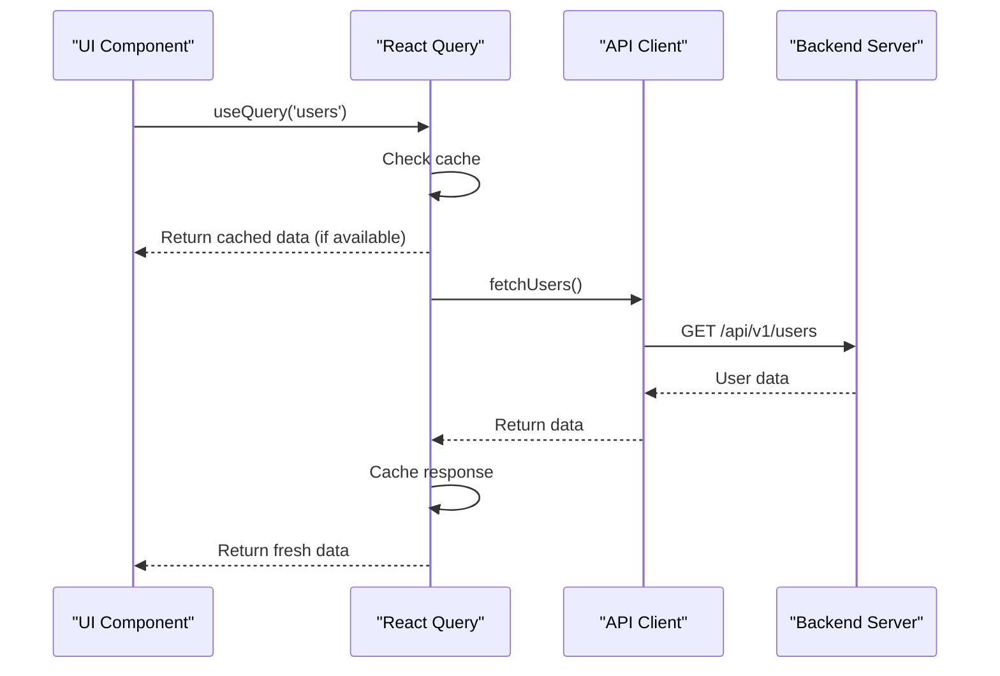
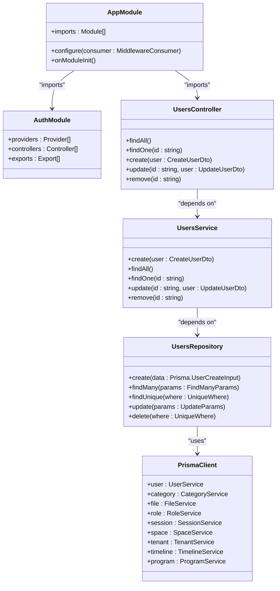
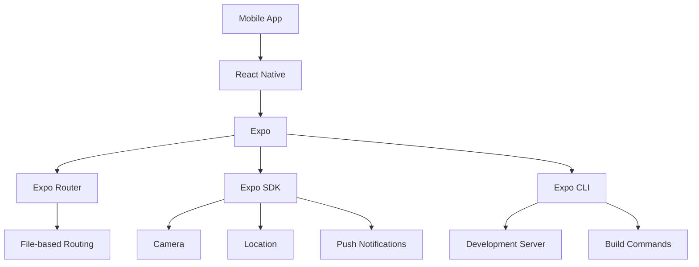
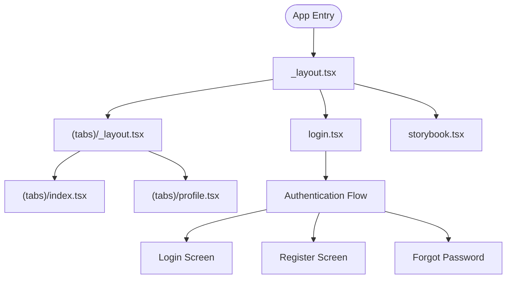
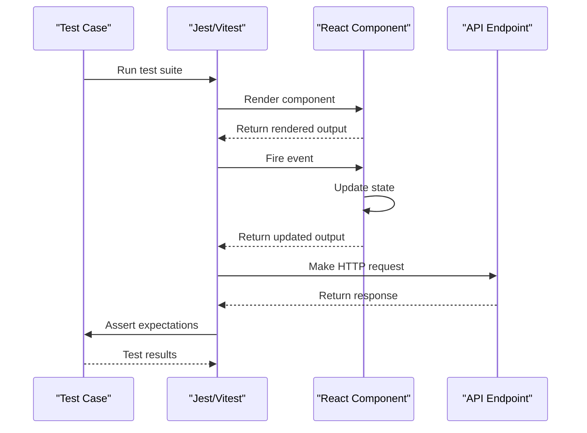
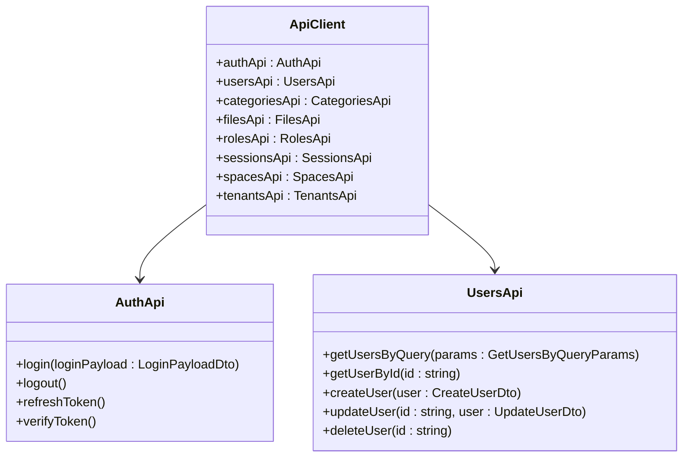
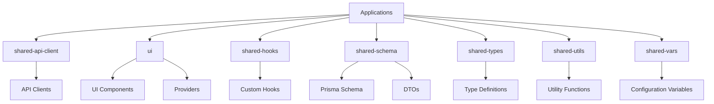
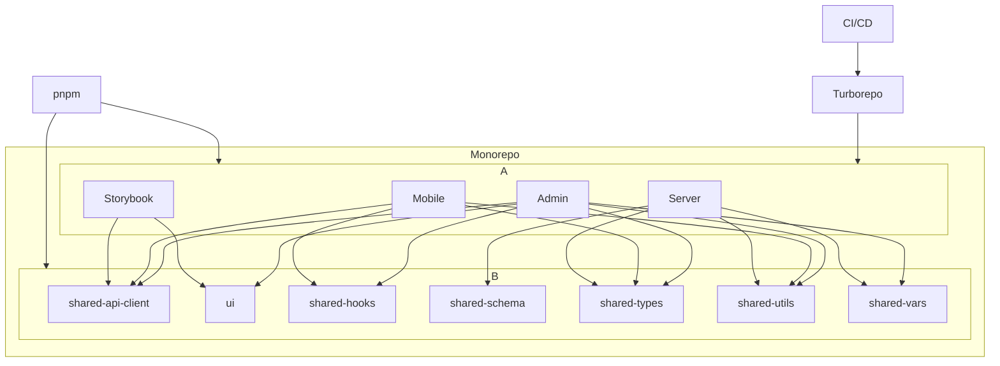
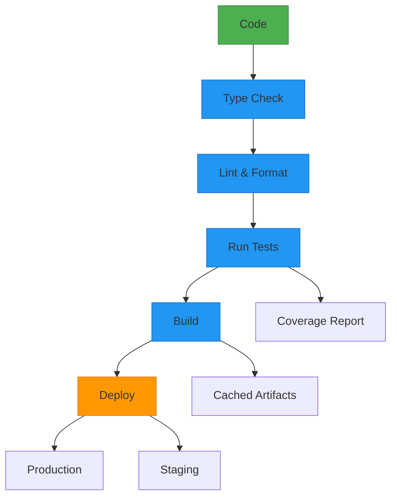

# Technology Stack

<cite>
**Referenced Files in This Document**   
- [package.json](file://apps/admin/package.json)
- [package.json](file://apps/mobile/package.json)
- [package.json](file://apps/server/package.json)
- [vite.config.ts](file://apps/admin/vite.config.ts)
- [main.ts](file://apps/server/src/main.ts)
- [schema.prisma](file://packages/shared-schema/prisma/schema.prisma)
- [turbo.json](file://turbo.json)
- [pnpm-workspace.yaml](file://pnpm-workspace.yaml)
- [main.tsx](file://apps/admin/src/main.tsx)
- [App.tsx](file://apps/admin/src/App.tsx)
- [AppProviders.tsx](file://packages/ui/src/provider/AppProviders/AppProviders.tsx)
- [QueryProvider.tsx](file://packages/ui/src/provider/QueryProvider/QueryProvider.tsx)
- [AuthProvider.tsx](file://packages/ui/src/provider/AuthProvider/AuthProvider.tsx)
- [app.module.ts](file://apps/server/src/module/app.module.ts)
- [auth.module.ts](file://apps/server/src/module/auth.module.ts)
- [authStore.ts](file://packages/ui/src/store/authStore.ts)
</cite>

## Table of Contents

1. [Frontend Stack](#frontend-stack)
2. [Backend Stack](#backend-stack)
3. [Mobile Stack](#mobile-stack)
4. [Testing Stack](#testing-stack)
5. [Build and Monorepo Tools](#build-and-monorepo-tools)
6. [Shared Packages and Utilities](#shared-packages-and-utilities)
7. [Architecture Overview](#architecture-overview)
8. [Technology Integration Workflow](#technology-integration-workflow)
9. [Best Practices and Configuration](#best-practices-and-configuration)
10. [Technology Selection Rationale](#technology-selection-rationale)

## Frontend Stack

The frontend stack for the admin application is built on modern web technologies centered around React, Vite, and TypeScript, providing a fast, type-safe development experience with excellent tooling support.

### React and TypeScript

The admin application uses **React 19.0.0** as its core UI library, leveraging the latest React features for building dynamic user interfaces. The application is fully typed with **TypeScript**, providing compile-time type checking and enhanced developer experience. The use of `@types/react` and `@types/react-dom` ensures proper type definitions for React components and DOM manipulation.

```mermaid
classDiagram
class App {
+render() JSX
}
class AppProviders {
+children : ReactNode
+render() JSX
}
class QueryProvider {
+children : ReactNode
+render() JSX
}
class AuthProvider {
+children : ReactNode
+isAuthenticated : boolean
+setIsAuthenticated(value : boolean)
+checkAuth() : boolean
+render() JSX
}
App --> AppProviders : "wraps"
AppProviders --> QueryProvider : "contains"
AppProviders --> AuthProvider : "contains"
QueryProvider --> "QueryClient" : "uses"
AuthProvider --> "authStore" : "manages state"
```

**Diagram sources**

- [App.tsx](file://apps/admin/src/App.tsx#L1-L22)
- [AppProviders.tsx](file://packages/ui/src/provider/AppProviders/AppProviders.tsx#L1-L21)
- [QueryProvider.tsx](file://packages/ui/src/provider/QueryProvider/QueryProvider.tsx#L1-L22)
- [AuthProvider.tsx](file://packages/ui/src/provider/AuthProvider/AuthProvider.tsx#L1-L58)

### Vite Build Tool

The frontend application uses **Vite** as its build tool and development server, providing lightning-fast hot module replacement (HMR) and optimized production builds. The Vite configuration is customized with several plugins to enhance functionality:

- **@vitejs/plugin-react-swc**: Uses SWC instead of Babel for faster React compilation
- **@tanstack/router-vite-plugin**: Integrates TanStack Router for type-safe routing
- **@tailwindcss/vite**: Integrates Tailwind CSS for utility-first styling

```typescript
import tailwindcss from "@tailwindcss/vite";
import { tanstackRouter } from "@tanstack/router-vite-plugin";
import react from "@vitejs/plugin-react-swc";
import { defineConfig } from "vite";

export default defineConfig(() => {
  return {
    plugins: [
      react(),
      tanstackRouter({
        routesDirectory: "./src/routes",
        generatedRouteTree: "./src/routeTree.gen.ts",
      }),
      tailwindcss(),
    ],
    server: {
      port: 3000,
      host: true,
      hmr: {
        overlay: true,
      },
    },
    build: {
      sourcemap: true,
    },
  };
});
```

**Section sources**

- [vite.config.ts](file://apps/admin/vite.config.ts#L1-L29)
- [package.json](file://apps/admin/package.json#L1-L70)

### State Management

The application uses **MobX** for state management, specifically **mobx-react-lite** for React integration. This provides a simple, reactive state management solution that automatically updates components when observables change. The `observer` decorator is used to make React components reactive to state changes.

Additionally, **React Query (TanStack Query)** is used for server state management, handling data fetching, caching, synchronization, and updates. The `QueryProvider` wraps the application, providing access to the query client and devtools.



**Diagram sources**

- [QueryProvider.tsx](file://packages/ui/src/provider/QueryProvider/QueryProvider.tsx#L1-L22)
- [shared-api-client](file://packages/shared-api-client/src/apis.ts)

**Section sources**

- [QueryProvider.tsx](file://packages/ui/src/provider/QueryProvider/QueryProvider.tsx#L1-L22)
- [package.json](file://apps/admin/package.json#L1-L70)

## Backend Stack

The backend stack is built on **NestJS**, a progressive Node.js framework for building efficient, scalable server-side applications. It leverages modern JavaScript features and combines elements of OOP, FP, and FRP.

### NestJS Framework

The server application uses **NestJS 11.1.3** as its core framework, providing a structured, modular architecture based on TypeScript. NestJS uses decorators and dependency injection to create a clean, maintainable codebase. The application is organized into feature modules, each responsible for a specific domain.



**Diagram sources**

- [app.module.ts](file://apps/server/src/module/app.module.ts#L1-L178)
- [auth.module.ts](file://apps/server/src/module/auth.module.ts#L1-L27)

### Prisma ORM

The application uses **Prisma** as its database ORM (Object-Relational Mapper), providing type-safe database access and a declarative way to define data models. Prisma Client is generated from the Prisma schema, offering an auto-completed, type-safe query builder.

The database is configured as PostgreSQL, with the connection URL and direct URL managed through environment variables for security and flexibility.

```prisma
generator client {
  provider        = "prisma-client-js"
  previewFeatures = ["prismaSchemaFolder"]
}

datasource db {
  provider  = "postgresql"
  url       = env("DATABASE_URL")
  directUrl = env("DIRECT_URL")
}
```

**Section sources**

- [schema.prisma](file://packages/shared-schema/prisma/schema.prisma#L1-L11)
- [package.json](file://apps/server/package.json#L1-L105)

### Application Bootstrap

The NestJS application is bootstrapped in the `main.ts` file, where the application instance is created, configured with global settings, and started on a specific port. The bootstrap process includes:

- **Global Exception Filters**: Custom exception filters for handling application-wide errors
- **Validation Pipe**: Global validation pipe for request data validation and transformation
- **Swagger Documentation**: API documentation automatically generated from code
- **CORS Configuration**: Cross-Origin Resource Sharing settings for frontend integration
- **Cookie Parser**: Middleware for parsing cookies from HTTP requests

```typescript
async function bootstrap() {
  const app = await NestFactory.create<NestExpressApplication>(AppModule, {
    bufferLogs: true,
  });

  app.useLogger(app.get(Logger));
  app.use(cookieParser());
  app.set("query parser", "extended");

  app.useGlobalFilters(
    new AllExceptionsFilter(httpAdapterHost.httpAdapter),
    new PrismaClientExceptionFilter(httpAdapterHost.httpAdapter)
  );

  app.useGlobalPipes(
    new ValidationPipe({
      transform: true,
      whitelist: true,
    })
  );

  const config = new DocumentBuilder()
    .setVersion("1.0.0")
    .addBearerAuth()
    .build();

  const document = SwaggerModule.createDocument(app, config, options);
  SwaggerModule.setup("api", app, document);

  app.enableCors({
    origin: [
      "http://localhost:3000",
      "http://localhost:5173",
      // ... other origins
    ],
    credentials: true,
  });

  await app.listen(3005);
}
```

**Section sources**

- [main.ts](file://apps/server/src/main.ts#L1-L77)
- [app.module.ts](file://apps/server/src/module/app.module.ts#L1-L178)

## Mobile Stack

The mobile application is built using **React Native** with **Expo**, providing a cross-platform solution for iOS and Android development with a shared codebase.

### React Native and Expo

The mobile app uses **React Native 0.79.5** as the core framework, allowing for native mobile development using React. **Expo 53.0.20** is used as a framework on top of React Native, providing a set of tools and services to simplify development, including:

- **Expo Router**: File-based routing system for navigation
- **Expo CLI**: Command-line interface for development and deployment
- **Expo SDK**: Collection of pre-built native modules

The application uses **React 19.0.0** and **React DOM 19.0.0**, ensuring consistency with the web applications in the monorepo.



**Section sources**

- [package.json](file://apps/mobile/package.json#L1-L78)
- [app.json](file://apps/mobile/app.json)

### Navigation and UI

The application uses **React Navigation 7.1.6** as the navigation library, providing a flexible and customizable navigation solution. **Expo Router** is integrated with React Navigation to enable file-based routing, where the file structure determines the navigation hierarchy.

For UI components, the application uses **@expo/vector-icons** for icons and **react-native-safe-area-context** to handle safe areas on different devices. **react-native-reanimated** provides smooth animations and gestures.



**Section sources**

- [package.json](file://apps/mobile/package.json#L1-L78)
- [src/app/\_layout.tsx](file://apps/mobile/src/app/_layout.tsx)
- [src/app/(tabs)/\_layout.tsx](<file://apps/mobile/src/app/(tabs)/_layout.tsx>)

## Testing Stack

The testing stack includes different tools for different applications, ensuring comprehensive test coverage across the codebase.

### Vitest and Jest

The admin application uses **Vitest** as its testing framework, which is a fast, Vite-native test runner. Vitest provides excellent TypeScript support and integrates seamlessly with the Vite build system.

The mobile application uses **Jest** with **jest-expo** preset, which is the standard testing framework for React Native applications. Jest provides a complete testing solution with mocking, assertion libraries, and test runners.

```json
{
  "scripts": {
    "test": "jest --watchAll"
  },
  "jest": {
    "preset": "jest-expo"
  }
}
```

**Section sources**

- [package.json](file://apps/admin/package.json#L1-L70)
- [package.json](file://apps/mobile/package.json#L1-L78)

### Testing Libraries

For React component testing, the mobile application uses **@testing-library/react-native**, which promotes testing components from the user's perspective. This library provides utilities to render components, query the rendered output, and fire events.

For API testing, the server application uses **supertest** for integration testing of HTTP endpoints, allowing for easy testing of request-response cycles.



**Section sources**

- [package.json](file://apps/mobile/package.json#L1-L78)
- [test](file://apps/server/test)

## Build and Monorepo Tools

The project uses a monorepo architecture managed by **pnpm** and orchestrated by **Turborepo**, enabling efficient development and build processes across multiple applications.

### Turborepo

**Turborepo** is used as the build system orchestrator, providing incremental builds, caching, and task pipelining. The `turbo.json` configuration defines tasks such as build, test, lint, and start, with dependencies between tasks to ensure proper execution order.

```json
{
  "tasks": {
    "build": {
      "outputs": [
        "dist/**",
        ".next/**",
        "!.next/cache/**",
        "storybook-static/**"
      ],
      "dependsOn": ["^build"],
      "env": ["NODE_ENV"],
      "passThroughEnv": ["NODE_OPTIONS"]
    },
    "test": {
      "outputs": ["coverage/**"],
      "dependsOn": []
    },
    "lint": {},
    "start:dev": {
      "cache": false,
      "persistent": true
    }
  }
}
```

Turborepo's caching mechanism ensures that only changed packages are rebuilt, significantly reducing build times in development and CI/CD environments.

**Section sources**

- [turbo.json](file://turbo.json#L1-L42)
- [package.json](file://package.json)

### pnpm Workspaces

The monorepo uses **pnpm** as the package manager with workspace support, allowing for shared dependencies and efficient package linking. The `pnpm-workspace.yaml` file defines the workspace packages, including all applications and shared packages.

The workspace configuration includes a catalog of shared dependencies with specific versions, ensuring consistency across all packages in the monorepo.

```yaml
packages:
  - apps/*
  - packages/*

catalog:
  "@heroui/react": ^2.8.2
  "@types/react": ~19.0.10
  "react": 19.0.0
  "typescript": ~5.8.3
  "vite": ^6.0.8
```

**Section sources**

- [pnpm-workspace.yaml](file://pnpm-workspace.yaml#L1-L57)
- [package.json](file://package.json)

## Shared Packages and Utilities

The monorepo includes several shared packages that provide common functionality across applications, promoting code reuse and consistency.

### Shared API Client

The **shared-api-client** package contains auto-generated API clients using Orval, which generates TypeScript clients from OpenAPI specifications. This ensures type-safe API interactions across all applications.

The package includes models, APIs, and types that correspond to the backend endpoints, reducing the need for manual API client implementation.



**Section sources**

- [shared-api-client](file://packages/shared-api-client)
- [orval.config.js](file://packages/shared-api-client/orval.dev.config.js)

### Shared Frontend Components

The **ui** package contains reusable UI components, providers, and utilities used across frontend applications. This includes:

- **Components**: Reusable UI elements like buttons, forms, and layouts
- **Providers**: Context providers for authentication, queries, and theming
- **Store**: State management stores using MobX

The package uses **Tailwind CSS** for styling, ensuring consistent design across applications.

**Section sources**

- [ui](file://packages/ui)
- [postcss.config.js](file://packages/ui/postcss.config.js)

### Shared Schema and Utilities

The **shared-schema** package contains the Prisma schema and shared data models, ensuring database consistency across applications. It also includes DTOs (Data Transfer Objects) and entities used by the backend.

The **shared-utils** package provides common utility functions for date manipulation, environment detection, validation, and other cross-cutting concerns.



**Section sources**

- [packages](file://packages)
- [shared-schema](file://packages/shared-schema)

## Architecture Overview

The prj-core technology stack follows a monorepo architecture with multiple applications sharing common packages and utilities. This architecture promotes code reuse, consistent tooling, and streamlined development workflows.



The architecture separates concerns into distinct applications while sharing common functionality through packages. The admin and mobile applications consume the server API through the shared API client, ensuring type-safe interactions. The server application uses Prisma to interact with the PostgreSQL database, with the schema defined in the shared-schema package.

**Diagram sources**

- [turbo.json](file://turbo.json#L1-L42)
- [pnpm-workspace.yaml](file://pnpm-workspace.yaml#L1-L57)
- [package.json](file://package.json)

## Technology Integration Workflow

The technologies in the prj-core stack work together in a cohesive development workflow, from code editing to deployment.

### Development Workflow

1. **Code Editing**: Developers work on features in their respective applications or shared packages
2. **Type Checking**: TypeScript provides real-time type checking and error detection
3. **Linting and Formatting**: Biome enforces code style and best practices
4. **Hot Reloading**: Vite and Expo provide instant feedback during development
5. **Testing**: Vitest and Jest run tests with coverage reporting
6. **Building**: Turborepo orchestrates the build process with caching
7. **Deployment**: Applications are deployed to their respective environments



**Section sources**

- [turbo.json](file://turbo.json#L1-L42)
- [package.json](file://package.json)
- [biome.json](file://biome.json)

### API Integration

The frontend and mobile applications integrate with the backend API through the shared API client, which is auto-generated from the OpenAPI specification. This ensures that API contracts are enforced at the type level, reducing runtime errors.

When a backend endpoint is modified, the API client is regenerated, and any breaking changes are immediately apparent in the consuming applications due to TypeScript errors.

**Section sources**

- [shared-api-client](file://packages/shared-api-client)
- [server](file://apps/server)

## Best Practices and Configuration

The prj-core stack follows several best practices to ensure code quality, maintainability, and developer productivity.

### Code Quality

- **Type Safety**: TypeScript is used throughout the codebase to catch errors at compile time
- **Consistent Styling**: Biome enforces consistent code style and formatting
- **Testing**: Comprehensive test coverage is maintained with unit, integration, and end-to-end tests
- **Documentation**: Swagger provides automatic API documentation

### Performance Optimization

- **Incremental Builds**: Turborepo caches build artifacts to minimize rebuild times
- **Tree Shaking**: Vite eliminates unused code in production builds
- **Code Splitting**: React.lazy and Suspense enable lazy loading of components
- **Caching**: React Query provides intelligent data caching and background updates

### Security

- **Input Validation**: NestJS ValidationPipe ensures all incoming data is validated
- **Authentication**: JWT-based authentication with secure cookie storage
- **Authorization**: CASL provides fine-grained permission management
- **CORS**: Strict CORS policies prevent unauthorized cross-origin requests

**Section sources**

- [main.ts](file://apps/server/src/main.ts#L1-L77)
- [vite.config.ts](file://apps/admin/vite.config.ts#L1-L29)
- [turbo.json](file://turbo.json#L1-L42)

## Technology Selection Rationale

The technology choices in the prj-core stack were made based on several factors including developer experience, performance, ecosystem maturity, and team expertise.

### Why React and Vite?

React was chosen for its component-based architecture, large ecosystem, and strong typing support with TypeScript. Vite was selected over traditional bundlers like Webpack due to its faster development server startup and hot module replacement, significantly improving developer experience.

### Why NestJS?

NestJS was chosen over Express or Fastify for its structured, modular architecture that scales well with application complexity. Its dependency injection system, decorators, and opinionated patterns promote maintainable code, especially in large teams.

### Why Prisma?

Prisma was selected over traditional ORMs like TypeORM due to its type-safe query builder, declarative schema definition, and excellent TypeScript integration. The generated Prisma Client provides autocomplete and type checking, reducing runtime errors.

### Why Turborepo?

Turborepo was chosen over other monorepo tools like Nx or Lerna due to its superior caching mechanism, incremental builds, and seamless integration with modern build tools. Its performance advantages are particularly noticeable in large monorepos.

### Why pnpm?

pnpm was selected over npm or Yarn due to its disk space efficiency and strict dependency resolution. The hard linking system reduces disk usage, and the strict mode prevents phantom dependencies, leading to more reliable builds.

**Section sources**

- [package.json](file://package.json)
- [turbo.json](file://turbo.json#L1-L42)
- [pnpm-workspace.yaml](file://pnpm-workspace.yaml#L1-L57)
