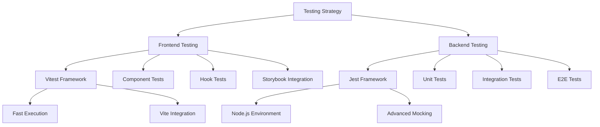
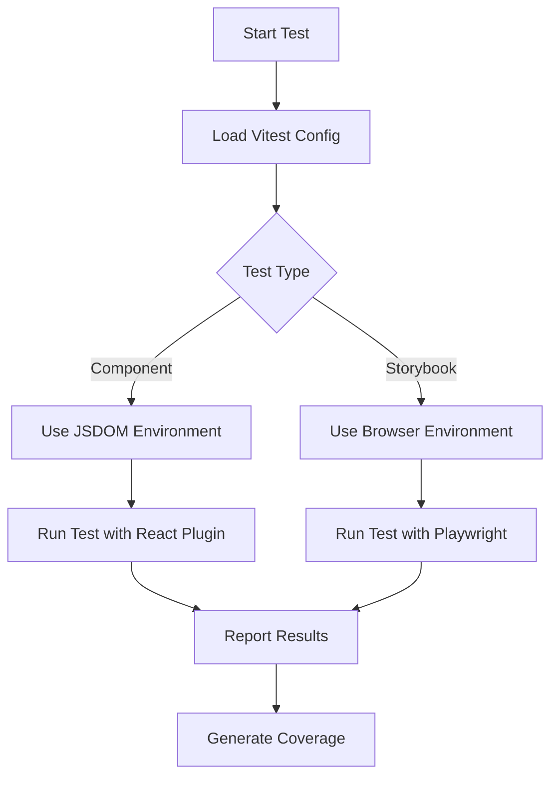
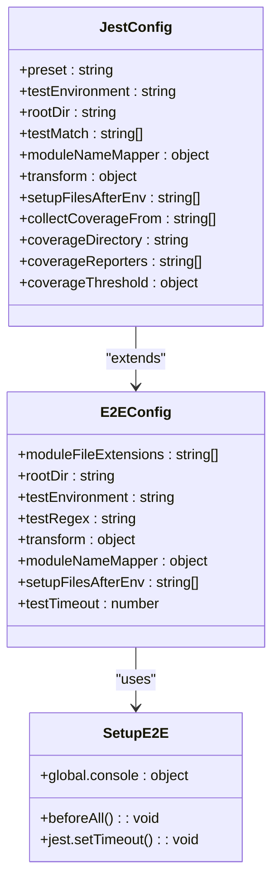
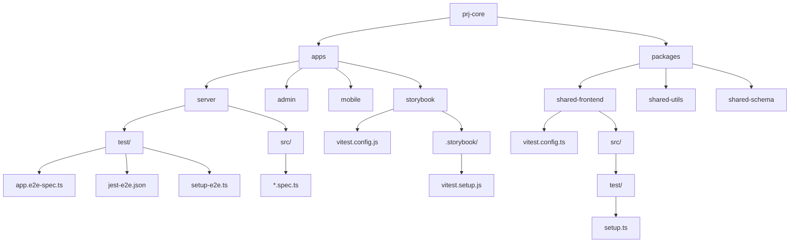
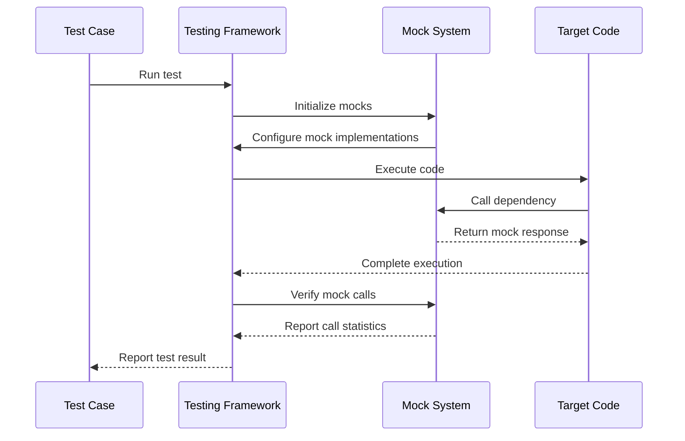
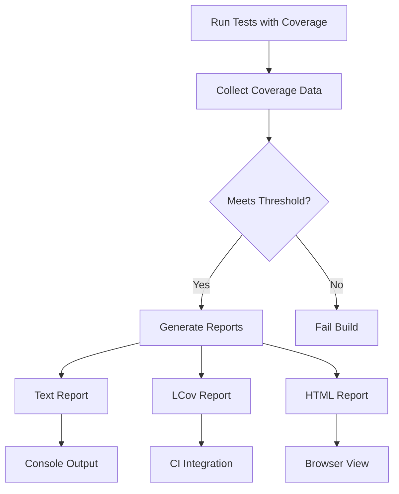
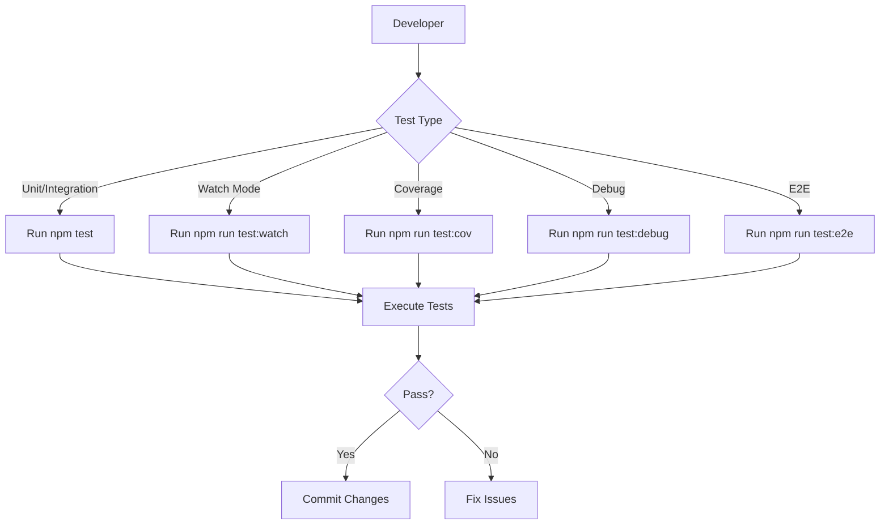
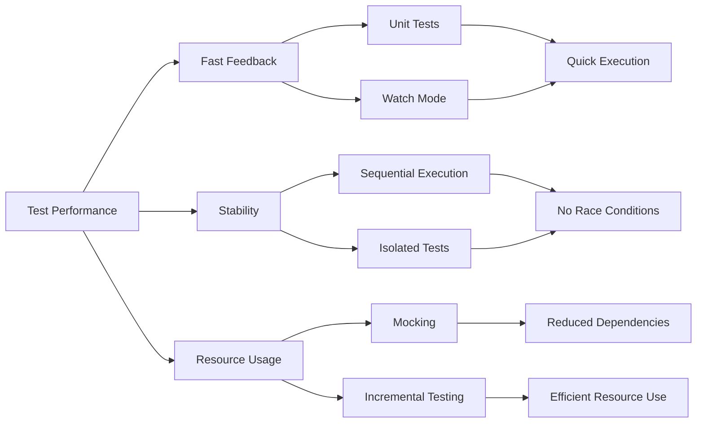

# Testing Strategy

<cite>
**Referenced Files in This Document**   
- [apps/server/package.json](file://apps/server/package.json)
- [apps/server/jest.config.js](file://apps/server/jest.config.js)
- [apps/server/test/jest-e2e.json](file://apps/server/test/jest-e2e.json)
- [apps/server/test/setup-e2e.ts](file://apps/server/test/setup-e2e.ts)
- [apps/server/test/app.e2e-spec.ts](file://apps/server/test/app.e2e-spec.ts)
- [apps/storybook/vitest.config.js](file://apps/storybook/vitest.config.js)
- [apps/storybook/.storybook/vitest.setup.js](file://apps/storybook/.storybook/vitest.setup.js)
- [packages/shared-frontend/vitest.config.ts](file://packages/shared-frontend/vitest.config.ts)
- [packages/shared-frontend/src/test/setup.ts](file://packages/shared-frontend/src/test/setup.ts)
- [packages/shared-utils/vitest.config.ts](file://packages/shared-utils/vitest.config.ts)
- [packages/shared-schema/vitest.config.ts](file://packages/shared-schema/vitest.config.ts)
</cite>

## Table of Contents
1. [Introduction](#introduction)
2. [Testing Architecture Overview](#testing-architecture-overview)
3. [Unit Testing with Vitest (Frontend)](#unit-testing-with-vitest-frontend)
4. [Integration and E2E Testing with Jest (Backend)](#integration-and-e2e-testing-with-jest-backend)
5. [Test Organization and Structure](#test-organization-and-structure)
6. [Mocking Strategies](#mocking-strategies)
7. [Coverage Requirements and Reporting](#coverage-requirements-and-reporting)
8. [Running Tests](#running-tests)
9. [Troubleshooting Common Issues](#troubleshooting-common-issues)
10. [Performance Considerations](#performance-considerations)

## Introduction
The prj-core monorepo implements a comprehensive testing strategy that ensures code quality and reliability across both frontend and backend applications. This document details the testing architecture, implementation patterns, and best practices used throughout the repository. The strategy employs Vitest for frontend testing in the shared components and Storybook environments, while utilizing Jest for backend testing in the NestJS server application. The approach supports unit, integration, and end-to-end (E2E) testing methodologies, providing comprehensive coverage of the application's functionality.

**Section sources**
- [apps/server/package.json](file://apps/server/package.json)
- [apps/storybook/vitest.config.js](file://apps/storybook/vitest.config.js)

## Testing Architecture Overview
The testing architecture in prj-core follows a dual-framework approach, leveraging the strengths of both Vitest and Jest for their respective domains. Vitest is used for frontend testing due to its Vite integration, fast execution, and excellent support for modern JavaScript features, while Jest is employed for backend testing because of its maturity, robust mocking capabilities, and seamless integration with Node.js environments.

The architecture is organized across multiple layers:
- **Frontend testing**: Utilizes Vitest for testing shared React components, hooks, and UI elements
- **Backend testing**: Employs Jest for testing NestJS controllers, services, and modules
- **E2E testing**: Implements comprehensive end-to-end tests using Jest with Supertest for API testing
- **Storybook integration**: Combines component testing with visual testing through Storybook and Vitest

**Diagram sources**
- [apps/storybook/vitest.config.js](file://apps/storybook/vitest.config.js)
- [apps/server/jest.config.js](file://apps/server/jest.config.js)

**Section sources**
- [apps/server/jest.config.js](file://apps/server/jest.config.js)
- [apps/storybook/vitest.config.js](file://apps/storybook/vitest.config.js)

## Unit Testing with Vitest (Frontend)
Vitest serves as the primary testing framework for frontend components and utilities within the prj-core monorepo. It is configured in multiple frontend packages including shared-frontend, shared-utils, and shared-schema, providing a consistent testing experience across shared components.

The Vitest configuration leverages Vite's build system for fast test execution and hot module replacement, significantly reducing test startup time. Key features of the Vitest setup include:

- **Multiple test projects**: The configuration supports running tests from different sources, including Storybook stories and shared frontend components
- **Browser testing**: Enabled through Playwright for component testing in actual browser environments
- **JSDOM environment**: Used for simulating browser environments in unit tests
- **Alias resolution**: Properly configured to handle module aliases used throughout the frontend codebase

The test files are typically colocated with the source code they test, following the pattern `*.test.ts` or `*.test.tsx`. For shared packages, tests are organized within the `src` directory, often in `__tests__` folders or alongside the implementation files.

**Diagram sources**
- [apps/storybook/vitest.config.js](file://apps/storybook/vitest.config.js)
- [packages/shared-frontend/vitest.config.ts](file://packages/shared-frontend/vitest.config.ts)

**Section sources**
- [apps/storybook/vitest.config.js](file://apps/storybook/vitest.config.js)
- [packages/shared-frontend/vitest.config.ts](file://packages/shared-frontend/vitest.config.ts)
- [packages/shared-frontend/src/test/setup.ts](file://packages/shared-frontend/src/test/setup.ts)

## Integration and E2E Testing with Jest (Backend)
The backend testing strategy in prj-core relies on Jest as the primary testing framework for the NestJS server application. Jest is configured through `jest.config.js` in the server application, with specialized configuration for end-to-end tests provided in `test/jest-e2e.json`.

Key aspects of the Jest configuration include:
- **Preset configuration**: Uses `ts-jest` to enable TypeScript support
- **Test environment**: Configured for Node.js environment testing
- **Module resolution**: Implements moduleNameMapper to handle workspace package aliases
- **Code transformation**: Transforms TypeScript files using ts-jest with specific compiler options
- **Test discovery**: Uses testMatch to identify test files with `.spec.ts` and `.test.ts` extensions

The E2E testing configuration is specialized for testing the complete application stack, with:
- **Separate configuration file**: `jest-e2e.json` provides specific settings for E2E tests
- **Extended timeouts**: 30-second timeout to accommodate database operations and API calls
- **Test environment setup**: `setup-e2e.ts` configures environment variables and global settings
- **Database isolation**: Uses a dedicated test database URL to prevent interference with development data

**Diagram sources**
- [apps/server/jest.config.js](file://apps/server/jest.config.js)
- [apps/server/test/jest-e2e.json](file://apps/server/test/jest-e2e.json)
- [apps/server/test/setup-e2e.ts](file://apps/server/test/setup-e2e.ts)

**Section sources**
- [apps/server/jest.config.js](file://apps/server/jest.config.js)
- [apps/server/test/jest-e2e.json](file://apps/server/test/jest-e2e.json)
- [apps/server/test/setup-e2e.ts](file://apps/server/test/setup-e2e.ts)

## Test Organization and Structure
The test organization in prj-core follows a structured approach that aligns with the monorepo architecture and application domains. Tests are organized by application and package, with specific conventions for different test types.

In the server application:
- **Unit tests**: Colocated with source files using `.spec.ts` suffix
- **Integration tests**: Located in the `test` directory alongside E2E tests
- **E2E tests**: Stored in `apps/server/test/` with `*.e2e-spec.ts` naming pattern
- **Test setup**: Shared setup files in `test/` directory for E2E configuration

In frontend packages:
- **Component tests**: Located in `src/` directory with `*.test.tsx` naming
- **Utility tests**: Organized in `__tests__` directories or alongside implementation
- **Hook tests**: Follow the same pattern as component tests
- **Storybook tests**: Integrated through the Storybook Vitest plugin

The monorepo structure enables shared testing configurations across packages, with each package maintaining its own test configuration while inheriting common patterns from the root configuration.

**Diagram sources**
- [apps/server/test/](file://apps/server/test/)
- [apps/storybook/vitest.config.js](file://apps/storybook/vitest.config.js)
- [packages/shared-frontend/vitest.config.ts](file://packages/shared-frontend/vitest.config.ts)

**Section sources**
- [apps/server/test/](file://apps/server/test/)
- [apps/storybook/vitest.config.js](file://apps/storybook/vitest.config.js)
- [packages/shared-frontend/vitest.config.ts](file://packages/shared-frontend/vitest.config.ts)

## Mocking Strategies
The prj-core monorepo employs several mocking strategies to isolate units of code and simulate external dependencies during testing. These strategies vary between frontend and backend testing contexts.

For backend testing with Jest:
- **Module mocking**: Uses Jest's built-in mocking capabilities to replace dependencies
- **Repository mocking**: Implements mock repositories for database operations
- **Service mocking**: Creates mock implementations of service classes
- **Controller mocking**: Uses NestJS testing utilities to create mock controllers

The Jest configuration includes settings that support effective mocking:
- `clearMocks`: Automatically clears mock calls between tests
- `resetMocks`: Resets mock implementations between tests
- `restoreMocks`: Restores original implementations after tests
- `moduleNameMapper`: Enables mocking of specific modules and paths

For frontend testing with Vitest:
- **Component mocking**: Uses Vitest's mocking capabilities to isolate components
- **Hook mocking**: Implements mock hooks for testing components that depend on custom hooks
- **API mocking**: Simulates API calls using mocked implementations
- **Context mocking**: Creates mock contexts for testing components that consume React context

The shared frontend packages include setup files that configure common mocking patterns, ensuring consistency across tests.

**Diagram sources**
- [apps/server/jest.config.js](file://apps/server/jest.config.js)
- [packages/shared-frontend/src/test/setup.ts](file://packages/shared-frontend/src/test/setup.ts)

**Section sources**
- [apps/server/jest.config.js](file://apps/server/jest.config.js)
- [packages/shared-frontend/src/test/setup.ts](file://packages/shared-frontend/src/test/setup.ts)

## Coverage Requirements and Reporting
The prj-core monorepo enforces strict code coverage requirements to ensure comprehensive test coverage. The coverage configuration is defined in the Jest configuration file for the server application, establishing minimum thresholds for different coverage metrics.

Key coverage requirements include:
- **Branch coverage**: Minimum 80% coverage
- **Function coverage**: Minimum 80% coverage  
- **Line coverage**: Minimum 80% coverage
- **Statement coverage**: Minimum 80% coverage

The coverage configuration excludes certain files from the coverage requirements:
- Test files (`.spec.ts`, `.test.ts`)
- Type definition files (`.d.ts`)
- Entry point files (main.ts, index.ts)
- Configuration files

Coverage reporting is configured to generate multiple output formats:
- **Text output**: Console display during test execution
- **LCov format**: For integration with code coverage tools
- **HTML reports**: For detailed visual analysis of coverage

The coverage directory is configured to output reports to `coverage/` in the server application, making it easy to review and analyze coverage results.

**Diagram sources**
- [apps/server/jest.config.js](file://apps/server/jest.config.js)

**Section sources**
- [apps/server/jest.config.js](file://apps/server/jest.config.js)

## Running Tests
The prj-core monorepo provides multiple scripts for running tests, accessible through the package.json files in each application. These scripts enable developers to run different types of tests based on their needs.

For the server application, the following test scripts are available:
- `test`: Runs all unit and integration tests
- `test:watch`: Runs tests in watch mode, re-executing when files change
- `test:cov`: Runs tests with coverage reporting
- `test:debug`: Runs tests in debug mode with inspector
- `test:e2e`: Runs end-to-end tests using the specialized E2E configuration

For frontend testing, tests are typically run through the Storybook Vitest integration or directly using Vitest commands. The Vitest configuration in the Storybook app enables running tests for both Storybook stories and shared frontend components.

When running tests, developers should consider:
- Using `test:watch` during development for rapid feedback
- Running `test:cov` before commits to ensure coverage requirements are met
- Executing `test:e2e` to verify the complete application flow
- Using debug mode when troubleshooting failing tests

**Diagram sources**
- [apps/server/package.json](file://apps/server/package.json)

**Section sources**
- [apps/server/package.json](file://apps/server/package.json)

## Troubleshooting Common Issues
When working with the testing setup in prj-core, developers may encounter several common issues. This section provides guidance on identifying and resolving these problems.

**Test environment variables not set**
Issue: E2E tests fail due to missing environment variables
Solution: Ensure `setup-e2e.ts` is properly configured in `setupFilesAfterEnv` and that all required environment variables are set in the file.

**Module resolution errors**
Issue: Tests fail with "Cannot find module" errors
Solution: Verify that `moduleNameMapper` in the Jest configuration correctly maps workspace packages and that the paths are accurate.

**Database connection issues in E2E tests**
Issue: E2E tests fail to connect to the database
Solution: Check that the `DATABASE_URL` environment variable in `setup-e2e.ts` is correct and accessible from the test environment.

**Mocking problems**
Issue: Mocks are not working as expected
Solution: Ensure that `clearMocks`, `resetMocks`, and `restoreMocks` are properly configured in the Jest configuration, and that mocks are set up before each test.

**Coverage reporting issues**
Issue: Coverage reports are not generated or are incomplete
Solution: Verify that `collectCoverageFrom` includes the correct patterns and that excluded files are properly specified.

**Test timeout failures**
Issue: Tests fail due to timeout
Solution: Increase the `testTimeout` value in the configuration, especially for E2E tests that may require more time to complete.

**Parallel test execution issues**
Issue: Tests fail when running in parallel
Solution: Set `maxWorkers` to 1 in the Jest configuration to run tests sequentially, which can help identify race conditions or shared state issues.

**Section sources**
- [apps/server/jest.config.js](file://apps/server/jest.config.js)
- [apps/server/test/setup-e2e.ts](file://apps/server/test/setup-e2e.ts)

## Performance Considerations
The testing strategy in prj-core incorporates several performance optimizations to ensure fast test execution and efficient development workflows.

Key performance considerations include:
- **Parallel test execution**: Jest can run tests in parallel by default, but this is limited to a single worker in the current configuration to avoid database conflicts
- **Test isolation**: Each test is isolated to prevent side effects, but this can impact performance when database operations are involved
- **Mocking strategy**: Extensive use of mocking reduces dependencies on external systems, improving test speed
- **Incremental testing**: The watch mode enables incremental testing, running only affected tests when files change
- **Coverage collection**: Coverage collection can significantly slow down test execution and should be used judiciously

To optimize test performance:
- Use unit tests for fast feedback on isolated functionality
- Reserve E2E tests for critical user journeys and run them less frequently
- Implement proper mocking to avoid slow external dependencies
- Use watch mode during development for rapid feedback
- Run coverage analysis only when necessary

The current configuration sets `maxWorkers` to 1 for both regular and E2E tests, prioritizing test stability over speed. This prevents potential race conditions when multiple tests access shared resources like the database.

**Diagram sources**
- [apps/server/jest.config.js](file://apps/server/jest.config.js)

**Section sources**
- [apps/server/jest.config.js](file://apps/server/jest.config.js)