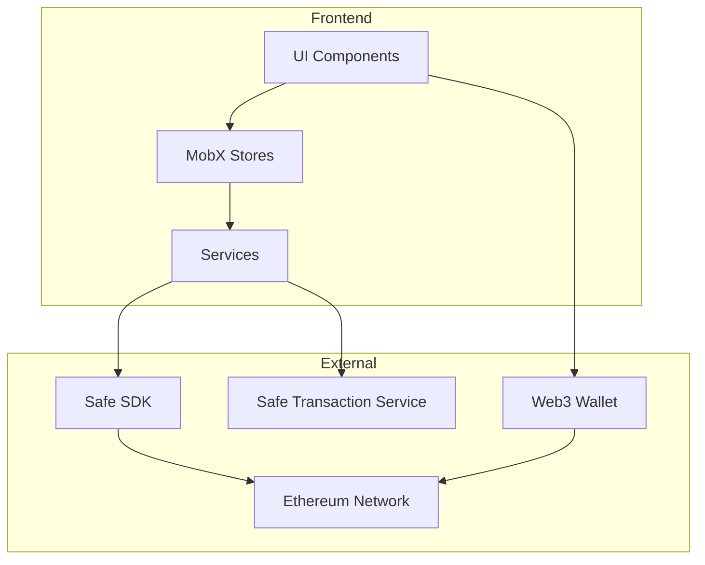
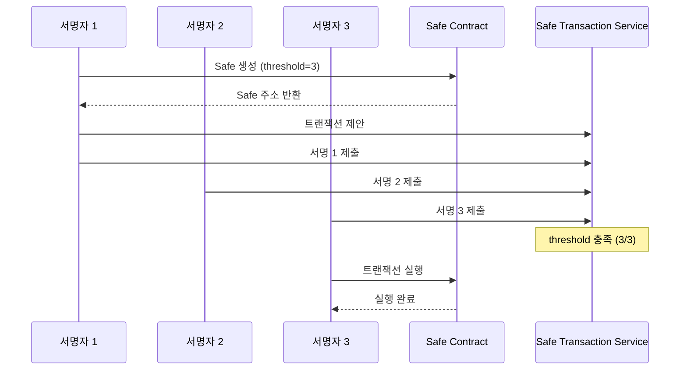

# Coin - 블록체인 멀티시그 자산 관리 서비스

> Safe(Gnosis Safe) 프로토콜 기반의 기업용 멀티시그 지갑 송금 시스템

---

## 📋 목차

- [서비스 개요](#-서비스-개요)
- [핵심 기능](#-핵심-기능)
- [보안 설계](#-보안-설계)
- [스마트 컨트랙트](#-스마트-컨트랙트)
- [인프라 구조](#-인프라-구조)
- [기술 스택](#-기술-스택)
- [아키텍처](#-아키텍처)
- [프로젝트 구조](#-프로젝트-구조)
- [시작하기](#-시작하기)
- [환경 설정](#-환경-설정)
- [테스트](#-테스트)
- [배포 가이드](#-배포-가이드)

---

## 🎯 서비스 개요

**Coin**은 기업 및 조직의 디지털 자산을 안전하게 관리하기 위한 **멀티시그(다중서명) 지갑 서비스**입니다.

### 비즈니스 목적

- **자산 보호**: 단일 키 분실/탈취 시에도 자산 보호
- **내부 통제**: 송금 시 복수 승인자 필요로 횡령 방지
- **감사 추적**: 모든 트랜잭션 이력 블록체인에 영구 기록
- **규정 준수**: 기업 자금 관리 정책 기술적 강제

### 대상 고객

| 고객 유형     | 사용 시나리오                  |
| ------------- | ------------------------------ |
| 스타트업      | 법인 자금 관리, 투자금 집행    |
| DAO/커뮤니티  | 공동 자금 관리, 제안 기반 집행 |
| 거래소/수탁사 | 고객 자산 콜드월렛 관리        |
| NFT 프로젝트  | 로열티 수익 분배               |

---

## ✨ 핵심 기능

### 지갑 연결

- wagmi connectors를 통한 MetaMask 지갑 연결
- Ethereum Mainnet 및 Sepolia 테스트넷 지원

### Safe 생성

- 3명의 서명자(threshold=3)로 구성된 멀티시그 Safe 생성
- 커스텀 소유자 및 threshold 설정 가능

### 송금 기능

- ETH 네이티브 토큰 송금
- ERC-20 토큰 송금 지원
- 트랜잭션 제안 및 대기열 관리

### 멀티시그 서명

- 대기 중인 트랜잭션 목록 조회
- 각 서명자별 승인/거부
- 실시간 서명 상태 확인

### 트랜잭션 실행

- threshold 충족 시 온체인 실행
- 트랜잭션 해시 및 상태 추적
- Etherscan 링크 제공

---

## 🔒 보안 설계

### 스마트컨트랙트 보안 패턴

#### 1. CEI 패턴 (Checks-Effects-Interactions)

```solidity
function withdraw(uint256 amount) external {
    // 1. Checks - 조건 확인
    require(balances[msg.sender] >= amount, "Insufficient");

    // 2. Effects - 상태 먼저 변경
    balances[msg.sender] -= amount;

    // 3. Interactions - 외부 호출 마지막
    (bool success, ) = msg.sender.call{value: amount}("");
    require(success, "Transfer failed");
}
```

#### 2. ReentrancyGuard

외부로 자산을 전송하는 모든 함수에 재진입 공격 방지 적용:

```solidity
import "@openzeppelin/contracts/security/ReentrancyGuard.sol";

function withdraw() external nonReentrant {
    // 안전한 출금 로직
}
```

#### 3. Pull over Push 패턴

자금을 직접 전송하지 않고 잔고 기록 후 수신자가 직접 출금:

```solidity
// 잔고 기록 (Push 아님)
mapping(address => uint256) public rewards;

// 수신자가 직접 출금 (Pull)
function claimReward() external {
    uint256 amount = rewards[msg.sender];
    rewards[msg.sender] = 0;
    payable(msg.sender).transfer(amount);
}
```

### 프론트엔드 보안

| 항목            | 적용 방식                        |
| --------------- | -------------------------------- |
| 트랜잭션 상태   | Pessimistic UI (확정 후 UI 변경) |
| 지갑 클라이언트 | 액션 시점에 getWalletClient 호출 |
| 에러 처리       | 상황별 명확한 메시지 제공        |

### 키 관리

- **AWS KMS**: 서버 측 암호화 키 관리
- **Secrets Manager**: DB 비밀번호, API 키 저장
- **클라이언트 키**: 사용자 지갑에서만 관리 (서버 미보관)

---

## 📜 스마트 컨트랙트

### Safe 컨트랙트 (Gnosis Safe)

본 서비스는 [Safe Global](https://safe.global/)의 검증된 스마트 컨트랙트를 활용합니다.

| 항목          | 내용                      |
| ------------- | ------------------------- |
| 프로토콜      | Safe (구 Gnosis Safe)     |
| 컨트랙트 버전 | v1.4.1                    |
| 감사 상태     | 다수 외부 감사 완료       |
| 네트워크      | Ethereum Mainnet, Sepolia |

### 컨트랙트 주소 (Mainnet)

```
Safe Singleton: 0x41675C099F32341bf84BFc5382aF534df5C7461a
Safe Proxy Factory: 0x4e1DCf7AD4e460CfD30791CCC4F9c8a4f820ec67
MultiSend: 0x38869bf66a61cF6bDB996A6aE40D5853Fd43B526
```

### Safe Transaction Service API

| 네트워크 | URL                                          |
| -------- | -------------------------------------------- |
| Mainnet  | https://safe-transaction-mainnet.safe.global |
| Sepolia  | https://safe-transaction-sepolia.safe.global |

---

## 🏗 인프라 구조

### 현재 아키텍처 (MVP)

```
┌─────────────────────────────────────────────────────────────┐
│                        Client                                │
│  ┌─────────────────┐    ┌─────────────────┐                 │
│  │   Next.js App   │───▶│   MetaMask      │                 │
│  │   (Vercel)      │    │   Wallet        │                 │
│  └────────┬────────┘    └────────┬────────┘                 │
│           │                      │                          │
└───────────┼──────────────────────┼──────────────────────────┘
            │                      │
            ▼                      ▼
┌───────────────────┐    ┌───────────────────────────────────┐
│ Safe Transaction  │    │         Ethereum Network          │
│ Service (API)     │    │  ┌─────────────────────────────┐  │
│                   │    │  │      Safe Contract          │  │
│ - 트랜잭션 대기열  │    │  │   (Multisig Wallet)         │  │
│ - 서명 수집       │    │  └─────────────────────────────┘  │
│ - 이력 조회       │    │                                   │
└───────────────────┘    └───────────────────────────────────┘
```

### 프로덕션 아키텍처 (AWS 전환 시)

```
┌─────────────────────────────────────────────────────────────────┐
│                         AWS Cloud                                │
│  ┌───────────────────────────────────────────────────────────┐  │
│  │                        VPC                                 │  │
│  │                                                            │  │
│  │   ┌─────────────┐    ┌─────────────┐    ┌─────────────┐   │  │
│  │   │ CloudFront  │───▶│     ALB     │───▶│ ECS Fargate │   │  │
│  │   │   (CDN)     │    │             │    │             │   │  │
│  │   └─────────────┘    └─────────────┘    │ ┌─────────┐ │   │  │
│  │                                         │ │ Next.js │ │   │  │
│  │                                         │ │ NestJS  │ │   │  │
│  │                                         │ └────┬────┘ │   │  │
│  │                                         └──────┼──────┘   │  │
│  │                                                │          │  │
│  │         ┌──────────────────────────────────────┼────┐     │  │
│  │         │                Private Subnet        ▼    │     │  │
│  │         │    ┌─────────┐    ┌─────────┐    ┌─────┐ │     │  │
│  │         │    │   RDS   │    │  Redis  │    │ S3  │ │     │  │
│  │         │    │(Postgres)│   │(ElastiCache)│ │     │ │     │  │
│  │         │    └────┬────┘    └────┬────┘    └──┬──┘ │     │  │
│  │         │         └──────────────┴────────────┘    │     │  │
│  │         │                    │                      │     │  │
│  │         │         ┌──────────▼──────────┐          │     │  │
│  │         │         │      AWS KMS        │          │     │  │
│  │         │         │  (암호화 키 관리)    │          │     │  │
│  │         │         └──────────┬──────────┘          │     │  │
│  │         │                    │                      │     │  │
│  │         │         ┌──────────▼──────────┐          │     │  │
│  │         │         │  Secrets Manager    │          │     │  │
│  │         │         │ (DB비밀번호, API키) │          │     │  │
│  │         │         └─────────────────────┘          │     │  │
│  │         └───────────────────────────────────────────┘     │  │
│  └───────────────────────────────────────────────────────────┘  │
│                                                                  │
│  ┌─────────────┐  ┌─────────────┐  ┌─────────────────────────┐  │
│  │ Route 53    │  │ CloudWatch  │  │ IAM (역할 기반 접근)     │  │
│  └─────────────┘  └─────────────┘  └─────────────────────────┘  │
└─────────────────────────────────────────────────────────────────┘
```

### 인프라 전환 전략

| 단계 | 현재   | 목표                  | 비고            |
| ---- | ------ | --------------------- | --------------- |
| 1    | Vercel | AWS Amplify/ECS       | 프론트엔드      |
| 2    | -      | RDS PostgreSQL        | 데이터베이스    |
| 3    | -      | ElastiCache           | Redis 세션/토큰 |
| 4    | -      | KMS + Secrets Manager | 키 관리         |

---

## 🛠 기술 스택

| 구분       | 기술                      | 버전   | 설명                           |
| ---------- | ------------------------- | ------ | ------------------------------ |
| 프레임워크 | Next.js                   | 16     | App Router 사용                |
| 빌드 도구  | Turbopack                 | latest | 고속 번들링                    |
| 상태 관리  | MobX                      | 6.x    | 반응형 상태 관리               |
| Web3       | wagmi                     | v2     | React Hooks for Ethereum       |
| Web3       | viem                      | v2     | TypeScript Ethereum 라이브러리 |
| 지갑 연결  | wagmi connectors          | -      | injected (MetaMask)            |
| Safe SDK   | @safe-global/protocol-kit | latest | Safe 컨트랙트 상호작용         |
| Safe SDK   | @safe-global/api-kit      | latest | Safe Transaction Service       |
| 스타일링   | Tailwind CSS              | 4.x    | 유틸리티 CSS                   |
| 네트워크   | Ethereum                  | -      | Mainnet, Sepolia               |

---

## 📐 아키텍처



### 멀티시그 워크플로우



---

## 📁 프로젝트 구조

```
src/
├── app/                          # Next.js App Router 페이지
│   ├── page.tsx                  # 메인 페이지 (지갑 연결)
│   └── safe/
│       ├── create/               # Safe 생성 페이지
│       │   └── page.tsx
│       └── [address]/            # Safe 상세 페이지
│           ├── page.tsx          # Safe 대시보드
│           ├── send/             # 송금 페이지
│           │   └── page.tsx
│           └── transactions/     # 트랜잭션 목록 페이지
│               └── page.tsx
│
├── components/                   # React 컴포넌트
│   ├── wallet/
│   │   └── ConnectWalletButton.tsx  # 지갑 연결 버튼
│   └── safe/
│       ├── CreateSafeForm.tsx    # Safe 생성 폼
│       ├── SafeDashboard.tsx     # Safe 대시보드
│       ├── SendForm.tsx          # 송금 폼
│       └── TransactionList.tsx   # 트랜잭션 목록
│
├── stores/                       # MobX 상태 관리
│   ├── RootStore.ts              # 루트 스토어
│   ├── WalletStore.ts            # 지갑 상태
│   ├── SafeStore.ts              # Safe 상태
│   ├── TransactionStore.ts       # 트랜잭션 상태
│   └── StoreProvider.tsx         # Store Context Provider
│
├── services/                     # 비즈니스 로직
│   ├── safe.service.ts           # Safe 생성/조회 서비스
│   └── transaction.service.ts    # 트랜잭션 생성/서명/실행
│
├── providers/                    # React Providers
│   └── Web3Provider.tsx          # wagmi 설정
│
├── config/                       # 설정 파일
│   └── web3.config.ts            # 체인, Safe 설정
│
└── types/                        # TypeScript 타입 정의
    └── web3.types.ts
```

---

## 🚀 시작하기

### 사전 요구사항

- Node.js 20.x 이상
- pnpm 10.x 이상
- MetaMask 브라우저 확장 설치

### 의존성 설치

```bash
pnpm install
```

### 환경 변수 설정

```bash
cp .env.example .env.local
```

```env
# RPC URLs
NEXT_PUBLIC_ETH_RPC_URL=https://mainnet.infura.io/v3/YOUR_KEY
NEXT_PUBLIC_SEPOLIA_RPC_URL=https://sepolia.infura.io/v3/YOUR_KEY

# WalletConnect (선택사항)
NEXT_PUBLIC_WALLETCONNECT_PROJECT_ID=your_project_id
```

### 개발 서버 실행

```bash
pnpm dev
```

브라우저에서 [http://localhost:3000](http://localhost:3000)으로 접속합니다.

### 빌드

```bash
pnpm build
```

---

## ⚙️ 환경 설정

### web3.config.ts

`config/web3.config.ts`에서 네트워크 및 Safe 설정을 변경할 수 있습니다:

```typescript
// 지원 체인
export const supportedChains = [mainnet, sepolia] as const;

// Safe 설정
export const SAFE_CONFIG = {
  threshold: 3, // 필요한 서명 수
  ownerCount: 3, // 소유자 수
};

// Safe Transaction Service URL
export const SAFE_TX_SERVICE_URL = {
  [mainnet.id]: "https://safe-transaction-mainnet.safe.global",
  [sepolia.id]: "https://safe-transaction-sepolia.safe.global",
};
```

### 주요 컴포넌트

| 컴포넌트           | 역할                                          |
| ------------------ | --------------------------------------------- |
| WalletStore        | 지갑 연결 상태, 주소, 체인 ID 관리            |
| SafeStore          | 현재 선택된 Safe 정보, 잔액, 소유자 목록 관리 |
| TransactionStore   | 대기 중인 트랜잭션, 서명 상태, 실행 상태 관리 |
| SafeService        | Safe 생성, 조회, SDK 초기화 담당              |
| TransactionService | ETH/ERC-20 트랜잭션 생성, 서명, 실행 담당     |

---

## 🧪 테스트

### 정적 분석

```bash
# Slither (스마트컨트랙트 취약점 분석)
pip install slither-analyzer
slither ./contracts/
```

### 단위 테스트

```bash
pnpm test
```

### E2E 테스트 (Sepolia)

1. Sepolia 테스트넷 ETH 확보 (Faucet)
2. MetaMask를 Sepolia로 전환
3. Safe 생성 → 송금 → 서명 → 실행 테스트

### 테스트 체크리스트

- [ ] 지갑 연결/해제
- [ ] Safe 생성 (threshold 설정)
- [ ] ETH 송금 트랜잭션 생성
- [ ] 다중 서명 수집
- [ ] 트랜잭션 실행
- [ ] 잔액 업데이트 확인

---

## 🚢 배포 가이드

### Vercel 배포 (권장 - MVP)

```bash
# Vercel CLI 설치
npm i -g vercel

# 배포
vercel --prod
```

### 환경 변수 설정 (Vercel Dashboard)

```
NEXT_PUBLIC_ETH_RPC_URL
NEXT_PUBLIC_SEPOLIA_RPC_URL
NEXT_PUBLIC_WALLETCONNECT_PROJECT_ID
```

### Docker 배포

```bash
# 이미지 빌드
docker build -t coin-app:latest -f Dockerfile .

# 실행
docker run -p 3000:3000 coin-app:latest
```

### AWS ECS 배포 (프로덕션)

```bash
# ECR에 푸시
aws ecr get-login-password --region ap-northeast-2 | docker login --username AWS --password-stdin <account>.dkr.ecr.ap-northeast-2.amazonaws.com

docker tag coin-app:latest <account>.dkr.ecr.ap-northeast-2.amazonaws.com/coin-app:latest
docker push <account>.dkr.ecr.ap-northeast-2.amazonaws.com/coin-app:latest

# ECS 서비스 업데이트
aws ecs update-service --cluster production --service coin-app --force-new-deployment
```

### 배포 체크리스트

- [ ] 환경 변수 설정 완료
- [ ] RPC URL 유효성 확인
- [ ] CORS 설정 확인
- [ ] 빌드 성공 확인
- [ ] Sepolia 테스트 완료
- [ ] Mainnet 연결 테스트
