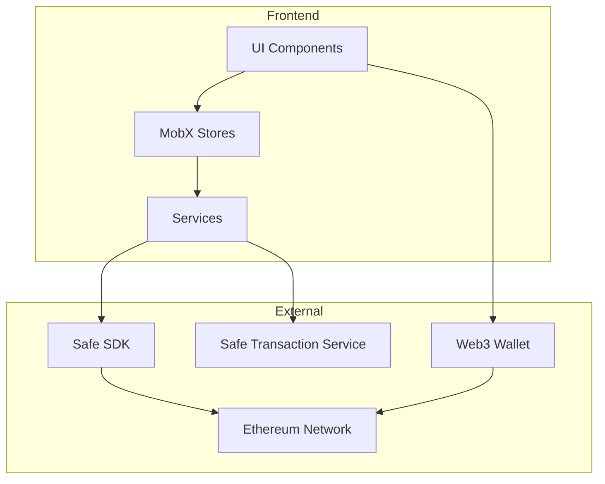
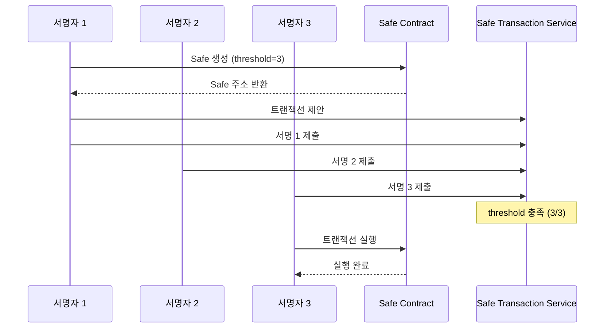

# Coin - Safe 멀티시그 지갑 시스템

Safe(Gnosis Safe) 프로토콜을 활용한 멀티시그(다중서명) 지갑 송금 시스템입니다.

## 주요 기능

- **지갑 연결**: wagmi connectors를 통한 다양한 지갑 연결 (MetaMask, WalletConnect, Coinbase)
- **Safe 생성**: 3명의 서명자(threshold=3)로 구성된 멀티시그 Safe 생성
- **송금 기능**: ETH 및 ERC-20 토큰 송금 지원
- **멀티시그 서명**: 대기 중인 트랜잭션 확인 및 서명
- **트랜잭션 실행**: threshold 충족 시 트랜잭션 실행

## 기술 스택

| 구분       | 기술                                                 |
| ---------- | ---------------------------------------------------- |
| 프레임워크 | Next.js 16 (App Router)                              |
| 빌드 도구  | Turbopack                                            |
| 상태 관리  | MobX + mobx-react-lite                               |
| Web3       | wagmi v2, viem v2                                    |
| 지갑 연결  | wagmi connectors (injected, WalletConnect, Coinbase) |
| Safe SDK   | @safe-global/protocol-kit, @safe-global/api-kit      |
| 스타일링   | Tailwind CSS 4                                       |
| 네트워크   | Ethereum (Mainnet/Sepolia)                           |

## 아키텍처



## 프로젝트 구조

```
src/
├── app/                          # Next.js App Router 페이지
│   ├── page.tsx                  # 메인 페이지 (지갑 연결)
│   └── safe/
│       ├── create/               # Safe 생성 페이지
│       │   └── page.tsx
│       └── [address]/            # Safe 상세 페이지
│           ├── page.tsx          # Safe 대시보드
│           ├── send/             # 송금 페이지
│           │   └── page.tsx
│           └── transactions/     # 트랜잭션 목록 페이지
│               └── page.tsx
│
├── components/                   # React 컴포넌트
│   ├── wallet/
│   │   └── ConnectWalletButton.tsx  # 지갑 연결 버튼
│   └── safe/
│       ├── CreateSafeForm.tsx    # Safe 생성 폼
│       ├── SafeDashboard.tsx     # Safe 대시보드
│       ├── SendForm.tsx          # 송금 폼
│       └── TransactionList.tsx   # 트랜잭션 목록
│
├── stores/                       # MobX 상태 관리
│   ├── RootStore.ts              # 루트 스토어
│   ├── WalletStore.ts            # 지갑 상태
│   ├── SafeStore.ts              # Safe 상태
│   ├── TransactionStore.ts       # 트랜잭션 상태
│   └── StoreProvider.tsx         # Store Context Provider
│
├── services/                     # 비즈니스 로직
│   ├── safe.service.ts           # Safe 생성/조회 서비스
│   └── transaction.service.ts    # 트랜잭션 생성/서명/실행
│
├── providers/                    # React Providers
│   └── Web3Provider.tsx          # wagmi 설정
│
├── config/                       # 설정 파일
│   └── web3.config.ts            # 체인, Safe 설정
│
├── api/                          # API 클라이언트
│   └── safe.api.ts               # 백엔드 API 호출
│
└── types/                        # TypeScript 타입 정의
    └── web3.types.ts
```

## 멀티시그 워크플로우



## 시작하기

### 의존성 설치

```bash
pnpm install
```

### 개발 서버 실행

```bash
pnpm dev
```

브라우저에서 [http://localhost:3000](http://localhost:3000)으로 접속합니다.

### 빌드

```bash
pnpm build
```

## 환경 설정

`config/web3.config.ts`에서 네트워크 및 Safe 설정을 변경할 수 있습니다:

- `SUPPORTED_CHAINS`: 지원 네트워크 (mainnet, sepolia)
- `SAFE_CONFIG`: 기본 threshold, 네트워크별 설정
- `SAFE_TX_SERVICE_URL`: Safe Transaction Service API URL

## 주요 컴포넌트

### WalletStore

지갑 연결 상태, 주소, 체인 ID 관리

### SafeStore

현재 선택된 Safe 정보, 잔액, 소유자 목록 관리

### TransactionStore

대기 중인 트랜잭션, 서명 상태, 실행 상태 관리

### SafeService

Safe 생성, 조회, SDK 초기화 담당

### TransactionService

ETH/ERC-20 트랜잭션 생성, 서명, 실행 담당
