# Coin - 블록체인 멀티시그 자산 관리 서비스

> Safe(Gnosis Safe) 프로토콜 기반의 기업용 멀티시그 지갑 송금 시스템

---

## 📋 목차

- [서비스 개요](#-서비스-개요)
- [핵심 기능](#-핵심-기능)
- [보안 설계](#-보안-설계)
- [스마트 컨트랙트](#-스마트-컨트랙트)
- [인프라 구조](#-인프라-구조)
- [기술 스택](#-기술-스택)
- [아키텍처](#-아키텍처)
- [프로젝트 구조](#-프로젝트-구조)
- [시작하기](#-시작하기)
- [환경 설정](#-환경-설정)
- [테스트](#-테스트)
- [배포 가이드](#-배포-가이드)

---

## 🎯 서비스 개요

**Coin**은 기업 및 조직의 디지털 자산을 안전하게 관리하기 위한 **멀티시그(다중서명) 지갑 서비스**입니다.

### 비즈니스 목적

- **자산 보호**: 단일 키 분실/탈취 시에도 자산 보호
- **내부 통제**: 송금 시 복수 승인자 필요로 횡령 방지
- **감사 추적**: 모든 트랜잭션 이력 블록체인에 영구 기록
- **규정 준수**: 기업 자금 관리 정책 기술적 강제

### 대상 고객

| 고객 유형     | 사용 시나리오                  |
| ------------- | ------------------------------ |
| 스타트업      | 법인 자금 관리, 투자금 집행    |
| DAO/커뮤니티  | 공동 자금 관리, 제안 기반 집행 |
| 거래소/수탁사 | 고객 자산 콜드월렛 관리        |
| NFT 프로젝트  | 로열티 수익 분배               |

---

## ✨ 핵심 기능

### 지갑 연결

- wagmi connectors를 통한 MetaMask 지갑 연결
- Ethereum Mainnet 및 Sepolia 테스트넷 지원

### Safe 생성

- 3명의 서명자(threshold=3)로 구성된 멀티시그 Safe 생성
- 커스텀 소유자 및 threshold 설정 가능

### 송금 기능

- ETH 네이티브 토큰 송금
- ERC-20 토큰 송금 지원
- 트랜잭션 제안 및 대기열 관리

### 멀티시그 서명

- 대기 중인 트랜잭션 목록 조회
- 각 서명자별 승인/거부
- 실시간 서명 상태 확인

### 트랜잭션 실행

- threshold 충족 시 온체인 실행
- 트랜잭션 해시 및 상태 추적
- Etherscan 링크 제공

---

## 🔒 보안 설계

### 스마트컨트랙트 보안 패턴

#### 1. CEI 패턴 (Checks-Effects-Interactions)

```solidity
function withdraw(uint256 amount) external {
    // 1. Checks - 조건 확인
    require(balances[msg.sender] >= amount, "Insufficient");

    // 2. Effects - 상태 먼저 변경
    balances[msg.sender] -= amount;

    // 3. Interactions - 외부 호출 마지막
    (bool success, ) = msg.sender.call{value: amount}("");
    require(success, "Transfer failed");
}
```

#### 2. ReentrancyGuard

외부로 자산을 전송하는 모든 함수에 재진입 공격 방지 적용:

```solidity
import "@openzeppelin/contracts/security/ReentrancyGuard.sol";

function withdraw() external nonReentrant {
    // 안전한 출금 로직
}
```

#### 3. Pull over Push 패턴

자금을 직접 전송하지 않고 잔고 기록 후 수신자가 직접 출금:

```solidity
// 잔고 기록 (Push 아님)
mapping(address => uint256) public rewards;

// 수신자가 직접 출금 (Pull)
function claimReward() external {
    uint256 amount = rewards[msg.sender];
    rewards[msg.sender] = 0;
    payable(msg.sender).transfer(amount);
}
```

### 프론트엔드 보안

| 항목            | 적용 방식                        |
| --------------- | -------------------------------- |
| 트랜잭션 상태   | Pessimistic UI (확정 후 UI 변경) |
| 지갑 클라이언트 | 액션 시점에 getWalletClient 호출 |
| 에러 처리       | 상황별 명확한 메시지 제공        |

### 키 관리

- **AWS KMS**: 서버 측 암호화 키 관리
- **Secrets Manager**: DB 비밀번호, API 키 저장
- **클라이언트 키**: 사용자 지갑에서만 관리 (서버 미보관)

---

## 📜 스마트 컨트랙트

### Safe 컨트랙트 (Gnosis Safe)

본 서비스는 [Safe Global](https://safe.global/)의 검증된 스마트 컨트랙트를 활용합니다.

| 항목          | 내용                      |
| ------------- | ------------------------- |
| 프로토콜      | Safe (구 Gnosis Safe)     |
| 컨트랙트 버전 | v1.4.1                    |
| 감사 상태     | 다수 외부 감사 완료       |
| 네트워크      | Ethereum Mainnet, Sepolia |

### 컨트랙트 주소 (Mainnet)

```
Safe Singleton: 0x41675C099F32341bf84BFc5382aF534df5C7461a
Safe Proxy Factory: 0x4e1DCf7AD4e460CfD30791CCC4F9c8a4f820ec67
MultiSend: 0x38869bf66a61cF6bDB996A6aE40D5853Fd43B526
```

### Safe Transaction Service API

| 네트워크 | URL                                          |
| -------- | -------------------------------------------- |
| Mainnet  | https://safe-transaction-mainnet.safe.global |
| Sepolia  | https://safe-transaction-sepolia.safe.global |

---

## 🏗 인프라 구조

### 현재 아키텍처 (MVP)

```
┌─────────────────────────────────────────────────────────────┐
│                        Client                                │
│  ┌─────────────────┐    ┌─────────────────┐                 │
│  │   Next.js App   │───▶│   MetaMask      │                 │
│  │   (Vercel)      │    │   Wallet        │                 │
│  └────────┬────────┘    └────────┬────────┘                 │
│           │                      │                          │
└───────────┼──────────────────────┼──────────────────────────┘
            │                      │
            ▼                      ▼
┌───────────────────┐    ┌───────────────────────────────────┐
│ Safe Transaction  │    │         Ethereum Network          │
│ Service (API)     │    │  ┌─────────────────────────────┐  │
│                   │    │  │      Safe Contract          │  │
│ - 트랜잭션 대기열  │    │  │   (Multisig Wallet)         │  │
│ - 서명 수집       │    │  └─────────────────────────────┘  │
│ - 이력 조회       │    │                                   │
└───────────────────┘    └───────────────────────────────────┘
```

### 인프라 방안 비교

> **권장: 방안 1 (VKE → EKS)**
>
> 초기 비용이 **70% 이상 절감**되며, Kubernetes 기반으로 향후 EKS 마이그레이션이 원활합니다.

| 비교 항목         | 방안 1: VKE → EKS            | 방안 2: AWS EC2                         |
| ----------------- | ---------------------------- | --------------------------------------- |
| **초기 비용**     | **월 $20~50** (VKE 기준)     | 월 $150~300                             |
| **확장성**        | Kubernetes 네이티브          | 수동 스케일링 필요                      |
| **마이그레이션**  | **K8s 호환, 즉시 이전 가능** | 컨테이너화 + 오케스트레이션 재구축 필요 |
| **운영 복잡도**   | 초기 학습 필요, 장기적 효율  | 초기 간단, 장기적 복잡                  |
| **프로덕션 전환** | EKS 동일 manifest 사용       | 인프라 전면 재설계                      |

---

### 방안 1: VKE → EKS (권장)

**장점**

- **비용 효율**: VKE 초기 비용이 EC2 대비 70% 이상 저렴
- **무중단 마이그레이션**: Kubernetes manifest 그대로 EKS 적용 가능
- **확장성**: Pod 기반 자동 스케일링
- **DevOps 친화적**: Helm, ArgoCD 등 생태계 활용

```
┌─────────────────────────────────────────────────────────────────┐
│                    Phase 1: VKE (MVP)                            │
│  ┌─────────────────────────────────────────────────────────┐    │
│  │                 Vultr Kubernetes (VKE)                   │    │
│  │   ┌───────────┐   ┌───────────┐   ┌───────────┐         │    │
│  │   │  Next.js  │   │  NestJS   │   │   Redis   │         │    │
│  │   │   Pod     │   │   Pod     │   │   Pod     │         │    │
│  │   └─────┬─────┘   └─────┬─────┘   └─────┬─────┘         │    │
│  │         └───────────────┴───────────────┘               │    │
│  │                         │                                │    │
│  │              ┌──────────▼──────────┐                    │    │
│  │              │   Ingress (Nginx)   │                    │    │
│  │              └─────────────────────┘                    │    │
│  └─────────────────────────────────────────────────────────┘    │
│  월 비용: $20~50                                                │
└─────────────────────────────────────────────────────────────────┘
                              │
                              │ K8s Manifest 그대로 이전
                              ▼
┌─────────────────────────────────────────────────────────────────┐
│                    Phase 2: AWS EKS (Production)                 │
│  ┌───────────────────────────────────────────────────────────┐  │
│  │                        VPC                                 │  │
│  │   ┌─────────────┐    ┌─────────────┐    ┌─────────────┐   │  │
│  │   │ CloudFront  │───▶│     ALB     │───▶│     EKS     │   │  │
│  │   └─────────────┘    └─────────────┘    │  ┌───────┐  │   │  │
│  │                                         │  │Next.js│  │   │  │
│  │                                         │  │NestJS │  │   │  │
│  │                                         │  │Redis  │  │   │  │
│  │                                         │  └───┬───┘  │   │  │
│  │                                         └──────┼──────┘   │  │
│  │         ┌──────────────────────────────────────┼────┐     │  │
│  │         │                Private Subnet        ▼    │     │  │
│  │         │  ┌─────────┐  ┌───────────────┐  ┌─────┐ │     │  │
│  │         │  │   RDS   │  │  ElastiCache  │  │ S3  │ │     │  │
│  │         │  └────┬────┘  └───────┬───────┘  └──┬──┘ │     │  │
│  │         │       └───────────────┴─────────────┘    │     │  │
│  │         │  ┌──────────┐   ┌─────────────────────┐  │     │  │
│  │         │  │ AWS KMS  │   │  Secrets Manager    │  │     │  │
│  │         │  └──────────┘   └─────────────────────┘  │     │  │
│  │         └──────────────────────────────────────────┘     │  │
│  └───────────────────────────────────────────────────────────┘  │
│  ┌─────────────┐  ┌─────────────┐  ┌───────────────────────┐    │
│  │ Route 53    │  │ CloudWatch  │  │ IAM (역할 기반 접근)   │    │
│  └─────────────┘  └─────────────┘  └───────────────────────┘    │
└─────────────────────────────────────────────────────────────────┘
```

---

### 방안 2: AWS EC2

**주의: 향후 인프라 이전 시 상당한 재작업 필요**

**단점**

- 초기 비용 3~5배 높음
- 수동 배포 및 스케일링
- **Kubernetes 전환 시 컨테이너화 + 오케스트레이션 전면 재구축 필요**
- IaC 템플릿 재작성 불가피

```
┌─────────────────────────────────────────────────────────────────┐
│                         AWS EC2                                  │
│  ┌───────────────────────────────────────────────────────────┐  │
│  │   ┌───────────────┐    ┌───────────────┐                  │  │
│  │   │   EC2 (App)   │    │   EC2 (Redis) │                  │  │
│  │   │   Next.js     │    │               │                  │  │
│  │   │   NestJS      │    │               │                  │  │
│  │   └───────┬───────┘    └───────┬───────┘                  │  │
│  │           └────────────────────┘                          │  │
│  │                       │                                    │  │
│  │            ┌──────────▼──────────┐                        │  │
│  │            │        RDS          │                        │  │
│  │            └─────────────────────┘                        │  │
│  └───────────────────────────────────────────────────────────┘  │
│  월 비용: $150~300                                               │
│  ⚠️ EKS 전환 시: Dockerfile 작성, K8s manifest 신규 구성 필요     │
└─────────────────────────────────────────────────────────────────┘
```

---

### 가격 비교 (월 기준)

| 항목         | 방안 1: VKE | 방안 1: EKS         | 방안 2: EC2   |
| ------------ | ----------- | ------------------- | ------------- |
| 컴퓨팅       | $10~20      | $73~ (EKS 클러스터) | $50~150       |
| 데이터베이스 | 내장/외부   | RDS $15~            | RDS $15~      |
| 캐시         | Pod 내장    | ElastiCache $12~    | 별도 EC2 $30~ |
| 총 예상      | **$20~50**  | $100~200            | **$150~300**  |

> 💡 **결론**: VKE로 MVP를 시작하면 월 비용을 70% 이상 절감하면서,
> 프로덕션 전환 시 동일한 Kubernetes manifest로 EKS에 즉시 배포할 수 있습니다.

### 인프라 전환 로드맵

| 단계 | 환경          | 구성 요소                    | 예상 기간 |
| ---- | ------------- | ---------------------------- | --------- |
| 1    | VKE (MVP)     | Next.js, NestJS, Redis (Pod) | 즉시      |
| 2    | VKE + 외부 DB | + Managed PostgreSQL         | 1주       |
| 3    | EKS 전환      | K8s manifest 그대로 적용     | 1~2주     |
| 4    | 프로덕션 완성 | RDS, ElastiCache, KMS 통합   | 2~4주     |

---

## 🛠 기술 스택

| 구분       | 기술                      | 버전   | 설명                           |
| ---------- | ------------------------- | ------ | ------------------------------ |
| 프레임워크 | Next.js                   | 16     | App Router 사용                |
| 빌드 도구  | Turbopack                 | latest | 고속 번들링                    |
| 상태 관리  | MobX                      | 6.x    | 반응형 상태 관리               |
| Web3       | wagmi                     | v2     | React Hooks for Ethereum       |
| Web3       | viem                      | v2     | TypeScript Ethereum 라이브러리 |
| 지갑 연결  | wagmi connectors          | -      | injected (MetaMask)            |
| Safe SDK   | @safe-global/protocol-kit | latest | Safe 컨트랙트 상호작용         |
| Safe SDK   | @safe-global/api-kit      | latest | Safe Transaction Service       |
| 스타일링   | Tailwind CSS              | 4.x    | 유틸리티 CSS                   |
| 네트워크   | Ethereum                  | -      | Mainnet, Sepolia               |

---

## 📐 아키텍처


### 멀티시그 워크플로우

```mermaid
sequenceDiagram
    participant User1 as 서명자 1
    participant User2 as 서명자 2
    participant User3 as 서명자 3
    participant Safe as Safe Contract
    participant API as Safe Transaction Service

    User1->>Safe: Safe 생성 (threshold=3)
    Safe-->>User1: Safe 주소 반환

    User1->>API: 트랜잭션 제안
    User1->>API: 서명 1 제출
    User2->>API: 서명 2 제출
    User3->>API: 서명 3 제출

    Note over API: threshold 충족 (3/3)

    User3->>Safe: 트랜잭션 실행
    Safe-->>User3: 실행 완료
```



---

## 📁 프로젝트 구조

```
src/
├── app/                          # Next.js App Router 페이지
│   ├── page.tsx                  # 메인 페이지 (지갑 연결)
│   └── safe/
│       ├── create/               # Safe 생성 페이지
│       │   └── page.tsx
│       └── [address]/            # Safe 상세 페이지
│           ├── page.tsx          # Safe 대시보드
│           ├── send/             # 송금 페이지
│           │   └── page.tsx
│           └── transactions/     # 트랜잭션 목록 페이지
│               └── page.tsx
│
├── components/                   # React 컴포넌트
│   ├── wallet/
│   │   └── ConnectWalletButton.tsx  # 지갑 연결 버튼
│   └── safe/
│       ├── CreateSafeForm.tsx    # Safe 생성 폼
│       ├── SafeDashboard.tsx     # Safe 대시보드
│       ├── SendForm.tsx          # 송금 폼
│       └── TransactionList.tsx   # 트랜잭션 목록
│
├── stores/                       # MobX 상태 관리
│   ├── RootStore.ts              # 루트 스토어
│   ├── WalletStore.ts            # 지갑 상태
│   ├── SafeStore.ts              # Safe 상태
│   ├── TransactionStore.ts       # 트랜잭션 상태
│   └── StoreProvider.tsx         # Store Context Provider
│
├── services/                     # 비즈니스 로직
│   ├── safe.service.ts           # Safe 생성/조회 서비스
│   └── transaction.service.ts    # 트랜잭션 생성/서명/실행
│
├── providers/                    # React Providers
│   └── Web3Provider.tsx          # wagmi 설정
│
├── config/                       # 설정 파일
│   └── web3.config.ts            # 체인, Safe 설정
│
└── types/                        # TypeScript 타입 정의
    └── web3.types.ts
```

---

## 🚀 시작하기

### 사전 요구사항

- Node.js 20.x 이상
- pnpm 10.x 이상
- MetaMask 브라우저 확장 설치

### 의존성 설치

```bash
pnpm install
```

### 환경 변수 설정

```bash
cp .env.example .env.local
```

```env
# RPC URLs
NEXT_PUBLIC_ETH_RPC_URL=https://mainnet.infura.io/v3/YOUR_KEY
NEXT_PUBLIC_SEPOLIA_RPC_URL=https://sepolia.infura.io/v3/YOUR_KEY

# WalletConnect (선택사항)
NEXT_PUBLIC_WALLETCONNECT_PROJECT_ID=your_project_id
```

### 개발 서버 실행

```bash
pnpm dev
```

브라우저에서 [http://localhost:3000](http://localhost:3000)으로 접속합니다.

### 빌드

```bash
pnpm build
```

---

## ⚙️ 환경 설정

### web3.config.ts

`config/web3.config.ts`에서 네트워크 및 Safe 설정을 변경할 수 있습니다:

```typescript
// 지원 체인
export const supportedChains = [mainnet, sepolia] as const;

// Safe 설정
export const SAFE_CONFIG = {
  threshold: 3, // 필요한 서명 수
  ownerCount: 3, // 소유자 수
};

// Safe Transaction Service URL
export const SAFE_TX_SERVICE_URL = {
  [mainnet.id]: "https://safe-transaction-mainnet.safe.global",
  [sepolia.id]: "https://safe-transaction-sepolia.safe.global",
};
```

### 주요 컴포넌트

| 컴포넌트           | 역할                                          |
| ------------------ | --------------------------------------------- |
| WalletStore        | 지갑 연결 상태, 주소, 체인 ID 관리            |
| SafeStore          | 현재 선택된 Safe 정보, 잔액, 소유자 목록 관리 |
| TransactionStore   | 대기 중인 트랜잭션, 서명 상태, 실행 상태 관리 |
| SafeService        | Safe 생성, 조회, SDK 초기화 담당              |
| TransactionService | ETH/ERC-20 트랜잭션 생성, 서명, 실행 담당     |

---

## 🧪 테스트

### 정적 분석

```bash
# Slither (스마트컨트랙트 취약점 분석)
pip install slither-analyzer
slither ./contracts/
```

### 단위 테스트

```bash
pnpm test
```

### E2E 테스트 (Sepolia)

1. Sepolia 테스트넷 ETH 확보 (Faucet)
2. MetaMask를 Sepolia로 전환
3. Safe 생성 → 송금 → 서명 → 실행 테스트

### 테스트 체크리스트

- [ ] 지갑 연결/해제
- [ ] Safe 생성 (threshold 설정)
- [ ] ETH 송금 트랜잭션 생성
- [ ] 다중 서명 수집
- [ ] 트랜잭션 실행
- [ ] 잔액 업데이트 확인

---

## 🚢 배포 가이드

### Vercel 배포 (권장 - MVP)

```bash
# Vercel CLI 설치
npm i -g vercel

# 배포
vercel --prod
```

### 환경 변수 설정 (Vercel Dashboard)

```
NEXT_PUBLIC_ETH_RPC_URL
NEXT_PUBLIC_SEPOLIA_RPC_URL
NEXT_PUBLIC_WALLETCONNECT_PROJECT_ID
```

### Docker 배포

```bash
# 이미지 빌드
docker build -t coin-app:latest -f Dockerfile .

# 실행
docker run -p 3000:3000 coin-app:latest
```

### AWS ECS 배포 (프로덕션)

```bash
# ECR에 푸시
aws ecr get-login-password --region ap-northeast-2 | docker login --username AWS --password-stdin <account>.dkr.ecr.ap-northeast-2.amazonaws.com

docker tag coin-app:latest <account>.dkr.ecr.ap-northeast-2.amazonaws.com/coin-app:latest
docker push <account>.dkr.ecr.ap-northeast-2.amazonaws.com/coin-app:latest

# ECS 서비스 업데이트
aws ecs update-service --cluster production --service coin-app --force-new-deployment
```

### 배포 체크리스트

- [ ] 환경 변수 설정 완료
- [ ] RPC URL 유효성 확인
- [ ] CORS 설정 확인
- [ ] 빌드 성공 확인
- [ ] Sepolia 테스트 완료
- [ ] Mainnet 연결 테스트

---

## 📅 3개월 MVP 개발 일정 (VKE 기반)

> **총 기간**: 12주 (3개월)  
> **인프라**: Vultr Kubernetes (VKE)  
> **월 예상 비용**: $20~50

### Phase 1: 기반 구축 (1~4주)

| 주차 | 태스크            | 상세 내용                          | 산출물             |
| ---- | ----------------- | ---------------------------------- | ------------------ |
| 1    | 프로젝트 초기화   | 모노레포 세팅, Next.js/NestJS 구성 | 기본 프로젝트 구조 |
| 1    | VKE 클러스터 세팅 | K8s 클러스터 생성, kubectl 설정    | 개발 환경          |
| 2    | CI/CD 파이프라인  | GitHub Actions + Docker 빌드       | 자동 배포 환경     |
| 2    | 지갑 연결         | wagmi v2 + injected connector      | MetaMask 연동      |
| 3    | Safe SDK 통합     | protocol-kit, api-kit 설정         | SDK 기본 연동      |
| 3    | 데이터베이스      | PostgreSQL Pod or Managed DB       | 스키마 설계        |
| 4    | Redis 세팅        | 세션/토큰 저장소 Pod               | 캐싱 레이어        |
| 4    | 환경변수 관리     | OpenBao or K8s Secrets             | 보안 기반          |

### Phase 2: 핵심 기능 (5~8주)

| 주차 | 태스크        | 상세 내용                       | 산출물          |
| ---- | ------------- | ------------------------------- | --------------- |
| 5    | Safe 생성     | 다중서명 지갑 생성 UI/로직      | Safe 생성 기능  |
| 5    | Owner 관리    | Owner 추가/제거, Threshold 설정 | Owner 관리 UI   |
| 6    | 트랜잭션 생성 | ETH 송금 트랜잭션 생성          | 송금 폼         |
| 6    | 서명 수집     | 다중 서명 수집 로직             | 서명 UI         |
| 7    | 트랜잭션 실행 | Threshold 충족 시 실행          | 실행 버튼       |
| 7    | 트랜잭션 이력 | Safe Transaction Service 연동   | 이력 목록       |
| 8    | 상태 관리     | MobX 스토어 구현                | 상태 관리 체계  |
| 8    | UI/UX 마무리  | Tailwind 기반 디자인            | 프론트엔드 완성 |

### Phase 3: 안정화 및 배포 (9~12주)

| 주차 | 태스크        | 상세 내용                    | 산출물           |
| ---- | ------------- | ---------------------------- | ---------------- |
| 9    | 에러 처리     | 전역 에러 처리, 토스트 알림  | 에러 처리 시스템 |
| 9    | 로깅          | 구조화된 로그 시스템         | 로깅 인프라      |
| 10   | 테스트        | Sepolia 테스트넷 통합 테스트 | 테스트 결과      |
| 10   | 보안 검토     | 코드 리뷰, 취약점 검토       | 보안 검토 보고서 |
| 11   | 성능 최적화   | 번들 최적화, 캐싱            | 성능 개선        |
| 11   | 문서화        | API 문서, 사용자 가이드      | 문서             |
| 12   | 스테이징 배포 | VKE 스테이징 환경 배포       | 스테이징 환경    |
| 12   | MVP 출시      | 최종 QA 및 린치              | **MVP 완성**     |

### 마일스톤

```
Week 1-4   ████████████████  Phase 1: 기반 구축
           └─ M1: 환경 구성 완료 (4주차)

Week 5-8   ████████████████  Phase 2: 핵심 기능
           └─ M2: Safe 기능 완성 (8주차)

Week 9-12  ████████████████  Phase 3: 안정화 및 배포
           └─ M3: MVP 출시 (12주차)
```

### 리스크 및 대응 방안

| 리스크        | 영향도 | 대응 방안                |
| ------------- | ------ | ------------------------ |
| Safe SDK 변경 | 중     | 버전 고정, 문서 모니터링 |
| VKE 장애      | 저     | 자동 복구 설정, 백업     |
| 인력 부족     | 중     | 우선순위 조정, 외주 검토 |
| RPC 제한      | 저     | 다중 RPC 프로바이더      |

### 비용 예상 (3개월 총액)

| 항목                        | 월 비용     | 3개월 총액  |
| --------------------------- | ----------- | ----------- |
| VKE 클러스터                | $20~40      | $60~120     |
| 도메인                      | $10~15      | $30~45      |
| RPC 서비스 (Alchemy/Infura) | $0~50       | $0~150      |
| **총 예상**                 | **$30~105** | **$90~315** |

> 💡 **참고**: AWS EC2로 시작했다면 동일 기간 **$450~900** 예상  
> VKE 선택 시 **60~70% 비용 절감** + 향후 EKS 전환 용이
