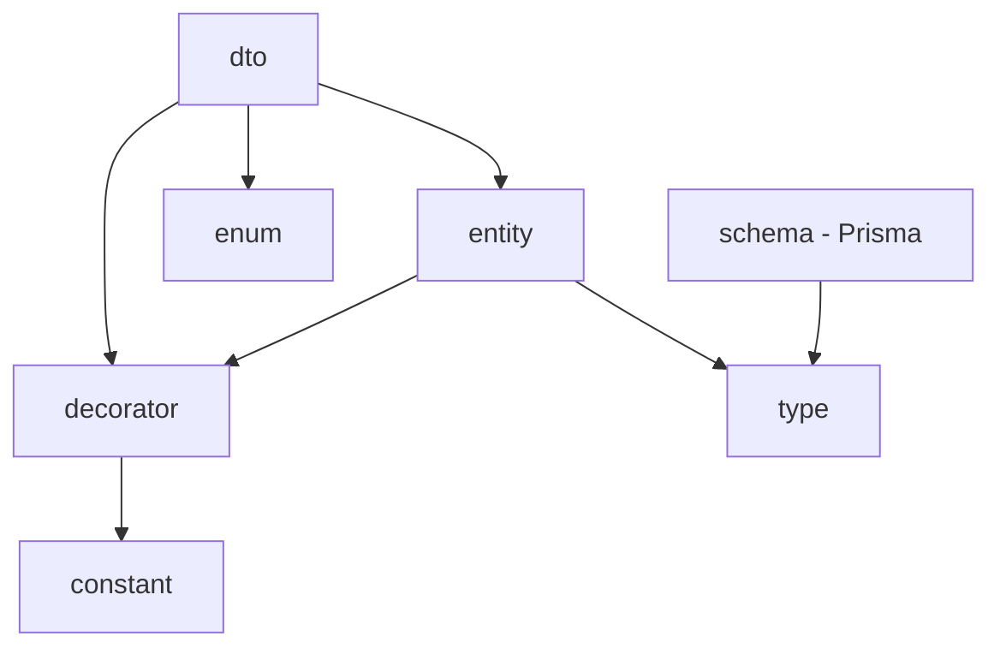

# Schema 패키지 리팩토링 가이드

## 개요

기존 `@cocrepo/schema` 패키지가 마이크로 패키지 구조로 분리되었습니다. 이 문서는 기존 코드를 새로운 패키지 구조로 마이그레이션하는 방법을 안내합니다.

## 변경 사항

### 패키지 분리 구조

| 기존 경로 | 새로운 패키지 | 설명 |
|-----------|---------------|------|
| `@cocrepo/schema/dto` | `@cocrepo/dto` | Data Transfer Objects |
| `@cocrepo/schema/entity` | `@cocrepo/entity` | 데이터베이스 엔티티 |
| `@cocrepo/schema/enum` | `@cocrepo/enum` | 공유 열거형 |
| `@cocrepo/schema/decorator` | `@cocrepo/decorator` | NestJS 데코레이터 |
| `@cocrepo/schema/constant` | `@cocrepo/constant` | 상수 값 |

### 현재 `@cocrepo/schema`의 역할

리팩토링 후 `@cocrepo/schema`는 **Prisma 클라이언트 전용** 패키지로 역할이 축소되었습니다:

```typescript
// @cocrepo/schema에서 제공하는 것
import { PrismaClient } from '@cocrepo/schema';
```

---

## 마이그레이션 가이드

### 1. DTO 임포트 변경

```typescript
// 이전
import { UserDto, CreateUserDto } from '@cocrepo/schema';

// 이후
import { UserDto, CreateUserDto } from '@cocrepo/dto';
```

### 2. 엔티티 임포트 변경

```typescript
// 이전
import { UserEntity, AbstractEntity } from '@cocrepo/schema';

// 이후
import { UserEntity, AbstractEntity } from '@cocrepo/entity';
```

### 3. Enum 임포트 변경

```typescript
// 이전
import { CategoryTypes, GroupTypes } from '@cocrepo/schema';

// 이후
import { CategoryTypes, GroupTypes } from '@cocrepo/enum';
```

### 4. 데코레이터 임포트 변경

```typescript
// 이전
import { StringField, NumberField, Roles } from '@cocrepo/schema';

// 이후
import { StringField, NumberField, Roles } from '@cocrepo/decorator';
```

### 5. 상수 임포트 변경

```typescript
// 이전
import { API_DESCRIPTIONS, ORDER } from '@cocrepo/schema';

// 이후
import { API_DESCRIPTIONS, ORDER } from '@cocrepo/constant';
```

---

## 의존성 업데이트

### package.json 변경

```json
{
  "dependencies": {
    // 이전
    "@cocrepo/schema": "workspace:*",

    // 이후 - 필요한 패키지만 선택적으로 추가
    "@cocrepo/dto": "workspace:*",
    "@cocrepo/entity": "workspace:*",
    "@cocrepo/enum": "workspace:*",
    "@cocrepo/decorator": "workspace:*",
    "@cocrepo/constant": "workspace:*"
  }
}
```

---

## 패키지 의존성 관계



---

## 주의사항

1. **Prisma 클라이언트**: `PrismaClient`는 여전히 `@cocrepo/schema`에서 임포트합니다.

2. **순환 의존성**: 새로운 패키지 구조는 순환 의존성을 방지하도록 설계되었습니다.

3. **점진적 마이그레이션**: 한 번에 모든 임포트를 변경할 필요 없이, 파일 단위로 점진적으로 마이그레이션할 수 있습니다.

---

## 관련 문서

- [packages/dto/README.md](../packages/dto/README.md)
- [packages/entity/README.md](../packages/entity/README.md)
- [packages/enum/README.md](../packages/enum/README.md)
- [packages/decorator/README.md](../packages/decorator/README.md)
- [packages/constant/README.md](../packages/constant/README.md)
