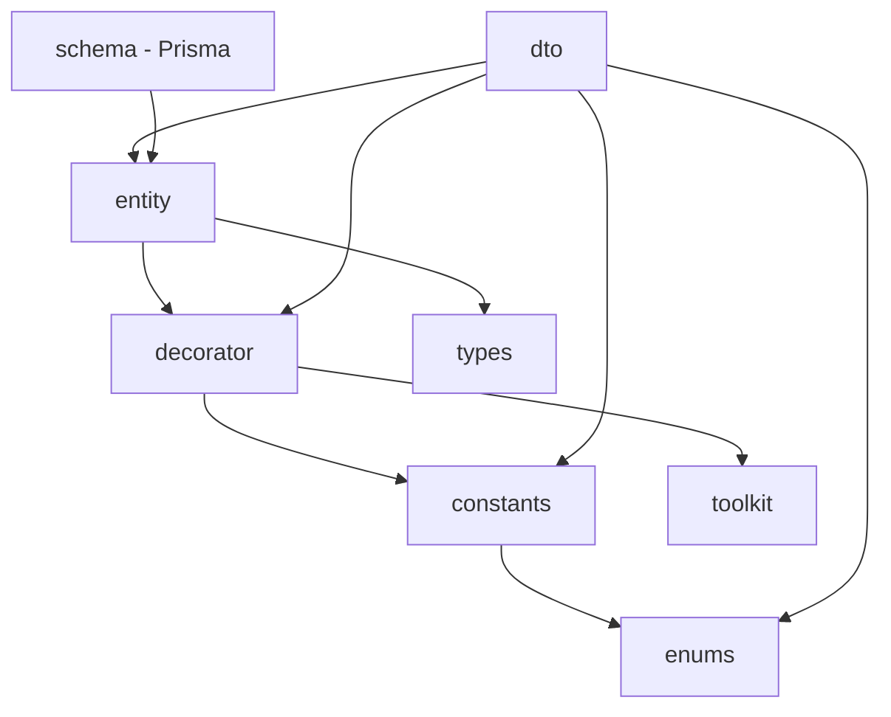

# Schema 패키지 리팩토링 가이드

> **문서 작성일**: 2025년 12월
> **상태**: 마이그레이션 진행 중

## 개요

기존 `@cocrepo/db` 패키지가 마이크로 패키지 구조로 분리되었습니다. 이 문서는 리팩토링 배경과 마이그레이션 방법을 설명합니다.

## 리팩토링 배경

### 기존 구조의 문제점

```
packages/schema/
├── src/
│   ├── constant/       # 상수
│   ├── decorator/      # NestJS 데코레이터
│   ├── dto/           # Data Transfer Objects
│   ├── entity/        # 엔티티 정의
│   └── enum/          # 열거형
└── prisma/            # Prisma 스키마
```

**문제점:**

- 단일 패키지에 너무 많은 책임이 집중됨
- 프론트엔드에서 불필요한 백엔드 의존성 포함
- 빌드 시간 증가
- 순환 의존성 발생 가능성

### 새로운 구조

```
packages/
├── constants/          # 상수 (routing, schema)
├── decorator/          # NestJS 데코레이터
├── dto/               # Data Transfer Objects
├── entity/            # 엔티티 정의
├── enums/             # 열거형
├── design-system/     # 디자인 시스템 (신규)
└── schema/            # Prisma 전용 (축소)
```

**개선점:**

- 관심사의 분리 (Separation of Concerns)
- 필요한 패키지만 의존 가능
- 빌드 최적화
- 명확한 패키지 역할

---

## 패키지별 역할

| 패키지                   | 역할              | 주요 내용                                  |
| ------------------------ | ----------------- | ------------------------------------------ |
| `@cocrepo/constants`     | 공통 상수         | 라우팅 경로, 스키마 상수, 기본값           |
| `@cocrepo/enums`         | 열거형            | CategoryTypes, SessionTypes, GroupTypes 등 |
| `@cocrepo/decorator`     | NestJS 데코레이터 | 필드, 인증, 권한, API 데코레이터           |
| `@cocrepo/entity`        | 엔티티 타입       | User, Tenant, Space 등 엔티티 정의         |
| `@cocrepo/dto`           | DTO 클래스        | Create, Update, Query DTO                  |
| `@cocrepo/db`            | Prisma 전용       | Prisma Client, 마이그레이션, Seed          |
| `@cocrepo/design-system` | 디자인 시스템     | HeroUI 테마, 토큰, Provider                |

---

## 의존성 관계도



---

## Import 경로 변경 가이드

### DTO 클래스

```typescript
// ❌ 이전
import { UserDto, CreateUserDto, QueryUserDto } from "@cocrepo/db";

// ✅ 이후
import { UserDto, CreateUserDto, QueryUserDto } from "@cocrepo/dto";
```

### 엔티티

```typescript
// ❌ 이전
import { UserEntity, TenantEntity } from "@cocrepo/db";

// ✅ 이후
import { UserEntity, TenantEntity } from "@cocrepo/entity";
```

### 열거형

```typescript
// ❌ 이전
import { CategoryTypes, SessionTypes } from "@cocrepo/db";

// ✅ 이후
import { CategoryTypes, SessionTypes } from "@cocrepo/enums";
```

### 데코레이터

```typescript
// ❌ 이전
import { StringField, NumberField, Auth } from "@cocrepo/db";

// ✅ 이후
import { StringField, NumberField, Auth } from "@cocrepo/decorator";
```

### 상수

```typescript
// ❌ 이전
import { API_DESCRIPTIONS, DEFAULT_OBJECTS } from "@cocrepo/db";

// ✅ 이후
import { API_DESCRIPTIONS, DEFAULT_OBJECTS } from "@cocrepo/constants/schema";
import { ROUTE_ENDPOINTS, ROUTE_NAMES } from "@cocrepo/constants/routing";
```

### Prisma Client

```typescript
// ✅ 변경 없음
import { PrismaClient } from "@cocrepo/db";
```

---

## 설치 및 의존성 업데이트

### 백엔드 (NestJS)

```bash
# 기존 의존성 제거
pnpm remove @cocrepo/db

# 새 의존성 추가
pnpm add @cocrepo/db @cocrepo/dto @cocrepo/entity @cocrepo/decorator @cocrepo/enums @cocrepo/constants
```

### 프론트엔드 (React)

프론트엔드에서는 일반적으로 `@cocrepo/api-client`를 사용하므로 직접 영향 없음.
디자인 시스템을 사용하는 경우:

```bash
pnpm add @cocrepo/design-system
```

---

## 주의사항

1. **순환 의존성**: 패키지 간 순환 의존성이 발생하지 않도록 주의
2. **빌드 순서**: turbo.json의 의존성 순서 확인 필요
3. **타입 호환성**: 엔티티와 DTO 간 타입 호환성 유지

---

## FAQ

### Q: 기존 코드가 동작하지 않습니다.

A: Import 경로를 새 패키지로 변경하세요. 위의 마이그레이션 가이드 참고.

### Q: 어떤 패키지를 설치해야 하나요?

A: 필요한 기능에 따라 선택적으로 설치합니다:

- 백엔드: dto, entity, decorator, enums, constants, schema
- 프론트엔드: design-system, constants (필요시)

### Q: Prisma 관련 기능은 어디에 있나요?

A: `@cocrepo/db` 패키지에 그대로 유지됩니다. PrismaClient, 마이그레이션, Seed는 변경 없습니다.

---

## 관련 문서

- [packages/decorator README](../packages/decorator/README.md)
- [packages/dto README](../packages/dto/README.md)
- [packages/entity README](../packages/entity/README.md)
- [packages/enums README](../packages/enums/README.md)
- [packages/design-system README](../packages/design-system/README.md)
